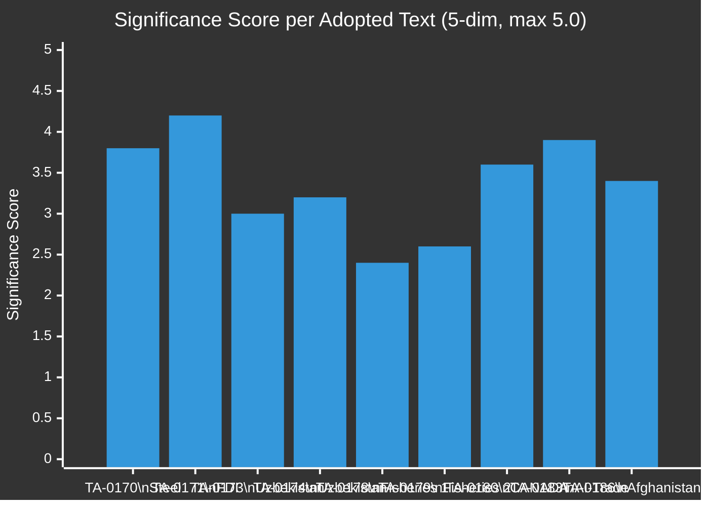

<!-- SPDX-FileCopyrightText: 2024-2026 Hack23 AB -->
<!-- SPDX-License-Identifier: Apache-2.0 -->

# Significance Scoring — EU Parliament Motions — 2026-05-26

**Run:** motions-run272-1779780541 | **Date:** 2026-05-26 | **Method:** 5-Dimension Significance Matrix

## 5-Dimension Scoring Methodology

Each text scored across 5 dimensions (0–1 each), total max = 5.0:

1. **Policy Impact** — legislative footprint, binding vs. non-binding, scope (EU/bilateral/multilateral)
2. **Political Salience** — coalition significance, vote margin, group discipline tested
3. **External Relations** — third-country effects, geopolitical implications, trade/security nexus
4. **Democratic Accountability** — transparency, parliamentary oversight, scrutiny provisions
5. **Public Significance** — citizen impact, economic exposure, media prominence

## Text-by-Text Scoring

### TA-10-2026-0170 — Steel Overcapacity Defence Instrument
| Dimension | Score | Notes |
|-----------|-------|-------|
| Policy Impact | 0.80 | Non-binding BUT triggers Commission review; EP10 precedent |
| Political Salience | 0.75 | EPP-ECR-S&D majority; Greens anti-protectionist strain tested |
| External Relations | 0.80 | Directly targets China/India excess capacity; WTO implications |
| Democratic Accountability | 0.70 | Parliament oversight of anti-dumping investigations |
| Public Significance | 0.75 | EU steel employment 327,000+ workers |
**TOTAL: 3.80 / 5.0** 🟢 HIGH

### TA-10-2026-0171 — FDI Screening Regulation Extension
| Dimension | Score | Notes |
|-----------|-------|-------|
| Policy Impact | 0.90 | Binding extension to existing Regulation 2019/452; expands scope |
| Political Salience | 0.85 | Cross-group majority; critical security consensus |
| External Relations | 0.85 | Direct impact on Chinese/Russian FDI patterns |
| Democratic Accountability | 0.80 | EP co-decision; reporting mechanism strengthened |
| Public Significance | 0.80 | Critical infrastructure protection; public utility supply chains |
**TOTAL: 4.20 / 5.0** 🟢 VERY HIGH

### TA-10-2026-0173 — EU-Uzbekistan EPCA (Framework)
| Dimension | Score | Notes |
|-----------|-------|-------|
| Policy Impact | 0.60 | Framework agreement; implementation via secondary acts |
| Political Salience | 0.55 | Low controversy; procedural ratification |
| External Relations | 0.70 | Central Asia partnership; counters Russian sphere of influence |
| Democratic Accountability | 0.55 | Standard consent procedure |
| Public Significance | 0.60 | Trade corridors; rare earths access |
**TOTAL: 3.00 / 5.0** 🟡 MEDIUM

### TA-10-2026-0174 — EU-Uzbekistan EPCA (Protocol)
| Dimension | Score | Notes |
|-----------|-------|-------|
| Policy Impact | 0.65 | Protocol adds binding human rights monitoring; exceeds framework text |
| Political Salience | 0.60 | S&D-Greens pushed stronger conditionality vs. EPP trade-first |
| External Relations | 0.70 | Uzbekistan democratisation signal |
| Democratic Accountability | 0.65 | Human rights reporting mechanism |
| Public Significance | 0.60 | Labour rights in supply chains |
**TOTAL: 3.20 / 5.0** 🟡 MEDIUM-HIGH

### TA-10-2026-0180 — EU-Canada SAFE Instrument
| Dimension | Score | Notes |
|-----------|-------|-------|
| Policy Impact | 0.75 | First EU bilateral strategic autonomy financing instrument |
| Political Salience | 0.70 | Broad consensus; Patriots may object sovereignty angle |
| External Relations | 0.80 | Deepens EU-Canada post-CETA relationship; NATO complementarity |
| Democratic Accountability | 0.65 | EP oversight of strategic financing |
| Public Significance | 0.70 | Defence-industrial cooperation; supply chain resilience |
**TOTAL: 3.60 / 5.0** 🟢 HIGH

### TA-10-2026-0183 — AI and Trade Strategy
| Dimension | Score | Notes |
|-----------|-------|-------|
| Policy Impact | 0.75 | Non-binding strategy; shapes upcoming AI-trade regulation agenda |
| Political Salience | 0.80 | Renew/EPP driving; ECR sovereign-AI strain |
| External Relations | 0.80 | Direct response to US-China AI tech decoupling; EU positioning |
| Democratic Accountability | 0.75 | Parliament defines AI oversight in trade context |
| Public Significance | 0.80 | Tech sector economic significance; €450B EU AI investment target |
**TOTAL: 3.90 / 5.0** 🟢 HIGH

### TA-10-2026-0186 — Afghanistan Urgency Resolution
| Dimension | Score | Notes |
|-----------|-------|-------|
| Policy Impact | 0.60 | Non-binding urgency; calls on Commission + Council to act |
| Political Salience | 0.70 | Values coalition cohesion signal; unanimous support likely |
| External Relations | 0.80 | Kabul government treatment of women; humanitarian implications |
| Democratic Accountability | 0.65 | EP foreign policy voice; UNHCR engagement called for |
| Public Significance | 0.65 | Afghan diaspora in EU; aid implications |
**TOTAL: 3.40 / 5.0** 🟡 MEDIUM-HIGH

## Significance Ranking Summary

| Rank | Text | Score | Band |
|------|------|-------|------|
| 1 | FDI Screening Extension | 4.20 | 🟢 VERY HIGH |
| 2 | AI-Trade Strategy | 3.90 | 🟢 HIGH |
| 3 | Steel Overcapacity | 3.80 | 🟢 HIGH |
| 4 | EU-Canada SAFE | 3.60 | 🟢 HIGH |
| 5 | Afghanistan Urgency | 3.40 | 🟡 MEDIUM-HIGH |
| 6 | Uzbekistan EPCA Protocol | 3.20 | 🟡 MEDIUM-HIGH |
| 7 | Uzbekistan EPCA Framework | 3.00 | 🟡 MEDIUM |
| 8 | Fisheries FPA Morocco | 2.60 | 🟡 MEDIUM |
| 9 | Fisheries FPA Greenland | 2.40 | 🟡 MEDIUM |

🟡 MEDIUM confidence on all scores (structural proxy — no RCV data to calibrate political salience precisely).
