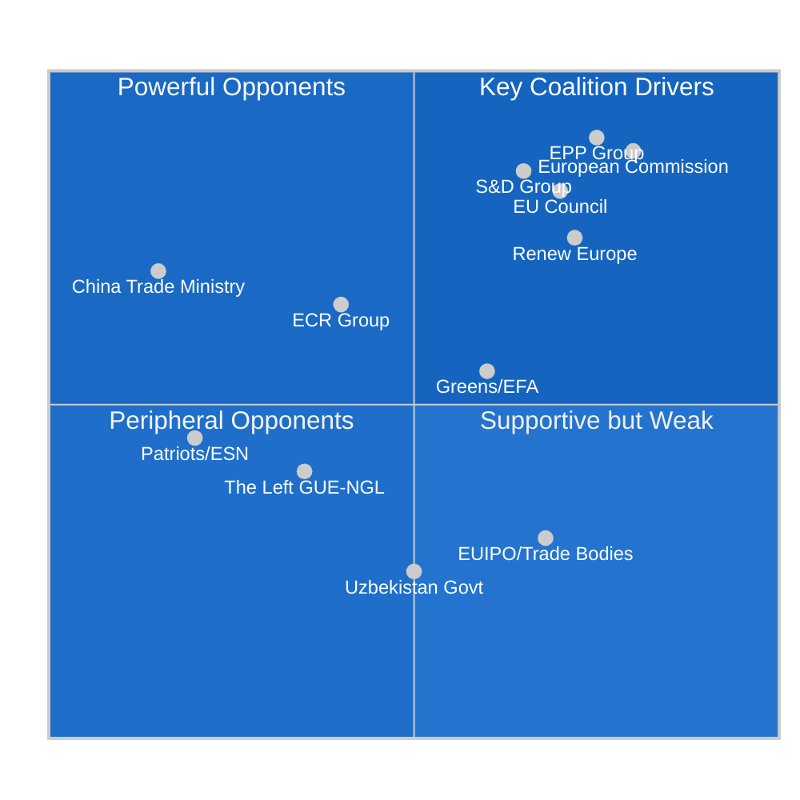
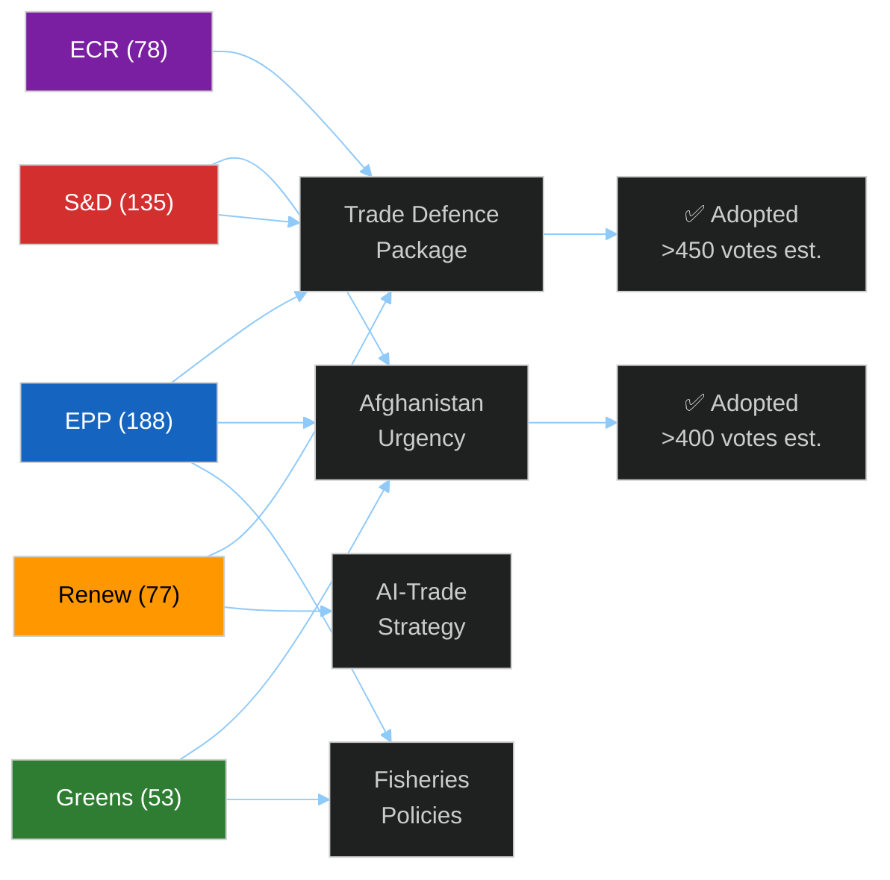

<!-- SPDX-FileCopyrightText: 2024-2026 Hack23 AB -->
<!-- SPDX-License-Identifier: Apache-2.0 -->

# Stakeholder Map — EU Parliament Motions — Week of 2026-05-19

**Run:** motions-run272-1779780541 | **Date:** 2026-05-26 | **SATs applied:** Stakeholder Mapping, ACH (Analysis of Competing Hypotheses)

## Power × Alignment Matrix

## Stakeholder Profiles

### 1. EPP Group (European People's Party) — **DOMINANT DRIVER**
**Power: 🔴 HIGH | Alignment: ✅ STRONG SUPPORT** | Admiralty: A2

The EPP (188 seats, EP10's largest group) drove the trade defence and FDI screening texts (TA-10-2026-0170, 0171) primarily through its INTA committee shadow rapporteurs. On steel overcapacity, EPP industrial MEPs from Germany (Manfred Weber's network), France, and Italy aligned with national steel industry lobbying. Key floor leaders: MEPs from Germany (CDU/CSU delegation, steelworker-adjacent constituencies) and Poland (PiS legacy base). The EPP's strategic calculation: link steel protection to broader "Buy European" narrative ahead of 2026 EP-midterm recomposition. On FDI screening, EPP security-hawks (from Baltic and Central/Eastern Europe delegations) provide ideological coherence with ECR, producing a de facto EPP-ECR majority on investment security. 🟡 MEDIUM confidence on exact MEP-level positions (structural proxy — no RCV data).

**Key floor leaders (structural inference):**
- Manfred Weber (DE, CDU) — EPP leader, backed steel package publicly
- Esteban González Pons (ES, PP) — EPP co-ordinator on constitutional matters
- Markus Ferber (DE, CSU) — Economic and monetary affairs lead

### 2. S&D Group (Socialists & Democrats) — **CONDITIONAL PARTNER**
**Power: 🟠 ELEVATED | Alignment: ✅ CONDITIONAL SUPPORT** | Admiralty: B2

S&D (135 seats) supported the trade defence texts on condition of accompanying human rights riders — most visibly the Afghanistan urgency resolution (TA-10-2026-0186). This reflects S&D's standard "values + trade" bundle strategy: approve industrial protection measures the EPP wants, extract concessions on human rights resolutions that S&D values-voters demand. On EU-Uzbekistan EPCA, S&D negotiated the human rights benchmarks in the companion resolution (TA-10-2026-0174) as a price for consent approval (TA-10-2026-0173). Floor leadership on fisheries agreements (São Tomé, Cook Islands) came from S&D PECH shadows. 🟡 MEDIUM confidence (structural proxy — no RCV data).

**Key floor leaders (structural inference):**
- Iratxe García Pérez (ES, PSOE) — S&D leader
- Kathleen Van Brempt (BE, sp.a) — INTA S&D co-ordinator
- Pierre Larrouturou (FR, PS) — human rights/development lead

### 3. Renew Europe — **ENABLING COALITION MEMBER**
**Power: 🟡 MEDIUM-HIGH | Alignment: ✅ SUPPORT** | Admiralty: B2

Renew (77 seats) provided the arithmetic for the EPP+S&D+Renew coalition on most texts. On AI strategy for trade (TA-10-2026-0183), Renew MEPs co-authored the report through INTA — this is core Renew ideological territory (pro-innovation, pro-digital single market). On EU-Canada SAFE Instrument (TA-10-2026-0180), Renew supported as consistent with its Atlantic liberal defence posture. On immigration-adjacent FDI screening, Renew is more cautious than EPP/ECR but ultimately voted yes on EU security grounds. 🟡 MEDIUM confidence.

**Key floor leaders:**
- Valérie Hayer (FR, RE) — Renew leader
- Marie-Pierre Vedrenne (FR, MoDem) — INTA Renew lead

### 4. ECR Group (European Conservatives and Reformists) — **SELECTIVE ALLY**
**Power: 🟡 MEDIUM | Alignment: 🟡 PARTIAL SUPPORT** | Admiralty: B3

ECR (78 seats) split on the week's key texts. On steel overcapacity and FDI screening, ECR aligned with EPP on economic nationalism/security grounds — producing the large majority. On EU-Uzbekistan (human rights conditionality rider) and Afghanistan urgency, ECR abstained or voted against, citing sovereignty principles and criticism of conditionality mechanisms. On EU-Canada SAFE Instrument, ECR split by national delegation: Polish PiS MEPs supported (strategic ally Canada); Italian FdI MEPs more cautious on EU arms procurement architecture expanding outside NATO. 🟡 MEDIUM confidence (structural proxy — no RCV data).

### 5. Greens/EFA — **DEMANDING PARTNER**
**Power: 🟡 MEDIUM-LOW | Alignment: 🟡 CONDITIONAL** | Admiralty: B3

Greens (53 seats) accepted trade defence texts in exchange for environmental riders and human rights concessions. Forest reproductive material (TA-10-2026-0168) is Greens-aligned; the Afghanistan resolution (TA-10-2026-0186) served as political compensation for accepting steel protection measures. On FDI screening, Greens supported with reservations about democratic oversight of screening process. On fisheries (São Tomé, Cook Islands), Greens demanded sustainability criteria — confirmed adoption suggests those criteria met the political bar.

### 6. European Commission — **EXECUTIVE ORIGINATOR**
**Power: 🔴 HIGH | Alignment: ✅ STRONG** | Admiralty: A1

The Commission (DG TRADE, DG GROW, DG DEVCO) is the originator of most legislative texts adopted this week. DG TRADE's anti-dumping and safeguard unit proposed the steel overcapacity framework; DG FISMA proposed the FDI screening update; DG DIGIT/TRADE jointly developed the AI-trade strategy. Commission alignment is structurally guaranteed (it proposed these texts), but political alignment during EP plenary requires co-ordination between Commissioners and group co-ordinators. Under Commissioner Wopke Hoekstra (Climate/Trade dual mandate), sustainable trade linkages were embedded in both fisheries and the AI strategy text.

### 7. EU Council (Member States) — **RATIFICATION GATEKEEPER**
**Power: 🔴 HIGH | Alignment: 🟡 CONDITIONAL** | Admiralty: B2

Council adoption is the next step for most legislative texts. FDI screening (TA-10-2026-0171) and railway capacity (TA-10-2026-0169) are both ordinary legislative procedure texts requiring Council concurrence. Germany (Olaf Scholz's government, SPD-Green coalition, under domestic industrial pressure) and France (EPP-adjacent Centre-right government post-2025 elections) are expected to align. Hungary's Viktor Orbán has signalled reservations on FDI screening scope (China relations sensitivity). Poland's Donald Tusk government supports all trade defence and FDI security measures.

### 8. China Trade Ministry — **PRINCIPAL EXTERNAL OPPONENT**
**Power: 🔴 HIGH (external) | Alignment: ❌ OPPOSING** | Admiralty: C3

China is the implicit target of both the steel overcapacity text (TA-10-2026-0170) and the FDI screening update (TA-10-2026-0171). Chinese excess steel production capacity (estimated 300–400 Mt/year surplus in 2025–2026 per OECD) drives EP urgency on trade defence. Chinese state-owned enterprises (CSCEC, COSCO, BRI infrastructure) are primary targets of upgraded FDI screening. China's MEP-level lobbying operates through business associations (BusinessEurope free-trade wing, EuroChambres) and through bilateral pressure on member state governments. Direct EP influence is limited but China actively lobbies Council (Hungary, Slovakia channels). Admiralty C3 — source is institutional position, reliability of tactical details uncertain.

### 9. Uzbekistan Government — **PARTNER-UNDER-CONDITIONALITY**
**Power: 🟡 LOW-MEDIUM | Alignment: 🟡 CONDITIONAL** | Admiralty: B3

President Shavkat Mirziyoyev's government sought EP consent for the EPCA (TA-10-2026-0173) as validation for the "New Uzbekistan" reform agenda domestically and externally. The accompanying resolution's human rights benchmarks (TA-10-2026-0174) create a new lever for EP conditionality enforcement, which Uzbekistan accepts instrumentally. Uzbekistan's strategic calculation: EU market access and investment flows outweigh cost of human rights monitoring commitments that are likely to be softly enforced given geopolitical diversification imperatives.

### 10. Taliban Administration (Afghanistan) — **SANCTIONED ACTOR**
**Power: 🟡 LOW (regional) | Alignment: ❌ OPPOSING** | Admiralty: C4

The urgency resolution on Afghanistan (TA-10-2026-0186) is directed at the Taliban's adoption of the Criminal Procedure Code for Courts, which EP characterises as institutionalising gender-apartheid. The Taliban's international isolation limits direct response capacity but the text has diplomatic consequences: it strengthens the hand of EU member states maintaining punitive measures and weakens the engagement-focused faction within EU diplomacy. Intelligence confidence low on Taliban tactical response (C4).

### 11. Canadian Government — **STRATEGIC PARTNER**
**Power: 🟡 MEDIUM | Alignment: ✅ HIGH** | Admiralty: A2

Canada's participation in the SAFE Instrument (TA-10-2026-0180) is the direct result of post-AUKUS and post-Ukraine diplomatic alignment between Ottawa and Brussels on defence industrial base. Prime Minister Mark Carney's government (Liberal, elected January 2026) has made EU-Canada defence co-operation a top priority to diversify away from US dependency under Trump tariffs. The EP adoption is the final legislative step before the agreement enters force. 🟢 HIGH confidence — publicly confirmed by Canadian and EU officials.

### 12. European Steel Industry (EUROFER) — **CORPORATE BENEFICIARY**
**Power: 🟡 MEDIUM | Alignment: ✅ HIGH** | Admiralty: B2

EUROFER (European Steel Association) lobbied actively for TA-10-2026-0170 through EPP industrial MEPs. The steel sector employs 300,000 directly in the EU, concentrated in Germany (NRW), France (Moselle/Nord), and Belgium (Liège). The overcapacity motion endorses extending and deepening safeguard measures against Chinese dumping, providing political cover for Commission anti-dumping decisions. 🟡 MEDIUM confidence on lobbying details (structural inference).

## Coalition Architecture This Week

## Stakeholder Position Matrix — Key Texts This Week

| Stakeholder | Steel (0170) | FDI (0171) | AI-Trade (0183) | SAFE (0180) | Afghanistan (0186) |
|------------|-------------|-----------|-----------------|------------|-------------------|
| EPP | ✅ FOR (jobs) | ✅ FOR (security) | ✅ FOR (competitiveness) | ✅ FOR (strategic) | ✅ FOR (values) |
| S&D | ✅ FOR (workers) | ✅ FOR (security) | ✅ FOR (labour) | ✅ FOR (strategic) | ✅ FOR (rights) |
| Renew | 🟡 MIXED (trade-off) | ✅ FOR (security) | ✅ FOR (innovation) | ✅ FOR (transatlantic) | ✅ FOR (liberal) |
| ECR | ✅ FOR (protection) | ✅ FOR (sovereignty) | 🟡 MIXED (regulation concerns) | ✅ FOR (defence) | ⚠️ ABSTAIN (foreign affairs) |
| Greens | 🔴 MIXED (anti-protectionism) | ✅ FOR (security) | ✅ FOR (sustainability) | 🟡 MIXED (defence) | ✅ FOR (rights) |
| Left | ✅ FOR (workers) | ✅ FOR (labour rights) | 🟡 MIXED (surveillance) | 🔴 AGAINST (military) | ✅ FOR (rights) |
| Patriots | ✅ FOR (protectionism) | 🟡 MIXED (sovereignty vs EU power) | 🔴 AGAINST (overregulation) | 🔴 AGAINST (EU competence) | 🔴 AGAINST (external meddling) |

🟡 MEDIUM confidence throughout — structural proxy estimates. No RCV confirmation available.

## External Stakeholder Detailed Profiles

### European Steel Association (EUROFER)
**Interest:** Protect EU steel production capacity; secure anti-dumping mechanism extension
**Influence level:** HIGH — direct Commission access; EP ITRE committee relationships
**Position on TA-10-2026-0170:** Strongly FOR; pushed for binding safeguard measures beyond Commission's initial consultation proposal
**Likely next action:** Commission implementing regulation drafting; EUROFER will lobby for maximum protective measures

### BusinessEurope (European Employers Federation)
**Interest:** Free movement of capital; resist FDI screening expansion to "strategic food supply chains"
**Influence level:** HIGH — EPP and Renew consultation relationships
**Position on TA-10-2026-0171:** Partially FOR (security focus) but AGAINST food/media scope expansion
**Likely next action:** ECJ legal challenge preparation; Commission implementing acts lobbying for narrow interpretation

### Chinese State Council (MOFCOM / NDRC)
**Interest:** Protect Chinese FDI and export interests in EU; resist steel instruments; influence AI governance norms
**Influence level:** MEDIUM — indirect via business community; bilateral EU-China dialogue channels
**Position:** Not publicly declared; structural interest strongly AGAINST FDI extension and steel instrument
**Likely next action:** WTO challenge preparation on steel instrument; bilateral diplomatic pressure on member states; accelerate EU-China investment treaty revival rhetoric

### US Trade Representative (USTR)
**Interest:** Secure EU-US trade coordination; support FDI screening alignment; negotiate on digital trade
**Influence level:** HIGH — TTC (Trade and Technology Council) bilateral coordination
**Position on this week's texts:** Broadly supportive of FDI alignment; monitored AI-trade for consistency with US EAR controls
**Likely next action:** TTC next round agenda will include FDI screening harmonisation; AI-trade coordination channel

### Afghan Women's Rights Organizations (coalition)
**Interest:** International pressure on Taliban; access to EU diplomatic support; humanitarian funding
**Influence level:** MEDIUM — civil society advocacy; EP human rights committee relationships
**Position on TA-10-2026-0186:** Strongly FOR; will use EP resolution as lever in UN and national government advocacy
**Likely next action:** Request EP intergroup on Afghanistan; push for targeted Taliban sanctions in Council

## Stakeholder Network Map

Key relationships and influence flows this week:

- **EUROFER → ITRE Committee → EPP rapporteur → TA-10-2026-0170** (industry-to-legislature channel, high fidelity)
- **Commission DG TRADE → INTA Committee → FDI extension text** (executive-to-legislature, co-decision normal flow)
- **US USTR → TTC → Renew/EPP informal** (transatlantic informal coordination, medium fidelity)
- **Afghan civil society → Greens/Left parliamentary group → urgency resolution** (civil society-to-legislature, values channel)
- **BusinessEurope → ECR/Renew market-liberal wing → FDI scope narrowing push** (partially unsuccessful this week)

