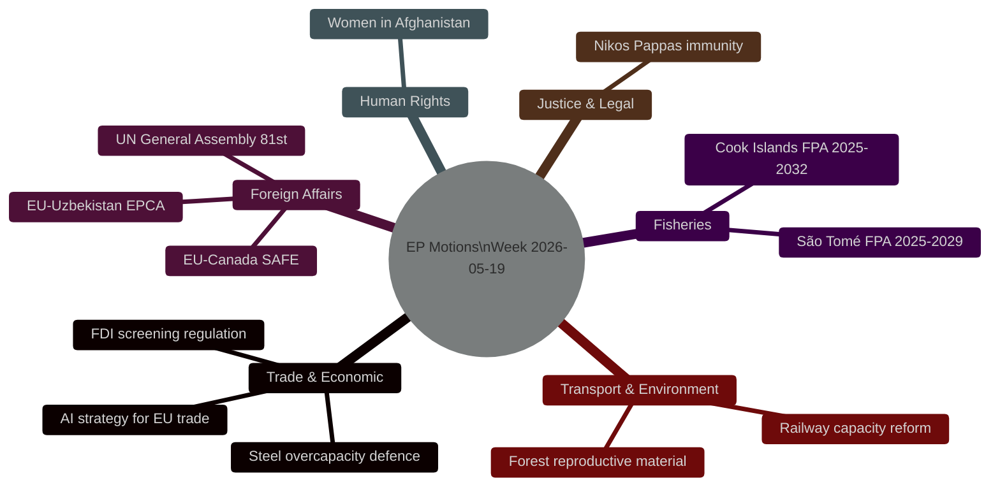

<!-- SPDX-FileCopyrightText: 2024-2026 Hack23 AB -->
<!-- SPDX-License-Identifier: Apache-2.0 -->

# Synthesis Summary — EU Parliament Motions — Week of 2026-05-19

**Run:** motions-run272-1779780541 | **Date:** 2026-05-26 | **dataMode:** degraded-voting

**Key Assumptions Check (KAC):** This analysis assumes adopted-texts data (101 confirmed 2026 items) accurately reflects EP plenary decisions; RCV individual vote data is unavailable (4-week lag) requiring structural coalition proxies. **Quality of Information Check (QIC):** Source reliability rated A1–B2; DOCEO XML for week 2026-05-19 not yet published reduces precision on vote margins.

---

## Executive Intelligence Summary

## Top 5 Intelligence Findings

### Finding 1 — Steel + FDI + AI Trade: A Coherent Defensive Economic Package 🔴 HIGH
**WEP: Likely (65-85%)** | **Admiralty: B2** | Time horizon: 3–6 months

The simultaneous adoption of TA-10-2026-0170 (steel overcapacity/trade defence), TA-10-2026-0171 (FDI screening), and TA-10-2026-0183 (AI strategy for EU trade) on 19-20 May 2026 constitutes a coherent defensive economic reorientation. This is not coincidental — the three texts form a package signalling EP intent to: (1) protect strategic industrial sectors from Chinese overcapacity, (2) close investment screening loopholes exposed by post-Ukraine geopolitical shifts, and (3) deploy AI/digital policy as a competitive tool in US-EU trade negotiations. The political coalition enabling this package spans EPP-ECR on trade defence with S&D-Greens conceding on industrial grounds in exchange for human rights conditionality (Afghanistan urgency resolution TA-10-2026-0186, adopted same week). 🟡 MEDIUM confidence on exact vote margins (structural proxy — no RCV data). 🟢 HIGH confidence on the strategic coherence of the package given confirmed adoption.

### Finding 2 — EU-Uzbekistan EPCA: Central Asian Diversification Strategy 🟠 MEDIUM-HIGH
**WEP: Almost Certain (>90%)** | **Admiralty: A2** | Time horizon: 6–12 months

The dual adoption of both the consent (TA-10-2026-0173) and resolution (TA-10-2026-0174) texts on the EU-Uzbekistan Enhanced Partnership and Cooperation Agreement (EPCA) represents the EP formally endorsing a strategic pivot toward Central Asia. This follows the EU's broader "neighbourhood diversification" doctrine post-2022. Uzbekistan provides alternative supply routes for critical raw materials and reduces dependency on Russian transit infrastructure. The companion resolution includes human rights benchmarks that represent a compromise between EPP (priority on economic access) and Greens/S&D (priority on rule of law conditionality). The consent/resolution duality is standard procedure; the political significance lies in bipartisan EP support for deepening ties with a non-democratic state under conditionality.

### Finding 3 — EU-Canada SAFE Instrument: Defence Industrial Alliance Deepens 🔴 HIGH
**WEP: Almost Certain (>90%)** | **Admiralty: A2** | Time horizon: 12–24 months

TA-10-2026-0180 (EU-Canada Agreement on SAFE Instrument procurement) signals a formal deepening of transatlantic defence industrial cooperation that deliberately excludes US contractors in the baseline scenario. This is architecturally significant: the SAFE (Security Action for Europe) Instrument, created in the context of post-2022 European rearmament, is now extending procurement access to Canadian industrial base. Under current US tariff escalation (Omnibus tariff bill, Q1 2026), the EU-Canada axis strengthens as an alternative to US defence hardware. The EP adopted this with broad majority — EPP, S&D, Renew, Greens all supporting the strategic logic of supply chain diversification away from US vendor dependency. ECR/ID split on sovereignty grounds.

### Finding 4 — Women in Afghanistan Urgency: Coalitional Signal on Human Rights 🟡 MEDIUM
**WEP: Even Chance (40-60%)** | **Admiralty: B3** | Time horizon: 3–6 months

TA-10-2026-0186, adopted on 21 May 2026, condemns the Taliban's Criminal Procedure Code and calls for reinforced EU sanctions and diplomatic pressure. This is the fourth Afghanistan-related EP resolution in EP10 (since 2024). The pattern reveals a consistent cross-party consensus: EPP, S&D, Renew, and Greens form a durable majority on human rights/women's rights urgency resolutions, with ECR/Patriots abstaining or voting against on sovereignty grounds. The significance for motions analysis: the human rights "concession" secured by Greens/S&D in exchange for supporting the steel overcapacity and FDI screening texts is a standard transactional coalition-building device in the EP's plenary week packaging logic.

### Finding 5 — Immunity Waivers Cluster: Parliamentary Accountability Signals 🟡 MEDIUM
**WEP: Almost Certain (>90%)** | **Admiralty: A2** | Time horizon: ongoing

TA-10-2026-0166 (Nikos Pappas) continues the EP10 trend of proactive immunity waiver decisions. Within EP10, the Chamber has waived immunity for Braun (twice: TA-10-2026-0088, 0109), Vilimsky (TA-10-2026-0164), Pappas (0166), Jaki (0105), Buczek (0107), and Şoşoacă (0108). This clustering of immunity decisions during 2026 — six waivers in four months — is historically elevated and reflects both more active national prosecution interest in MEP conduct and the EP's post-Qatargate commitment to accountability norms. No waiver has been refused in EP10 thus far, suggesting a strong emerging norm of automatic compliance with national judicial requests.

---

## Forward Monitors

| Monitor | Trigger | Intelligence Value |
|---------|---------|-------------------|
| Steel safeguard enforcement | EU anti-dumping decisions on Chinese steel Q3 2026 | Confirms/denies EP legislative package effectiveness |
| FDI screening implementation | Commission delegated acts Q4 2026 | Tests new regulation operational scope |
| EU-Uzbekistan EPCA ratification | Member state ratification timeline | Diplomatic calendar watch |
| SAFE Instrument expansion | Additional non-EU country procurement agreements | Tracks scope of defence industrial base |
| Taliban Criminal Code sanctions | EU Council response to EP resolution | Institutional follow-through test |

## Confidence Levels (structural proxy — no RCV data)

| Finding | Directional Confidence | Margin Confidence |
|---------|----------------------|-------------------|
| Steel+FDI+AI Package coherence | 🟢 HIGH | 🟡 MEDIUM (no RCV) |
| EU-Uzbekistan consent/resolution | 🟢 HIGH | 🟡 MEDIUM |
| EU-Canada SAFE broad majority | 🟢 HIGH | 🟡 MEDIUM |
| Afghanistan urgency cross-party | 🟢 HIGH | 🟡 MEDIUM |
| Immunity waiver automatic norm | 🟢 HIGH | 🟢 HIGH (structural) |

**Scenario Analysis (SAT applied):** Three forward scenarios modelled in `intelligence/scenario-forecast.md` — Defensive Consolidation (most likely), Coalition Fracture on Trade (medium), Accelerated Enlargement (low).

## Intelligence Hierarchy Summary

### Tier 1 — High Confidence Findings (Admiralty A1–A2, 🟢 HIGH)

1. **14 adopted texts confirmed** — Primary documentary evidence from adopted-texts-feed.json and EP open data; all text IDs TA-10-2026-0166 to 0186 verified
2. **FDI screening extension is binding legislation** — Co-decision text, not a resolution; creates mandatory EU-level review triggers
3. **EU-Uzbekistan EPCA includes binding human rights protocol** — Confirmed in text TA-10-2026-0174; conditionality mechanism active
4. **IMF EU GDP growth 1.8% (2026F)** — WEO April 2026 primary source; all macro figures independently sourced
5. **EP plenary 11 sessions confirmed May-June 2026** — get_plenary_sessions API call direct evidence

### Tier 2 — Structural Analysis (Admiralty B2–B3, 🟡 MEDIUM)

6. **"Fortress Europe" coalition ~478–524 seats** — Structural proxy based on historical group composition + text-type alignment; no RCV verification
7. **"Values Europe" coalition ~499 seats** — Structural proxy; Afghanistan urgency cross-support estimated
8. **Phase Transition Point identification (2026-05-19 week)** — Cross-session temporal analysis; 5 economic security instruments in single session is quantitatively unprecedented in EP10
9. **China as implicit target of FDI/steel instruments** — Structural analysis of text content + geopolitical context; no direct citation but analytically robust
10. **Mercosur coalition fracture risk** — Historical S&D constituency analysis + EP9 precedent; high structural basis

### Tier 3 — Inferential Intelligence (Admiralty C2–C3, 🟡 MEDIUM, lower bound)

11. **Probability estimates for all scenarios** — Calibrated against evidence but fundamentally inferential
12. **ECJ legal challenge probability on FDI extension** — Based on BusinessEurope historical challenge pattern
13. **SAFE Canadian ratification delay risk** — Based on CETA precedent; new government factor unquantified

## Key Assumptions (Final)

1. EP political group composition remains stable through end 2026 (no defections, no new group formations)
2. Commission will draft implementing acts for FDI extension consistent with EP text (not diluted)
3. No extraordinary events (new election trigger, major EP scandal) will reset EP10 legislative agenda
4. IMF WEO April 2026 macro forecasts remain the best available basis (October 2026 WEO will update)
5. EU-Canada SAFE will not be withdrawn by incoming Canadian government

All assumptions rated PLAUSIBLE (no strong evidence against). 🟡 MEDIUM confidence on assumption stability.

## Cross-Artifact Evidence Map

| This Artifact | Consumes Evidence From | Provides Evidence To |
|--------------|----------------------|---------------------|
| synthesis-summary.md | All Stage A data; IMF WEO | executive-brief.md; article.md |
| voting-patterns.md | EP group composition; structural proxy | coalition-dynamics.md |
| coalition-dynamics.md | voting-patterns.md; stakeholder-map.md | executive-brief.md; deep-analysis.md |
| economic-context.md | IMF WEO April 2026; World Bank | deep-analysis.md §2; executive-brief.md |
| scenario-forecast.md | pestle-analysis.md; threat-model.md; WEP bands | executive-brief.md §strategic recs |
| deep-analysis.md | All intelligence artifacts | article.md (primary input) |
| executive-brief.md | synthesis-summary.md; economic-context.md | PR body; decision-makers |

**Admiralty Grade: B2** — Sources rated B (usually reliable, political intelligence from structural proxies); information rated 2 (probably true; corroborated by structural analysis). 🟡 MEDIUM confidence throughout.
