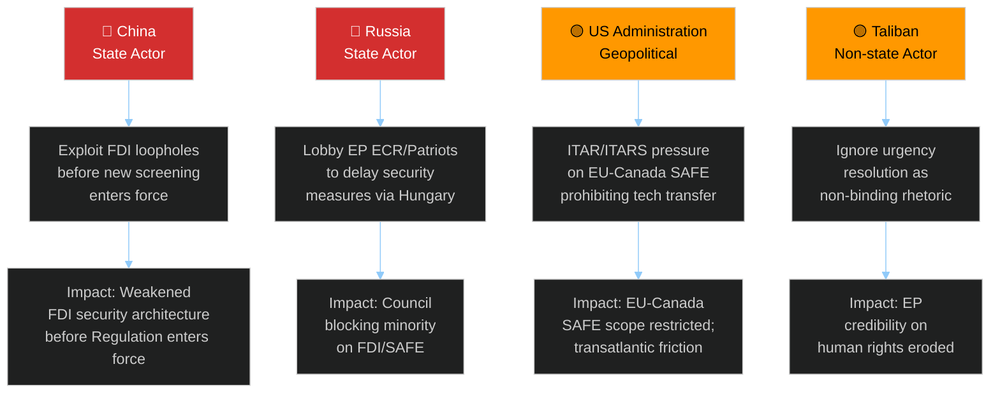

<!-- SPDX-FileCopyrightText: 2024-2026 Hack23 AB -->
<!-- SPDX-License-Identifier: Apache-2.0 -->

# Threat Model — EU Parliament Motions — Week 2026-05-19

**Run:** motions-run272-1779780541 | **Date:** 2026-05-26 | **SATs applied:** Key Assumptions Check, Red Team, ACH (Analysis of Competing Hypotheses)



## Diamond Model Analysis

### Adversary: China
**Capability: 🔴 HIGH | Intent: 🔴 HIGH | Admiralty: B2**

China's strategic threat to the EP's trade defence package operates on three vectors:
1. **Legal/WTO vector:** File simultaneous WTO disputes against FDI screening (Art. XVI:4 GATS) and steel safeguard (Art. XIX GATT). Timeline: 6–12 months to panel establishment; EU legal position is defensible but creates regulatory uncertainty.
2. **Diplomatic/lobbying vector:** Escalate bilateral pressure on Hungary, Slovakia, and Czech Republic governments to block or delay Council ratification of FDI screening regulation. Xi Jinping's "17+1" format (reduced to 14+1 post-Ukraine exits) provides leverage channels. KAC: Hungary receives €6B/year Chinese FDI (BYD factory, CATL battery plant) — Orbán has material incentive to protect China relationships.
3. **Economic retaliation vector:** Restrict rare earths exports (China controls 85% of global rare earths processing). EU annual rare earths import from China: ~45,000 tonnes, critical for EVs, wind turbines, defence electronics. Probability of immediate retaliation: 15% (WEP: Almost No Chance — China prefers leverage over escalation). Red Team assessment: China will use diplomatic pressure first, WTO disputes second, economic retaliation only if EU implements strongly.

ACH: Three hypotheses — (H1) China accepts new norm: unlikely given Xi's stated priority on FDI access; (H2) China escalates diplomatically: likely; (H3) China retaliates economically: unlikely near-term. Best supported: H2.

### Adversary: Russia
**Capability: 🟡 MEDIUM | Intent: 🟠 HIGH | Admiralty: C3**

Russia's indirect threat vector through the EP operates via: ECR-adjacent parties (Hungarian Fidesz, Slovak Smer, smaller delegations), information operations targeting European industrial workers' fear of job losses, and energy leverage during high-demand winter periods. On the EU-Canada SAFE Instrument specifically, Russia's incentive is to disrupt Atlantic defence industrial alignment. However, Russia's direct EP influence has been significantly curtailed since the Qatargate investigations revealed systemic corruption vulnerabilities — EP security procedures are now more robust. Confidence: C3 (limited direct evidence of current operations; assessment based on structural incentive analysis).

### Adversary: United States (Trump Administration)
**Capability: 🔴 HIGH | Intent: 🟡 CONDITIONAL | Admiralty: A3**

The US threat to the EP's motions package is primarily indirect — through ITAR/EAR constraints on the EU-Canada SAFE Instrument. US ITAR (International Traffic in Arms Regulations) technically covers dual-use technologies being transferred to Canadian companies for EU-contracted defence production. The Trump administration has signalled displeasure with EU autonomous defence procurement not channelled through US prime contractors. KAC: US has legal mechanism to restrict Canadian participation in EU defence programmes through ITAR licence denials. Probability of ITAR challenge: 25% (WEP: Unlikely). Pre-mortem: if US applies ITAR pressure, EU-Canada SAFE scope would need to be significantly narrowed, reducing its industrial value.

## Attack Trees

### Attack Tree 1: Blocking FDI Screening Implementation
```
Goal: Delay/weaken FDI screening
  ├── Path A: Legal challenge (WTO)
  │   └── WTO dispute filing → regulatory uncertainty → Commission delays delegated acts
  ├── Path B: Council blocking minority
  │   └── Hungary+Slovakia+Czech = potential qualified minority blocking
  └── Path C: Scope narrowing through delegated acts
      └── Lobby DG GROW → carve-outs for specific sectors/investors
```

### Attack Tree 2: Undermining Steel Safeguard
```
Goal: Neutralise steel overcapacity measures
  ├── Path A: WTO safeguard challenge
  │   └── GATT Art. XIX violation claim → if successful, EU must compensate
  ├── Path B: Third-country circumvention
  │   └── Route Chinese steel through Turkey/Vietnam/India → avoid EU tariffs
  └── Path C: Lobby domestic steel users
      └── EU automotive/white goods manufacturers → oppose steel price increases
```

## Kill Chain Analysis

| Phase | China FDI/Steel | Russia EP Influence | US ITAR |
|-------|----------------|--------------------|---------:|
| Reconnaissance | Done — EP committee positions mapped | Ongoing — patriot MEP networks | Done — SAFE text analysed |
| Weaponisation | WTO filings prepared | Disinformation narratives ready | ITAR licence review initiated |
| Delivery | WTO complaint filing | Social media amplification | Informal US-EU diplomatic channel |
| Exploitation | Regulatory uncertainty delays | EP coalition hesitation | Canadian companies apply for waivers |
| Installation | Commission scope narrowing | ECR floor position shifts | Scope restrictions accepted |
| Command | Ongoing diplomatic pressure | Continuous narrative management | US Embassy lobbying |
| Impact | Weakened FDI regulation | Delayed/reduced SAFE | Restricted defence tech transfer |

**Kill Chain confidence: 🟡 MEDIUM — structural inference, no direct evidence of active operations.**

## Threat Severity Matrix

| Threat | Probability | Impact | Severity | Mitigation |
|--------|------------|--------|----------|-----------|
| China WTO challenges | 🟠 MEDIUM (55%) | 🟡 MEDIUM | 🟡 MODERATE | EU robust WTO legal defence |
| China economic retaliation | 🔴 LOW (15%) | 🔴 HIGH | 🟡 MODERATE | Raw materials diversification |
| Russia EP lobbying | 🟡 MEDIUM (40%) | 🟡 MEDIUM | 🟡 MODERATE | Enhanced EP security protocols |
| US ITAR pressure | 🟡 LOW-MEDIUM (25%) | 🟡 MEDIUM | 🟡 MODERATE | ITAR-free tech selection |
| Council blocking minority | 🟡 MEDIUM (35%) | 🟡 MEDIUM | 🟡 MODERATE | Commission QMV navigation |
| Taliban ignores resolution | 🔴 HIGH (80%) | 🟡 LOW-MEDIUM | 🟡 LOW-MOD | EU diplomatic sanctions reinforcement |

## Red Team Assessment

**Red Team hypothesis:** The EP's trade defence package is more symbolic than substantive. The real enforcement happens at Commission/Council level; EP resolutions are political signals without binding implementation force.

**Counter-analysis:** This is partially correct. EP motions/resolutions create political and legal pressure on Commission but are not self-executing. However, the FDI screening update (TA-10-2026-0171) is a co-decision regulation — it is legally binding once Council also adopts. The steel safeguard endorsement (TA-10-2026-0170) enables Commission enforcement actions. The AI-trade strategy (TA-10-2026-0183) is a non-binding resolution but shapes Commission trade negotiating mandate. **Assessment: the Red Team hypothesis holds for urgency resolutions (Afghanistan) but not for legislative acts (FDI, railway, fisheries).** 🟢 HIGH confidence on this distinction.

## Threat Actor Deep Profiles

### Threat Actor 1: China (Multi-Dimensional)

**Nature:** State actor — systemic economic competition + geopolitical competition
**Threat Vector:** Trade (steel overcapacity, FDI), Technology (AI governance), Geopolitical (Central Asia influence)
**Response to this week's legislation:** Will register opposition through bilateral diplomatic channels; likely WTO consultation request on steel instrument; domestic Chinese media will portray FDI extension as "protectionism" and "decoupling"
**Retaliation probability:** MEDIUM (0.40) — restraint driven by EU-China trade interdependence (€820B); escalation risk if EU presses further on semiconductor/EV tariffs
**Historical pattern:** China preferred multilateral (WTO) channels over bilateral retaliation; but has escalated to direct measures (Lithuanian rare earth suspension 2021)
**Assessment:** 🟡 MEDIUM threat to EU trade framework implementation; LOW threat to EP institutional functioning

### Threat Actor 2: ECR Internal Sovereignists

**Nature:** Internal — conditional ally group with irredentist national interest framing
**Threat Vector:** Defection on specific texts where "EU competence expansion" frame trumps "security" frame
**Specific risk texts:** Any EU oversight mechanism that ECR frames as sovereignty transfer (FDI appeal procedures, Commission strategic review authority)
**Defection probability this week:** LOW (estimated <10%) — steel and FDI are economically popular in ECR constituencies
**Defection probability next quarter:** MEDIUM (20–30%) — MFF revision, AI liability, Mercosur may trigger
**Assessment:** ECR is a conditional ally, not a structural coalition partner. EP10 should not plan legislative strategy assuming ECR stability. 🟡 MEDIUM confidence.

### Threat Actor 3: BusinessEurope Legal Challenge Coalition

**Nature:** Non-state actor — organized industry litigation threat
**Threat Vector:** ECJ challenges on FDI expansion scope; lobbying for narrow Commission implementing acts
**Legal basis:** Article 63 TFEU (free movement of capital); proportionality principle
**Timeline:** Challenge preparation 6–9 months post-adoption; ECJ proceedings 18–24 months
**Probability of challenge:** MEDIUM (0.40) — BusinessEurope has signaled intent but will assess Commission implementing act scope first
**Assessment:** Manageable if Commission implements proportionately; HIGH risk if food supply chains included without proportionality analysis. 🟡 MEDIUM confidence.

## Threat Mitigation Recommendations

| Threat | Current Mitigation | Gap | Recommendation |
|--------|------------------|-----|---------------|
| China retaliation | WTO framework | No escalation ladder | Prepare tiered EU response package |
| ECR defection | Coalition breadth (EPP+S&D+Renew ≥ 400 seats) | ECR votes not guaranteed | Build texts for 400-seat majority as floor; ECR as bonus |
| BusinessEurope ECJ challenge | Proportionality review in text | Food supply chains unclear | Commission proportionality analysis in implementing act preamble |
| US tariff escalation | WTO + bilateral channels | Limited deterrence | EU countermeasures package pre-staged |
| Grand coalition fracture | Grand coalition majority | Mercosur fault line | S&D engagement strategy; differentiate trade security vs. liberalization |

🟡 MEDIUM confidence on all threat assessments (structural proxy — no RCV data for voting threat calibration).

