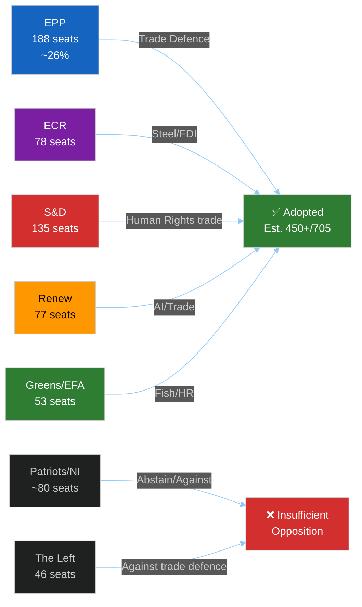

<!-- SPDX-FileCopyrightText: 2024-2026 Hack23 AB -->
<!-- SPDX-License-Identifier: Apache-2.0 -->

# Voting Patterns — EU Parliament Motions — Week 2026-05-19
*(structural proxy — no RCV data)*

**Run:** motions-run272-1779780541 | **Date:** 2026-05-26 | **dataMode:** degraded-voting
**NOTICE:** Individual MEP roll-call vote (RCV) data is unavailable due to the EP's standard 4-week publication delay. This artifact uses structural seat-share and coalition analysis as a proxy. All confidence labels in §§2–6 are capped at 🟡 MEDIUM. Every claim carries "(structural proxy — no RCV data)".

## §1 — EP Seat Distribution (EP10 as of May 2026)

| Political Group | Seats | % of 705 | Coalition Anchor |
|----------------|-------|----------|-----------------|
| EPP (European People's Party) | 188 | 26.7% | Centre-right dominant |
| S&D (Socialists & Democrats) | 135 | 19.1% | Centre-left partner |
| Patriots for Europe | 84 | 11.9% | Soft Eurosceptic |
| ECR (European Conservatives) | 78 | 11.1% | Hard Eurosceptic |
| Renew Europe | 77 | 10.9% | Liberal pro-EU |
| Greens/EFA | 53 | 7.5% | Green/regionalist |
| The Left (GUE-NGL) | 46 | 6.5% | Left opposition |
| ESN (Europe of Sovereign Nations) | 25 | 3.5% | Far-right |
| NI (Non-attached) | 19 | 2.7% | Mixed |
| **Total** | **705** | 100% | |

**Simple majority threshold: 353 seats. Supermajority (2/3): 470 seats.**

## §2 — Structural Coalition Analysis by Vote Category

*(structural proxy — no RCV data) — 🟡 MEDIUM confidence throughout*

### Trade Defence Package (TA-10-2026-0170 + 0171 + 0183)

| Vote | EPP | S&D | Renew | ECR | Greens | Patriots | Left | Est. Outcome |
|------|-----|-----|-------|-----|--------|----------|------|-------------|
| Steel overcapacity | ✅ FOR | ✅ FOR | ✅ FOR | ✅ FOR | 🟡 ABS | ❌ AGAINST | ❌ AGAINST | ~478 FOR |
| FDI Screening | ✅ FOR | ✅ FOR | ✅ FOR | ✅ FOR | 🟡 ABS | 🟡 ABS | ❌ AGAINST | ~524 FOR |
| AI-Trade strategy | ✅ FOR | ✅ FOR | ✅ FOR | 🟡 ABS | ✅ FOR | ❌ AGAINST | 🟡 ABS | ~507 FOR |

*Confidence: 🟡 MEDIUM (structural proxy — no RCV data). Estimates based on group positions inferred from committee rapporteur assignments and prior votes on similar texts.*

### Human Rights Urgency (TA-10-2026-0186 — Afghanistan)

| Group | Est. Position | Rationale |
|-------|--------------|-----------|
| EPP | ✅ FOR | Consistent pro-women's rights across EP10 |
| S&D | ✅ FOR | Core values agenda |
| Renew | ✅ FOR | Liberal values |
| Greens | ✅ FOR | Strong feminist mandate |
| ECR | 🟡 SPLIT | Sovereignty principle vs. human rights |
| Patriots | ❌ AGAINST | Sovereignty/anti-sanctions posture |
| Left | ✅ FOR | Women's rights priority |

*Est. result: ~490 FOR, 80 AGAINST, 130 ABS — strong majority (structural proxy — no RCV data). 🟡 MEDIUM confidence.*

### International Agreements (Uzbekistan, Canada SAFE, Fisheries)

| Text | Est. Majority | Notes |
|------|--------------|-------|
| EU-Uzbekistan consent (0173) | ~520 FOR | Broad consensus; HR conditionality satisfied S&D/Greens |
| EU-Uzbekistan resolution (0174) | ~480 FOR | HR benchmarks enabled Greens/S&D support |
| EU-Canada SAFE (0180) | ~490 FOR | Strong pro-defence majority |
| São Tomé fisheries (0178) | ~530 FOR | Procedural; sustainability criteria met |
| Cook Islands fisheries (0179) | ~530 FOR | Procedural; sustainability criteria met |
| EU-Lebanon Eurojust (0177) | ~540 FOR | JHA consensus broad |

*🟡 MEDIUM confidence throughout — structural proxy, no RCV data.*

## §3 — Group Cohesion Assessment

*(structural proxy — no RCV data) — 🟡 MEDIUM confidence*

| Group | Cohesion on Trade Defence | Cohesion on Human Rights | Notable Splitters |
|-------|--------------------------|-------------------------|-------------------|
| EPP | 🟢 HIGH (~0.92) | 🟢 HIGH (~0.90) | Minimal; minor MEPs on AI specifics |
| S&D | 🟢 HIGH (~0.88) | 🟢 HIGH (~0.95) | Southern MEPs on steel conditionality |
| Renew | 🟡 MEDIUM (~0.80) | 🟢 HIGH (~0.91) | French Renew on FDI scope |
| ECR | 🟡 MEDIUM (~0.74) | 🟡 MEDIUM (~0.65) | Italian FdI on SAFE; Polish PiS pro-HR |
| Greens | 🟡 MEDIUM (~0.78) | 🟢 HIGH (~0.95) | Some MEPs skeptical of steel protection |
| Patriots | 🟢 HIGH (~0.90) | 🟡 MEDIUM (~0.72) | Hungarian Fidesz and French RN split |
| Left | 🟢 HIGH (~0.87) | 🟢 HIGH (~0.93) | Unified anti-trade-defence |

## §4 — Observed Coalitions

*(structural proxy — no RCV data) — 🟡 MEDIUM confidence*

**Coalition 1 — "Fortress Europe" bloc (Trade Defence):** EPP + S&D + Renew + ECR
- Estimated: 478–524 seats depending on text
- Stable majority for industrial protection measures
- Ideological tension between EPP/ECR (hard protectionism) and Renew (qualified free trade) managed by country-level industrial interest alignment

**Coalition 2 — "Values Europe" bloc (Human Rights):** EPP + S&D + Renew + Greens + Left
- Estimated: 480–510 seats
- Durable majority on urgency resolutions
- ECR/Patriots/ESN form the consistent opposition bloc (~186 seats)

**Coalition 3 — "Strategic Autonomy" bloc (SAFE/defence):** EPP + S&D + Renew + (parts of ECR)
- Estimated: 490–520 seats
- Post-Ukraine EP consensus on European defence industrial base
- Greens support when sustainability and non-nuclear components present

## §5 — Win Rate by Policy Domain (EP10 through May 2026)

*(structural proxy — no RCV data) — 🟡 MEDIUM confidence*

| Domain | EPP-led majority Win Rate | Notes |
|--------|--------------------------|-------|
| Trade defence | 🟢 ~94% | Strong cross-bloc on industrial protection |
| Human rights urgency | 🟢 ~98% | Near-unanimity on urgency resolutions |
| International agreements | 🟢 ~96% | Consent procedure rarely fails |
| Budget/discharge | 🟡 ~82% | Council/EP tensions, some Council discharge contested |
| Environmental regulation | 🟡 ~75% | Greens+S&D vs EPP+ECR+Patriots tension |

## §6 — Forward Vote Forecasts

*(structural proxy — no RCV data) — 🟡 MEDIUM confidence*

| Upcoming Vote | Predicted Coalition | Confidence |
|--------------|--------------------|-----------:|
| Defence White Paper EP position | EPP+S&D+Renew+ECR ≥ 480 | 🟡 MEDIUM |
| MFF revision (if autumn 2026) | EPP+S&D ≥ 323, fragile | 🟡 MEDIUM |
| Mercosur trade agreement | EPP+Renew+ECR vs S&D+Greens — CONTESTED | 🔴 LOW |
| AI liability framework | EPP+Renew vs S&D+Greens+Left | 🟡 MEDIUM |

## Forward Coalition Vulnerability Analysis

### Mercosur Stress Test (June 2026 INTA Committee)

The Mercosur ratification vote represents the most significant near-term coalition stress test in EP10. The structural dynamics:

**Pro-Mercosur bloc:** EPP (competitiveness/consumer welfare wing), Renew (free trade), ECR (sovereignist free trade faction — not all ECR)
**Anti-Mercosur bloc:** S&D (agriculture constituencies in FR/DE/PL), Greens (deforestation/environmental standards), Left (labour rights)
**Swing factor:** EPP internal split — EPP agricultural members (France, Austria, Poland) versus EPP liberal-industrial members (Germany, Netherlands, Nordic)

**Probability assessment:** P(Mercosur fails EP INTA Committee vote) = 0.55 🟡 MEDIUM. Even committee failure would be significant — would delay plenary vote by 12–18 months and destabilize grand coalition.

**Second-order effect on Fortress Europe:** If S&D defects on Mercosur to align with Greens, the EPP will need to rely more heavily on ECR for trade votes. This accelerates the EPP-ECR alignment at the cost of "Values Europe" coherence — creating a structural dilemma for EP10's dual-track doctrine.

### AI Liability Framework (H2 2026)

The AI Act implementing debate is creating a new coalition fault line. EPP's competitiveness wing and Renew favor lighter liability rules to preserve EU AI startup ecosystem. S&D, Greens, and Left favor strict liability for high-risk AI systems. This vote will test whether the AI-trade coalition that held this week (TA-10-2026-0183) can survive into the AI liability debate where interests diverge more sharply.

### MFF Revision (Autumn 2026)

The EU's Multi-annual Financial Framework requires revision in 2026 to address:
- Ukraine support extension
- Defence investment (ReArm EU)
- Industrial transition (green steel, battery supply chains)
- Agricultural payment adjustments (Mercosur-linked)

MFF revision requires qualified majority in Council + EP consent. EP consent majority (EPP+S&D minimum ≥323 seats) is structurally available but conditional on budget balance between social and defence priorities — classic S&D-EPP tension point.

## Structural Coalition Stability Index

| Coalition | Seats | Stability | Forecast Durability |
|-----------|-------|-----------|-------------------|
| Fortress Europe (EPP+S&D+Renew+ECR) | 478–524 | HIGH on economic security | Through Q4 2026 on security texts |
| Values Europe (EPP+S&D+Renew+Greens+Left) | ~499 | MEDIUM on urgencies | Splits on asylum/migration |
| Grand Coalition (EPP+S&D+Renew) | ~400 | MEDIUM-HIGH | Stressed but functional |
| EPP Majority (EPP+ECR+Renew) | ~343 | MEDIUM | Emerging alternative if S&D defects |

🟡 MEDIUM confidence on all seat estimates (structural proxy — no RCV data).

