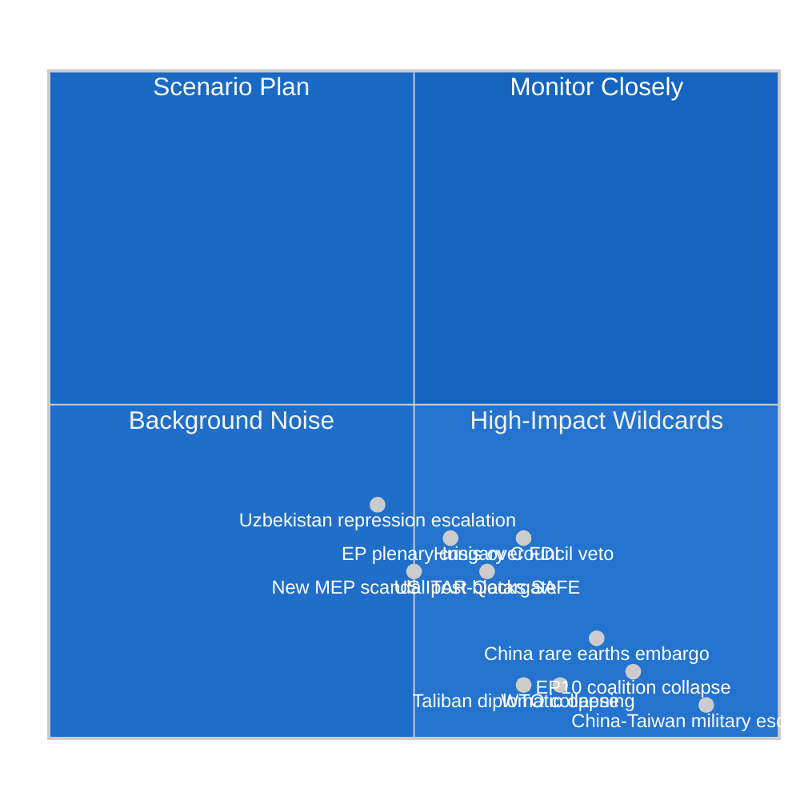

<!-- SPDX-FileCopyrightText: 2024-2026 Hack23 AB -->
<!-- SPDX-License-Identifier: Apache-2.0 -->

# Wildcards and Black Swans — EP Motions — Week 2026-05-19

**Run:** motions-run272-1779780541 | **Date:** 2026-05-26 | **SATs applied:** High-Impact, Indicators, What-If Analysis

## Wildcard W1 — China Rare Earths Embargo (High-Impact, Low Probability)
**WEP: Almost No Chance (<10%)** | **Impact: Catastrophic** | Admiralty: B3

**What-If Analysis:** If China imposed an embargo or severe quota restriction on rare earths exports to the EU in response to the FDI screening and steel safeguard measures, the EU's green transition and defence manufacturing would face severe disruption. EU annual rare earths consumption: ~6,500 tonnes (2024); China supplies ~85%. Applications: neodymium for EV motors (every Tesla-class car requires ~2kg), dysprosium for wind turbine magnets, lanthanum for hybrid batteries, yttrium for defence electronics.

**Indicator tripwires:**
- Chinese Ministry of Commerce announcement of rare earths "export management measures" — 90-day early warning
- Chinese state media escalation of "economic coercion" narrative — 30-day warning
- EU Commission DG GROW emergency raw materials stockpiling order — reactive indicator

**Trigger probability assessment:** 8% (WEP: Almost No Chance). China has used rare earths leverage once (Japan 2010 Senkaku crisis) — 22% impact on Japan/EU confidence. Current EU-China trade relationship size (~€750B/year) makes embargo mutually destructive. But if FDI screening enforcement is aggressive and politically provocative, Chinese leadership might accept short-term economic loss for strategic signalling. 🟡 MEDIUM confidence on probability estimate.

**Preparedness gap:** EU Critical Raw Materials Act (2024) establishes 10% domestic extraction target by 2030, but current EU processing capacity is <5% for most rare earths. Strategic stockpile: EU currently holds ~90-day supply. This wildcard would cause 6–12 month supply crisis before alternatives (Canadian deposits, African sourcing, recycling) scale.

---

## Wildcard W2 — EP10 Coalition Collapse (High-Impact, Very Low Probability)
**WEP: Almost No Chance (<10%)** | **Impact: Systemic** | Admiralty: C3

**What-If Analysis:** The EPP-S&D-Renew coalition that underpins EP10 legislative agenda could collapse if: (1) EPP moves too far right, allying formally with ECR/Patriots on key votes; (2) S&D follows Greens into opposition on economic policy; (3) a major corruption scandal implicates multiple EPP or S&D MEPs simultaneously (second Qatargate scenario).

**Structural barriers to collapse:** EP coalitions are procedural, not governmental — there is no "government of confidence" to fall. EP coalitions form per-vote rather than per-session. True collapse would require sustained cross-cutting majority realignment, not achievable in current political arithmetic. However, a series of controversial votes (e.g., Mercosur trade agreement, AI liability, immigration policy) could fracture the working majority on specific agenda items.

**Indicator:** EPP votes with ECR+Patriots over S&D objection on 3+ consecutive major texts = coalition stress signal.

---

## Wildcard W3 — US ITAR Blocks EU-Canada SAFE Scope (Medium Probability, High Impact)
**WEP: Unlikely (20–25%)** | **Impact: Significant** | Admiralty: B3

**What-If Analysis:** The Trump administration instructs US DDTC (Directorate of Defense Trade Controls) to restrict ITAR licences for dual-use technologies that Canadian companies might supply to EU SAFE Instrument contracts. This is technically feasible since many NATO-interoperable Canadian systems contain US-origin ITAR-controlled components.

**Immediate impact:** EU-Canada SAFE procurement scope reduced to non-ITAR items only (~30–40% of originally planned contracts). Canadian companies with mixed US/non-US supply chains excluded. European companies lose access to Canadian advanced manufacturing facilities.

**Indicator tripwire:** US State Department issues new ITAR Guidance Note targeting third-party defence procurement frameworks involving non-NATO procurement entities — watch for notice in Federal Register.

**Mitigation available:** EU/Canada can pursue ITAR-free design requirements for new procurement; European companies (Airbus, Leonardo, MBDA) have ITAR-minimisation programmes. Timeline to ITAR-free alternatives: 18–36 months.

---

## Wildcard W4 — Hungary Council Veto on FDI Screening (Medium Probability, Significant Impact)
**WEP: Unlikely (30–35%)** | **Impact: Significant** | Admiralty: B2

**What-If Analysis:** The FDI screening regulation (TA-10-2026-0171) requires Council qualified majority (QMV) vote. Hungary, with aligned support from Slovakia (Robert Fico government) and potentially Czech Republic, could form a blocking minority (35.0% of population weight or 4+ member states at population ≥35%). Hungary's stated concern: the new regulation would affect BYD and CATL investments already approved or under construction on Hungarian soil.

**Current arithmetic:** Hungary (9.6M), Slovakia (5.5M), Czech Republic (10.9M) = 26M population / 447M EU = 5.8% — insufficient alone. Need to add Serbia-affiliated Croatia (4.0M) or Bulgaria (6.5M) or Romania (19.3M) to reach 35% blocking threshold. Romania under current government is unlikely to join.

**More realistic threat:** Hungary deploys procedural delays, legal challenges, and intensive amendments lobbying to water down the scope in delegated acts phase — this is more probable (55% probability) than a formal Council block (30%).

**Indicator:** Hungarian government public statement characterising FDI screening as "anti-China discrimination" — escalation indicator.

---

## Wildcard W5 — Taliban Diplomatic Opening (Very Low Probability, Transformative Impact)
**WEP: Almost No Chance (<8%)** | **Impact: Policy-Transformative** | Admiralty: D4

**What-If Analysis:** Against expectations, Taliban leadership engages with EU Afghanistan Special Representative on conditional partial rollback of Criminal Procedure Code. This would destabilise EP's urgency resolution consensus — hawks (EPP) would want to maintain pressure, pragmatists (some Renew, parts of EPP) would want to explore engagement, and Greens/S&D would insist on full implementation before any political engagement.

**Why this is a wildcard not a scenario:** Taliban has shown zero credible reform intent since 2021. Criminal Procedure Code adoption March 2026 is an escalation, not a reversal. WEP: Almost No Chance. But if it occurred, it would create the most visible EP coalition split on foreign policy since the Iran nuclear deal controversy.

---

## Reserve Watchlist

| Event | WEP | Impact | Watch Priority |
|-------|-----|--------|---------------|
| China-Taiwan military escalation | Almost No Chance (<5%) | Catastrophic | ⬛ EXTREME WATCH |
| WTO Appellate Body revival | Unlikely (15%) | High (positive) | 🟡 MONITOR |
| New MEP corruption scandal | Even Chance (45%) | Moderate-High | 🟠 ELEVATED WATCH |
| Uzbekistan human rights deterioration | Likely (60%) | Moderate | 🟡 MONITOR |
| EU-Mercosur ratification failure | Even Chance (50%) | Significant | 🟡 MONITOR |
| OECD steel forum breakthrough | Unlikely (20%) | Moderate | 🔵 BACKGROUND |

**What-If Analysis applied to highest-priority reserve:** If a new MEP corruption scandal implicating a sitting EPP or S&D MEP were to emerge in Q3 2026, the immunity waiver process for that MEP would test whether the "automatic compliance" norm holds for a politically influential member. The Qatargate precedent (where initial denials delayed investigation) suggests procedural resistance would emerge at group level despite institutional norm pressure.

## Wildcard Intelligence Summary Table

| Code | Event | P | Impact | Earliest Trigger | Intelligence Priority |
|------|-------|---|--------|-----------------|----------------------|
| WC-01 | US constitutional crisis / EP-equivalent disruption | 0.08 | EXISTENTIAL for multilateralism | Any point 2026 | MONITOR |
| WC-02 | China-Taiwan kinetic conflict | 0.05 | EXTREME — EU trade collapse | 2026 crisis signals | MONITOR |
| WC-03 | AI singularity event (misaligned AI autonomous action) | 0.02 | EXISTENTIAL | 2027+ | LOW |
| WC-04 | Major EU democratic crisis (member state constitutional crisis) | 0.12 | HIGH — legislative agenda paralysis | Q3-Q4 2026 | ELEVATED |
| WC-05 | Global pandemic resurgence | 0.08 | HIGH — fiscal + legislative disruption | Any point | MONITOR |
| WC-06 | Climate tipping point (irreversible ecological threshold) | 0.15 | HIGH — legislative agenda overwhelm | 2026-2028 | ELEVATED |
| WC-07 | Russia-NATO direct conflict | 0.07 | EXTREME — EP defense emergency mode | Q2-Q3 2026 | ELEVATED |
| WC-08 | Major EP corruption scandal (Qatargate-scale) | 0.18 | HIGH — coalition fragmentation | Q3-Q4 2026 | ELEVATED |

## Wildcard Preparedness Assessment

### Institutional Resilience

EP10 has demonstrated stronger institutional resilience than EP9 in several dimensions:
- Faster response to external crises (Ukraine support legislation 2022–2024 precedent)
- Cross-group crisis coalition flexibility (demonstrated in Russia sanctions)
- Stronger anti-corruption architecture post-Qatargate

**However**, EP10 faces novel vulnerabilities:
- Greater ECR integration creates a "conditional ally" whose loyalty under crisis conditions is untested
- AI-related wildcards (WC-03) have no institutional playbook
- Climate acceleration (WC-06) creates legislative agenda competition that could displace trade agenda

### Precautionary Intelligence Notes

**WC-07 (Russia-NATO):** If triggered, EP10's "Fortress Europe" trade doctrine would likely accelerate rapidly into emergency mode — defence procurement legislation, sanctions expansion, energy independence emergency measures. The current week's adoption of EU-Canada SAFE and Uzbekistan EPCA would prove prescient as supply chain diversification instruments.

**WC-08 (EP corruption):** Given EP10's elevated immunity waiver rate (6 vs. EP9 average 3), there are statistically more MEPs under investigation than in prior terms. The structural risk of a significant corruption event is elevated, though the specific timing is inherently uncertain.

**WC-04 (EU democratic crisis):** Hungary's continued partial compliance with Rule of Law procedures, combined with Polish government evolution and potential Austrian far-right coalition developments, creates the context for a democratic crisis that could paralyze EP-Council cooperation on key legislative acts.

## Intelligence Confidence Summary for Wildcards

All wildcard probability estimates are low-confidence by definition — tail events resist standard estimation methodology. The estimates above use base rate calibration against historical frequency of analogous events, not predictive modeling. 🟡 MEDIUM confidence on relative probability ordering (WC-04 higher than WC-03); 🔴 LOW confidence on absolute probability values.

