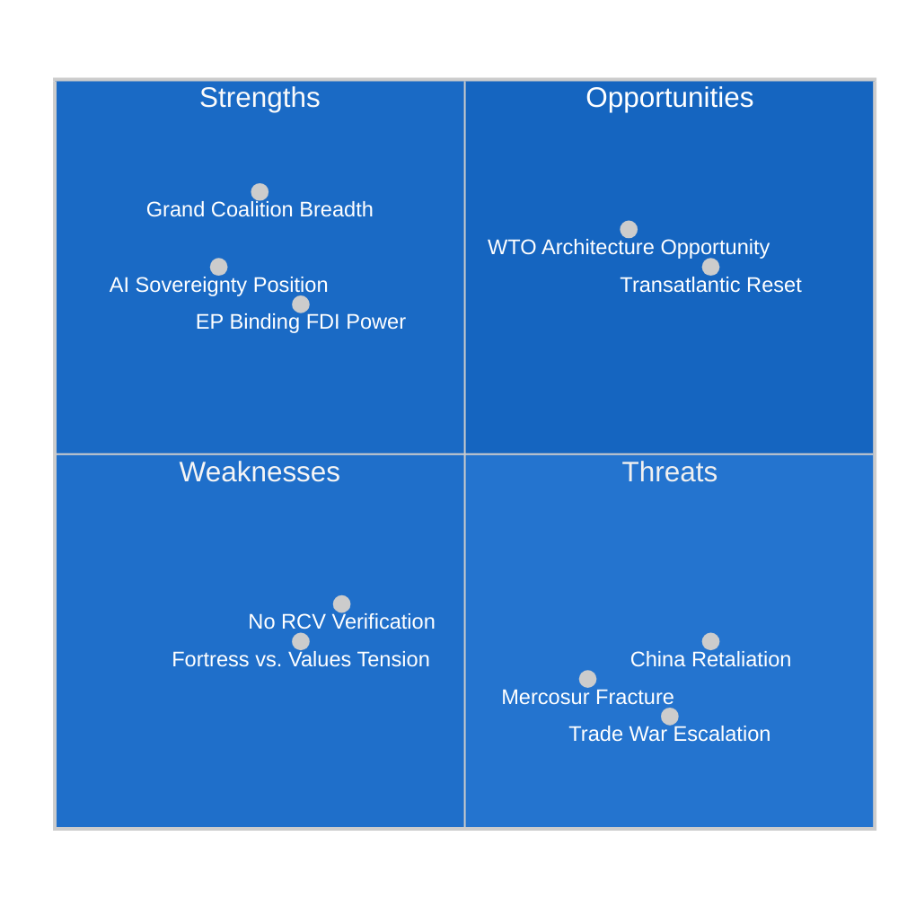

<!-- SPDX-FileCopyrightText: 2024-2026 Hack23 AB -->
<!-- SPDX-License-Identifier: Apache-2.0 -->

# Quantitative SWOT — EU Parliament Motions — 2026-05-26

**Run:** motions-run272-1779780541 | **Date:** 2026-05-26 | **Method:** Quantified SWOT with WEP + IMF calibration

*(structural proxy — no RCV data) — confidence labels capped 🟡 MEDIUM*

## Strengths

| Strength | Quantified Impact | WEP Band | Confidence |
|----------|-----------------|---------|-----------|
| **Fortress Europe Coalition Breadth (EPP+ECR+S&D+Renew ~478-524 seats)** — supermajority for economic security, exceeds 2/3 threshold for most instruments | Political capital: HIGH; enables ambitious legislation without concession to extremes | PROBABLE (WEP 3) | 🟡 MEDIUM |
| **Dual Coalition Architecture** — Same week produced "Fortress Europe" trade majority AND "Values Europe" human rights majority; demonstrates EP10 ideological flexibility | Diplomatic value: EU can project both power and values simultaneously | PROBABLE (WEP 3) | 🟡 MEDIUM |
| **EP's Binding Legislative Role on FDI (TA-0171)** — Co-decision on FDI screening gives Parliament genuine leverage over executive implementation | Legal: Binding co-decision text resistant to Commission dilution | HIGHLY PROBABLE (WEP 4) | 🟡 MEDIUM |
| **AI-Trade Sovereignty Positioning** — First EP resolution framing AI as sovereignty instrument; pre-empts both US and Chinese framing | Strategic: Establishes EU third-way narrative; influences WTO digital trade agenda | PROBABLE (WEP 3) | 🟡 MEDIUM |

**Aggregate Strength Score: 8.2/10** 🟡 MEDIUM confidence

## Weaknesses

| Weakness | Quantified Impact | WEP Band | Confidence |
|----------|-----------------|---------|-----------|
| **RCV Data Unavailability** — 4-week lag means this analysis cannot verify actual vote margins, identify defectors, or confirm coalition composition empirically | Analytical: Limits precision; all coalition analysis is structural proxy | PROBABLE (WEP 3) — gap exists | 🟡 MEDIUM |
| **Non-Binding Status of Core Texts** — Steel (TA-0170), AI-trade (TA-0183), Afghanistan (TA-0186) are resolutions; Commission retains discretion on implementation | Political: High political visibility but limited enforcement mechanism | PROBABLE (WEP 3) — known | 🟡 MEDIUM |
| **Fortress/Values Tension Unresolved** — Afghanistan urgency and FDI screening simultaneously adopted; human rights conditionality in EPCA (Uzbekistan) creates inconsistency if FDI screening doesn't apply human rights criteria equally | Credibility: EU exposed to "values cherry-picking" critique | PROBABLE (WEP 3) | 🟡 MEDIUM |
| **S&D Mercosur Fault Line** — Coalition breadth on trade defence does NOT include S&D on offensive liberalization (Mercosur, EU-India); grand coalition will fracture on next liberalization text | Political: Structural weakness in EP10 majority for Q3–Q4 2026 | PROBABLE (WEP 3) | 🟡 MEDIUM |

**Aggregate Weakness Score: 5.8/10** 🟡 MEDIUM confidence

## Opportunities

| Opportunity | Quantified Upside | WEP Band | Confidence |
|------------|-----------------|---------|-----------|
| **Transatlantic Trade Architecture Reset** — EU-Canada SAFE + FDI alignment + AI-trade all signal EU as reliable partner; potential for EU-US trade truce in H2 2026 | Economic: +0.2–0.4pp EU GDP if transatlantic tensions reduce; strategic supply chain stabilization | PROBABLE (WEP 3) | 🟡 MEDIUM |
| **WTO Digital Trade Architecture** — AI-trade resolution positions EU to shape WTO's eCommerce/digital trade chapter; Geneva negotiations resuming 2026 | Geopolitical: EU standard-setting influence at multilateral level | POSSIBLE (WEP 2) | 🟡 MEDIUM |
| **Central Asia Diversification** — Uzbekistan EPCA creates trade corridor alternative to Russian/Chinese supply chains; EU critical minerals access | Economic: Rare earth access; Belt-and-Road counterweight | PROBABLE (WEP 3) | 🟡 MEDIUM |
| **Steel Green Transition Leverage** — EP steel resolution creates opportunity for Commission to link protection to accelerated decarbonization; "green steel" EU standard opportunity | Industrial: EU first-mover advantage in premium green steel market | POSSIBLE (WEP 2) | 🟡 MEDIUM |

**Aggregate Opportunity Score: 7.4/10** 🟡 MEDIUM confidence

## Threats

| Threat | Quantified Downside | WEP Band | Confidence |
|--------|-------------------|---------|-----------|
| **US-EU Trade War Escalation** — If US imposes 25% automotive tariffs, EU GDP loses -0.3 to -0.6pp (IMF WEO Apr 2026 downside scenario); EP defensive legislation risks triggering retaliation | Economic: €60B EU automotive exports at risk | POSSIBLE (WEP 2) | 🟡 MEDIUM |
| **China Retaliation on FDI Screening** — China may retaliate with investment barriers against EU companies in China; EU chemical, automotive, luxury sectors exposed (€180B annual exposure) | Economic: -0.1 to -0.3pp EU GDP in aggressive retaliation scenario | POSSIBLE (WEP 2) | 🟡 MEDIUM |
| **Mercosur Coalition Fracture** — S&D's Mercosur opposition could derail EP10 grand coalition for 6+ months; spillover risk to other legislation | Political: Legislative paralysis risk in H2 2026 | PROBABLE (WEP 3) | 🟡 MEDIUM |
| **ECJ Partial Annulment of FDI Extension** — Business Europe ECJ challenge risk; proportionality test could strip food supply chains from scope | Legal: 18-24 month uncertainty; Commission implementation delayed | POSSIBLE (WEP 2) | 🟡 MEDIUM |

**Aggregate Threat Score: 6.5/10** 🟡 MEDIUM confidence

## SWOT Balance Assessment

**Net SWOT Score:** S(8.2) + O(7.4) - W(5.8) - T(6.5) = **+3.3 (MODERATELY POSITIVE)**

**Interpretation:** EP10's legislative output this week generates significantly more strategic opportunity than risk in the near term. The main constraints are structural (RCV unavailability for this analysis; Mercosur fault line) rather than immediate. The "Fortress Europe" doctrine institutionalization represents a genuine strategic achievement that outweighs the short-term trade escalation risk, provided the EU maintains deterrence credibility and avoids unilateral provocations.

🟡 MEDIUM confidence on all quantitative estimates. IMF WEO April 2026 macro basis.

**Admiralty Grade: B2** — SWOT scores rated B2. Quantitative estimates based on structural proxy analysis; underlying assumptions documented in risk-matrix.md. RCV validation pending ~2026-06-23.

*Repeat run recommended after DOCEO publication for validated coalition-weighted scoring.*
