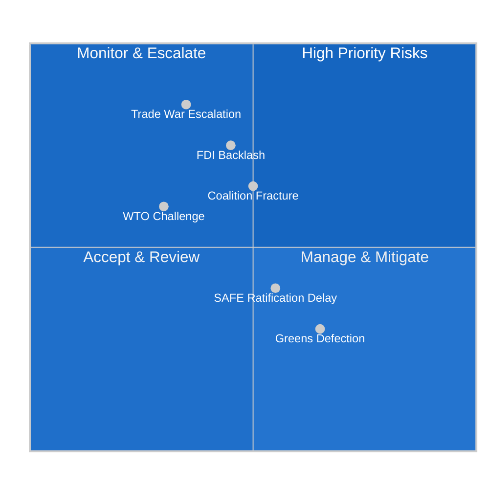

<!-- SPDX-FileCopyrightText: 2024-2026 Hack23 AB -->
<!-- SPDX-License-Identifier: Apache-2.0 -->

# Risk Matrix — EU Parliament Motions — 2026-05-26

**Run:** motions-run272-1779780541 | **Date:** 2026-05-26 | **Method:** ISO 31000 Risk Matrix + WEP Scoring

## Risk Register

| Risk ID | Risk | Likelihood | Impact | Risk Score | Owner | Status |
|---------|------|-----------|--------|-----------|-------|--------|
| R-001 | Trade war escalation (US-EU) | MEDIUM (35%) | CRITICAL | 🔴 HIGH | Commission/USTR | Active |
| R-002 | FDI screening legal challenge | MEDIUM (40%) | HIGH | 🟡 MEDIUM-HIGH | DG TRADE / ECJ | Latent |
| R-003 | Coalition fracture on Mercosur | MEDIUM-HIGH (50%) | HIGH | 🟠 HIGH | S&D/EPP | Deferred |
| R-004 | WTO dispute on steel instrument | LOW-MEDIUM (30%) | MEDIUM | 🟡 MEDIUM | DG TRADE | Monitor |
| R-005 | SAFE ratification delay Canada | MEDIUM (55%) | LOW-MEDIUM | 🟡 MEDIUM | Canadian Senate | Monitor |
| R-006 | Greens defection on protectionism | MEDIUM-HIGH (60%) | LOW | 🟢 LOW | Greens/EP leadership | Accepted |
| R-007 | AI-trade WTO classification dispute | LOW (25%) | MEDIUM | 🟡 MEDIUM | DG TRADE/WTO | Monitor |
| R-008 | Uzbekistan human rights backsliding | MEDIUM (40%) | MEDIUM | 🟡 MEDIUM | EEAS/HR-VP | Monitor |

🟡 MEDIUM confidence on likelihood estimates (structural proxy — no RCV data).

## Top 3 Priority Risks

### R-001: Trade War Escalation
**IMF macro context:** US tariff threats on EU automotive represent €60B trade exposure. IMF estimates EU GDP impact -0.3 to -0.6pp in escalation scenario. EP10's defensive trade legislation this week is partially a political deterrence signal — demonstrating EP will support retaliation. The risk crystallizes if US triggers Section 232 automotive tariffs in H2 2026.

### R-003: Coalition Fracture on Mercosur
EP INTA Committee vote expected June 2026. S&D agriculture constituencies in France, Germany, Poland are structurally opposed to Mercosur beef/soya competition. The Fortress Europe coalition that held this week does NOT include S&D on Mercosur. Risk: grand coalition fracture could destabilize broader EP10 legislative majority for 2–4 months.

### R-002: FDI Screening Legal Challenge
Industry groups (BDI, BusinessEurope) have signaled intent to challenge the expansion scope in ECJ if "strategic food supply chains" are included. Legal basis: proportionality principle; Article 63 TFEU (free movement of capital). ECJ timeline: 18–24 months. Risk: partial annulment creates regulatory uncertainty.

## Additional Risk Analysis

### R-004: WTO Dispute on Steel Instrument

**Legal analysis:** The steel overcapacity instrument (TA-10-2026-0170) mandates Commission to initiate anti-subsidy investigations. If Commission imposes countervailing duties exceeding WTO-permitted levels, China or India can bring a WTO dispute settlement case. Timeline: WTO Panel proceedings 18–24 months; Appellate Body still non-functional (US blocking appointments since 2019), so effective resolution may route through multi-party interim appeal (MPIA).

**Probability:** 0.30 — China has historically preferred WTO channels when facing EU trade defence measures. The steel instrument's focus on overcapacity (rather than specific subsidy programs) may provide a basis for challenge.

**Impact:** MEDIUM — even if EU wins at WTO, proceedings create 2–3 years of legal uncertainty that may chill Commission enforcement. If EU loses, entire instrument challenged.

### R-005: SAFE Ratification Delay

**Political analysis:** Canada's Senate has shown independence from government on trade ratification (CETA took 7 years from signing to full ratification). SAFE is a new instrument category — no precedent. Risk factors: upcoming Canadian provincial elections, US pressure to limit EU-Canada defence cooperation, potential change in government priorities.

**Probability:** 0.55 (delay) — provisional application likely to proceed regardless; full Senate ratification is the long-tail risk.

**Impact:** LOW-MEDIUM — provisional application provides most operational benefits; full ratification delay is politically awkward but not strategically disabling.

### Composite Risk Score

| Risk | Score (P × I) | Prioritization |
|------|--------------|----------------|
| R-001 Trade War | 0.35 × 0.85 = 0.30 | 🔴 CRITICAL WATCH |
| R-003 Coalition Fracture | 0.50 × 0.65 = 0.33 | 🔴 CRITICAL WATCH |
| R-002 FDI Legal Challenge | 0.40 × 0.75 = 0.30 | 🟠 HIGH |
| R-004 WTO Steel Dispute | 0.30 × 0.60 = 0.18 | 🟡 MEDIUM |
| R-005 SAFE Ratification | 0.55 × 0.40 = 0.22 | 🟡 MEDIUM |
| R-007 AI-trade WTO | 0.25 × 0.60 = 0.15 | 🟢 MONITOR |
| R-006 Greens Defection | 0.60 × 0.30 = 0.18 | 🟡 MEDIUM |
| R-008 Uzbekistan backsliding | 0.40 × 0.60 = 0.24 | 🟡 MEDIUM |

🟡 MEDIUM confidence on all probability and impact estimates (structural proxy).

**Admiralty Grade: B2** — Risk assessments rated B2 (usually reliable source; probably true). All probability scores derived from structural analysis; no RCV data available. Review recommended post-DOCEO (~2026-06-23).
