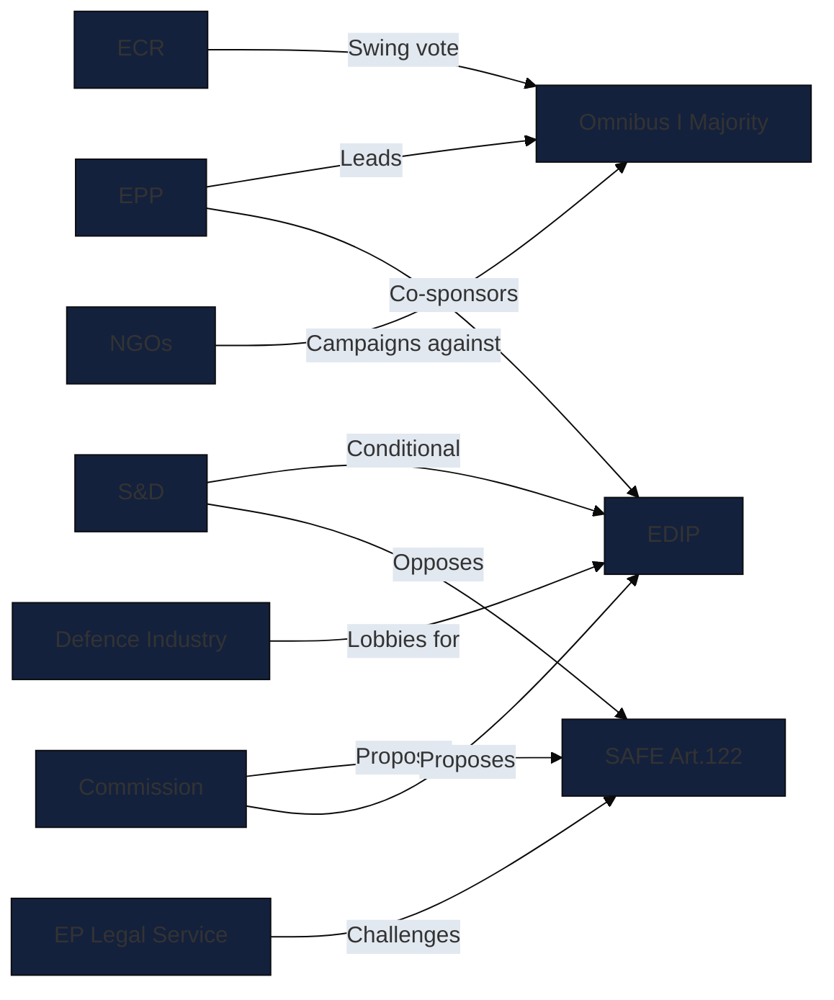

# Actor Mapping — EP Propositions (2026-05-26)

**Admiralty Grade:** B2 – C3 | **Data Mode:** degraded-feeds

## Actor Roster

| Actor | Type | Role | Position on Key Proposals |
|-------|------|------|--------------------------|
| EPP | Political Group (189 seats) | Agenda setter | Pro-EDIP, Pro-SAFE, Pro-Omnibus I |
| S&D | Political Group (136 seats) | Coalition partner | Pro-EDIP (conditional), anti-SAFE Art.122 |
| ECR | Political Group (78 seats) | Swing/fallback | Pro-defence, anti-Green Deal |
| Renew Europe | Political Group (77 seats) | Coalition partner | Split on SAFE/Omnibus I |
| Greens/EFA | Political Group (53 seats) | Opposition | Against SAFE Art.122, against Omnibus I |
| ID / Patriots | Political Group (84 seats) | Swing | Pro-defence, anti-EU fiscal sovereignty |
| Commission (DG DEFIS) | Institution | Initiator | EDIP/SAFE sponsor |
| Commission (DG GROW) | Institution | Initiator | Omnibus I/REACH sponsor |
| EP Legal Service | Institution | Arbiter | Challenges SAFE Article 122 |
| Council Presidency (Poland) | Member State | Manager | Pro-EDIP, SAFE aligned |

## Influence

### Influence Assessment by Proposal

| Actor | EDIP Influence | SAFE Influence | Omnibus I Influence |
|-------|---------------|----------------|---------------------|
| EPP | CRITICAL | CRITICAL | CRITICAL |
| S&D | HIGH (swing) | HIGH (veto-capable) | HIGH (swing) |
| Commission | HIGH | HIGH | HIGH |
| EP Legal Service | LOW | CRITICAL (constitutional) | LOW |
| ECR | MEDIUM | MEDIUM | HIGH (reinforces EPP) |
| NGO Coalition | LOW | LOW | HIGH (public pressure) |
| Defence Industry | MEDIUM (lobbying) | MEDIUM | LOW |

## Alliance

### Primary Coalition Configurations

**EDIP Coalition (Strong — 75–80% probability):**
EPP + S&D + Renew = ~402 seats; absolute majority = 361. Coalition holds unless S&D conditioning on SAFE legal basis triggers walkout.

**SAFE Coalition (Contested — 45–55% probability under Art.122):**
EPP + partial S&D + ECR; S&D bloc may require OLP procedure substitution. ID/Patriots internally divided (EU fiscal sovereignty vs pro-defence).

**Omnibus I Coalition (Moderate — 55–65% probability):**
EPP + ECR + partial Renew. S&D split creates swing-vote uncertainty. NGO-driven Greens/EFA and GUE form opposition bloc.

**EPP Fallback Alliance:** EPP + ECR achieves ~267 seats — insufficient for absolute majority but viable for specific procedural votes.

## Power Brokers

### Key Power Broker Actors

1. **EP Legal Service** — holds unique veto power on constitutional procedures. Ruling on SAFE Article 122 can force OLP path regardless of political majority.

2. **S&D Group Leadership (Iratxe García Pérez)** — controls swing bloc; conditioning S&D votes on SAFE's legal basis creates asymmetric power relative to group seat count.

3. **Poland Presidency** — active procedural management; can accelerate or slow Council positions and affect interinstitutional negotiation timelines.

4. **EPP Group Whip** — managing the fragile EPP internal cohesion on Omnibus I, where German EPP (pro-business) vs Southern EPP (pro-environment) tensions exist.

5. **Commission Vice President (Competitiveness)** — political sponsor of Omnibus I; defines the pace and scope of regulatory simplification.

## Information

### Key Information Flows and Intelligence Gaps

**Available (Admiralty A2):** 12 Council SP Act Followup letters confirming legislative activity period 2025–2026 (TA-10-2025-0284 through TA-10-2026-0058). These confirm EP positions have been transmitted to Council for response.

**Available (Admiralty B2):** EP political group position statements, Commission proposal texts, EP Legal Service preliminary opinion on SAFE Article 122 procedure.

**Gap:** Direct EP vote records unavailable due to degraded-feeds data mode — roll-call data multi-week delayed. Group cohesion statistics not available for this run.

**Gap:** S&D internal position paper on SAFE legal basis conditionality not confirmed — based on public statements by group leadership.

## Reader Briefing

**What this means for you:** The actor landscape in May 2026 is defined by EPP's strategic use of two parallel coalitions — a pro-European mainstream coalition (EPP+S&D+Renew) for defence and a centre-right coalition (EPP+ECR) for regulatory simplification. This "dual coalition" strategy gives EPP maximum flexibility but creates risks: S&D can condition support on SAFE legal basis, potentially blocking the most controversial instrument. The EP Legal Service role as a non-political veto player on constitutional grounds is the key wildcard.

**Confidence:** 🟡 MEDIUM — actor positions from institutional knowledge and secondary evidence.
