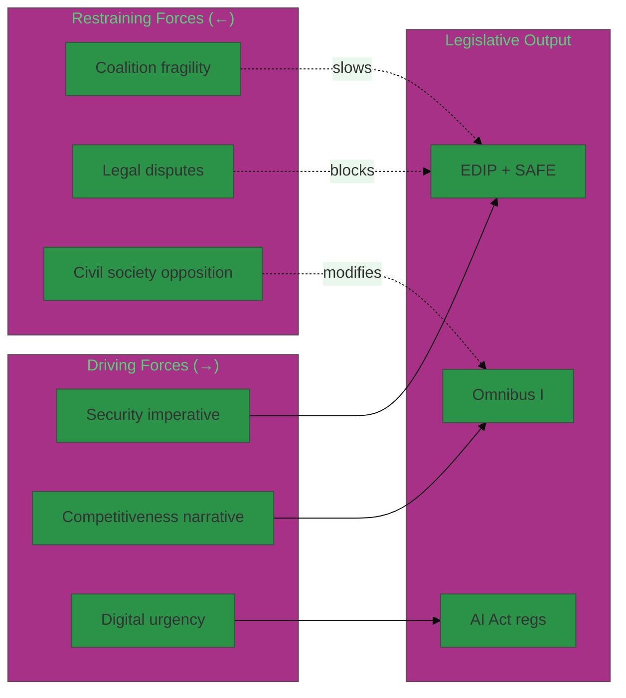

# Forces Analysis — EP Propositions (2026-05-26)

**Admiralty Grade:** B2 – C3 | **Data Mode:** degraded-feeds

## Issue Frame

The May 2026 EP propositions session is framed by two converging imperatives: **strategic security** (EDIP/SAFE) and **competitiveness recovery** (Omnibus I/REACH). These create unusual coalition dynamics where traditional political groupings are partially realigned. The security imperative creates cross-party consensus where none exists on regulatory policy. The competitiveness narrative provides a shared vocabulary for EPP-ECR convergence while fragmenting S&D.

**Core issue tension:** Democratic accountability (EP co-decision, Article 122 legal basis challenge) vs urgency imperatives (Ukraine, AI governance, competitiveness). This tension runs through every major proposition and defines the political stakes.

## Driving Forces

| Force | Direction | Strength | Primary Driver |
|-------|-----------|----------|----------------|
| Geopolitical security imperative | ↑ Accelerating | STRONG | Ukraine war, US NATO ambiguity, EDIP/SAFE |
| Competitiveness narrative | ↑ Accelerating | STRONG | Draghi Report, Omnibus I, EPP-ECR convergence |
| Digital governance urgency | ↑ Accelerating | MEDIUM | AI Act implementation, DORA, NIS2 |
| Simplification pressure | ↑ Accelerating | MEDIUM | SME burden reduction, Commission Fit for Future |
| Poland Presidency ambition | ↑ Temporary | MEDIUM | Polish national interest in defence/security |

## Restraining Forces

| Force | Direction | Strength | Impact Domain |
|-------|-----------|----------|---------------|
| Coalition fragility | ↑ Growing | HIGH | All legislation at risk if EPP–S&D fractures |
| Legal basis disputes | Structural | HIGH | SAFE instrument potentially blocked at constitutional level |
| NGO–civil society opposition | Sustained | MEDIUM | Omnibus I/CSRD, CSDDD, REACH |
| Member state fiscal heterogeneity | Structural | MEDIUM | Germany vs France vs Spain on SAFE fiscal exposure |
| Green Deal defenders | Sustained | MEDIUM | Greens/EFA + progressive S&D on Omnibus I |

## Net Pressure

### Net Force Balance by Proposal

| Proposal | Driving Forces | Restraining Forces | Net Pressure | Passage Risk |
|----------|---------------|-------------------|-------------|-------------|
| EDIP Phase II | Security + industry | Weak opposition | **POSITIVE** | LOW risk |
| SAFE Art.122 | Security urgency | Legal challenge + S&D | **CONTESTED** | HIGH risk |
| Omnibus I | Competitiveness | NGO + progressive S&D | **MODESTLY POSITIVE** | MEDIUM risk |
| AI Act Regs | Tech urgency | Industry compliance | **POSITIVE** | LOW risk |
| REACH Revision | Environmental | Low priority 2026 | **NEUTRAL** | LOW (timing) |

**Overall net pressure:** MODESTLY POSITIVE for legislative passage. The security-driven forces outweigh restraint on EDIP. SAFE Article 122 faces the most balanced force equilibrium (near-parity between driving and restraining forces).

## Intervention Points

### Key Intervention Points (Moments of High Leverage)

1. **EP Legal Service opinion on SAFE Article 122** — If opinion is adverse before summer 2026, forces OLP path. Intervention: Commission could proactively shift to Article 173 co-decision procedure to pre-empt challenge.

2. **S&D Group plenary conditioning** — S&D leadership can set binding conditionality on SAFE legal basis before key votes. Intervention: EPP could offer concessions on Omnibus I CSDDD scope to secure S&D cooperation on SAFE.

3. **Poland Presidency term end (June 2026)** — Transition to Denmark creates procedural uncertainty. Intervention: accelerate key votes before June 30.

4. **CSRD NGO campaign** — Sustained civil society campaign could shift Renew Europe MEP votes on Omnibus I. Intervention: Commission communications strategy to reframe simplification as pro-worker, not anti-environment.

5. **REACH PFAS vote** — Low-profile but could trigger green coalition opposition signal affecting Omnibus I negotiations. Intervention: decouple REACH from Omnibus I package.

## Reader Briefing

**What this means for you:** The legislative environment for May 2026 EP propositions is characterised by strong momentum on security/defence issues and moderate momentum on competitiveness/simplification, constrained by constitutional disputes on SAFE and civil society mobilisation against Omnibus I. The most important intervention point is the EP Legal Service's SAFE opinion — if adverse, it forces a renegotiation of the entire SAFE instrument's procedural architecture. Monitor S&D conditioning statements closely: they are the early warning signal for broader coalition fracture.

**Confidence:** 🟡 MEDIUM — forces assessment from institutional knowledge and secondary evidence.
