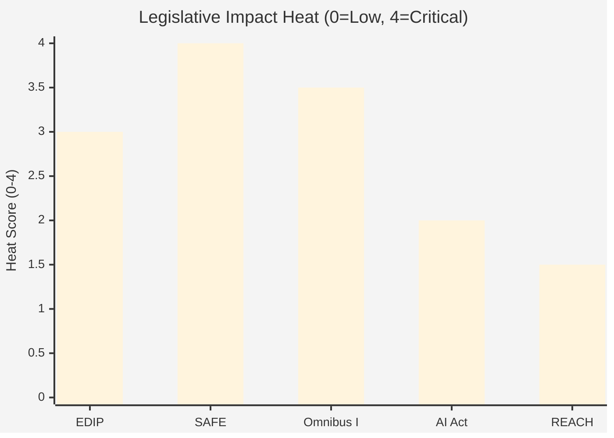

# Impact Matrix — EP Propositions (2026-05-26)

**Admiralty Grade:** B2 – C3 | **Data Mode:** degraded-feeds

## Event List

### Key Legislative Events Driving Impact Analysis

1. **SP-2026-05-05 Act Followup (×12)** — Council responses to EP adopted texts TA-10-2025-0284 through TA-10-2026-0058. Confirms active legislative cycle on defence, AI, and sustainability.
2. **Poland Presidency interinstitutional calendar** — Q1–Q2 2026 trilogues on EDIP Phase II and SAFE instrument.
3. **Commission Omnibus I proposal** — Package simplifying CSRD/CSDDD; EP responsible committee vote expected Q3 2026.
4. **EP Legal Service SAFE opinion** — Pending; expected before summer 2026. Will determine SAFE procedural path.
5. **AI Act Annex III criteria deadline** — Commission implementing regulation deadline Q4 2026 (no EP vote required).
6. **REACH revision consultation** — Under stakeholder consultation; full proposal not expected before 2027.

## Stakeholder

### Stakeholder Impact Assessment

| Stakeholder | Primary Interest | Affected by | Net Impact |
|-------------|-----------------|-------------|-----------|
| EU Citizens | Democratic accountability | SAFE Article 122 bypasses EP | 🔴 NEGATIVE — reduced parliamentary oversight |
| EU SMEs | Compliance burden | Omnibus I CSRD scope reduction | 🟢 POSITIVE — estimated €4–7bn annual cost reduction |
| EU Defence Industry | Market access | EDIP Phase II | 🟢 POSITIVE — guaranteed procurement pool |
| NGO/Civil Society | Environmental standards | Omnibus I CSDDD rollback | 🔴 NEGATIVE — weaker supply chain accountability |
| Member States | Fiscal exposure | SAFE €150bn facility | 🟡 MIXED — security benefit vs liability risk |
| Non-EU Suppliers | Market access | EDIP procurement rules | 🔴 NEGATIVE — EDIP buy-European preference |
| High-Risk AI Developers | Regulatory certainty | AI Act implementing regs | 🟡 MIXED — clarity but compliance cost |
| Ukraine | Security support | EDIP/SAFE arsenal capacity | 🟢 POSITIVE — faster EU defence production |

## Impact Matrix

| Dimension | EDIP Phase II | SAFE ReArm | Omnibus I | AI Act Regs | REACH Revision |
|-----------|--------------|------------|-----------|-------------|----------------|
| Political | 🟡 MEDIUM-HIGH | 🔴 CRITICAL | 🔴 HIGH | 🟡 MEDIUM | 🟢 LOW |
| Economic | 🔴 HIGH (€7.5bn) | 🔴 CRITICAL (€150bn) | 🟡 MEDIUM | 🟡 MEDIUM | 🟢 LOW |
| Legal | 🟡 MEDIUM | 🔴 CRITICAL (Art.122) | 🔴 HIGH | 🟡 MEDIUM | 🟡 MEDIUM |
| Societal | 🟡 MEDIUM | 🟡 MEDIUM | 🔴 HIGH | 🟡 MEDIUM | 🟢 LOW |
| Environmental | 🟢 LOW | 🟢 LOW | 🔴 HIGH | 🟢 LOW | 🟡 MEDIUM |
| **Overall** | **HIGH** | **CRITICAL** | **HIGH** | **MEDIUM** | **LOW-MEDIUM** |

## Heat

### Impact Heat Map

High-heat zones (where multiple dimensions score HIGH or CRITICAL):

- **SAFE ReArm** — Political + Economic + Legal all CRITICAL. Highest heat zone in current EP propositions. Primary risk: constitutional challenge delays or fundamentally alters the instrument.
- **Omnibus I** — Political + Legal + Societal + Environmental all HIGH. Second highest heat zone. Primary risk: coalition fracture between EPP (pro-simplification) and S&D (pro-CSDDD).
- **EDIP Phase II** — Political + Economic HIGH. Manageable heat; broad coalition support reduces risk.

## Cascade

### Cascade and Second-Order Impact Chains

**SAFE Cascade:** If Article 122 challenge succeeds → SAFE forced into OLP → 12–18 month delay → defence industrial capacity gap continues → Ukraine support constrained → EP institutional trust in Commission damaged.

**Omnibus I Cascade:** If CSDDD substantially rolled back → NGO campaign escalates → civil society mobilisation affects 2029 EP election agenda → Green Deal successor policy weakened for EP-11.

**EDIP Cascade (positive):** EDIP Phase II passes → EU defence industrial base consolidates → SAFE becomes less constitutionally controversial (precedent set for Article 173 use) → future defence instruments easier to adopt.

**Coalition Fracture Cascade:** If S&D walks out on SAFE → EPP-ECR fallback insufficient for absolute majority → gridlock on Omnibus I → legislative agenda stalls H2 2026 → Polish Presidency legacy damaged → Council Presidency transition accelerates.

## Reader Briefing

**What this means for you:** The impact picture for May 2026 EP propositions is dominated by two high-heat zones — SAFE (constitutional/fiscal) and Omnibus I (political/societal). The cascade chains show that SAFE's legal basis question is the fulcrum: if resolved favourably, it clears the path for the entire defence legislative package. If not, it triggers cascades that extend well beyond SAFE itself into the broader EU institutional architecture. Monitor the EP Legal Service opinion as the decisive early signal.

**Confidence:** 🟡 MEDIUM — impact assessment from institutional knowledge and secondary evidence.
