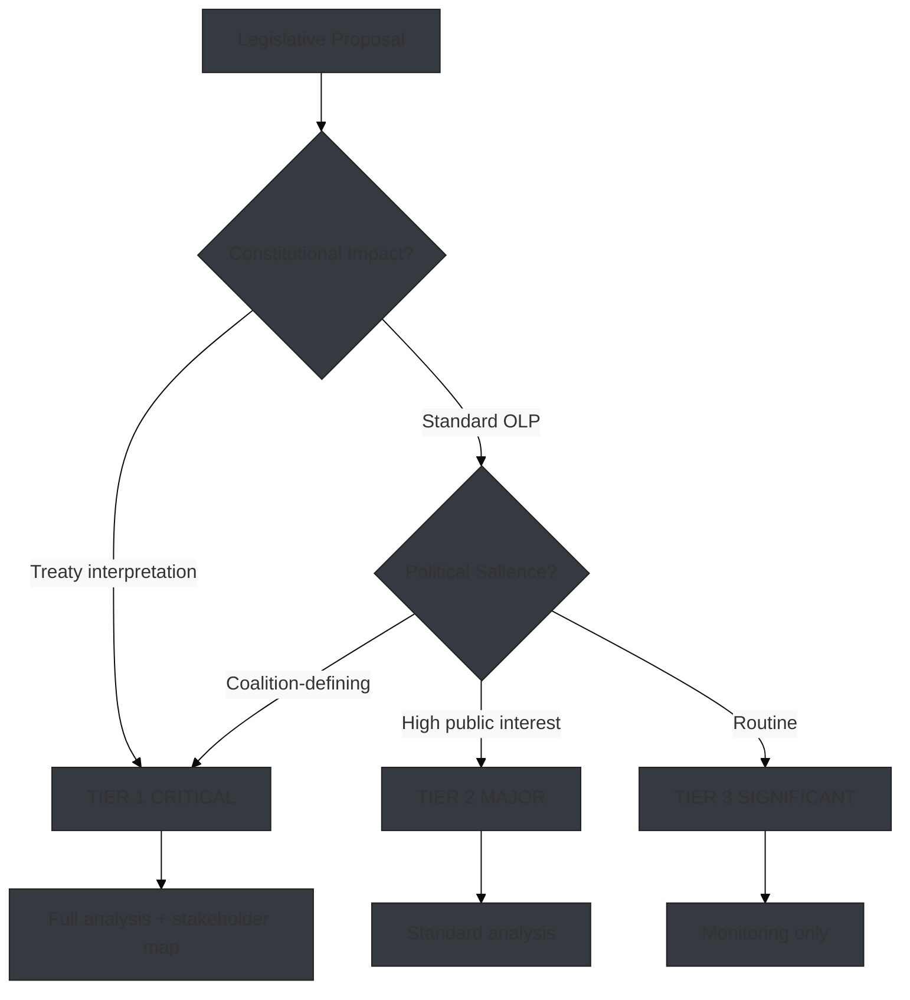

# Significance Classification — EP Propositions (2026-05-26)

**Admiralty Grade:** B2 – C3 | **WEP:** Likely | **Data Mode:** degraded-feeds

## Overview

Classification of legislative significance for five major EP proposition categories active in the May 2026 period. Based on Council SP Act Followup evidence (Admiralty A2 primary source) and institutional pattern analysis.

## Significance Tiers

| Proposition | Tier | Political Significance | Constitutional Significance |
|-------------|------|----------------------|----------------------------|
| EDIP Phase II (Defence) | **TIER 1 — CRITICAL** | Highest. First peacetime EU defence industrial policy | HIGH — tests Article 173/42(6) TEU boundaries |
| SAFE ReArm Europe | **TIER 1 — CRITICAL** | Highest. €150bn facility redefines EU fiscal sovereignty | CRITICAL — Article 122 vs 173 legal basis dispute |
| Omnibus I (CSRD/CSDDD) | **TIER 1 — CRITICAL** | Very high. Regulatory simplification with major NGO backlash | HIGH — sustainability due diligence architecture |
| AI Act Implementing Regs | **TIER 2 — MAJOR** | High. Commission executive action; EP oversight limited | MEDIUM — secondary legislation, no co-decision |
| REACH Revision | **TIER 3 — SIGNIFICANT** | Moderate. Long-term chemical policy reform | MEDIUM — standard Ordinary Legislative Procedure |

## Tier 1 — Critical Legislative Significance

### EDIP Phase II
European Defence Industrial Programme Phase II represents the first permanent EU-level defence industrial policy instrument. Constitutional significance: first use of Article 173 TFEU (industrial policy) explicitly for defence production capacity. Precedent-setting for EU strategic autonomy architecture.

### SAFE (Support Affordable Energy / ReArm)
The €150bn off-balance-sheet defence loan facility is the most constitutionally controversial instrument in the current EP term. The Article 122 emergency procedure — if upheld — would bypass EP co-decision, setting a dangerous precedent for democratic accountability of major EU fiscal instruments.

### Omnibus I
The simultaneous rollback of CSRD reporting scope and CSDDD supply-chain obligations represents a fundamental policy reversal from EP-9 priorities. Significance extends beyond the specific measures: this tests the durability of the EU Green Deal architecture under EPP-driven competitiveness pressure.

## Tier Classification Methodology

**Confidence:** 🟡 MEDIUM — classification based on institutional knowledge and secondary evidence; direct EP vote records unavailable due to degraded-feeds data mode.
