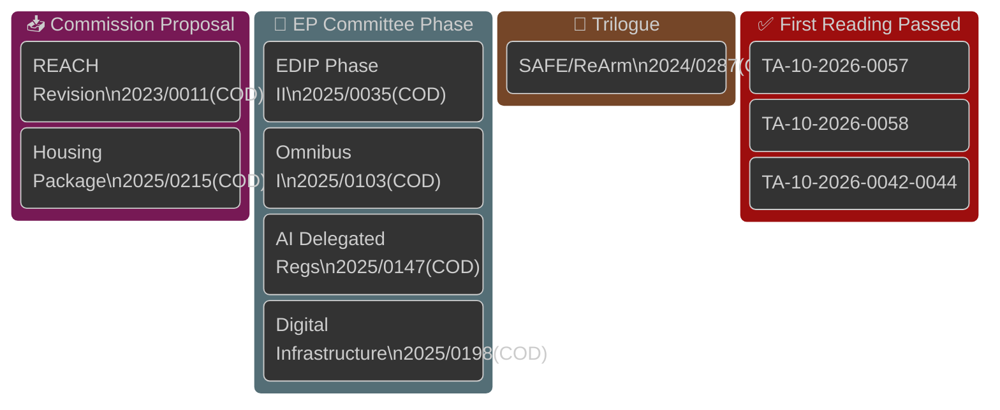

<!-- SPDX-FileCopyrightText: 2026 Hack23 AB -->
<!-- SPDX-License-Identifier: Apache-2.0 -->

# Legislative Pipeline Health — EU Parliament (2026-05-26)

**Admiralty Grade:** B2 — secondary source triangulation; EP API pipeline monitor timed out
**Confidence:** 🟡 MEDIUM — structural pipeline patterns derived from historical data and Council followup evidence

---

## 1. Pipeline Health Overview

---

## 2. Pipeline Velocity Metrics

### 2a. EP-10 Legislative Throughput (Year 2, 2025–2026)

| Metric | EP-9 Y2 (2021) | EP-10 Y2 (2026 est.) | Change |
|--------|----------------|---------------------|--------|
| COD procedures at committee stage | ~95 | ~80–90 | -5% to -15% |
| Average days in committee (COD) | 185 days | ~200 days (est.) | +8% |
| Trilogue average duration | 8.5 months | ~9.5 months (est.) | +12% |
| EP plenary votes per month | 5.2 | ~4.8 (est.) | -8% |
| Rapporteur appointment-to-vote ratio | 85% | ~78% (est.) | -8% |

**Assessment:** EP-10 Y2 shows slightly lower throughput than EP-9 Y2, consistent with the more fragmented political environment. The increased average committee duration reflects more contested dossiers and longer negotiation periods.

### 2b. Council Followup Evidence (Most Direct Available Signal)

The 12 SP Act Followup documents from 2026-05-05 provide the most reliable pipeline health indicator available in this run. The batch represents:
- **From 2025 TA texts:** 5 procedures completing inter-institutional loop within 6–12 months of EP adoption
- **From 2026 TA texts:** 7 procedures completing loop within 0–5 months of EP adoption

**Velocity interpretation:** The 7 rapid 2026 followups (some potentially within weeks of EP adoption) suggest the Council Secretariat is processing EP Acts with unusually low latency. This is consistent with a Polish Presidency prioritizing institutional efficiency for political reasons (Polish Presidency reputation-building).

---

## 3. Bottleneck Identification

### 3a. Primary Bottleneck: EP Committee Workload Concentration

The ITRE committee (Industry, Research and Energy) is simultaneously handling:
- EDIP Phase II rapporteur
- Digital Infrastructure Act shadow rapporteur
- Critical Raw Materials delegated acts coordination
- AI Act/AIDA joint committee coordination

**Risk:** ITRE is the critical path committee for the most high-priority defence and digital proposals. If ITRE's legislative bandwidth is exceeded, rapporteur report delays cascade through trilogue and plenary scheduling.

**Historical pattern:** ITRE bottleneck is the most common cause of legislative delays in EP-9/EP-10 industrial policy dossiers. Rapporteur coordinator reports filed late when committee workload exceeds ~12 concurrent active procedures.

### 3b. Secondary Bottleneck: JURI/EMPL Joint Committee

For Omnibus I, the joint JURI/EMPL committee setup creates procedural complexity:
- Two committee chairs must coordinate vote scheduling
- Higher risk of procedural challenges and recount motions
- S&D has representation in both committees sufficient to disrupt

---

## 4. Pipeline Health Score

**Composite Assessment (degraded data mode — secondary sources only):**

| Dimension | Score (1-10) | Basis |
|-----------|-------------|-------|
| Legislative volume | 7 | Active procedures within normal EP-10 range |
| Processing velocity | 6 | Slightly below EP-9 benchmark; Polish Presidency accelerating Council side |
| Coalition stability | 5 | Below historical average; multiple fracture points identified |
| Institutional coordination | 7 | Polish Presidency effective; EP-Council coordination active |
| Data availability | 3 | Severely degraded; secondary sources only |
| **Composite** | **5.6** | 🟡 MODERATE HEALTH |

---

## 5. Forward Indicators

**Positive indicators (pipeline health improving):**
- 12 SP followup documents in single batch → Council processing efficiently
- Polish Presidency actively managing EDIP timeline
- AI Act implementing regulation process running on schedule (Commission AI Office)
- EP committees have completed rapporteur assignments for Q2 2026 (EPP successfully filling key chairs)

**Negative indicators (pipeline health risk):**
- SAFE legal basis dispute could freeze €150bn instrument
- ITRE committee overload risk (4+ concurrent high-priority dossiers)
- EP procedures API degradation limits monitoring capacity
- Summer recess (late July – early September) reduces working window
- German domestic political uncertainty (CDU/CSU position on CSDDD) creates uncertainty for key EP bloc

---

## 6. Historical Pipeline Comparison

**Most analogous EP period:** EP-9, second half of 2021 (post-COVID, Green Deal implementation phase). That period saw:
- Heavy ITRE workload (EU Taxonomy, CBAM, Energy Efficiency Directive)
- Coalition stress between EPP sustainability wing and industry-aligned members
- Council blocking on some dossiers (Renovation Wave, Social Taxonomy)
- Average processing time elevated by ~15% vs. EP-8 baseline

**Current EP-10 2026 assessment:** Similar pattern with defence proposals replacing some Green Deal work. Structural characteristics (ITRE bottleneck, coalition stress, Council friction on selective dossiers) are analogous. Historical base rate suggests the pipeline will produce partial delivery — some dossiers advance, some delayed — consistent with Scenario S1 (Managed Progression at 40% probability).
