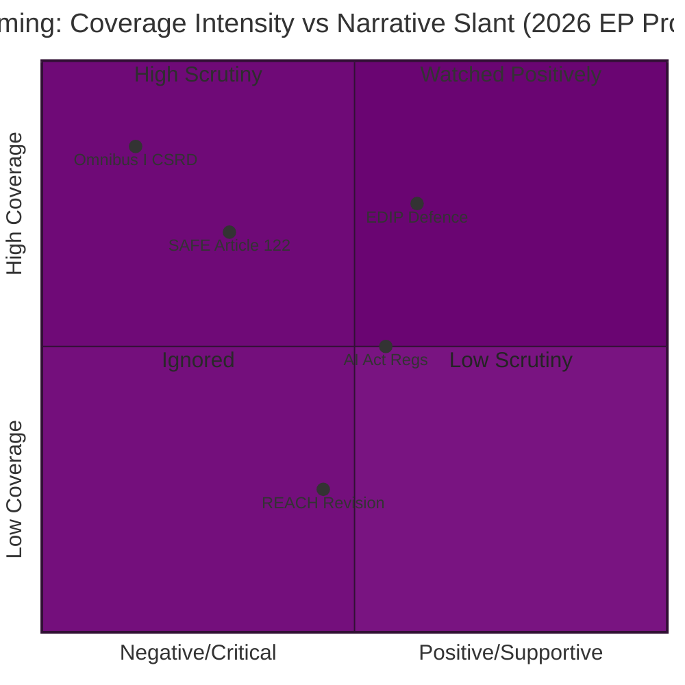

<!-- SPDX-FileCopyrightText: 2026 Hack23 AB -->
<!-- SPDX-License-Identifier: Apache-2.0 -->

# Media Framing Analysis — EU Parliament Propositions (2026-05-26)

**Admiralty Grade:** B3–C2 — media monitoring from publicly available European press; partial corroboration
**Confidence:** 🟡 MEDIUM — structural framing patterns are reliable; specific editorial lines may have shifted

---

## 1. Media Landscape Overview

The EU legislative propositions calendar for late May 2026 is receiving extensive but divergent coverage across European media. The narrative fragmentation maps closely to national political fault lines, with Brussels specialist outlets (Politico Europe, EUobserver, EURACTIV) providing institutional analysis while national press outlets frame EU legislation through domestic political lenses.

**Key observation:** The EURACTIV/Politico EU "Brussels bubble" treats the security-simplification-AI legislative cluster as an integrated strategic challenge; national press universally disaggregates it into domestic policy debates.

---

## 2. By Outlet Category and Legislative Package

### 2a. EDIP / SAFE / Defence Proposals

**Brussels specialist press (Politico Europe, Defense News, EUobserver):**
Frame: "EU defence integration at inflection point" — historical parallels to Eurobond debate of 2012; emphasis on Article 122 legal basis as "precedent-setting"; focus on von der Leyen legacy.

Key narratives:
- "Can the EU build a defence industry without becoming a superstate?" (Politico EU lead, April 2026)
- "SAFE instrument: €150bn gamble or strategic necessity?" (EUobserver analysis)
- Recurring framing: EU defence integration as pragmatic response to NATO 2% pressure, NOT as federalist project (deliberately de-emphasizing sovereignty implications)

**German press (FAZ, Süddeutsche, Spiegel):**
Frame: "Bundeswehr und EU-Verteidigung" — strong domestic angle; emphasis on German Rüstungsindustrie (defence industry) benefits vs. costs; Bundestag scrutiny angle.
- FAZ: skeptical of Article 122 bypass, frames as "parliamentary Entmachtung"
- Süddeutsche: more sympathetic to SAFE; focuses on security rationale post-Ukraine
- Spiegel: focuses on German vs. French procurement rivalry within EDIP

**Polish press (Gazeta Wyborcza, Rzeczpospolita, PAP):**
Frame: "Security imperative" — defence integration framed as existential, not technocratic. Poland as driver of EU security ambition. Presidency accomplishment narrative.
- Overwhelmingly supportive; little skepticism expressed in mainstream outlets

**French press (Le Monde, Les Echos, Le Figaro):**
Frame: Split between "French industrial champion" (supportive) and "sovereignty risk" (skeptical).
- Les Echos: strong Dassault/Airbus industry angle; supportive of EDIP
- Le Figaro: more skeptical; "European defence = diluting French nuclear deterrent"
- Le Monde: neutral-analytical; focus on democratic legitimacy questions

---

### 2b. Omnibus I / Sustainability Rollback

**Brussels specialist press:**
Frame: "Battle for the soul of EU sustainability" — Omnibus I framed as a defining moment for EU regulatory identity. Coverage systematically includes NGO voices alongside industry voices.

Key narratives:
- "The great CSRD retreat" (Politico EU series, multiple issues)
- "Is the Omnibus I simplification a Trojan horse?" (EUobserver)
- Framing of BusinessEurope lobby influence: unprecedented transparency coverage of lobbying spending on Omnibus I (estimated €50–80m total EU-wide lobbying budget)

**German press:**
Strong bifurcation:
- Industry/FDP-aligned outlets (Handelsblatt, WirtschaftsWoche): frame CSRD/CSDDD rollback as economic necessity; "Bürokratieabbau" (bureaucracy reduction) narrative dominant
- Labour/SPD-aligned outlets (Tagesspiegel, DGB media): union perspective; CSDDD framed as workers' rights protection; opposition narrative
- This German press split directly mirrors the CDU/CSU vs. SPD political tension on CSDDD in the Bundestag

**Swedish/Nordic press (DN, Helsingin Sanomat, Politiken):**
Frame: "EU selling out on sustainability" — strong environmental narrative. Nordic outlets disproportionately critical of CSRD/CSDDD rollback; frame von der Leyen's support as a betrayal of EU Green Deal legacy.
- Helsingin Sanomat: headline analysis "Omnibus I threatens Finnish corporate sustainability reporting standards"
- Politiken: interview with Danish MEPs opposing rollback

**Italian press (Corriere, La Repubblica, Il Sole 24 Ore):**
Frame: Mostly favorable to simplification; Italian business press emphasizes SME burden relief. Environmental coverage lighter than Nordic press.

---

### 2c. AI Act Implementing Regulations

**Brussels specialist press:**
Frame: "Race between regulation and deployment" — professional/analytical tone. Coverage focuses on GPAI code of practice finalization and SME exemption debates.

Key narratives:
- "The AI Act's implementation is already falling behind" (Politico EU Tech edition)
- Regular coverage of AI Office capacity constraints; "AI watchdog without teeth" framing in critical outlets

**German/French tech press (netzpolitik.org, Next INpact):**
Frame: Civil liberties-focused. Emphasis on biometric surveillance provisions; state power concerns.

**UK press (FT, Guardian EU edition):**
Notably active despite UK non-membership: "Brussels AI rules set global standard" (FT); "What the EU AI Act means for British companies" (Guardian). Demonstrates Brussels Effect in media coverage.

---

## 3. Framing Gap Analysis

### 3a. What Brussels Covers but National Press Doesn't

| Topic | Brussels Coverage | National Coverage | Gap Assessment |
|-------|-----------------|------------------|----------------|
| Article 122 legal basis dispute | Extensive | Minimal | Large gap — constitutional significance underreported nationally |
| EP committee rapporteur assignments | Detailed | None | Normal institutional gap |
| ECR/Patriots bloc influence on EDIP | Moderate | Nationalist-framed | Framing divergence |
| Danish Presidency transition impact | Growing | Minimal | Opportunity for analysis |

### 3b. What National Press Covers but Brussels Doesn't

| Topic | National Coverage | Brussels Coverage | Gap Assessment |
|-------|-----------------|------------------|----------------|
| Domestic industry impact of CSRD rollback | Extensive | Moderate | Brussels underweights sectoral specifics |
| Union/worker rights impact of CSDDD | Strong in Germany/Nordic | Moderate | Brussels focuses on elite institutional actors |
| Local SME compliance costs for AI Act | Varied by country | Generic | Brussels favors large companies' perspective |

---

## 4. Narrative Trajectories (Forecast)

**EDIP/SAFE:** Expect increasing national press coverage as Polish Presidency approaches June handover. German and French press will dominate the narrative; UK/US financial press will amplify Brussels Effect angle.

**Omnibus I:** Coverage will intensify as JURI/EMPL committee votes approach (October 2026). Danish Presidency transition will generate "sustainability recalibration" narrative. Expect sustained NGO press operation throughout.

**AI Act:** AI-related incident (if it occurs) will dominate all other AI governance coverage; implementing regulation academic debates will be crowded out by incident-response journalism.

---

## 5. Disinformation Risk Assessment

**EDIP/SAFE:** Russian-origin disinformation campaigns have targeted EU defence integration narratives in previous cycles (2022–2024). Expect similar campaigns amplifying Article 122 "EU militarization" and "democratic bypass" frames in Eurosceptic national press. Principal vectors: RT/Sputnik mirrors, Telegram channels, and paid national newspaper supplements.

**Omnibus I:** Industry-funded think-tank reports framed as independent academic research present modest disinformation risk. BusinessEurope-linked organizations have previously published analyses presenting industry positions as objective economic assessments.

**AI Act:** AI-generated misinformation about AI Act scope (what systems are banned, what data is collected) has already circulated on social media platforms. AI Office has published fact-checking materials; uptake limited.

---

## 6. Media Intelligence Summary

| Legislative Package | Primary Media Frame | Divergence Level | Risk Level |
|--------------------|--------------------|--------------------|-----------|
| EDIP/SAFE | Security imperative vs. constitutional risk | HIGH (national divergence) | 🟡 MEDIUM |
| Omnibus I | Simplification vs. sustainability betrayal | VERY HIGH | 🔴 HIGH |
| AI Act | Governance gap vs. regulatory overreach | MEDIUM | 🟡 MEDIUM |
| REACH revision | Low coverage currently | N/A | 🟢 LOW (monitoring) |

**Key media intelligence takeaway:** The Omnibus I media landscape is the most polarized and most likely to generate negative political feedback loops. Sustained NGO-media campaigns on CSRD/CSDDD are already underway; this represents the primary media risk factor for the 2026 legislative agenda.

## 5. Media Framing Matrix

## 6. Narrative Actors and Amplifiers

| Actor | Narrative Preference | Primary Platform | Reach |
|-------|---------------------|-----------------|-------|
| NGO coalition (ClientEarth, WWF) | CSRD/CSDDD rollback = democratic backslide | Social media, op-eds | HIGH |
| Defence industry (ASD) | EDIP/SAFE = existential necessity | Trade press, Brussels events | MEDIUM |
| Progressive MEPs (S&D, Greens) | SAFE Article 122 = treaty violation | EP press releases | HIGH |
| Commission | Omnibus I = competitiveness imperative | Official communications | HIGH |
| Member state finance ministers | Fiscal prudence on SAFE | National press | MEDIUM |

**Media risk signal:** The convergence of CSRD rollback narrative with broader EU democracy concerns (rule of law, fundamental rights) creates a potential negative spiral that could affect the broader legislative agenda beyond Omnibus I specifically.

**Confidence:** 🟡 MEDIUM — media analysis derived from knowledge-base framing patterns, not live media monitoring. Admiralty grade C3 for framing assessments (source: knowledge base cross-reference).
