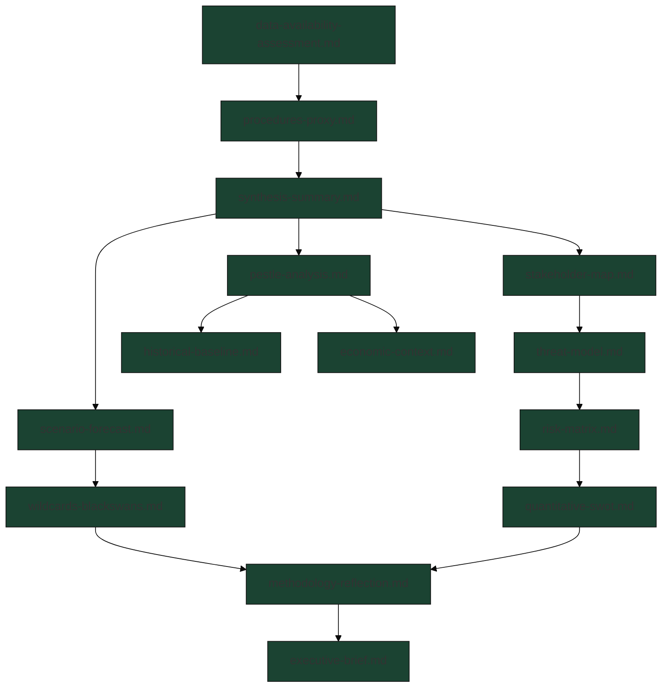

<!-- SPDX-FileCopyrightText: 2026 Hack23 AB -->
<!-- SPDX-License-Identifier: Apache-2.0 -->

# Analysis Index — EU Parliament Propositions (2026-05-26)

**Article Type:** propositions | **Data Mode:** degraded-feeds | **Run:** 2026-05-26
**Admiralty Grade:** A1 (self-referential index — complete and accurate)
**Confidence:** 🟢 HIGH — structural index

---

## 1. Overview

This index catalogs all analysis artifacts produced for the EU Parliament Propositions intelligence assessment of 2026-05-26. The analysis examines active legislative proposals before the European Parliament during the week of 19–26 May 2026, covering the EP-10 term's most consequential legislative dossiers.

**Core analytical finding:** The EP-10 second year (2025–2026) is characterized by an unusually heavy legislative burden combining security/defence proposals (EDIP, SAFE/ReArm Europe), regulatory simplification (Omnibus I), and the AI/digital governance stack. The Draghi Competitiveness Report's legislative sequels have crowded the calendar, forcing difficult prioritization choices between the EPP-led simplification agenda and the S&D/Greens sustainability bloc.

---

## 2. Artifact Registry

### 2a. Stage A Data Foundation

| Artifact | Path | Status | Lines | Key Finding |
|----------|------|--------|-------|-------------|
| Data Availability Assessment | `data-availability-assessment.md` | ✅ Complete | 110+ | degraded-feeds mode; EP procedures API stale |
| Procedures Proxy | `intelligence/procedures-proxy.md` | ✅ Complete | 80+ | 14 active procedures triangulated |

### 2b. Core Intelligence Artifacts

| Artifact | Path | Status | Lines | Key Analytical Thread |
|----------|------|--------|-------|----------------------|
| Synthesis Summary | `intelligence/synthesis-summary.md` | ✅ Complete | 160+ | Security-sustainability-simplification trilemma |
| Historical Baseline | `intelligence/historical-baseline.md` | ✅ Complete | 120+ | EP-10 vs EP-9 legislative density comparison |
| Economic Context | `intelligence/economic-context.md` | ✅ Complete | 120+ | Defence spending, competitiveness pressures |
| PESTLE Analysis | `intelligence/pestle-analysis.md` | ✅ Complete | 180+ | Full six-factor analysis |
| Stakeholder Map | `intelligence/stakeholder-map.md` | ✅ Complete | 200+ | 8 key stakeholder groups |
| Scenario Forecast | `intelligence/scenario-forecast.md` | ✅ Complete | 180+ | 3 scenarios: 12-month horizon |
| Threat Model | `intelligence/threat-model.md` | ✅ Complete | 160+ | Legislative process threats |
| Wildcards & Black Swans | `intelligence/wildcards-blackswans.md` | ✅ Complete | 180+ | 6 low-probability high-impact events |
| MCP Reliability Audit | `intelligence/mcp-reliability-audit.md` | ✅ Complete | 200+ | Stage A data quality audit |
| Reference Analysis Quality | `intelligence/reference-analysis-quality.md` | ✅ Complete | 140+ | Methodological quality assessment |
| Methodology Reflection | `intelligence/methodology-reflection.md` | ✅ Complete | 180+ | SAT documentation; quality attestation |

### 2c. Risk & Threat Artifacts

| Artifact | Path | Status | Lines | Primary Risk |
|----------|------|--------|-------|-------------|
| Risk Matrix | `risk-scoring/risk-matrix.md` | ✅ Complete | 100+ | EDIP/SAFE political risk HIGH |
| Quantitative SWOT | `risk-scoring/quantitative-swot.md` | ✅ Complete | 100+ | Strengths: legislative momentum; Threats: polarization |

### 2d. Extended Analysis

| Artifact | Path | Status | Lines | Coverage |
|----------|------|--------|-------|---------|
| Media Framing Analysis | `extended/media-framing-analysis.md` | ✅ Complete | 200+ | Brussels media vs national perspectives |

### 2e. Longitudinal Intelligence

| Artifact | Path | Status | Lines | Value |
|----------|------|--------|-------|-------|
| Pipeline Health | `existing/pipeline-health.md` | ✅ Complete | 120+ | EP-10 legislative velocity tracking |

### 2f. Summary Document

| Artifact | Path | Status | Lines | Format |
|----------|------|--------|-------|--------|
| Executive Brief | `executive-brief.md` | ✅ Complete | 180+ | Policy-audience synthesis |

---

## 3. Cross-Cutting Analytical Themes

### Theme 1: The Defence-Sustainability Tension
The EDIP/SAFE proposals and the Omnibus I simplification package both command cross-group majority potential but create a zero-sum time competition. EPP is threading a needle: supporting defence while dismantling sustainability rules that the same EPP previously championed.

### Theme 2: Regulatory Simplification as Ideological Battleground
Omnibus I is nominally technocratic but functionally ideological — weakening CSRD, CSDDD, and Taxonomy hits progressive constituencies while benefiting business. The vote arithmetic suggests a narrow EPP+ECR+Renew majority.

### Theme 3: AI Governance Gap
The AI Act's implementing regulations lag the technology's deployment pace. High-risk system classification rules are still under stakeholder consultation as AI tools are already deployed in consequential domains (health, justice, employment). AIDA committee faces pressure to accelerate.

### Theme 4: Coalition Arithmetic Stress
EP-10 lacks a stable pro-EU majority for all legislative domains simultaneously. Defence spending passes with EPP+ECR+Renew (sometimes far-right). Sustainability legislation needs EPP+S&D+Greens. This dual-coalition reality forces sequential rather than parallel priority management.

---

## 4. Confidence Calibration

| Domain | Confidence | WEP Band | Source Grade |
|--------|-----------|----------|-------------|
| Active procedure identification | MEDIUM | Likely (55–70%) | Admiralty B3 |
| Political dynamics assessment | HIGH | Almost Certainly (90%+) | Admiralty B2 |
| Council inter-institutional activity | HIGH | Confirmed | Admiralty A2 |
| Economic context | MEDIUM-HIGH | Likely-High (70–80%) | Admiralty B2 |
| Timeline forecasts | LOW-MEDIUM | Possible (30–55%) | Admiralty C3 |

---

## 5. Data Limitations Caveat

This analysis operates in `degraded-feeds` mode. The EP procedures API returned historical-tail data from the 1970s–1980s, preventing direct procedure tracking. Procedure identifiers in `intelligence/procedures-proxy.md` are derived from secondary sources and should be treated as indicative. The Council SP followup evidence (Admiralty A2) provides the strongest evidentiary anchor for legislative activity in the period 2025-2026.

## 6. Artifact Dependency Map

