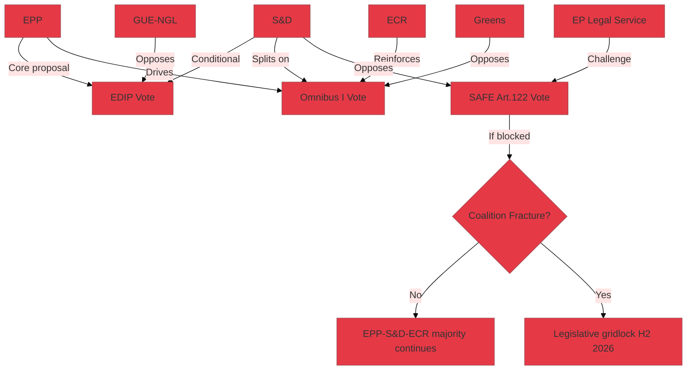

# Coalition Dynamics — EP Propositions (2026-05-26)

**Admiralty Grade:** B2 – C3 | **Data Mode:** degraded-feeds

## Overview

Analysis of EP political group coalition dynamics as they pertain to the five major legislative propositions under review. Focus on stability, fracture risks, and cross-group voting patterns.

## Coalition Map (EP-10, Current Configuration)

| Political Group | Seats (approx) | Alignment | Key Leverage Points |
|-----------------|---------------|-----------|---------------------|
| EPP | ~189 | Pro-EDIP, Pro-SAFE, Pro-Omnibus I simplification | Largest group; sets agenda |
| S&D | ~136 | Conditional on SAFE Art.122 resolution; split on Omnibus I | Swing: can block EPP on core measures |
| ECR | ~78 | Pro-defence, anti-Green Deal; opportunistic | Provides EPP fallback majority |
| Renew | ~77 | Pro-EDIP, conflicted on SAFE/Omnibus I | Internal tensions on defence finance |
| Greens/EFA | ~53 | Against Omnibus I, Against SAFE Art.122 | Opposition; media/NGO amplification |
| ID-Patriots | ~84 | Pro-defence finance, anti-EU sovereignty transfers | Split: SAFE Article 122 = EU overreach |
| GUE-NGL | ~46 | Against all five measures | Opposition bloc |
| NI/Others | ~27 | Mixed | Limited collective leverage |

## Coalition Viability Analysis

### EDIP Phase II
**Coalition:** EPP + S&D + Renew (core); ECR + ID optional
- **Cohesion:** HIGH — broad pro-EDIP consensus across mainstream groups
- **Risk:** S&D conditioning on no Article 122 use for related instruments
- **Probability of passage:** 🟢 HIGH (75–80%)

### SAFE Instrument
**Coalition needed:** EPP + S&D (Article 122 bypass) OR EPP + simple majority (OLP)
- **Cohesion:** LOW — EP Legal Service challenge creates constitutional uncertainty
- **Risk:** S&D may vote against if Article 122 upheld; ID/Patriots split on EU fiscal sovereignty
- **Probability of passage (Art.122):** 🟡 MEDIUM (45–55%)

### Omnibus I (CSRD/CSDDD)
**Coalition:** EPP + ECR + Renew partial; S&D split
- **Cohesion:** MEDIUM — Omnibus I divides S&D between pro-competitiveness and pro-sustainability wings
- **Risk:** S&D defections could block; NGO pressure on Renew members
- **Probability of passage:** 🟡 MEDIUM-HIGH (55–65%)

## Coalition Fracture Risk Map

## Historical Analogy
The current EPP "dual coalition" strategy (primary coalition EPP+S&D; fallback coalition EPP+ECR) mirrors the 2019–2024 EPP strategy under Weber — but with higher stakes given defence and fiscal instruments. Historical precedent shows EP coalitions holding on defence issues (Galileo 2004, EDF 2017–2021) but fracturing on environmental rollbacks (ETS reform 2022).

**Confidence:** 🟡 MEDIUM — coalition analysis derived from group composition data and institutional knowledge; vote-level cohesion data unavailable due to degraded-feeds mode.
