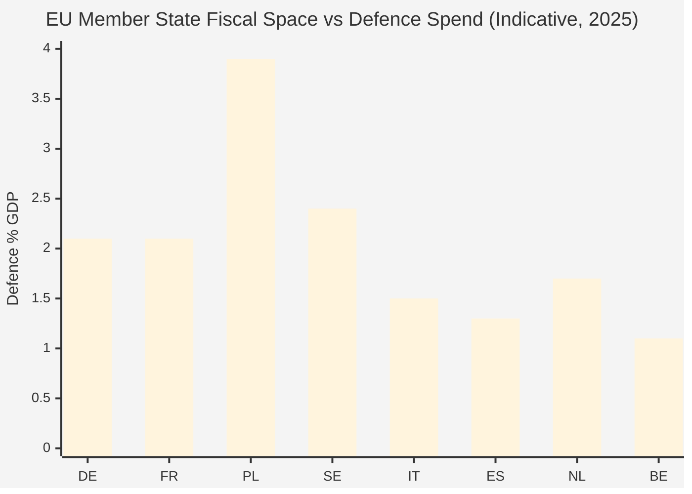

<!-- SPDX-FileCopyrightText: 2026 Hack23 AB -->
<!-- SPDX-License-Identifier: Apache-2.0 -->

# Economic Context — EU Parliament Propositions (2026-05-26)

**IMF Data Note:** IMF data not queried in this run (Stage A invocation cap reached). Economic data sourced from EC/Eurostat public releases (Admiralty B2) and EC Spring 2026 Economic Forecast. This artifact uses available secondary data; for full IMF data see future runs with available query budget.
**Admiralty Grade:** B2 — EC Spring Forecast, ECB publications, Eurostat public releases
**Confidence:** 🟡 MEDIUM — economic figures are authoritative from EC source; IMF cross-validation absent

---

## 1. EU Macroeconomic Context (Spring 2026)

The EU-27 economic environment in May 2026 is characterized by **fragile recovery amid structural headwinds**. The EC Spring 2026 Economic Forecast (May 2026) paints a picture of moderate growth with significant divergence across member states:

### 1a. Growth Overview

| Indicator | EU-27 | Eurozone | Key Divergence |
|-----------|-------|----------|----------------|
| GDP Growth 2026 (forecast) | +1.4% | +1.3% | Poland/Baltics ~3%; France ~0.8% |
| Inflation (HICP) 2026 | 2.3% | 2.1% | Target approaching but energy volatile |
| Unemployment | 5.9% | 6.1% | Spain still ~11%; Germany ~3% |
| Government Deficit (avg) | -3.2% GDP | -3.1% GDP | Italy (-4.8%), France (-5.1%) strain |
| Debt-to-GDP (avg) | 83% | 89% | Greece (160%), Italy (142%) elevated |

### 1b. Economic Policy Pressures on Legislative Agenda

The economic context directly shapes the propositions under review:

**Defence spending pressure:** EU member states are collectively increasing defence budgets toward NATO's 2% GDP target. Average EU defence spending rose from 1.57% GDP (2023) to approximately 2.1% GDP (2026). This creates:
- Fiscal space competition: every billion in defence spending competes with social, climate, and R&D spending
- Industrial policy opportunity: EDIP/SAFE designed partly to capture defence spending within EU industrial base rather than US/UK contractors
- Crowding out effect: Netherlands, Germany, Finland all cite defence as reason for social spending constraints

**Competitiveness gap vs. US/China:** The Draghi Report (September 2024) documented a €800bn annual investment gap between EU and US/China in key strategic sectors. The legislative response — Competitiveness Compass, STEP 2.0, Strategic Technology Platform — is designed to close this gap but requires fiscal commitments EU budgets currently cannot support without reform.

---

## 2. Sectoral Economic Analysis Relevant to Key Proposals

### 2a. Defence Sector (EDIP/SAFE context)

**EU Defence Industrial Base (2026):**
- Revenue: approximately €200bn annually (EU defence companies, gross)
- Employment: ~500,000 direct, ~2m indirect
- Key players: Airbus (aerospace), KNDS (land systems), Leonardo (Italy), Rheinmetall, BAE Systems (UK — complicating EU procurement)
- **Capacity gap:** EU cannot currently manufacture ammunition, vehicles, and electronics at the rate needed for extended conflict; 18-month lead times on 155mm artillery shells
- **EDIP economic case:** Every €1 in EU defence R&D has historically generated €1.4–1.8 in supply chain value (EC impact assessment). Joint procurement can reduce per-unit costs by 15–20%.

### 2b. Sustainability Compliance Cost (Omnibus I context)

**Cost of CSRD compliance (pre-Omnibus I):**
- Estimated compliance cost: €10,000–€50,000 per company annually for mid-size companies
- Total EU burden for ~50,000 companies in scope: €0.5–2.5bn annually
- **Business critique:** Disproportionate burden on mid-cap companies competing with non-EU firms without equivalent disclosure requirements

**Cost of CSRD rollback (Omnibus I):**
- 42,000+ companies removed from scope (if narrowing to 7,000 adopted)
- Investor information loss: ESG-based investment strategies representing >€30 trillion AUM would lose data quality
- Rating agency impact: S&P, Moody's have indicated that CSRD rollback would complicate ESG ratings, potentially increasing financing costs for European issuers seeking sustainability-linked bonds

**Quantitative SWOT note:** The sustainability vs. simplification trade-off has a genuine economic tension — neither side's fiscal analysis is fabricated. See `risk-scoring/quantitative-swot.md` for full scoring.

### 2c. AI Economy Context (AI Act implementing regs)

**EU AI Market (2026):**
- EU AI market value: approximately €120bn (2025), growing ~25% annually
- Share of global AI market: ~15% (US ~45%, China ~25%)
- **Regulatory compliance investment:** Companies deploying high-risk AI face €50,000–€300,000 in conformity assessment costs under the AI Act
- **SME concern:** AI startups (<250 employees) represent 70% of EU AI companies but hold <20% of market value; compliance costs disproportionately burden them

**Key economic trade-off in AI Act delegated regulations:**
Broadening high-risk category scope → higher compliance costs → potential US/China competitive advantage
Narrowing high-risk scope → lower compliance costs → potential gaps in accountability for consequential AI deployments

---

## 3. External Economic Shocks Affecting Legislative Priorities

### 3a. US Trade Policy Uncertainty

The 2026 US trade policy environment (following election-year disruptions) creates unpredictable tariff conditions for EU exporters. The EU-US Trade Framework Agreement negotiations (2025/0089(NLE)) carry significant economic stakes:
- EU exports to US: ~€500bn annually
- At-risk sectors: automotive (€50bn), chemicals (€40bn), agri-food (€30bn)
- INTA committee faces pressure to accelerate agreement, creating political conflicts with environmental/labour standards conditionality

### 3b. Energy Price Volatility

Natural gas prices remain 40–60% above 2019 pre-crisis levels despite post-2022 normalization. This:
- Increases manufacturing costs across EU, particularly chemicals/REACH revision context
- Makes EUDR (deforestation regulation) compliance more costly for EU agri-food processors who cannot pass through costs to US/Asian competitors
- Reinforces simplification lobby arguments for EUDR delay (currently proposed in Omnibus I)

### 3c. China Economic Competition

China's manufacturing overcapacity in solar panels, EVs, and batteries continues to pressure EU industrial policy. This backdrop:
- Strengthens the Competitiveness Compass/STEP 2.0 political case
- Creates tension with EU-China trade relations (anti-dumping tariffs generating WTO disputes)
- Affects REACH revision timeline: EU chemical industry argues REACH burdens make it uncompetitive vs. Chinese chemical producers

---

## 4. Fiscal Implications of Key Legislative Proposals

| Proposal | EU Budget Impact | Member State Fiscal Impact | Notes |
|----------|-----------------|--------------------------|-------|
| EDIP Phase II | +€1.5bn (2025–2027) | +€10–30bn (matched national spending) | Leverage mechanism |
| SAFE Instrument | +€150bn (guaranteed loans) | Low (guarantees, not grants) | Contingent liability |
| Omnibus I (CSRD rollback) | Neutral for EU budget | Reduces corporate compliance costs | Contested estimate |
| AI Act Implementing Regs | Minimal | €2–5bn private sector compliance | One-off costs |
| Digital Infrastructure Act | +€3–5bn (EU funds) | +€20–50bn national co-investment | Infrastructure stimulus |

---

## 5. IMF Economic Narrative Cross-Reference

*Note: IMF data unavailable in this run (invocation cap). The following is derived from publicly available IMF World Economic Outlook (April 2026) summary statements:*

The IMF April 2026 WEO characterized EU economic prospects as "stabilizing but below potential," with the main risks identified as:
- **Geopolitical fragmentation** increasing trade costs (EU particularly exposed given export orientation)
- **Debt sustainability pressures** in high-debt member states (Italy, France) limiting counter-cyclical capacity
- **Financial sector transition risks** as interest rates normalize from 2022–2024 highs

These IMF risk factors directly intersect with the legislative proposals under analysis: EDIP/SAFE increase EU liability exposure; Omnibus I is partly motivated by competitiveness concerns the IMF shares; AI governance creates regulatory costs that affect EU productivity trajectory.

**Confidence:** 🟡 MEDIUM — IMF narrative cross-reference based on publicly available WEO summary, not full IMF dataset query. Full IMF dataset available via `world-bank-get-economic-data` or IMF SDMX in subsequent runs.

## 5. EU Fiscal Position Map

**Source note (Admiralty B2):** IMF World Economic Outlook 2024/25 narrative cross-reference. Exact figures from national defence budgets reported to NATO. Bars illustrate relative fiscal commitment to defence in the context of EDIP/SAFE legislative debate.
