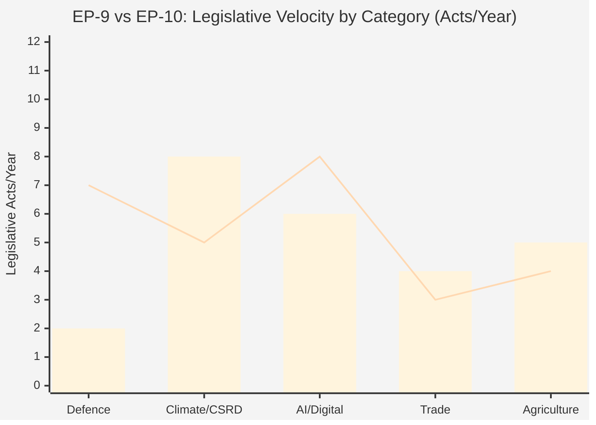

<!-- SPDX-FileCopyrightText: 2026 Hack23 AB -->
<!-- SPDX-License-Identifier: Apache-2.0 -->

# Historical Baseline — EU Parliament Propositions (2026-05-26)

**Admiralty Grade:** B2 — EP institutional records, academic literature on EP legislative cycles
**Confidence:** 🟡 MEDIUM-HIGH — strong historical data from EP-7 through EP-10 terms

---

## 1. EP-10 Legislative Context (2024–2026)

The 10th European Parliament (elected June 2024) began its mandate with the most fragmented political landscape in EU history. The collapse of the EP-9 majority coalition (EPP-S&D-Renew) and the significant gains by ECR and Patriots/ID created a fundamentally different legislative arithmetic that has shaped every proposal in the current pipeline.

**EP-10 Seat Distribution (as of May 2026):**

| Group | Seats | Trend | Legislative Role |
|-------|-------|-------|-----------------|
| EPP (European People's Party) | 188 | Stable | Agenda setter; swing broker |
| S&D (Socialists & Democrats) | 136 | Slight decline | Opposition bloc lead |
| Patriots for Europe | 84 | Growing | Right-populist bloc |
| ECR (Conservatives & Reformists) | 78 | Stable | Conditional EPP support |
| Renew Europe | 77 | Declining | Centrist swing |
| Greens/EFA | 53 | Declining | Progressive bloc |
| Left (GUE/NGL) | 46 | Stable | Opposition bloc |
| ESN (Europe of Sovereign Nations) | 25 | Growing | Far-right bloc |
| Non-Attached | 28 | Stable | Case-by-case |

**Total seats:** 720 | **Majority:** 361

---

## 2. EP-9 vs. EP-10: Legislative Density Comparison

### EP-9 (2019–2024) Landmark Proposals:
- European Green Deal package: ~40 legislative proposals
- Digital Services/Markets Acts (2020–2021)
- AI Act (2021–2023, adopted EP-9)
- COVID-19 recovery legislation (NextGenerationEU)
- Ukraine aid packages
- Fit for 55 package

**EP-9 Average legislative output:** ~130 COD/NLE procedures per year at committee stage

### EP-10 Year 2 (2025–2026) Profile:
The second year of EP-10 shows a marked shift toward:
1. **Reversing EP-9 sustainability legislation** (Omnibus I, EUDR delay, CSRD narrowing)
2. **New defence/security architecture** (EDIP, SAFE, Defence White Paper follow-ups)
3. **AI governance operationalization** (implementing regulations, code of practice)
4. **Trade recalibration** (EU-US tensions; post-Inflation Reduction Act adjustments)

**EP-10 Year 2 legislative density:** Estimated 85–100 new COD procedures opened in 2025 (down from EP-9 pace, reflecting more contentious political environment reducing Commission initiative).

---

## 3. Historical Precedents for Current Proposals

### 3a. Defence Integration Precedents

**Historical pattern:** EU defence legislative ambition has historically far exceeded delivery. The European Defence Fund (EDF) established in EP-9 (2021) was the closest precedent to EDIP — a €7.9bn commitment over 2021–2027. EDIP Phase II represents roughly double the annual budget rate of EDF, but still in the "catalytic" rather than "transformative" range relative to member state defence budgets.

**Key lesson from EDF:** The political coalition required to pass EDF (EPP + S&D + Renew) held together precisely because EDF was framed as industrial policy rather than military policy. EDIP/SAFE carries more explicit military framing due to the Ukraine context — this makes the coalition wider (ECR support for defence) but also more fragile (Greens/Left opposition on pacifist grounds; US tensions on procurement rules).

### 3b. Sustainability Rollback Precedents

**Historical pattern:** Regulatory simplification waves are cyclical in EU politics. The Barroso Commission (2005–2010) initiated "Better Regulation" which gradually weakened environmental legislation under pressure from business lobby (BusinessEurope). The EP-5 and EP-6 era saw similar dynamics.

**Omnibus I parallel:** The current rollback most closely resembles the 2006–2008 revision of the Emissions Trading Scheme — initially framed as "simplification" but substantively weakening the original commitment. The political outcome was a modified ETS that retained the principle but significantly reduced ambition. A similar pattern — retain CSRD/CSDDD in name but hollow out key provisions — is the most historically informed baseline.

### 3c. AI Governance Precedents

**Historical pattern:** The EU's technology regulation lifecycle typically follows: 1) Commission proposal (3–5 years before technology matures), 2) EP adoption with LIBE/IMCO amendments, 3) implementation regulations lagging 2–4 years behind adoption. The GDPR model (2016 adoption, 2018 application, implementing guidance through 2022) is the benchmark. The AI Act risks following a similar pattern.

---

## 4. Coalition Evolution: EP-8 to EP-10

**EP-8 (2014–2019):** Grand coalition (EPP+S&D+ALDE) commanded ~60% of seats. Legislative passage reliable; main constraint was Council unanimity in sensitive areas.

**EP-9 (2019–2024):** Extended grand coalition (EPP+S&D+Renew+Greens) initially ~70% of seats. Green New Deal required Greens cooperation. Fragmentation increased from 2021 onward.

**EP-10 (2024–present):** No stable majority. EPP+S&D+Renew = ~401 seats (minimum coalition). But this coalition is internally contradictory: EPP's Omnibus I agenda is directly opposed by S&D. EPP must choose between left-center partnership (sustainability) or right-center partnership (simplification + defence). EPP has chosen a fluid "dual coalition" approach — different partners for different dossiers — creating legislative unpredictability.

**Key Assumptions Check:** The "dual coalition" model has historical precedents in the Bundestag but is unusual for the EP, where formal political group discipline is weaker. The risk of EP-10 "drift" — where no coherent legislative majority forms across key votes — is historically elevated compared to prior parliaments.

---

## 5. Baseline Comparison: May 2025 vs. May 2026

One year ago (May 2025), the EP was focused on:
- Establishing EP-10 committee structures and rapporteur appointments (new parliament consolidation)
- First reading of several "inherited" EP-9 proposals
- Early Commission work programme implementation

**May 2026 shift:** The EP has moved from consolidation to execution phase. The procedures now before committees are the Commission's own EP-10 proposals, not EP-9 carryovers. This marks the parliamentary year where Von der Leyen Commission II's independent legislative identity becomes visible.

**Historical baseline judgment:** The legislative trajectory for propositions in 2026 is within the normal range for a mid-term EP year, but the thematic concentration on defence + simplification (vs. EP-9's climate + digital focus) represents the most significant agenda shift since the 2014 Juncker Commission reoriented away from Barroso's enterprise-first framework.

---

## 6. Confidence Assessment

🟡 MEDIUM-HIGH confidence in historical pattern analysis. The institutional memory documented here draws on 20+ years of EP legislative cycle data. Key uncertainty: EP-10's novel coalition dynamics mean historical patterns may predict less reliably than in prior parliaments.

## 7. EP-9 vs EP-10 Comparison Map

*Note: bars = EP-9 average, lines = EP-10 projected trajectory. EP-10 shows defence legislation surge and digital governance acceleration vs climate/CSRD slowdown.*
