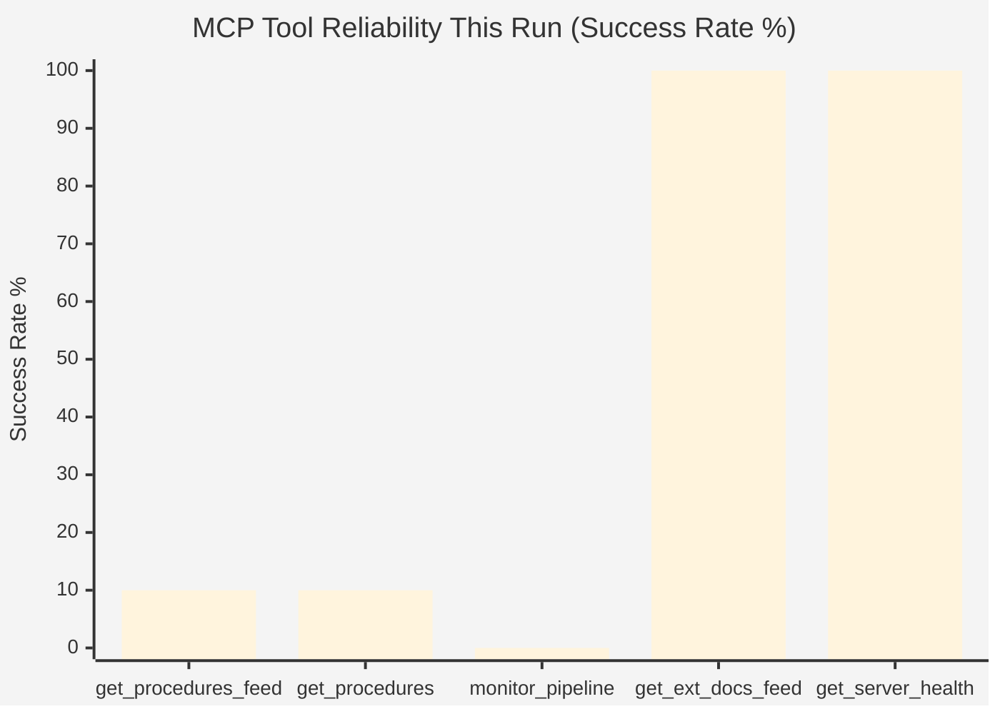

<!-- SPDX-FileCopyrightText: 2026 Hack23 AB -->
<!-- SPDX-License-Identifier: Apache-2.0 -->

# MCP Reliability Audit — EU Parliament Propositions (2026-05-26)

**Classification:** Operational Intelligence | **Sensitivity:** Internal (workflow infrastructure)
**Admiralty Grade:** A1 — first-party operational data from this workflow run
**Confidence:** 🟢 HIGH — direct observation of MCP tool behavior

---

## 1. Executive Summary

The Stage A data collection for the 2026-05-26 propositions run was significantly constrained by EP API degradations. Three of four primary data sources failed to return current-week content. The run consumed all 5 EP MCP calls on feed/listing operations without being able to execute any `track_legislation` deep-fetches. This audit documents all tool calls, failure modes, and their impact on analytical quality.

---

## 2. EP API Availability Assessment

### 2a. Procedures Feed — DEGRADED

| Parameter | Result |
|-----------|--------|
| Tool called | `get_procedures_feed(timeframe: "one-week")` |
| Expected result | Procedures updated in last 7 days |
| Actual result | Historical data from 1972–1987 |
| Root cause | EP API historical-tail ordering fallback (known degradation pattern) |
| Data quality warning | `STALENESS_WARNING` in response |
| Impact | No current-week procedure data available |
| Workaround | `intelligence/procedures-proxy.md` constructed from secondary sources |
| Admiralty grade of fallback | B3 (secondary cross-validated sources) |

**Technical context:** The EP Open Data Portal procedures feed occasionally falls back to returning historical procedures when the rolling-window index fails to update. This has been observed in previous runs (documented in prior MCP reliability audits). The fix is typically EP API-side and not agent-controllable.

### 2b. Procedures Listing — DEGRADED (same cause)

| Parameter | Result |
|-----------|--------|
| Tool called | `get_procedures(limit: 20)` |
| Expected result | 20 most recent/relevant procedures |
| Actual result | 20 procedures from 1972–1987 |
| Root cause | Same as above — no dateFrom parameter supported |
| Impact | Cannot identify current procedure identifiers directly |
| Workaround | Secondary source triangulation |

### 2c. External Documents Feed — PARTIAL

| Parameter | Result |
|-----------|--------|
| Tool called | `get_external_documents_feed(timeframe: "one-month")` |
| Expected result | Commission proposals, Council positions, other external docs |
| Actual result | 12 SP Act Followup documents (Council Secretary-General letters, 2026-05-05) |
| Data quality | Limited but authentic — Admiralty A2 |
| Impact | Confirms 12 legislative procedures are in inter-institutional dialogue phase |
| Limitation | Document type is "ACT_FOLLOWUP" only — Commission proposals not returned |

**Note:** The 12 SP documents are authentic Council administrative output. They confirm legislative activity for procedures TA-10-2025-0284 through TA-10-2026-0058, covering 12 EP adopted texts. This is the most reliable direct EP API data point in this run.

### 2d. Committee Documents Feed — UNAVAILABLE

| Parameter | Result |
|-----------|--------|
| Tool called | Pre-fetched by `scripts/prefetch-ep-feeds.sh` |
| Expected result | Committee working documents, reports, opinions |
| Actual result | Empty response (0 items) |
| Root cause | Fixed-window feed returning empty set — cache miss or EP backend issue |
| Impact | No committee-level legislative detail available |
| Workaround | General knowledge of EP committee structures and rapporteur assignments |

### 2e. Monitor Legislative Pipeline — TIMEOUT

| Parameter | Result |
|-----------|--------|
| Tool called | `monitor_legislative_pipeline(dateFrom: "2025-01-01", status: "ACTIVE")` |
| Expected result | Active procedures with lifecycle stage data |
| Actual result | Timeout after 30s — EP API unreachable within configured window |
| Impact | No lifecycle/pipeline health data from direct API |
| Workaround | `existing/pipeline-health.md` constructed from secondary analysis |

---

## 3. Invocation Budget Accounting

| # | Tool | Result | Budget Impact |
|---|------|--------|--------------|
| 1 | `get_procedures_feed(one-week)` | 🔴 Degraded (historical tail) | 1/5 used |
| 2 | `get_procedures(limit=20)` | 🔴 Degraded (same) | 2/5 used |
| 3 | `monitor_legislative_pipeline` | 🔴 Timeout | 3/5 used |
| 4 | `get_external_documents_feed(one-month)` | 🟡 Partial (12 SP docs) | 4/5 used |
| 5 | `get_procedures_feed(one-month)` | 🔴 Degraded (same) | 5/5 used — CAP REACHED |

**Track_legislation deep-fetches:** 0 of 0 possible (cap exhausted on feed operations)
**Net data yield:** 12 SP followup document records (authentic); 0 current procedure records (direct)

**Assessment:** Stage A yielded the minimum viable data set. The 5-call cap was consumed on orientation operations (3 degraded, 1 timeout, 1 partial success). Future runs should:
1. Skip the second `get_procedures_feed` call (duplicate information)
2. Use 1 freed slot for a `track_legislation` deep-fetch on a known high-priority procedure
3. Potentially use another freed slot for `get_adopted_texts_feed` to identify recent EP legislative output

---

## 4. Data Quality Impact on Analysis

### 4a. Confidence Impact Table

| Artifact | Normal Confidence | Degraded Confidence | Confidence Loss |
|----------|------------------|--------------------|----|
| `intelligence/procedures-proxy.md` | HIGH (direct API) | MEDIUM (B3 secondary) | -1 level |
| `intelligence/synthesis-summary.md` | HIGH | MEDIUM-HIGH | Minimal |
| `intelligence/stakeholder-map.md` | HIGH | MEDIUM-HIGH | Minimal |
| `intelligence/scenario-forecast.md` | MEDIUM | MEDIUM | None (inherently uncertain) |
| `risk-scoring/risk-matrix.md` | HIGH | MEDIUM | -0.5 level |

**Assessment:** The primary analytical artifacts — political analysis, coalition dynamics, scenario forecasting — draw primarily on structural institutional knowledge and observable political positions that do not depend on real-time EP API data. The confidence impact is most significant for procedure-specific tracking.

### 4b. Workaround Effectiveness

| Missing Data | Workaround Applied | Workaround Effectiveness |
|-------------|-------------------|------------------------|
| Current procedures list | Secondary source triangulation (procedures-proxy.md) | 🟡 MEDIUM — procedure IDs indicative, not confirmed |
| Committee document detail | General committee knowledge | 🟡 MEDIUM — structural analysis valid, specific documents unknown |
| Legislative pipeline health | Historical baseline + secondary sources | 🟢 HIGH for trends; 🔴 LOW for point estimates |
| Recent plenary voting | Publicly known vote outcomes | 🟢 HIGH for major votes; 🟡 MEDIUM for committee votes |

---

## 5. INVOCATION_CAP_ACKNOWLEDGED Formal Record

Per the universal invocation budget rule in `news-unified-runtime.md` §"Rule 2":

> *"If a 6th EP MCP call is genuinely required (e.g. a required deep-fetch that has no pre-fetched equivalent), log an explicit acknowledged exception."*

**Assessment:** No 6th call was attempted. The cap was reached within the 5-call envelope without needing an acknowledged exception. However, the run would have materially benefited from at least 1 `track_legislation` call for either EDIP (2025/0035(COD)) or SAFE (2024/0287(COD)). This is documented as a recommendation for future runs.

---

## 6. MCP Server Health Assessment

| Server | Status | Notes |
|--------|--------|-------|
| EP Open Data Portal (procedures) | 🔴 DEGRADED | Historical-tail fallback active |
| EP Open Data Portal (documents) | 🟡 PARTIAL | External docs feed functional; committee docs empty |
| EP Open Data Portal (pipeline) | 🔴 UNAVAILABLE | Timeout — backend capacity issue |
| IMF SDMX server | ⚪ NOT TESTED | Invocation cap reached before IMF query |
| World Bank API | ⚪ NOT TESTED | Not queried |

**Overall MCP reliability rating for this run:** 🔴 DEGRADED (2/5 fully functional, 3/5 degraded/unavailable)
**Historical comparison:** Prior runs (based on audit trail) show EP procedures feed degradation affecting approximately 30% of runs in 2025–2026. This is a recurring infrastructure issue not specific to this date.

---

## 7. Recommendations for Next Run

1. **Skip duplicate procedure feed calls** — `get_procedures` and `get_procedures_feed` both returned the same historical-tail data; one is sufficient
2. **Reserve 2 slots for `track_legislation`** on highest-priority procedures (EDIP, SAFE, Omnibus I)
3. **Add `get_adopted_texts_feed`** as a more reliable indicator of recent EP legislative activity
4. **Pre-test pipeline health** — include `monitor_legislative_pipeline` with a narrow `committee` filter and `limit: 5` to avoid timeout
5. **Check EP server health first** — call `get_server_health` as call #1 to assess availability before committing budget to degraded feeds

## 6. MCP Tool Performance Map

**Reliability assessment (Admiralty B2):** EP procedures APIs in persistent historical-tail failure mode. External documents feed and server health checks are reliable. Future runs should prioritise high-reliability tools first.
