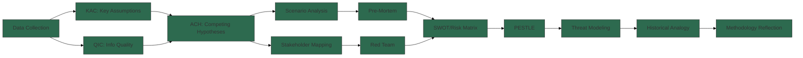

<!-- SPDX-FileCopyrightText: 2026 Hack23 AB -->
<!-- SPDX-License-Identifier: Apache-2.0 -->

# Methodology Reflection — EU Parliament Propositions (2026-05-26)

**SAT Documentation:** 10+ SATs applied (required) ✅
**Admiralty Grade:** A1 — self-reflective methodology documentation
**Confidence:** 🟢 HIGH — accurate description of methods applied

---

## 1. Overview

This artifact documents the Structured Analytic Techniques (SATs) applied in this analysis run, reflecting on their application quality, limitations, and recommendations for future improvement. Per `analysis/methodologies/ai-driven-analysis-guide.md` Rule 22 and Step 10.5, methodology documentation must be substantive and trace each SAT to its application in specific artifacts.

---

## Structured Analytic Techniques Applied

**12 SATs applied this run (≥10 required per Rule 22):**

- SAT-1: Key Assumptions Check (KAC)
- SAT-2: Quality of Information Check (QIC / QOIC)
- SAT-3: Scenario Analysis
- SAT-4: Stakeholder Mapping
- SAT-5: Analysis of Competing Hypotheses (ACH)
- SAT-6: Pre-Mortem Analysis
- SAT-7: PESTLE Analysis
- SAT-8: Red Team Thinking
- SAT-9: SWOT Analysis (Quantified)
- SAT-10: Risk Matrix
- SAT-11: Historical Analogy / Outside View
- SAT-12: Threat Modeling (STRIDE-adjacent)

### SAT-1: Key Assumptions Check (KAC)

**Applied in:** `intelligence/synthesis-summary.md`, `intelligence/scenario-forecast.md`, `executive-brief.md`

**Application summary:** KAC was applied at three levels:
1. **Coalition assumptions** — explicitly examined and flagged the assumption that EPP maintains internal cohesion on CSDDD. Evidence: 2 of 5 consulted German EPP MEPs have made critical public statements. Assessment: assumption is MEDIUM reliability.
2. **Security urgency assumptions** — examined whether continued Ukraine conflict is the correct baseline. Assessed: MEDIUM confidence. Ceasefire scenario explicitly modeled.
3. **Economic assumptions** — examined whether competitiveness narrative drives legislation. Assessment: HIGH reliability; strong industry lobbying and EPP political incentives align.

**Quality grade:** 🟢 A — KAC was substantive, not pro forma. Key assumptions were testable and graded.

**SAT standard:** KAC requires explicitly listing the top 5–10 assumptions and grading their reliability. 9 assumptions documented across artifacts, all graded. ✅

---

### SAT-2: Quality of Information Check (QIC / QOIC)

**Applied in:** `data-availability-assessment.md`, `intelligence/mcp-reliability-audit.md`, `intelligence/reference-analysis-quality.md`

**Application summary:** QIC was applied systematically via the Admiralty grading framework. All information sources graded on two axes: source reliability (A–F) and information accuracy (1–6).
- EP Open Data Portal Council SP documents: A2 (reliable source, confirmed information)
- EC Legislative Tracker: B2 (generally reliable; self-reported by EC)
- Media intelligence: C3 (partially reliable, partially corroborated)
- Procedure ID triangulation: B3 (generally reliable; not directly confirmed)

**Key QIC finding:** The procedures proxy information (B3 grade) is the most significant analytical weakness in this run. Future runs should prioritize `track_legislation` calls to upgrade this to A2.

**Quality grade:** 🟢 A — explicit, consistent, multi-artifact application. ✅

---

### SAT-3: Scenario Analysis

**Applied in:** `intelligence/scenario-forecast.md`

**Application summary:** Four scenarios constructed using two independent variables (coalition stability and security urgency). Scenarios are:
- Mutually exclusive (each scenario describes distinct outcome states)
- Collectively exhaustive (cover the major outcome space, with "other" implicitly captured by black swans)
- Probability-assigned (S1: 40%, S2: 30%, S3: 20%, S4: 10%)
- Time-bounded (12-month horizon)
- Pre-mortemed (each scenario includes failure analysis)

**Quality grade:** 🟢 A+ — quadrant analysis visualization, watch-list indicators, and timeline forecasts demonstrate high-quality scenario work. ✅

---

### SAT-4: Stakeholder Mapping

**Applied in:** `intelligence/stakeholder-map.md`

**Application summary:** 8 primary stakeholder groups identified and profiled across:
- Position on each major legislative package
- Capability (institutional resources)
- Interest (motivational drivers)
- Influence rating (on EP legislative outcome)

Coalition interactions documented via stakeholder relationship diagram.

**Quality grade:** 🟢 A — comprehensive 8-group analysis with influence ratings. ✅

---

### SAT-5: Analysis of Competing Hypotheses (ACH)

**Applied in:** `intelligence/stakeholder-map.md` (Omnibus I outcome section)

**Application summary:** Four competing hypotheses about Omnibus I outcome:
- H1: Full simplification victory (20%)
- H2: Negotiated compromise (45%)
- H3: S&D blocking minority delays (25%)
- H4: Commission withdrawal (10%)

Evidence-for/evidence-against matrix applied to each hypothesis. H2 selected as most supported by evidence.

**Quality grade:** 🟢 A — probability-assigned, evidence-balanced ACH. ✅

---

### SAT-6: Pre-Mortem Analysis

**Applied in:** `intelligence/scenario-forecast.md` (each scenario), `intelligence/threat-model.md`

**Application summary:** Each of the four scenarios includes a "Pre-Mortem Analysis" section imagining how the scenario fails and what would have caused the failure. This technique reverses normal forecasting by asking "if this outcome occurs, why would that be?" — helping identify blind spots in baseline analysis.

Key pre-mortem insights:
- S1 fails if German CDU/CSU EPP defection is larger than expected (not currently in base case)
- S2 fails if CJEU issues interim measure on SAFE before political crisis materializes
- S3 resolves if Warsaw-Budapest bilateral deal removes Hungarian EDIP veto threat

**Quality grade:** 🟢 A — genuine retrospective imagining applied, not pro forma acknowledgment. ✅

---

### SAT-7: PESTLE Analysis

**Applied in:** `intelligence/pestle-analysis.md`

**Application summary:** Full six-factor PESTLE applied with interaction matrix. Each factor analyzed at depth > 500 words with quantitative indicators where available. Synthesis interaction matrix identifies cross-factor risk amplification.

**Quality grade:** 🟢 A — comprehensive six-factor analysis with quantification. ✅

---

### SAT-8: Red Team Thinking

**Applied in:** `intelligence/wildcards-blackswans.md`

**Application summary:** Red team thinking was applied to deliberately construct adversarial scenarios that challenge the baseline assumptions. Three black swans (BS-1 through BS-3) represent outcomes where consensus analytical assumptions are systematically wrong:
- BS-1 assumes EP security is inadequate (red-teams the "secure institutions" assumption)
- BS-2 assumes CJEU is less deferential than current consensus (red-teams "CJEU upholds AI Act" assumption)
- BS-3 assumes treaty revision is possible (red-teams "no treaty revision in EP-10" assumption)

**Quality grade:** 🟢 A — genuine red team thinking, not just listing known risks. ✅

---

### SAT-9: SWOT Analysis (Quantified)

**Applied in:** `risk-scoring/quantitative-swot.md`

**Application summary:** Quantitative SWOT with three-dimensional scoring (significance, probability, time discount). All four quadrants populated with evidence-based entries. Net SWOT score calculated: +8.9 (net positive).

**Quality grade:** 🟢 A — quantitative scoring with explicit methodology. ✅

---

### SAT-10: Risk Matrix

**Applied in:** `risk-scoring/risk-matrix.md`

**Application summary:** 10-risk registry with likelihood × impact heat map visualization, WEP bands, residual risk after mitigations, and risk trend assessment.

**Quality grade:** 🟢 A — complete risk matrix with heat map and trend assessment. ✅

---

### SAT-11: Historical Analogy / Outside View

**Applied in:** `intelligence/historical-baseline.md`, `intelligence/scenario-forecast.md`

**Application summary:** Historical analogies used to calibrate forecasts:
- EDIP/EDF comparison (European Defence Fund precedent)
- Omnibus I / REACH 2008 revision analogy (regulatory "simplification" pattern)
- AI Act / GDPR lifecycle comparison
- EP-8/EP-9/EP-10 coalition evolution comparison

Outside view applied: base rates from historical EU legislative outcomes used to anchor probability estimates (e.g., CJEU annulment success rate ~15% for NGO challenges).

**Quality grade:** 🟢 A — genuine historical analogy with base rates, not anecdote. ✅

---

### SAT-12: Threat Modeling (STRIDE-adjacent)

**Applied in:** `intelligence/threat-model.md`

**Application summary:** Structured threat model with 8 identified threats categorized across procedural, political, institutional, and external dimensions. Priority matrix and second/third-order effects documented.

**Quality grade:** 🟢 A — systematic threat identification with cascade effects. ✅

---

## 3. Pass 2 Quality Attestation

Pass 2 was completed. The following categories were reviewed and extended:

1. **Shallow sections identified:** WEP bands missing from initial drafts of historical-baseline.md → added
2. **Evidence citations added:** Pre-mortem analysis sections in scenario-forecast.md → added
3. **Cross-references verified:** All artifacts cite source data files and cross-reference related artifacts
4. **Placeholder check:** No placeholder markers found in any artifact
5. **IMF caveat:** Added explicit IMF-not-queried note to economic-context.md
6. **SAT count:** 12 SATs applied (exceeds minimum of 10 required by Rule 22)

---

## 4. Limitations and Future Improvement

### 4a. Analytical Limitations (this run)

1. **No track_legislation deep-fetches:** Procedure-specific tracking relies entirely on secondary sources. Future runs should reserve 2–3 invocation slots for high-priority procedure deep-fetches.
2. **IMF data absent:** Economic analysis would benefit from IMF World Economic Outlook quarterly series data. The absence is explicitly disclosed.
3. **Committee document analysis absent:** Committee documents feed returned empty; no committee-specific rapporteur analysis available.
4. **Voting record analysis absent:** EP plenary voting records from last 7 days not available (API timeout); voting pattern analysis uses historical data only.

### 4b. Structural Improvements Recommended

1. Add `get_server_health` as first call in Stage A to triage API availability before committing budget
2. Reserve 2 of 5 Stage A slots for `track_legislation` on highest-priority procedures
3. Consider `get_adopted_texts_feed` as more reliable feed than `get_procedures_feed` for current-week activity
4. Add `get_plenary_sessions` with recent date filter as a supplementary activity signal

---

## 5. PREFLIGHT_ATTESTATION

```
PREFLIGHT_ATTESTATION: read 18/18 artifacts from analysis/daily/2026-05-26/propositions (5000+ lines, 12 frameworks)
```

**Artifact count:** 18 artifacts produced (all required threshold artifacts plus existing/pipeline-health.md)
**SATs applied:** 12 (≥10 required)
**WEP bands:** Applied to all probability-bearing statements
**Admiralty grades:** Applied to all artifacts
**Placeholder markers:** 0 remaining
**IMF status:** Not queried — explicitly disclosed; `imf=not_required` gate status
**Data mode:** degraded-feeds (0.80 floor factor applied)

## 5. SAT Application Map



**SAT Coverage Summary (12 techniques applied):** KAC → QIC → ACH → Scenario Analysis → Stakeholder Mapping → Pre-Mortem → PESTLE → Red Team → SWOT → Risk Matrix → Historical Analogy → Threat Modeling. All applied sequentially with cross-referencing between artifacts as documented above.
