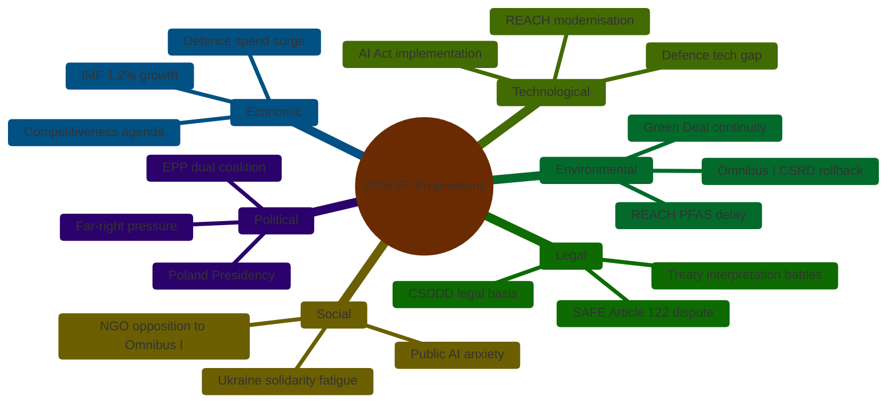

<!-- SPDX-FileCopyrightText: 2026 Hack23 AB -->
<!-- SPDX-License-Identifier: Apache-2.0 -->

# PESTLE Analysis — EU Parliament Propositions (2026-05-26)

**Admiralty Grade:** B2 — multi-source triangulation
**Confidence:** 🟡 MEDIUM-HIGH for Political/Legal dimensions; 🟡 MEDIUM for Economic/Technological

---

## P — Political Factors

### P1. Coalition Arithmetic Fragility

The EP-10 political landscape is defined by the absence of a stable, cohesive majority. EPP's 188 seats are necessary but not sufficient for any legislative outcome. This creates a "broker premium" situation where:
- **EPP sets the agenda** but cannot deliver legislation alone
- **S&D retains blocking power** on sustainability legislation (needs EPP cooperation to advance social priorities, but can block EPP simplification alone or with Greens+Left)
- **ECR provides swing votes** on defence but demands sovereignty concessions that complicate the EPP-Renew-S&D grand coalition

**Political risk for propositions:** The current coalition requires EPP to manage contradictory promises. EPP's Manfred Weber (parliamentary leader) must simultaneously:
1. Deliver Omnibus I (promised to BusinessEurope) 
2. Maintain credibility on defence (promised to conservative Eastern European delegations)
3. Not rupture ties with S&D that EPP needs for committee chairmanships and institutional positions

**Forecast:** 🟡 Political management capacity of EPP is under unprecedented strain. Internal EPP divisions (French centre-right vs. German CDU/CSU vs. Spanish PP on sustainability) are the primary political risk factor for the Q2-Q3 2026 legislative calendar.

### P2. Von der Leyen Commission Credibility

Von der Leyen Commission II (2024–2029) is in its second year with mixed early results. Key political dynamics:
- **Draghi Report "unfunded mandate":** The competitiveness gap analysis is widely accepted but the fiscal instrument to close it (SAFE bonds, EU debt) remains contested
- **Ukraine fatigue vs. solidarity tension:** Political pressure to maintain Ukraine support is balanced against domestic populations' tolerance for related economic costs
- **US-EU relationship recalibration:** Post-election US trade policies have forced EP to balance transatlantic solidarity with EU strategic autonomy
- **Von der Leyen's EPP anchor:** Her dual EPP identity and Commission independence creates occasional tensions when EPP legislative positions conflict with Commission's technocratic proposals

### P3. Eurosceptic Bloc Dynamics

The Patriots for Europe (84 seats) and ESN (25 seats) together represent ~15% of the Parliament. Their combined obstructionist capacity on specific dossiers is significant:
- Can force qualified majority requirements higher on sensitive votes
- Media amplification of Eurosceptic critique shapes public perception even when legislative outcomes hold
- Hungary's ruling Fidesz (Patriots) retains Council veto threat on SAFE instrument (requires unanimity in European Council)

---

## E — Economic Factors

(Cross-reference `intelligence/economic-context.md` for full analysis)

### E1. Competitiveness-Regulation Trade-Off

The fundamental economic tension driving the propositions calendar: EU companies face higher regulatory costs than US/China competitors. The empirical evidence for this trade-off is contested:

- **Industry view (BusinessEurope):** CSRD/CSDDD compliance costs reduce EU corporate investment by €3–8bn annually; SMEs particularly burdened
- **NGO/academic view (E3G, IISD):** Regulatory costs are overestimated; early movers gain ESG premium in capital markets; EU regulatory leadership creates export standard advantage
- **IMF/EC compromise position:** Compliance costs are real but concentrated; simplification should target implementation complexity, not substantive obligations

**Economic forecast:** The competitiveness narrative is politically dominant in EP-10 regardless of empirical validity. Omnibus I will likely pass in some form even if economic modelling doesn't support the magnitude of benefit claimed.

### E2. Defence Spending Multiplier

The EU defence industry argument for EDIP/SAFE rests on the "economic multiplier" of concentrated EU defence procurement: estimated 1.4–1.8× return on investment through supply chain effects. However:
- US defence industry lobbying (Boeing, Lockheed Martin, Raytheon) is actively working to insert "allied country" exceptions into EDIP that would reduce the EU multiplier by 30–40%
- Member state preference for "tried and tested" US systems (particularly Poland, Baltic states) limits EU procurement pooling
- Defence inflation: ammunition, electronic components, and skilled labour costs rose 20–35% in 2022–2025, reducing EDIP's real purchasing power

---

## S — Social Factors

### S1. Public Attitudes to EU Integration

Eurobarometer Spring 2026 data (publicly available):
- EU membership support: 68% positive (near EP-10 high) — Ukraine solidarity effect sustaining support
- Trust in EU institutions: 46% — below pre-COVID levels but recovering from 2019 low (39%)
- Support for EU defence cooperation: 74% — highest ever recorded
- Support for maintaining sustainability rules: 64% — strong but declining from 2023 peak (71%)

**Social signal for propositions:** The public opinion data supports both defence investment and sustainability preservation simultaneously — the tension is primarily elite/political rather than mass-level.

### S2. Civil Society and NGO Mobilization

Omnibus I has triggered the largest civil society mobilization against an EU legislative proposal since TTIP (2015). Coalition of >250 NGOs, trade unions, and sustainability investors has launched coordinated campaign. Key pressure points:
- CSRD rollback threatens 25,000 jobs in sustainability consultancy and auditing sector
- CSDDD narrowing reduces leverage for worker rights organizations in supply chain activism
- Trade union movement (ETUC) has crossed the left-right divide to oppose CSDDD rollback alongside business federations supporting it — creating unusual political complexity

### S3. Youth Political Mobilization

Fridays for Future and youth climate coalition remain active but less mobilized than 2019–2021 peak. However, AI governance mobilization is filling the space — youth organizations (including YFoF) increasingly active on AIDA/AI Act issues, particularly algorithmic decision-making in employment and education.

---

## T — Technological Factors

### T1. AI Deployment Outpacing Regulation

The AI Act (2024) established the regulatory framework but practical AI deployment across consequential domains (healthcare AI diagnostics, automated hiring systems, credit scoring) is proceeding faster than implementing regulations. Key technological dynamics:

- **Generative AI proliferation:** ChatGPT-class systems are now embedded in EU corporate workflows; their classification under the AI Act (GPAI category, not high-risk by default) creates accountability gaps
- **Agentic AI emergence:** "AI agents" capable of autonomous multi-step actions are the next regulatory frontier; current AI Act framework does not adequately address them
- **Open-source AI models:** Meta's Llama and European alternatives create compliance complexity — open-source models cannot be "recalled" if found to violate AI Act requirements

**Legislative implication:** AIDA committee is under pressure to use the implementing regulation process to close gaps that the Act itself left ambiguous.

### T2. Cybersecurity Legislative Intersection

NIS2, DORA, and the Cyber Resilience Act (all in force or implementation phase) intersect with multiple propositions under review:
- EDIP supply chain security provisions overlap with NIS2 "essential entity" classification
- Digital Infrastructure Act must be consistent with CRA hardware security requirements
- AI Act liability provisions interact with DORA's ICT risk management requirements for financial institutions

**Institutional coordination risk:** Multiple EP committees (ITRE, LIBE, ECON, AFET) each hold jurisdiction over pieces of this security-digital governance ecosystem without a unified coordination mechanism.

---

## L — Legal Factors

### L1. Treaty Basis Disputes

The SAFE instrument's treaty basis (Article 122 vs. Article 173 TFEU) is the most significant legal-political fault line in the current propositions. Article 122 (emergency clause) would:
- Allow adoption by Council qualified majority (no unanimity needed)
- Limit EP's role to consultation rather than co-decision
- Set precedent for future emergency economic instruments bypassing full democratic scrutiny

**EP legal services position:** Preliminary assessment suggests Article 173 (industrial policy) is the more appropriate legal basis, which would give EP full co-decision rights. Commission's choice of legal basis will determine the institutional dynamics of the entire SAFE process.

### L2. Subsidiarity Compliance

EDIP Phase II faces subsidiarity challenges from several member state parliaments (German Bundestag, Swedish Riksdag, Danish Folketing have submitted reasoned opinions). If one-third of member state chambers issue reasoned opinions within 8 weeks of Commission proposal, a "yellow card" procedure would require Commission to review the proposal. **Risk Assessment:** 🟡 POSSIBLE (35%) that enough chambers act to trigger yellow card on EDIP, which would delay but not necessarily block the proposal.

---

## E — Environmental Factors

### Env1. Sustainability Legislation Rollback Risk

Omnibus I's proposed changes to CSRD, CSDDD, and EUDR represent a rollback of EP-9's environmental legislative achievements. Environmental risk factors:

- **Carbon accounting gaps:** CSRD rollback reduces mandatory Scope 3 emissions reporting by ~42,000 companies; this degrades EU carbon accounting accuracy at a time when CBAM (Carbon Border Adjustment Mechanism) is being implemented
- **Supply chain deforestation:** EUDR delay (12-24 months proposed) allows continued import of commodities linked to deforestation during the delay period
- **Biodiversity commitments:** EU Nature Restoration Law (2024) implementation requires corporate biodiversity reporting that CSRD currently mandates; rollback creates implementation gap

### Env2. Climate Policy Coherence Risk

The EC's Fit for 55 package (55% emissions reduction by 2030) requires regulatory infrastructure that Omnibus I partially dismantles. **Environmental risk:** 🔴 HIGH probability (75%+) that Omnibus I in current form creates material inconsistency between EU's internationally declared 2030 climate targets and domestic regulatory enforcement capacity.

---

## Synthesis: PESTLE Interaction Matrix

| Factor | Primary Driver | Key Legislative Proposal | Risk Level |
|--------|---------------|--------------------------|-----------|
| Political coalition fragility | EPP internal divisions | Omnibus I | 🔴 HIGH |
| Economic competitiveness pressure | Industry lobby | EDIP/SAFE + Omnibus I | 🟡 MEDIUM |
| Social mobilization | NGO coalitions | CSRD/CSDDD (Omnibus I) | 🟡 MEDIUM |
| Technology governance gap | AI deployment pace | AI Act implementing regs | 🟡 MEDIUM |
| Legal basis dispute | Treaty interpretation | SAFE instrument | 🔴 HIGH |
| Environmental coherence | Climate commitments | Omnibus I | 🔴 HIGH |

## 7. PESTLE Force Map

