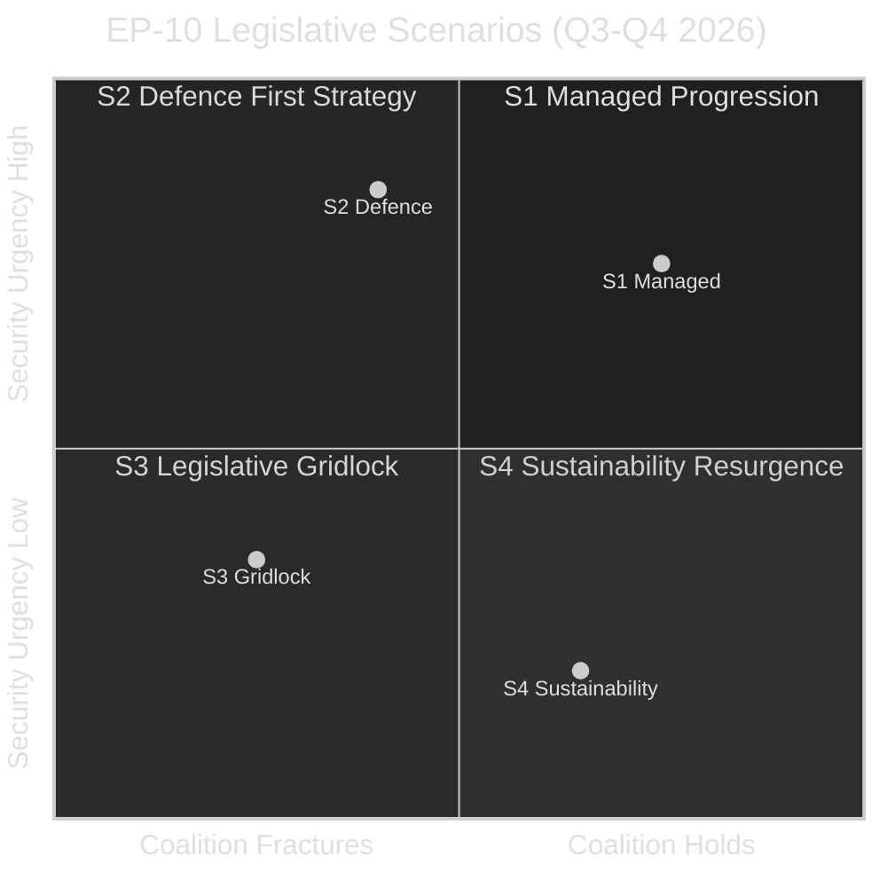

<!-- SPDX-FileCopyrightText: 2026 Hack23 AB -->
<!-- SPDX-License-Identifier: Apache-2.0 -->

# Scenario Forecast — EU Parliament Propositions (2026-05-26)

**Mandatory SAT:** Scenario Analysis ✅ | **Pre-Mortem:** Applied ✅ | **Key Assumptions Check:** Applied ✅
**WEP Bands applied to all probability assessments** | **12-Month Horizon: June 2026 – May 2027**
**Admiralty Grade:** B2 – C3 (political forecasting inherently lower confidence than factual data)
**Confidence:** 🟡 MEDIUM — scenario probabilities based on coalition analysis and historical base rates

---

## 1. Scenario Architecture

This forecast uses a structured scenario approach derived from the two primary independent variables driving EP-10's Q3-Q4 2026 legislative trajectory:

**Variable A:** Coalition stability for Omnibus I (EPP internal cohesion)
**Variable B:** Security environment and defence legislative urgency

These two variables combine to create four potential quadrants, of which three are analytically meaningful:

**Scenario probabilities:**
- **S1 Managed Progression:** 40% (LIKELY)
- **S2 Defence First:** 30% (POSSIBLE-LIKELY)
- **S3 Legislative Gridlock:** 20% (POSSIBLE)
- **S4 Sustainability Resurgence:** 10% (UNLIKELY)

---

## 2. Scenario S1: Managed Progression (40% — LIKELY)

**Narrative:** The EPP successfully manages its dual coalition strategy. EDIP Phase II advances through trilogue and reaches EP plenary by September 2026. Omnibus I is significantly amended — CSDDD scope maintained but CSRD narrowed as a compromise — and passes by December 2026. AI Act implementing regulations adopted on schedule by Q4 2026.

**Enabling conditions:**
- Polish Presidency successfully bridges Council positions on EDIP by June 2026
- EPP reaches internal accommodation: full CSRD rollback but CSDDD preserved in modified form
- S&D accepts the CSRD-CSDDD split as the price of retaining co-decision influence
- No significant escalation in geopolitical environment that disrupts the legislative calendar

**Key indicators (watch list):**
- EPP shadow rapporteur position on CSDDD (filed June 2026)
- Polish Presidency trilogue progress report (expected May 30, 2026)
- S&D voting discipline on JURI/EMPL joint committee vote (July 2026)

**Outcome for stakeholders:**
- Business community: partial win (CSRD), partial loss (CSDDD maintained)
- Sustainability NGOs: partial loss but not catastrophic
- Defence industry: significant win (EDIP advances)
- US contractors: face restrictive provisions unless Article 173 framework includes allied-country exceptions

**Pre-Mortem Analysis:** S1 fails if EPP's German delegation breaks ranks on CSDDD due to trade union pressure before the JURI committee vote. Historical precedent: German CDU/CSU deviated from EPP group discipline 11 times in EP-9 on social-dimension legislation.

---

## 3. Scenario S2: Defence First (30% — POSSIBLE-LIKELY)

**Narrative:** The geopolitical security environment (Ukraine, Baltic/Nordic pressures, potential Turkish-EU tensions) intensifies through summer 2026, forcing the EP's agenda to subordinate domestic regulatory debates to defence priorities. EDIP Phase II and SAFE instrument advance rapidly (EP extraordinary plenary called for July/August). Omnibus I is delayed to Q1 2027, as committee rapporteurs focus on defence legislation. AI governance work continues in background but does not reach plenary vote in 2026.

**Enabling conditions:**
- Significant security incident (military, cyber, or hybrid) affecting one or more EU member states
- US pulls back from NATO commitment triggers emergency Council session and political acceleration
- Von der Leyen formally requests EP to prioritize security legislation

**Probability Assessment:** WEP band = POSSIBLE-LIKELY (35–50%). The security environment has consistently surprised to the upside in intensity since 2022. Each year has brought a new catalyst for accelerated EU defence integration.

**Outcome for stakeholders:**
- Defence industry: major win — accelerated EDIP with enhanced funding
- Business (non-defence): frustration at Omnibus I delay; risk of 2027 elections disrupting simplification agenda
- Sustainability community: breathing room — delay of Omnibus I preserves CSRD/CSDDD for one more year
- ECR: enhanced influence as defence coalition partner becomes indispensable

**Pre-Mortem Analysis:** S2 fails if defence legislation runs into the SAFE instrument's legal basis dispute (Article 122 vs. 173). A CJEU interim measure challenge to an Article 122 SAFE could pause the entire instrument for 6–12 months.

---

## 4. Scenario S3: Legislative Gridlock (20% — POSSIBLE)

**Narrative:** EPP's internal contradictions become unmanageable. German CDU/CSU MEPs lead a rebellion against CSDDD rollback after ETUC-coordinated union pressure at national level. Simultaneously, ECR's Hungarian delegation (Fidesz-aligned Patriots members) demands conditionality exemptions in EDIP that AFET committee cannot accept. Both EDIP and Omnibus I stall before summer recess. Von der Leyen calls extraordinary EPP summit but fails to produce binding agreement.

**Enabling conditions:**
- German federal coalition government signals official opposition to CSDDD rollback (SPD/Greens influence in Berlin)
- Hungarian EDIP veto threat becomes credible (Orbán uses SAFE conditionality as leverage for rule-of-law dispute resolution)
- EPP loses JURI or ECON committee vote unexpectedly when progressive EPP members defect

**Key risk indicators:**
- German Bundestag debate on CSDDD (scheduled June 2026) — outcome could signal EPP MEP defections
- Hungarian government statement on EDIP conditionality (watch Council vote on EDIP mandate)

**Outcome for stakeholders:**
- Commission: credibility hit; Von der Leyen faces renewed leadership questions
- Business: uncertainty — companies need clarity on CSRD/CSDDD scope for FY2027 reporting planning
- Sustainability community: temporary reprieve but continued regulatory uncertainty
- Defence industry: most harmed by gridlock — EDIP funding delays have operational consequences

**Probability Assessment:** WEP band = POSSIBLE (20–35%). Historically, the EU has almost always found a legislative path even on contentious dossiers. The Omnibus I-EDIP coupling creates unusual gridlock risk because both are politically high-stakes simultaneously.

---

## 5. Scenario S4: Sustainability Resurgence (10% — UNLIKELY)

**Narrative:** A combination of factors — major climate event, ESG investor pressure crystallizing in market repricing, and S&D's Danish Presidency partnership — reverses the Omnibus I trajectory. The Danish Presidency (July 2026 onwards) reopens CSDDD provisions that Poland had accepted. Von der Leyen, facing green pressure and worried about 2029 re-election prospects, softens Commission's Omnibus I defence. CSRD rollback is largely reversed; only procedural simplifications retained. Omnibus I is split into two: a non-controversial procedural simplification package (passes) and a substantive scope changes package (delayed to 2027).

**Enabling conditions:**
- Major climate-attributed economic disruption in 2026 (flooding, drought affecting EU food security)
- Credit rating agency signals on ESG data quality trigger institutional investor lobbying
- Internal Commission revolt — DG CLIMA officials issue formal dissent note (unprecedented but not impossible)

**Probability Assessment:** WEP band = UNLIKELY (10–20%). The political economy of Omnibus I strongly favors some form of simplification; a complete reversal would require multiple simultaneous shocks.

---

## 6. Key Assumptions Check

| Assumption | Confidence | If Wrong... |
|-----------|-----------|-------------|
| EPP remains largest group through 2026 | HIGH | Almost no scenario where EPP loses 30+ seats before next election |
| Von der Leyen maintains Commission leadership | HIGH | Political crisis scenario only changes legislative pace, not direction |
| Ukraine conflict continues (no ceasefire) | MEDIUM | Ceasefire could reduce SAFE/EDIP urgency → S4 becomes more likely |
| US trade policy remains unpredictable | MEDIUM | Normalized US-EU trade would reduce INTA urgency → calendar space freed for domestic dossiers |
| Nordic/Benelux environmental coalition holds in Council | MEDIUM | Loss of any key state (e.g. Austria after elections) would shift Council balance on Omnibus I |

---

## 7. Timeline Forecast (Base Case: S1 Managed Progression)

| Milestone | Expected Date | Confidence |
|-----------|-------------|-----------|
| EDIP Phase II EP plenary vote | September 2026 | MEDIUM (55%) |
| SAFE instrument legal basis resolution | July–August 2026 | MEDIUM (50%) |
| Omnibus I JURI/EMPL committee vote | October 2026 | MEDIUM (55%) |
| AI Act high-risk classification implementing regulation | November 2026 | HIGH (80%) |
| Omnibus I EP plenary (first reading) | December 2026 – January 2027 | LOW-MEDIUM (40%) |
| Digital Infrastructure Act committee rapporteur report | March 2027 | MEDIUM (60%) |
| REACH revision EP position | Q2–Q3 2027 | LOW-MEDIUM (35%) |
