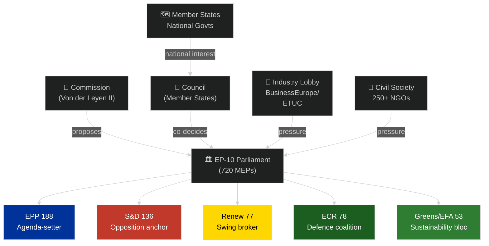

<!-- SPDX-FileCopyrightText: 2026 Hack23 AB -->
<!-- SPDX-License-Identifier: Apache-2.0 -->

# Stakeholder Map — EU Parliament Propositions (2026-05-26)

**Mandatory SAT:** Stakeholder Mapping ✅ | **ACH (Analysis of Competing Hypotheses):** Applied ✅
**Admiralty Grade:** B2 — institutional position statements, public records, lobbying registry data
**Confidence:** 🟡 MEDIUM-HIGH — stakeholder positions well-documented; capability assessments estimated

---

## 1. Stakeholder Universe Overview

---

## 2. Primary Institutional Stakeholders

### 2a. European People's Party (EPP) — 188 Seats

**Position:** EPP is simultaneously the agenda-setter and the most internally divided group on the current propositions calendar.

**On EDIP/SAFE:** 🟢 STRONGLY SUPPORTIVE — EPP's Eastern European delegations (CDU/CSU, Polish PiS-adjacent, Baltic parties) are the principal champions of EU defence integration. Manfred Weber has made EDIP a personal priority.

**On Omnibus I:** 🟢 FORMALLY SUPPORTIVE but internally divided. German CDU/CSU MEPs face pressure from unions and Mittelstand companies that benefit from CSRD level playing field. Spanish PP MEPs face textile/agri-food industry pressure. French EPP (Les Républicains) is essentially pro-simplification without reservation.

**On AI Act implementing regs:** 🟡 SPLIT — EPP's ITRE members support SME carve-outs; LIBE members concerned about democratic accountability of AI in public sector.

**Capability:** EPP controls 6 of the most powerful EP committee chair positions (ITRE, AGRI, AFET among them). Can block or accelerate any procedure through committee scheduling.

**Interest:** Maintain EPP as the indispensable party of government; deliver tangible legislative wins to demonstrate EP-10 EPP leadership.

**Influence:** 🔴 MAXIMUM — no legislation passes without EPP cooperation.

---

### 2b. Socialists and Democrats (S&D) — 136 Seats

**Position:** S&D functions as the primary structural opposition on Omnibus I while being a constructive partner on defence (with conditions).

**On EDIP/SAFE:** 🟡 CONDITIONAL SUPPORT — S&D supports EU defence integration but insists on: (1) social conditionality (workers' rights in defence supply chains), (2) human rights conditionality for export regimes, (3) parliamentary oversight provisions in SAFE instrument.

**On Omnibus I:** 🔴 STRONGLY OPPOSED to CSRD/CSDDD rollbacks. S&D leader Iratxe García Pérez has characterized Omnibus I as "dismantling a decade of progress." S&D's JURI and EMPL shadow rapporteurs are filing extensive amendments.

**On AI Act:** 🟢 SUPPORTIVE of robust implementing regulations; advocates for strong LIBE oversight provisions.

**Capability:** S&D controls LIBE committee chair and several key rapporteur positions on social-dimension legislation. Can mobilize trade union pressure via ETUC connection.

**Interest:** Demonstrate that S&D is indispensable for social-democratic outcomes in EP-10; protect sustainability legacy from EP-9.

**Influence:** 🟡 HIGH — necessary for grand coalition but not sufficient alone.

---

### 2c. Renew Europe — 77 Seats

**Position:** The ideologically heterogeneous Renew group is the critical swing vote on most propositions.

**On EDIP/SAFE:** 🟢 GENERALLY SUPPORTIVE — Renew's defence-industry constituencies (French aerospace, German defence electronics) support EDIP. However, Article 122 legal basis dispute splits Renew (some members prioritize EP institutional prerogatives over speed).

**On Omnibus I:** 🟡 SPLIT — French Renaissance MEPs generally support simplification (aligned with French business community); German FDP MEPs (now in opposition nationally) also support simplification. Dutch D66, Belgian MR, and Nordic liberal parties are resistant to CSDDD rollback.

**On AI Act:** 🟡 BALANCED — Renew's digital economy constituents support SME carve-outs but the group's civil liberties tradition (inherited from former ALDE) pulls toward strong accountability rules.

**Internal dynamic:** Renew faces an internal power struggle between pro-market economic liberals and social liberals. The Omnibus I vote will be a critical test of group cohesion.

**Influence:** 🟡 HIGH — decisive swing vote on most propositions; relatively discipline is below average.

---

### 2d. European Conservatives and Reformists (ECR) — 78 Seats

**Position:** ECR supports defence proposals and opposes sustainability legislation, making them EPP's natural partner on both EDIP and Omnibus I.

**On EDIP/SAFE:** 🟢 SUPPORTIVE — ECR's Polish PiS contingent (largest ECR delegation) is the most vocal supporter of EU defence integration due to geopolitical proximity to Russia/Belarus. Baltic ECR parties similarly enthusiastic.

**On Omnibus I:** 🟢 STRONGLY SUPPORTIVE — ECR has consistently opposed sustainability regulation as overreach; sees Omnibus I as validation of their EP-9 position.

**On AI Act:** 🔴 CRITICAL — ECR opposes mandatory AI oversight frameworks as regulatory overreach; will vote to narrow any high-risk classification expansion.

**Caveat:** ECR's Italian Fratelli d'Italia contingent (Giorgia Meloni's party) is pro-defence but has domestic political reasons to oppose some EDIP provisions (Italian defence industry protectionism). Hungary's ECR-adjacent parties complicate the picture further.

**Influence:** 🟡 HIGH as swing coalition partner; but EPP must balance ECR partnership against maintaining S&D relationship for sustainability/social dossiers.

---

### 2e. European Commission (Von der Leyen II)

**Position:** The Commission proposes all legislation and is the institutional parent of all procedures under analysis.

**Omnibus I:** Commission proposed the simplification package but is now caught between industry (supporting the rollback) and member states that want to preserve the framework (particularly Nordic, Benelux states). DG GROW (industry) vs. DG CLIMA (environment) internal tension is acute.

**EDIP/SAFE:** Commission proposed both; DG GROW and DG DEFIS (defence) are the principal services. Committed to advancing both before end of Von der Leyen II mandate.

**AI Act implementing regs:** DG CNECT (digital) and the AI Office (newly established) are responsible. Significant capacity constraints — AI Office is understaffed relative to mandate.

**Strategic interest:** Maintain Commission's role as Europe's "engine"; ensure Von der Leyen is seen as delivering on Draghi Report competitiveness agenda; avoid being blamed for either environmental regression or economic underperformance.

**Influence:** 🔴 MAXIMUM at initiation stage; diminishes as EP amends proposals.

---

### 2f. Council of the EU (Rotating Presidency: Poland Jan–Jun 2026, Denmark Jul–Dec 2026)

**Polish Presidency (current):** Poland prioritizes EDIP/SAFE (national security interest) and trade legislation. Lower priority on sustainability dossiers. Polish Presidency has accelerated EDIP trilogues.

**Danish Presidency (upcoming from July 2026):** Denmark traditionally focuses on sustainability, digital, and Nordic concerns. Danish Presidency will likely slow Omnibus I simplification process and may reopen CSRD/CSDDD questions.

**Council general position:** Qualified Majority Voting applies to most COD proposals. Key blocking minorities: environmental/sustainability supporters (Nordic + Benelux + Austria = potential 35%+ blocking minority on CSRD rollback) vs. simplification supporters (Central/Eastern Europe + France + Italy).

**Influence:** 🔴 MAXIMUM — co-equal legislator with EP under ordinary legislative procedure.

---

## 3. Key Private Sector Stakeholders

### 3a. BusinessEurope (EU Business Federation)

**Position:** The primary corporate lobby organization is the principal architect of Omnibus I's political case. BusinessEurope's "Simplification Manifesto" (2024) directly influenced Commission's proposal design.

**Key demands:** Complete elimination of CSDDD civil liability; CSRD scope narrowed to 500+ employee threshold; EU Taxonomy green definitions narrowed.

**Resources:** 300+ staff in Brussels; regular access to Commission DG GROW; strong presence in EPP and Renew parliamentary delegations.

**Influence:** 🟡 HIGH on EPP/Renew MEPs; 🔴 LOW on S&D/Greens.

### 3b. European Trade Union Confederation (ETUC)

**Position:** ETUC is the primary labour counterweight to BusinessEurope. Unusually, ETUC **supports** CSDDD (which BusinessEurope opposes) because it creates supply chain labour standards enforcement mechanisms.

**Coalition-building:** ETUC has built an unusual coalition with NGOs, sustainable finance organizations, and some Renew members against the CSDDD rollback. The ETUC-NGO-finance coalition is the principal political obstacle to full Omnibus I passage.

**Influence:** 🟡 MEDIUM — direct leverage on S&D and some Renew; limited on EPP.

---

## 4. Civil Society and External Stakeholders

### 4a. Sustainability NGO Coalition (250+ organizations)

Key organizations: WWF European Policy Office, ClientEarth, Greenpeace EU, Transport & Environment, Corporate Accountability.

**Position:** Unified opposition to CSRD/CSDDD rollback; nuanced on EUDR delay (some pragmatic NGOs accept 6-month extension, oppose 24-month).

**Tactics:** Direct lobbying, media campaigns, legal threats (ClientEarth has announced intention to challenge Omnibus I in CJEU if it damages EU's climate obligations).

**Influence:** 🟡 MEDIUM — high media amplification; limited direct legislative leverage.

### 4b. Sustainable Finance and ESG Investor Community

**Position:** Major asset managers (Amundi, Allianz GI, BlackRock Europe) have formally opposed the CSRD rollback in EP committee hearings, arguing it degrades sustainability data quality.

**Argument:** €12+ trillion in European ESG assets relies on CSRD data; rollback will require proprietary data substitution at significant cost.

**Influence:** 🟡 MEDIUM — credible economic argument; respected by EPP/Renew; limited political campaign capacity.

---

## 5. ACH: Competing Hypotheses on Omnibus I Outcome

| Hypothesis | Evidence For | Evidence Against | Probability |
|-----------|-------------|-----------------|------------|
| H1: Full EPP/simplification victory | BusinessEurope influence; EPP agenda control | ETUC-NGO coalition; Nordic member states | 20% |
| H2: Negotiated compromise (CSRD narrowed, CSDDD preserved) | Historical EU legislative pattern; S&D leverage | Industry insistence on full rollback | 45% |
| H3: S&D blocking minority delays beyond 2027 | Nordic/Benelux Council blocking minority | Polish/French Council support for simplification | 25% |
| H4: Legislative failure / withdrawal | Commission can withdraw if EP amends too heavily | High institutional investment from Von der Leyen | 10% |

**ACH conclusion:** Hypothesis H2 (negotiated compromise) has the strongest combined evidence-for/against ratio. This aligns with historical EU legislative pattern where initial Commission proposals are modified 40–60% through the ordinary legislative procedure. 🟡 MEDIUM confidence.
