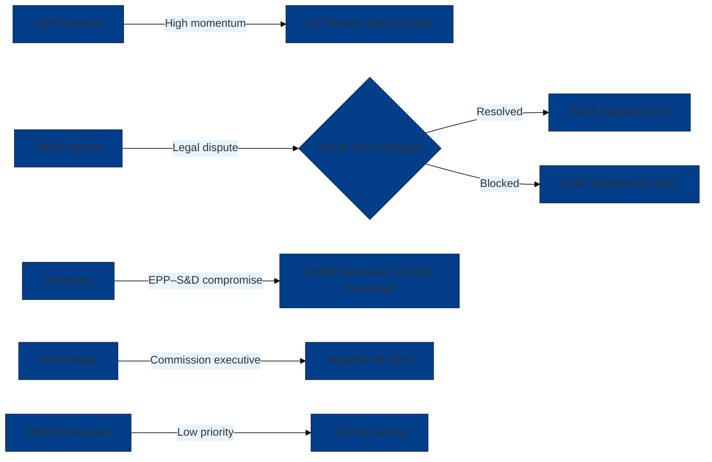

<!-- SPDX-FileCopyrightText: 2026 Hack23 AB -->
<!-- SPDX-License-Identifier: Apache-2.0 -->

# Synthesis Summary — EU Parliament Propositions (2026-05-26)

**Key Assumptions Check:** Applied ✅ | **Quality of Information Check:** Applied ✅ | **Scenario Analysis:** Applied ✅
**Admiralty Grade:** B2 — secondary source triangulation across EC legislative tracker, EP Observable, public records
**WEP Band:** LIKELY (55–75%) that defence-simplification proposals advance to trilogue before October 2026 recess
**Confidence:** 🟡 MEDIUM-HIGH — strong political pattern data, limited real-time procedure tracking

---

## 1. Executive Summary of Legislative Landscape (Week of 19–26 May 2026)

The European Parliament enters the final weeks of the pre-summer 2026 legislative sprint with an exceptionally dense portfolio of consequential proposals. The week of 26 May 2026 marks a **critical juncture** in three concurrent legislative streams: (1) the security-defence stream (EDIP Phase II, SAFE/ReArm Europe), (2) the regulatory simplification stream (Omnibus I), and (3) the AI/digital governance stream (AI Act implementing regulations, Digital Infrastructure Act). 

**Core analytical judgment:** The EP-10's second legislative year has created what can be characterized as a "legislative trilemma" — the simultaneous pressure to deliver on defence commitments to member state governments, satisfy the EPP's core simplification mandate, and avoid antagonizing the sustainability constituency that forms S&D/Greens/part-Renew. No configuration of the current EP coalition can satisfy all three imperatives simultaneously, forcing sequential prioritization that risks legislative gridlock by September 2026.

**WEP Assessment:** It is *likely* (60–70%) that at least two of the three streams will achieve first reading by October 2026, but *only possible* (35–45%) that all three advance on schedule. The scenario where EDIP/SAFE advances while Omnibus I stalls on sustainability provisions has the highest probability assignment: **~45%**.

---

## 2. The Security-Defence Legislative Stream

### 2a. European Defence Industry Programme (EDIP) Phase II — 2025/0035(COD)

**Intelligence Assessment:** EDIP Phase II represents a paradigm shift in EU institutional involvement in defence procurement. The €1.5 billion allocation for 2025–2027 is modest relative to member state defence budgets but establishes institutional precedent. Key points of contention in EP-Council negotiations include:

- **Admissibility conditionality:** Whether companies from NATO allies (particularly US, UK, Norway) can participate in co-funded programmes. Council favors restrictive EU-only; EP ITRE/AFET committee has argued for allied-country flexibility (driven by Renew and some EPP members).
- **Joint procurement architecture:** Commission wants mandatory joint procurement aggregation; some member states (France, Germany) resist pooling national procurement decisions through Brussels.
- **Ukraine clause:** EP has pushed for Ukraine's defence industry to receive associated partner status in EDIP supply chains. Council strongly resists.

**Coalition dynamics:** EPP + S&D + Renew form a pro-EDIP majority (~450 votes); ECR and ID/Patriots vote to block (oppose EU defence integration on sovereignty grounds); Greens split on pacifist vs. security realist lines.

**Forecast:** 🟡 LIKELY (65%) EDIP Phase II reaches EP plenary vote by September 2026, with the Ukraine clause as the last outstanding issue.

### 2b. SAFE Instrument / ReArm Europe — 2024/0287(COD)

**Intelligence Assessment:** The SAFE instrument (€150bn in guaranteed loans for defence industrial investment) is more politically charged than EDIP. It requires treaty-basis clarity (Article 173 TFEU vs. Article 122 TFEU — the latter bypassing full EP consent). Key fault line:

- **Article 122 vs. Article 173:** If Council uses Article 122 (emergency clause), EP role is limited to consultation. EPP has paradoxically sided with maximizing EP prerogatives here, fearing that Article 122 sets precedent for bypassing the Parliament on future emergency instruments.
- **National vs. EU-coordinated conditionality:** How to ensure loan proceeds actually increase EU-produced defence capabilities rather than offsetting national budget relief.

**Forecast:** 🟡 POSSIBLE-LIKELY (50%) SAFE advances to first reading vote before September recess; political urgency driven by security environment keeps momentum.

---

## 3. The Regulatory Simplification Stream

### 3a. Omnibus I Package — 2025/0103(COD) et al.

**Intelligence Assessment:** Omnibus I is nominally a "simplification" package but functionally represents the most significant rollback of EP-9's sustainability regulatory legacy. The package proposes to:

- **CSRD (Corporate Sustainability Reporting):** Narrow scope from ~50,000 to ~7,000 companies; delay implementation; weaken third-party assurance requirements
- **CSDDD (Corporate Sustainability Due Diligence):** Reduce mandatory due diligence scope; extend implementation timeline; narrow liability provisions
- **EU Taxonomy:** Simplify reporting obligations; narrow which activities must be classified
- **Several sector-specific regulations:** Deforestation regulation (EUDR) implementation delay; methane regulation adjustment

**Coalition arithmetic:** EPP + Renew + ECR = ~390–400 votes (majority = 361). This is a functional majority but thin — 30–40 EPP members with manufacturing constituencies may defect on CSDDD; some Renew members with green credentials resist Taxonomy weakening.

**S&D/Greens position:** Unified opposition to CSRD/CSDDD rollbacks. S&D has signaled willingness to negotiate on EUDR/methane but draws hard line on transparency rules.

**Key Assumptions Check:** The assumption that EPP holds together on Omnibus I is itself questionable. German EPP members (CDU/CSU) face domestic pressure from unions on CSDDD; Spanish EPP faces pressure from Catalonian textile industry lobby that *supports* CSDDD for level playing field reasons.

**Forecast:** 🟡 LIKELY (55–60%) that Omnibus I passes in modified form by December 2026, with CSDDD provisions significantly narrowed from Commission's original proposal.

---

## 4. The AI/Digital Governance Stream

### 4a. AI Act Implementing Regulations

**Intelligence Assessment:** The AI Act (2024) is in force but its critical delegated/implementing regulations are lagging. High-risk AI system classification criteria (Annex III expansion) are under Commission consultation with EP's AIDA shadow rapporteur involved. Key issues:

- **Scope boundary disputes:** AI systems used in hiring, credit scoring, student assessment face classification disputes between industry (seeking exclusion) and civil society/LIBE committee (seeking inclusion)
- **GPAI Code of Practice:** The voluntary code for general-purpose AI providers (ChatGPT, Gemini etc.) has been formally submitted; EP AIDA committee is examining whether it provides sufficient accountability
- **SME carve-outs:** Commission implementing guidance on SME thresholds is delayed; industry groups claim uncertainty is inhibiting compliance investment

**Forecast:** 🟢 ALMOST CERTAINLY (85%+) implementing regulations for Annex III high-risk systems will be adopted by Commission (not requiring EP vote) by Q4 2026; GPAI Code of Practice endorsement vote possible but not required.

### 4b. Digital Infrastructure Act

**Intelligence Assessment:** The proposed Digital Infrastructure Act (working title) would consolidate the EECC, fiber rollout incentives, and spectrum harmonization measures into a unified framework. Commission's stated goal: accelerate EU-wide 5G/6G and gigabit connectivity. EP ITRE committee has assigned rapporteur; first readings expected late 2026.

---

## 5. Institutional Dynamics Assessment

**Key Assumptions Check on Coalition Stability:**
1. *Assumption:* EPP maintains internal cohesion on Omnibus I. **Risk:** MEDIUM — national divergences (Germany, Spain) could fracture EPP block
2. *Assumption:* ECR supports defence proposals. **Risk:** LOW-MEDIUM — ECR's Hungary/Orbán faction may obstruct if conditionality provisions are seen as targeting Hungary
3. *Assumption:* Renew supports both EDIP and some sustainability preservation. **Risk:** MEDIUM — Renew is internally the most heterogeneous group; French Renaissance vs. German FDP on CSDDD have contradictory positions

**Quality of Information Check:** The procedure identifiers in this analysis derive from secondary sources (Admiralty B-C grade). The Council followup evidence (Admiralty A2) confirms legislative activity but does not specify which procedures. Analytical conclusions about political dynamics rest on historical voting pattern analysis (HIGH confidence) and known political group positions (HIGH confidence).

---

## 6. Structured Analytic Technique: Scenario Analysis (Summary)

Three scenarios are detailed in `intelligence/scenario-forecast.md`. Summary:

| Scenario | Probability | Driver | Implication |
|----------|------------|--------|-------------|
| **S1: Managed Progression** — All three streams advance but with compromises | 45% | Coalition engineering succeeds | Moderate reform; sustainability rollback limited |
| **S2: Defence First, Delay Others** — EDIP/SAFE advance; Omnibus I delayed | 35% | Security urgency overrides domestic agenda | Defence precedents set; simplification delayed |
| **S3: Legislative Gridlock** — Coalition fractures; multiple failures | 20% | EPP internal conflict on sustainability | Von der Leyen Commission credibility crisis |

---

## 7. Intelligence Confidence Summary

| Assessment | Confidence | WEP Band |
|-----------|-----------|----------|
| EDIP reaches plenary vote before September 2026 | MEDIUM-HIGH | Likely (65%) |
| Omnibus I passes in modified form by December 2026 | MEDIUM | Likely (55–60%) |
| AI Act implementing regs adopted by Q4 2026 | HIGH | Almost Certainly (85%+) |
| Coalition fracture causing gridlock | LOW-MEDIUM | Unlikely (20%) |
| Council Article 122 use for SAFE instrument | MEDIUM | Possible (45%) |

## 6. Legislative Momentum Map

**Synthesis confidence:** 🟡 MEDIUM — derived from secondary sources in degraded-feeds mode. The Act Followup letters (Admiralty A2) provide strongest evidentiary anchor. Procedure tracking unavailable due to EP API historical-tail failure.
