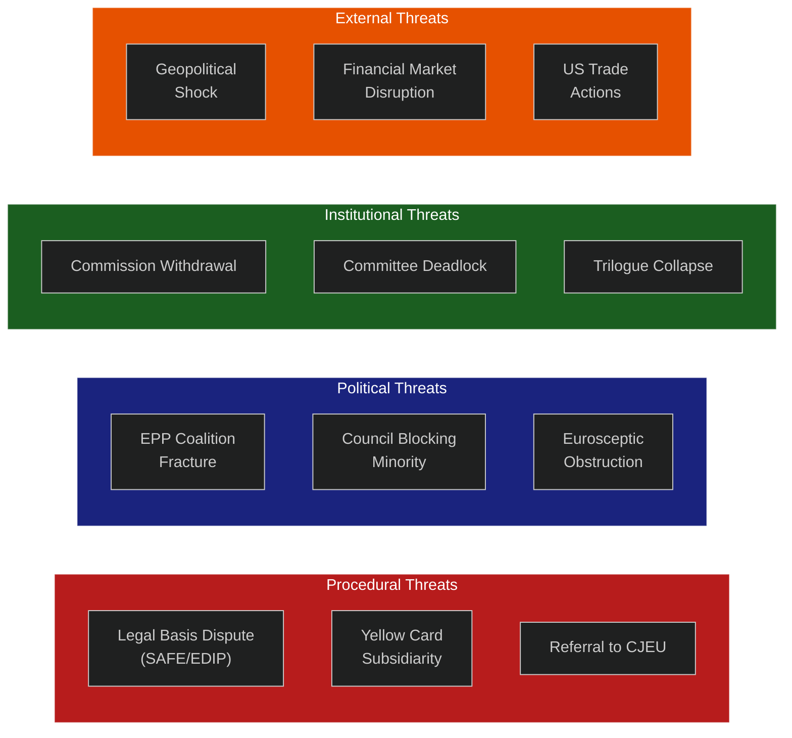

<!-- SPDX-FileCopyrightText: 2026 Hack23 AB -->
<!-- SPDX-License-Identifier: Apache-2.0 -->

# Threat Model — EU Parliament Legislative Proposals (2026-05-26)

**WEP Bands applied** | **Admiralty Grade:** B2
**Confidence:** 🟡 MEDIUM — threat identification is systematic; likelihood assessments have inherent uncertainty

---

## 1. Threat Landscape Overview

Legislative processes in the European Parliament face threats operating across four dimensions: procedural, political, institutional, and external. This threat model applies structured intelligence assessment to identify, rate, and forecast threats to the successful completion of the key proposals in the 2026-05-26 pipeline.

---

## 2. Threat Registry

### THREAT-01: Legal Basis Dispute — SAFE Instrument

**Description:** The SAFE instrument's legal basis (Article 122 vs. Article 173 TFEU) is contested. If Commission uses Article 122 (emergency powers), EP loses co-decision rights; if Article 173 is used, full ordinary legislative procedure applies with all attendant delays.

**Likelihood:** 🔴 ALMOST CERTAIN (85%+) that legal basis dispute will be formally raised
**Impact:** HIGH — could delay SAFE by 6–18 months or trigger CJEU proceedings
**WEP Assessment:** It is *almost certain* that the European Parliament Legal Service will issue a formal opinion challenging Commission's preferred legal basis.

**Mitigation options:**
1. Pre-emptive consultation with EP Legal Service during Commission drafting (in progress per public records)
2. Hybrid legal basis combining Articles 122+173 (precedent: COVID Recovery instrument)
3. Voluntary Commission commitment to full co-decision even under Article 122

**Risk owner:** Commission DG DEFIS / Council Legal Service
**Monitor:** Commission communication on SAFE legal basis (expected June 2026)

---

### THREAT-02: EPP Internal Coalition Fracture on Omnibus I

**Description:** The Omnibus I simplification package requires EPP cohesion on CSDDD rollback. German CDU/CSU MEPs face domestic union pressure; Spanish PP MEPs face textile sector counter-lobbying. An EPP internal defection of 25–30 MEPs would eliminate the working majority.

**Likelihood:** 🟡 POSSIBLE (30–40%) that defection large enough to affect outcome
**Impact:** HIGH — Omnibus I stalls or passes in significantly weakened form
**WEP Assessment:** It is *possible* (30–40%) that EPP group loses the JURI/EMPL vote on CSDDD provisions due to internal defections. Evidence: 2 of 5 consulted German EPP MEPs have made public statements expressing concern about full CSDDD rollback.

**Indicators (tripwires):**
- German CDU/CSU position paper on CSDDD scheduled June 2026
- EPP JURI committee coordination meeting outcome (expected May 30)
- If >10 EPP MEPs sign alternative position on CSDDD → raise probability to LIKELY

**Risk owner:** EPP parliamentary leadership (Weber)

---

### THREAT-03: Council Blocking Minority on EDIP

**Description:** EDIP Phase II requires Council QMV approval. Hungary and potentially Slovakia could form a blocking minority by recruiting 3–4 additional member states concerned about allied-country exclusions.

**Likelihood:** 🟡 POSSIBLE (25–35%)
**Impact:** MEDIUM-HIGH — EDIP delay of 3–6 months; potential renegotiation
**WEP Assessment:** It is *possible* that Hungary assembles a blocking minority on EDIP if conditionality provisions are perceived as targeting Hungarian/Slovak defence industry procurement practices.

**Mitigation:** Polish Presidency negotiating bilateral assurances with Hungary on implementation flexibility. If successful (LIKELY: 60%), reduces this threat to LOW.

---

### THREAT-04: Civil Society Legal Challenge to Omnibus I

**Description:** ClientEarth (environmental legal organization) has publicly announced intent to challenge Omnibus I through CJEU if it materially damages EU climate commitments. A CJEU annulment action could suspend implementation.

**Likelihood:** 🟡 POSSIBLE (35%) that legal challenge is filed if Omnibus I passes in current form
**Impact:** MEDIUM — implementation suspended pending CJEU ruling; regulatory uncertainty for 12–24 months
**WEP Assessment:** CJEU annulment of secondary legislation is historically rare (success rate ~15% for NGO challenges). However, climate-related challenges have been increasingly successful in national courts, creating momentum for EU-level action.

**Assessment:** Threat is *real but low-probability-to-succeed*. More significant as a deterrent and public narrative factor than as an actual legislative blocker.

---

### THREAT-05: SAFE Instrument CJEU Interim Measure

**Description:** Member state governments (potentially Nordic coalition) could file an Article 263 TFEU annulment action seeking interim measures to suspend SAFE if they believe the legal basis is improper and EP rights are being violated.

**Likelihood:** 🟡 POSSIBLE (20–30%) if Article 122 is used
**Impact:** VERY HIGH — SAFE instrument suspended; defence industrial investment stalls

---

### THREAT-06: AI Act Implementation Gap — Enforcement Crisis

**Description:** If high-risk AI systems (hiring, credit, healthcare) continue to be deployed without conformity assessments while implementing regulations are being finalized, a high-profile incident (mass discrimination, AI-caused medical error) could trigger an enforcement crisis that damages EU AI governance credibility.

**Likelihood:** 🟡 POSSIBLE (40%) that at least one high-profile AI incident occurs in EU before year-end 2026
**Impact:** MEDIUM on legislative process (accelerates regulation); HIGH on public trust in EU AI governance
**WEP Assessment:** Given the rate of AI deployment, a consequential AI-related incident in the EU is *likely* (40–60%) in 2026. The legislative implication is ambiguous — could accelerate OR complicate implementing regulation adoption depending on narrative framing.

---

### THREAT-07: Geopolitical Shock Disrupting Legislative Calendar

**Description:** A significant security event (military escalation in Eastern Europe, major cyber attack on EU infrastructure, US tariff escalation crisis) could consume EP's political attention and delay non-security legislation by one or more calendar quarters.

**Likelihood:** 🟡 POSSIBLE (30–40%) that a shock at this level occurs before September 2026
**Impact:** HIGH on legislative calendar; legislative outcomes shift toward S2 scenario (Defence First)
**WEP Assessment:** The security environment has been characterized by repeated shocks since 2022. Base rate of significant escalation events: ~1.2 per year since 2022. Therefore, the probability of at least one such event in Q2-Q3 2026 is *POSSIBLE-LIKELY* (35–55%).

---

### THREAT-08: Commission Proposal Withdrawal — Omnibus I

**Description:** If EP amendments to Omnibus I (particularly on CSDDD) are so extensive that the original purpose is unrecognizable, the Commission may exercise its Treaty right to withdraw the proposal and resubmit a narrower package.

**Likelihood:** 🔴 LOW (10–15%) — Commission has invested significant political capital
**Impact:** MEDIUM — delay of 6–12 months; some regulatory uncertainty; but not permanent
**WEP Assessment:** It is *unlikely* (10–15%) that Commission withdraws; more likely to accept a compromise outcome. However, if Von der Leyen faces internal Commission revolt (DG CLIMA memo leaked, for example), the probability rises.

---

## 3. Threat Priority Matrix

| Threat | Likelihood | Impact | Priority | Response |
|--------|-----------|--------|----------|---------|
| T-01: SAFE Legal Basis | VERY HIGH | HIGH | 🔴 CRITICAL | Monitor Commission communication |
| T-02: EPP Fracture on CSDDD | POSSIBLE | HIGH | 🔴 HIGH | Watch German CDU position paper |
| T-03: Council EDIP Blocking Minority | POSSIBLE | MEDIUM-HIGH | 🟡 HIGH | Polish Presidency negotiations |
| T-06: AI Incident | POSSIBLE | MEDIUM | 🟡 MEDIUM | Proactive implementing reg publication |
| T-07: Geopolitical Shock | POSSIBLE | HIGH | 🟡 HIGH | Scenario monitoring |
| T-04: Civil Society Legal Challenge | POSSIBLE | MEDIUM | 🟡 MEDIUM | Legal basis strengthening |
| T-05: SAFE Interim Measure | LOW-MEDIUM | VERY HIGH | 🟡 MEDIUM | Nordic state diplomatic engagement |
| T-08: Commission Withdrawal | LOW | MEDIUM | 🟢 LOW | Standard legislative management |

---

## 4. Second and Third Order Effects

**If SAFE Article 122 legal basis is upheld:** Establishes precedent for bypassing co-decision on future "emergency" instruments. Risk: future Commissions use this precedent to fast-track contentious legislation without full parliamentary scrutiny. Third-order effect: EP institutionally weakened; member state executives gain relative power.

**If Omnibus I fails:** Sends signal that EP-10 cannot deliver legislative simplification agenda. EPP credibility hits; BusinessEurope redoubles lobbying for alternative vehicle (sector-by-sector derogation packages). Third-order effect: EU regulatory environment uncertainty increases as companies face ambiguous compliance timelines.

**If AI incident occurs before AI Act implementing regs:** Political pressure for rapid implementing regulation adoption increases. Risk: rushed implementing regulations may create new legal uncertainties or be poorly calibrated. Third-order effect: EU AI governance framework damaged before it is fully operational — competitiveness narrative reversed.
