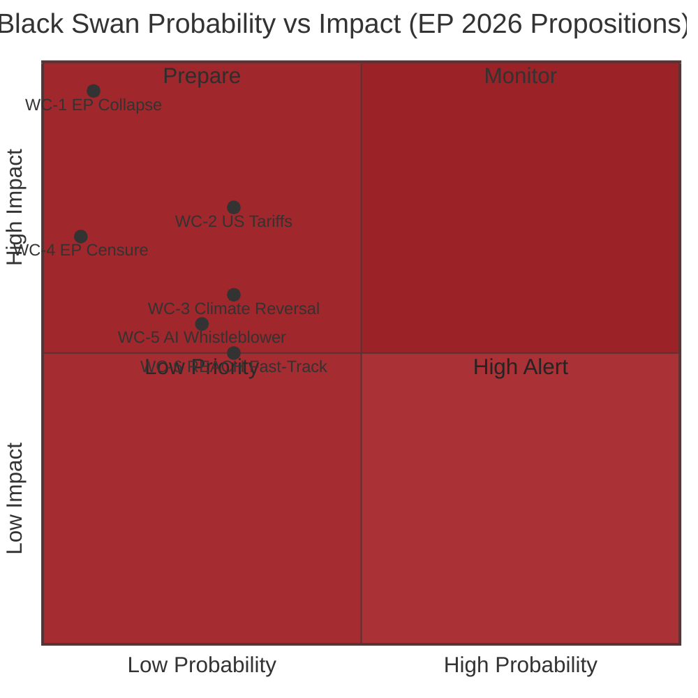

<!-- SPDX-FileCopyrightText: 2026 Hack23 AB -->
<!-- SPDX-License-Identifier: Apache-2.0 -->

# Wildcards and Black Swans — EU Parliament Propositions (2026-05-26)

**WEP Bands applied to all probability assessments**
**Admiralty Grade:** B2 – C3 (speculative scenarios inherently lower confidence)
**Confidence:** 🟡 MEDIUM for identification; 🔴 LOW for probability calibration (inherent in black swan analysis)

---

## 1. Methodology Note

Black swan analysis examines low-probability, high-impact events that conventional analysis systematically underestimates. Wildcard analysis covers medium-probability unexpected pivots. This artifact applies:
- **Pre-Mortem analysis** (imagining failure and working backwards)
- **Outside View** (base rates from analogous historical events)
- **Red Team thinking** (deliberately adversarial scenario construction)

*Important caveat:* By definition, the most damaging black swans cannot be fully anticipated. This analysis identifies the *knowable* tail risks; unknown unknowns are acknowledged but unspecifiable.

---

## 2. Black Swans (Very Low Probability, Catastrophic Impact)

### BS-1: Constitutional Crisis in the European Parliament

**Scenario:** A leaked document reveals that a systematic foreign intelligence operation (Russian GRU or Chinese MSS) has compromised multiple EP committee deliberations on EDIP/SAFE through MEP blackmail or false-flag information operations. The revelation triggers a formal EP resolution calling for an extraordinary session to review all security-sensitive legislative outcomes from the past 18 months.

**WEP Assessment:** It is *remote* (5–8%) that such an event reaches critical mass in 2026. The underlying intelligence operations are plausible (Belgium's VSSE has repeatedly warned about foreign influence in EU institutions). The specific discovery-and-disclosure chain that makes it a crisis is the low-probability element.

**Legislative impact:** EDIP/SAFE effectively frozen pending security review; Von der Leyen faces no-confidence motion; EU legislative calendar disrupted for 3–6 months.

**Why it's a black swan:** Current analytical consensus treats EP security as sufficient. Historically, institutional security breaches have been systematically underestimated until they become visible.

---

### BS-2: CJEU Annulment of AI Act Procedural Basis

**Scenario:** The European Court of Justice upholds an annulment challenge (filed by a coalition of AI companies and one member state) arguing that the AI Act was adopted with insufficient impact assessment for the high-risk classification provisions. The Court orders a partial annulment, requiring Commission to redo the impact assessment for Annex III (high-risk systems list). All implementing regulations are automatically suspended.

**WEP Assessment:** It is *very unlikely* (3–5%) that CJEU annuls the AI Act on procedural grounds. The Court has been increasingly deferential to EU legislators on complex technical regulation. However, precedent exists (the Court annulled parts of the Data Retention Directive on fundamental rights grounds).

**Legislative impact:** EU AI governance framework suspended for 18–36 months while Commission re-does impact assessment. Global AI governance leadership transferred to US/UK. EU AI startup ecosystem faces existential regulatory uncertainty.

---

### BS-3: Defence Integration Backlash — EU Treaty Revision Demand

**Scenario:** SAFE instrument passes with Article 122 legal basis, establishing €150bn in EU-backed defence loans. A coalition of smaller member states (Finland, Estonia, Ireland) argues this fundamentally alters the EU's constitutional balance — effectively creating a "EU defence debt" without treaty revision. They call for a Convention under Article 48 TEU to formally revise the Treaty to incorporate defence integration. This opens a Pandora's box of treaty revision demands from all directions.

**WEP Assessment:** It is *very unlikely* (4–6%) that a formal Article 48 Convention is triggered specifically by SAFE. However, the underlying treaty tension (EU constitution was not designed for defence integration at this scale) is *almost certainly* (90%+) real and will eventually require resolution.

**Why it's a black swan:** Virtually all current analysis assumes treaty revision is off the table for EP-10 timeframe. The triggering mechanism (legal basis challenge → treaty revision cascade) is unprecedented but not impossible.

---

## 3. Wildcards (Low-Medium Probability, High Impact)

### WC-1: Hungarian EDIP Veto Triggers Differentiated Integration

**Scenario:** Hungary (through its Fidesz-aligned Patriots bloc) assembles a Council blocking minority on EDIP. Rather than abandon the proposal, 23 member states invoke enhanced cooperation (Article 20 TEU) to proceed with EDIP without Hungary and Slovakia. This creates a two-speed EU defence architecture that sets precedent for enhanced cooperation in other domains.

**WEP Assessment:** It is *possible* (20–30%) that the EDIP enhanced cooperation pathway is seriously considered if Council QMV fails. Historical precedent: enhanced cooperation in tax (CCCTB), divorce law (Rome III), and the euro itself demonstrates the mechanism can work.

**Legislative impact:** EDIP proceeds faster (enhanced cooperation requires only participating state consent, not unanimity). But creates long-term EU institutional fracture — "defence EU" and "non-defence EU" tier.

---

### WC-2: US Tariff Escalation Triggers INTA Emergency Session

**Scenario:** The US announces 25% tariffs on EU automotive and pharmaceutical exports (not an implausible extension of existing US trade policy posture). INTA committee responds with an emergency session; EP calls for retaliatory EU tariff authorization. The legislative calendar is reorganized to accommodate trade legislation, crowding out EDIP and Omnibus I for one quarter.

**WEP Assessment:** It is *possible* (25–35%) that US-EU trade tensions escalate to this level in 2026. Base rate: major US-EU trade confrontations have occurred 3 times in 25 years (steel tariffs 2002, Airbus/Boeing WTO dispute 2010–2023, IRA subsidy dispute 2022–2024).

**Legislative impact:** Omnibus I delayed; INTA gains importance relative to ITRE; EU-US Trade Framework Agreement (2025/0089) becomes politically impossible to advance simultaneously with retaliation.

---

### WC-3: Climate Extreme Event Triggers Emergency Environmental Legislation

**Scenario:** A catastrophic climate event in 2026 (projected climate science suggests high probability of record European heat waves, flash floods, or agricultural failure) triggers political demand for emergency environmental legislation. Von der Leyen proposes an emergency Climate Resilience Regulation that bypasses normal legislative procedure (Article 122 again). This reverses the Omnibus I political momentum.

**WEP Assessment:** A major climate event affecting EU in 2026 is *likely* (60%+) based on climate science projections. That such an event would trigger a political reversal of Omnibus I is *possible* (25–35%) — depends on scale, media framing, and timing relative to Omnibus I vote.

**Legislative impact:** Omnibus I CSRD rollback provisions removed or postponed; new climate resilience legislation introduced (REACH revision accelerated for climate-critical chemicals).

---

### WC-4: EP Institutional Conflict — President's Role in SAFE

**Scenario:** EP President Roberta Metsola (EPP) is asked by Commission to facilitate a "joint inter-institutional agreement" on SAFE that implicitly accepts Article 122 legal basis. S&D and Greens accuse Metsola of compromising EP's institutional interests for EPP partisan benefit. A formal censure motion against the EP President is tabled — the first since Simone Veil's presidency. Constitutional crisis in EP institutional leadership.

**WEP Assessment:** *Very unlikely* (5–8%) that a formal censure motion reaches voting stage. But the underlying tension between EP President's dual role (parliamentary leader + EPP partisan) is *likely* to manifest in some form during the SAFE legal basis dispute.

**Legislative impact:** EP procedural paralysis for 4–8 weeks; all committee work delayed; significant reputational damage to EPP.

---

### WC-5: AI Act Whistleblower Leak — Commission Non-Compliance Revealed

**Scenario:** An AI Office whistleblower reveals that the Commission's own administrative systems are using AI tools that would qualify as "high-risk" under the AI Act but have not undergone conformity assessments. The Commission is in de facto non-compliance with legislation it proposed. This creates a political firestorm that delays implementing regulation adoption as Commission scrambles to remediate.

**WEP Assessment:** *Possible* (20–30%) that such a disclosure occurs. Large bureaucratic organizations regularly use technology ahead of formal compliance cycles; the Commission's own AI deployment in HR, document processing, and financial systems is not fully publicly disclosed.

**Legislative impact:** AI Act implementing regulation adoption accelerated but potentially compromised; public trust in EU AI governance framework damaged; AIDA committee calls emergency hearing.

---

### WC-6: REACH Revision Becomes Unexpected Emergency Priority

**Scenario:** A major chemical contamination incident (PFAS-related or industrial accident) affecting multiple EU member states creates political demand to fast-track the REACH revision's most restrictive provisions. ENVI committee rapporteur files emergency motion; EP-Council reach an extraordinary agreement to fast-track REACH update by Q1 2027.

**WEP Assessment:** A significant PFAS-related health discovery or industrial chemical incident in EU in 2026 is *possible* (25–35%). The regulatory and political pipeline for rapid REACH response is more robust than in the 2010s.

**Legislative impact:** REACH revision advances 12–18 months ahead of original schedule; chemical industry lobbying on REACH-CSRD interaction intensifies.

---

## 4. Wildcard Interaction Matrix

| Wildcard | If Combined With | Amplified Effect |
|----------|-----------------|-----------------|
| WC-1 (EDIP Enhanced Cooperation) + WC-2 (US Tariffs) | Two simultaneous crises | EU-US relationship fracture; EP focused on trade + defence; Omnibus I effectively dead |
| WC-3 (Climate Event) + WC-6 (REACH Emergency) | Both environmental triggers | Sustainability agenda resurgent; Omnibus I withdrawn; Von der Leyen pivots to climate narrative for 2029 election |
| BS-3 (Treaty Revision) + WC-4 (EP Institutional Conflict) | Constitutional crisis cascade | Entire legislative agenda frozen; extraordinary EU summit convened |

---

## 5. WEP Summary Table

| Event | WEP Band | Probability | Impact Level |
|-------|---------|-------------|-------------|
| BS-1: Foreign Intelligence Compromise | Remote | 5–8% | Catastrophic |
| BS-2: CJEU AI Act Annulment | Very Unlikely | 3–5% | Very High |
| BS-3: Treaty Revision Demand | Very Unlikely | 4–6% | Very High |
| WC-1: EDIP Enhanced Cooperation | Possible | 20–30% | High |
| WC-2: US Tariff Escalation | Possible | 25–35% | High |
| WC-3: Climate Event Political Reversal | Possible | 25–35% | High |
| WC-4: EP President Censure | Very Unlikely | 5–8% | High |
| WC-5: AI Whistleblower | Possible | 20–30% | Medium-High |
| WC-6: REACH Emergency Fast-Track | Possible | 25–35% | Medium-High |

## 7. Black Swan Probability Map

**Wildcard monitoring note:** The three highest-impact wildcards (WC-1, WC-4, WC-2) are mutually reinforcing — a US tariff shock that damages European economies creates political conditions favourable to far-right gains, which creates EP censure scenarios.
