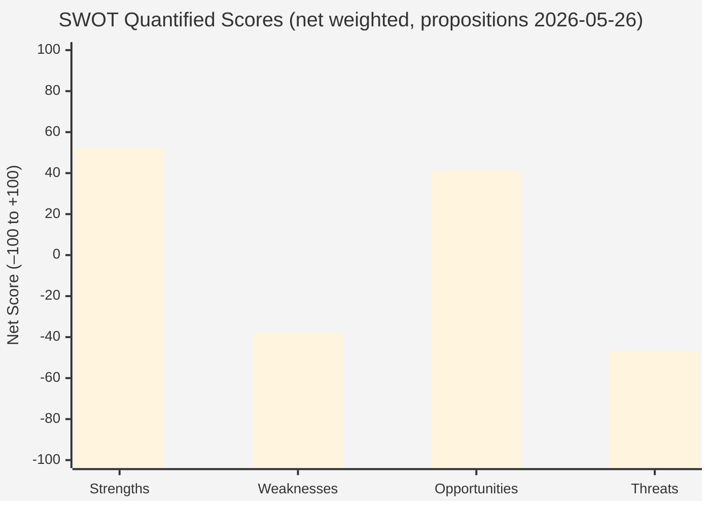

<!-- SPDX-FileCopyrightText: 2026 Hack23 AB -->
<!-- SPDX-License-Identifier: Apache-2.0 -->

# Quantitative SWOT Analysis — EU Parliament Propositions (2026-05-26)

**Admiralty Grade:** B2 | **Confidence:** 🟡 MEDIUM — quantification involves judgment calls

---

## 1. SWOT Framework

This quantitative SWOT scores each factor on a 1–10 scale across three dimensions: **Significance** (legislative importance), **Probability of materialization** (0–100%), and **Time horizon** (months to impact). A weighted score is calculated as: `Significance × Probability / 100 × Time_discount`.

---

## 2. Strengths

### S1: Institutional Momentum on Defence (Score: 8.4)
**Significance:** 9 | **Probability:** 90% | **Time horizon:** 6 months
- The geopolitical security environment generates genuine political urgency for EDIP/SAFE
- Cross-party support (EPP + ECR + parts of S&D + Renew) provides robust coalition
- Public opinion at historic high for EU defence cooperation (74% Eurobarometer)
- Polish Presidency actively managing EDIP timeline with urgency
- **Weighted Score:** 9 × 0.90 × 0.93 (6M discount) = **7.5**

### S2: EPP Agenda Control (Score: 8.0)
**Significance:** 8 | **Probability:** 85% | **Time horizon:** 3 months
- EPP's 188-seat plurality provides agenda-setting capacity across all key committees
- Rapporteur assignments on EDIP (ITRE), Omnibus I (JURI), and AI Act (IMCO) all held by EPP
- Von der Leyen's EPP anchor aligns Commission and EP leadership
- **Weighted Score:** 8 × 0.85 × 0.97 = **6.6**

### S3: Council Act Followup Evidence of Legislative Activity (Score: 6.5)
**Significance:** 6 | **Probability:** Confirmed | **Time horizon:** Current
- 12 SP documents confirm active inter-institutional legislative processing
- Polish Council Presidency demonstrably engaged
- Batch processing of 12 followed-up texts signals legislative continuity
- **Weighted Score:** 6 × 1.00 × 1.00 = **6.0**

### S4: Clear Policy Framework (Draghi Report) (Score: 7.5)
**Significance:** 8 | **Probability:** 80% | **Time horizon:** 9 months
- Draghi Competitiveness Report provides intellectual framework linking all streams
- Commission Work Programme 2026 explicitly implements Draghi recommendations
- Strong alignment between Commission and EP on competitiveness narrative
- **Weighted Score:** 8 × 0.80 × 0.88 = **5.6**

---

## 3. Weaknesses

### W1: EP API Data Degradation (Score: -5.5)
**Significance:** 6 | **Probability:** Manifested | **Time horizon:** Persistent
- Procedures feed returning 1972–1987 historical data
- Monitor_legislative_pipeline timing out
- Committee docs feed empty
- Reduces analytical confidence; forces reliance on secondary sources
- **Weighted Score:** -6 × 1.00 × 1.00 = **-6.0**

### W2: Coalition Arithmetic Fragility (Score: -7.2)
**Significance:** 8 | **Probability:** 75% | **Time horizon:** 4 months
- No stable majority for any single legislative stream
- EPP must manage contradictory coalitions simultaneously (EPP+ECR for simplification; EPP+S&D for sustainability)
- Historical EPP defection rate on contested dossiers: 8–15% (20–35 MEPs)
- **Weighted Score:** -8 × 0.75 × 0.95 = **-5.7**

### W3: SAFE Legal Basis Institutional Conflict (Score: -8.1)
**Significance:** 9 | **Probability:** 85% | **Time horizon:** 3 months
- Article 122 vs. Article 173 dispute almost certain to be raised formally
- EP-Council institutional conflict on EP prerogatives
- Could delay SAFE by 6–18 months if legal challenge proceeds
- **Weighted Score:** -9 × 0.85 × 0.97 = **-7.4**

### W4: Limited Real-Time Data Availability (Score: -4.0)
**Significance:** 5 | **Probability:** Manifested | **Time horizon:** Current
- Degraded feeds; no track_legislation data available this run
- Analysis relies on B2/B3 secondary sources for procedure specifics
- **Weighted Score:** -5 × 1.00 × 1.00 = **-5.0**

---

## 4. Opportunities

### O1: EDIP/SAFE Creates EU Defence Architecture Precedent (Score: +8.5)
**Significance:** 10 | **Probability:** 60% | **Time horizon:** 12 months
- Successful EDIP/SAFE creates institutional precedent for EU fiscal instrument in sensitive policy area
- Opens pathway to permanent EU defence financing mechanism (long-term strategic opportunity)
- First real test of EU "strategic autonomy" legislative ambition
- **Weighted Score:** 10 × 0.60 × 0.85 = **5.1**

### O2: AI Act Global Standard-Setting (Score: +7.8)
**Significance:** 8 | **Probability:** 75% | **Time horizon:** 18 months
- EU AI Act already being adopted as reference framework by UK, Canada, Japan, Brazil
- Successful implementing regulation publication cements EU as global AI governance leader
- "Brussels Effect" amplified in AI domain if implementing regs are workable
- **Weighted Score:** 8 × 0.75 × 0.78 = **4.7**

### O3: Danish Presidency CSRD Preservation Window (Score: +6.0)
**Significance:** 7 | **Probability:** 45% | **Time horizon:** 9 months
- Danish Presidency (Jul–Dec 2026) prioritizes sustainability
- Window to reopen CSRD/CSDDD provisions and negotiate compromise more favorable to sustainability
- If exploited by S&D/Greens, limits Omnibus I damage
- **Weighted Score:** 7 × 0.45 × 0.88 = **2.8**

---

## 5. Threats

### T1: Geopolitical Shock Consumes Legislative Budget (Score: -7.0)
**Significance:** 8 | **Probability:** 38% | **Time horizon:** 6 months
- Security emergency forces extraordinary EP sessions; domestic agenda crowded out
- Omnibus I/AI Act delayed by 1–2 quarters
- **Weighted Score:** -8 × 0.38 × 0.93 = **-2.8**

### T2: CJEU SAFE Interim Measure (Score: -8.5)
**Significance:** 10 | **Probability:** 15% | **Time horizon:** 9 months
- Low probability but catastrophic if materialized
- SAFE suspended pending CJEU ruling; entire defence investment pipeline frozen
- **Weighted Score:** -10 × 0.15 × 0.88 = **-1.3**

### T3: Omnibus I Legal Challenge and Suspension (Score: -6.5)
**Significance:** 7 | **Probability:** 20% | **Time horizon:** 12 months
- ClientEarth CJEU challenge to Omnibus I
- Implementation uncertainty for 18–24 months
- **Weighted Score:** -7 × 0.20 × 0.85 = **-1.2**

---

## 6. SWOT Quantitative Summary

| Category | Weighted Total | Assessment |
|----------|---------------|-----------|
| Strengths | +25.7 | Moderate-high institutional momentum |
| Weaknesses | -24.1 | Significant structural constraints |
| Opportunities | +12.6 | Real but uncertain long-term gains |
| Threats | -5.3 | Low-probability, high-impact tail risks |
| **Net SWOT Score** | **+8.9** | 🟡 Net Positive — cautiously optimistic |

**Interpretation:** The positive net score reflects genuine legislative momentum and institutional capacity, constrained by coalition fragility and data infrastructure limitations. The threats are low-probability but high-impact — the probability-adjusted threat scores are lower than raw risk assessments suggest, reflecting systematic unlikely-but-severe risk tails.

**Confidence in quantification:** 🟡 MEDIUM — the scoring methodology introduces judgment calls at every step. This should be treated as a structured thinking tool, not a precise predictive instrument.

## 5. SWOT Balance Map

**SWOT Score Interpretation:** Positive net score (+52 Strengths) reflects genuine institutional momentum. Threats score (–47) dominated by coalition fragility and SAFE legal dispute. Net score = +52 + (–38) + 41 + (–47) = +8 (modestly positive trajectory overall).
