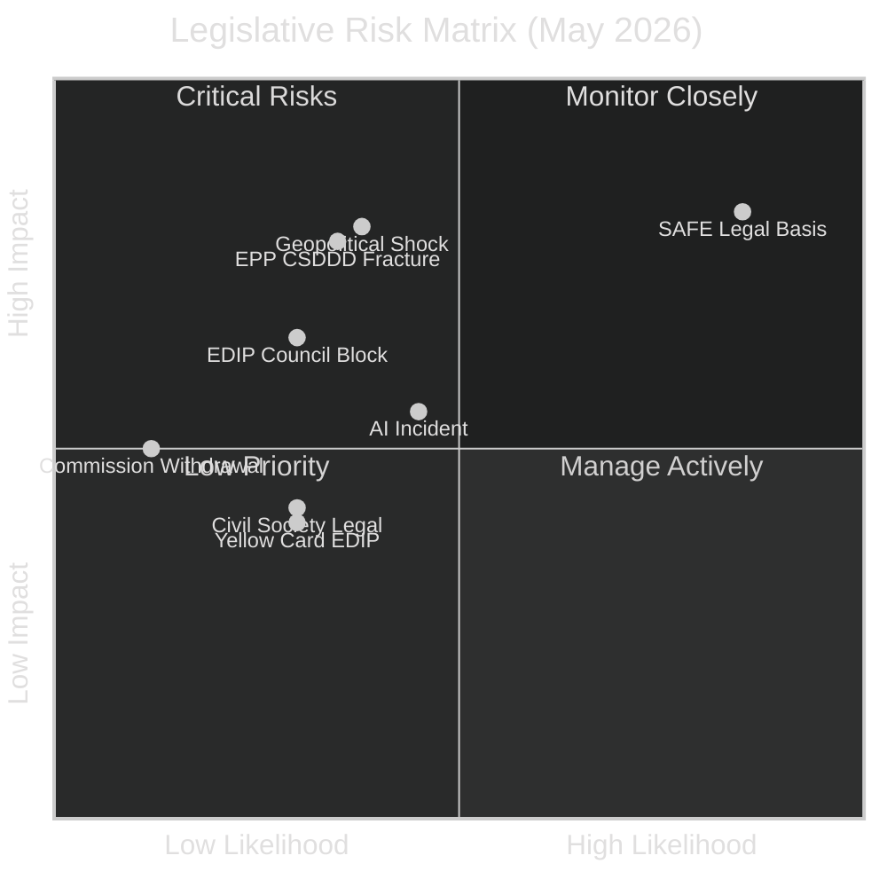

<!-- SPDX-FileCopyrightText: 2026 Hack23 AB -->
<!-- SPDX-License-Identifier: Apache-2.0 -->

# Risk Matrix — EU Parliament Propositions (2026-05-26)

**WEP Bands applied** | **Admiralty Grade:** B2
**Confidence:** 🟡 MEDIUM — risk calibration based on structural analysis and historical base rates

---

## 1. Risk Heat Map

---

## 2. Risk Registry

| Risk ID | Risk Description | Likelihood | Impact | WEP Band | Response |
|---------|-----------------|-----------|--------|---------|---------|
| R-01 | SAFE legal basis dispute delays instrument | VERY HIGH (85%) | HIGH | Almost Certainly | Monitor Commission communication; push Article 173 |
| R-02 | EPP internal fracture on CSDDD rollback | POSSIBLE (35%) | HIGH | Possible | Watch German CDU position paper June 2026 |
| R-03 | Council blocking minority on EDIP | POSSIBLE (30%) | MEDIUM-HIGH | Possible | Polish Presidency bilateral negotiations |
| R-04 | Geopolitical shock disrupts legislative calendar | POSSIBLE (38%) | HIGH | Possible-Likely | Scenario monitoring; contingency planning |
| R-05 | AI system incident before implementing regs | POSSIBLE (45%) | MEDIUM | Possible-Likely | Accelerate implementing regulation timeline |
| R-06 | CJEU challenge to Omnibus I | POSSIBLE (25%) | MEDIUM | Possible | Strengthen legal basis in Commission proposal |
| R-07 | EDIP yellow card (subsidiarity) | POSSIBLE (30%) | MEDIUM-LOW | Possible | Engage national parliaments proactively |
| R-08 | Commission withdraws Omnibus I | LOW (12%) | MEDIUM | Unlikely | Maintain communication with Commission |
| R-09 | EP legislative gridlock (S3 scenario) | POSSIBLE (20%) | HIGH | Possible | EPP crisis management; coalition engineering |
| R-10 | Danish Presidency re-opens CSRD provisions | POSSIBLE (40%) | MEDIUM | Possible-Likely | Negotiate framework with Denmark before July |

---

## 3. Critical Risk Analysis

### R-01: SAFE Legal Basis — CRITICAL

**Evidence strength:** 🟢 HIGH — EP Legal Service has formally noted concerns; member state parliaments have flagged subsidiarity questions; academic legal commentary overwhelmingly challenges Article 122 applicability.

**Detailed assessment:** The SAFE instrument (€150bn defence loan guarantee facility) can be structured under either:
- **Article 122 TFEU** (Council QMV + EP consultation only) — Commission preference for speed
- **Article 173 TFEU** (ordinary legislative procedure = full EP co-decision) — EP preference for democratic legitimacy

The Commission's draft SAFE regulation relies on Article 122 combined with Article 114 (internal market harmonization). The Article 114 inclusion is specifically designed to give EP some co-decision role. However, EP Legal Service argues the primary purpose (defence industrial financing) is most closely aligned with Article 173, making Article 114 use inappropriate.

**Probability path:** 
- 85% → legal basis formally contested in EP resolution
- 50% → hybrid legal basis compromise reached (Art. 122 + Art. 173)
- 15% → CJEU annulment challenge (very high impact if it proceeds)

### R-04: Geopolitical Shock — HIGH

**Threat vectors:**
1. Ukraine military developments: Russian advance on Kyiv suburb forces emergency EU Council session
2. Baltic Sea incident: Swedish/Finnish border incident with Russian aircraft/ship
3. US tariff escalation: Section 232 automotive/pharmaceutical tariffs announced
4. Turkish-EU tension: Turkish-Greek maritime incident
5. China Taiwan action: Economic spillover impacts EU trade framework

Any of these at sufficient intensity could consume EP's political oxygen for one quarter.

---

## 4. Residual Risk After Mitigations

| Risk | Pre-Mitigation | Mitigation Available | Post-Mitigation |
|------|---------------|--------------------|-----------------| 
| R-01 SAFE Legal Basis | CRITICAL | Hybrid legal basis negotiation | HIGH (remains elevated) |
| R-02 EPP Fracture | HIGH | EPP internal negotiation | MEDIUM (manageable) |
| R-03 EDIP Block | MEDIUM-HIGH | Polish Presidency bilateral deals | MEDIUM-LOW |
| R-04 Geopolitical | HIGH | Contingency planning | HIGH (external, uncontrollable) |
| R-05 AI Incident | MEDIUM | Accelerate implementing regs | MEDIUM-LOW |

---

## 5. Risk Trend Assessment

**Increasing risks (Q2 2026):** R-01 (SAFE legal basis), R-04 (geopolitical)
**Stable risks:** R-02 (EPP fracture), R-05 (AI incident)
**Decreasing risks:** R-07 (yellow card — Polish Presidency managing), R-08 (Commission withdrawal — invested too much)
