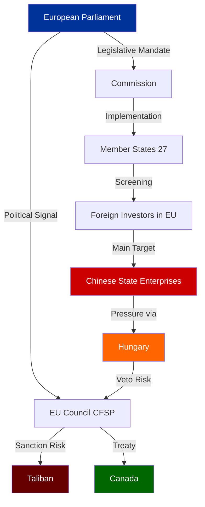
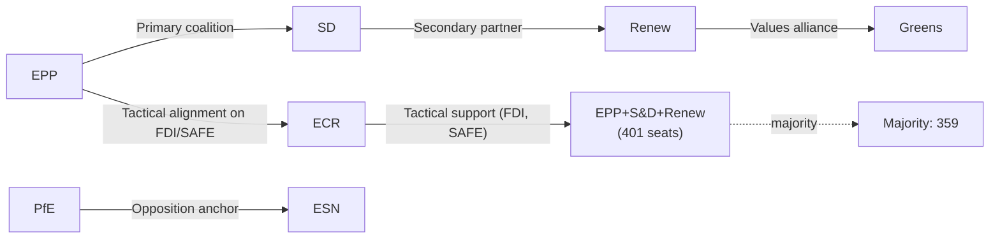

# Actor Mapping — Breaking News, 2026-05-27

**SATs Applied**: Network Analysis, Role Mapping

---

## Actor Map: EU FDI Screening & Strategic Autonomy Legislation

### PRIMARY ACTORS (Decision-Makers)

**1. European Parliament Plenary**
- Role: Legislative principal; adopted all five items
- Voting bloc: EPP (188) + S&D (136) + Renew (77) = estimated 401 core votes; supplemented by ECR selective alignment
- Influence level: DECISIVE on adoption; limited on implementation
- Next action: Monitoring implementation; potential own-initiative reports

**2. European Commission (DG Trade, DG DEFIS)**
- Role: Implementation authority; delegated act author for FDI screening; Commission party to SAFE bilateral agreements
- Influence level: DECISIVE on implementation quality
- Key actors: Commissioner for Trade, Commissioner for Defence Industry and Space
- Next action: Publishing FDI screening guidelines within 90 days; SAFE implementing regulations

**3. Council of the EU (COREPER II, Economic Policy Committee)**
- Role: Co-legislator (FDI screening already Council-agreed); executive authority on SAFE and Afghanistan sanctions
- Influence level: HIGH — controls Annex I/II updates to FDI screening list; controls whether Afghanistan resolution triggers sanctions action
- Next action: FDI screening entry into force coordination; potential Afghanistan targeted measures review

---

### SECONDARY ACTORS (Influencers/Implementers)

**4. Member State Governments (Security-Sensitive)**
- Germany: Largest inward FDI recipient; mandatory screening creates compliance burden but provides political cover for blocking sensitive Chinese transactions
- France: Strong supporter; seeks EU-level backup for FIRFI national screening
- Sweden: Currently has screening legislation but will require coordination upgrade
- Poland: High interest in FDI screening for defence sector
- Hungary: RISK actor — potential obstruction of Council action on FDI screening secondary legislation; historical pattern of protecting Chinese investments

**5. Canadian Government (Global Affairs Canada)**
- Role: Bilateral SAFE partner; primary beneficiary of TA-10-2026-0180
- Interest: Market access for Canadian defence companies; strategic alignment with EU defence industrial base
- Next action: Ratification of bilateral agreement; implementing regulations

**6. Taliban Government (de facto authority, Afghanistan)**
- Role: Subject of TA-10-2026-0186 — will face increased pressure if Council acts on EP mandate
- Response capacity: Limited formal leverage; informal leverage through migration flows, counterterrorism cooperation requests, resource access
- *WEP 75%: Taliban will characterise EP resolution as illegitimate interference*

---

### TERTIARY ACTORS (Affected Parties)

**7. Chinese Government (MOFCOM, NDRC)**
- Role: Primary subject of FDI screening concerns; secondary subject of AI/trade strategy
- Interest: Maintaining market access; avoiding formal designation
- Likely response: Diplomatic protests; potential trade retaliation; seeking bilateral exceptions with weaker member states
- *WEP 65%: Some form of formal diplomatic response within 30 days*

**8. European Defence Industry (AeroSpace & Defence Industries Association, etc.)**
- Interest: SAFE expansion opportunities; SAFE Instrument inclusion of Canada increases competition but expands market
- Net assessment: Complex — EU companies benefit from expanded procurement pool but face more competition for specific contracts

**9. Steel Industry (EUROFER, national steel associations)**
- Interest: Resolution adoption is positive signal; actual safeguard measures remain delayed
- Next action: Lobbying Commission for rapid safeguard proceeding under WTO Article XIX

**10. Afghan Women's Rights Organizations (RAWA, Afghan Women's Network, etc.)**
- Interest: EP resolution provides international advocacy platform and potential leverage on ICC/ICJ proceedings
- *WEP 55%: Some formal engagement with EP committee on follow-up*

---

## Actor Network Diagram

```
EU Council ←→ European Commission ←→ European Parliament
     ↓                ↓                      ↓
Member States    Implementation          Political Mandate
     ↓                ↓
 [Hungary-risk]  Guidelines/Rules
                      ↓
              Third Countries: Canada (+), China (-), Taliban (-)
```

---

## Cross-References

- `intelligence/stakeholder-map.md` for stakeholder perspectives
- `intelligence/coalition-dynamics.md` for voting bloc analysis
- `intelligence/threat-model.md` for threat actor profiles

---

## Actor Influence Diagram



## Actor Roster

| Actor | Type | Role | Influence Level |
|-------|------|------|----------------|
| European Parliament | EU Institution | Legislature | DECISIVE on adoption |
| European Commission | EU Institution | Implementer | DECISIVE on execution |
| EU Council | EU Institution | Co-legislator + CFSP | HIGH on implementation |
| Member States | National | Implementers | CRITICAL for FDI |
| Hungary | National | Obstructionist | HIGH blocking capacity |
| Canada | Third Country | SAFE partner | MEDIUM (bilateral) |
| China | Third Country | Primary subject | HIGH (external pressure) |
| Taliban | Non-state actor | Resolution subject | LOW (indirect) |
| Steel unions | Civil society | Advocacy | MEDIUM |
| Afghan NGOs | Civil society | Advocacy | LOW-MEDIUM |

## Influence Network Analysis

**Central actors by influence**: Commission (highest implementation power), Council (CFSP control), Member States (implementation mandate)

**Blocking actors**: Hungary (CFSP veto, comitology votes), China (economic pressure on member states)

**Alliance structures**: EPP-S&D-Renew = pro-autonomy bloc; Patriots-ESN = resistance bloc

## Power Brokers

**Key brokers** (actors who can shift outcomes):
1. German government — can pressure Commission on FDI implementing acts
2. European Commission DG Trade — determines actual scope of FDI screening guidance
3. ICJ Presidency — if they pursue gender apartheid advisory opinion formally, changes Taliban calculus

## Information Environment

Key information flows:
- Commission → Member states: FDI screening guidance (T+90 days)
- Council → Taliban: Diplomatic demarches (post-resolution)
- EP → Civil society: Political mandate signal (immediate)

## Reader Briefing

**What this means**: The actors who will determine whether this legislation actually works are not the MEPs who voted for it, but the Commission officials who write the implementing rules, the member state bureaucrats who create screening authorities, and the Council diplomats who decide whether to follow through on the Afghanistan mandate.

---

## Alliance Map



**Alliance summary**:
- **Core coalition** (EPP + S&D + Renew): 401 seats — primary legislative vehicle for all strategic autonomy legislation in EP10
- **Extended coalition** (EPP + S&D + Renew + ECR): 479 seats — includes ECR on security/economic sovereignty issues; excludes ECR on social and rule of law
- **Values coalition** (EPP + S&D + Renew + Greens): 454 seats — used for human rights resolutions; Greens may split on defence spending
- **Opposition bloc** (PfE + ESN): 109 seats — can coordinate to delay but not block

**Alliance stability**: 🟢 HIGH for the core coalition on strategic autonomy issues. The EPP has been the indispensable centre — without EPP, no majority is achievable from either direction.

