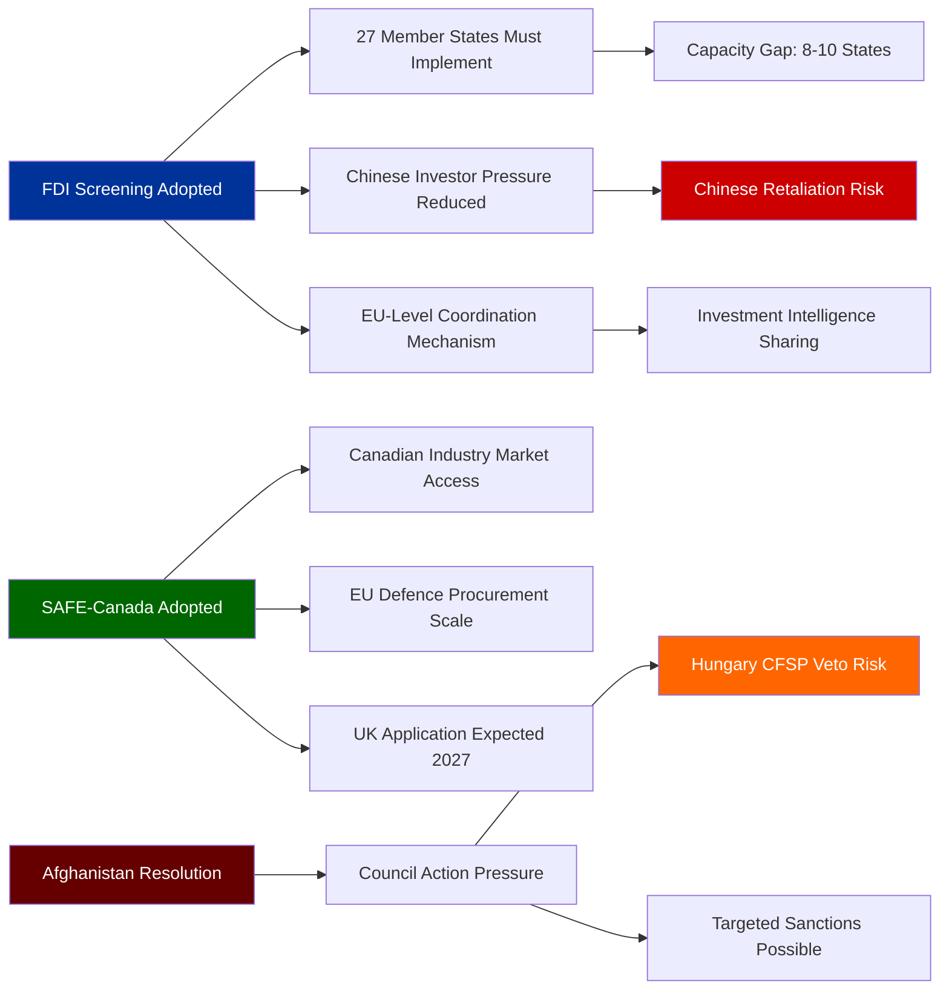

# Impact Matrix — Breaking News, 2026-05-27

**Framework**: Stakeholder × Issue Impact Matrix
**SATs Applied**: Matrix Analysis, Systems Thinking

---

## Methodology

For each adopted item, this matrix assesses impact on key stakeholder groups across three dimensions:
- **Economic Impact** (E): 1–5 scale; 5 = largest economic disruption
- **Political Impact** (P): 1–5 scale; 5 = most politically significant
- **Security Impact** (S): 1–5 scale; 5 = most direct security implications

---

## Impact Matrix

### TA-10-2026-0171: FDI Screening Regulation

| Stakeholder | E | P | S | Net | Key Channel |
|-------------|---|---|---|-----|-------------|
| EU member states | 4 | 4 | 5 | 13 | Mandatory implementation; coordination burden |
| Chinese investors in EU | 5 | 3 | 3 | 11 | Increased screening friction; some deals blocked |
| EU technology companies | 3 | 2 | 4 | 9 | Access to security-sensitive sectors may be complicated |
| Allied-country investors (US, UK, Canada) | 2 | 2 | 3 | 7 | Expedited track available; some complexity increase |
| EU defence sector | 2 | 3 | 5 | 10 | Enhanced protection from foreign acquisition attempts |
| Hungary | 2 | 5 | 2 | 9 | Implementation conflict risk; sovereignty objection |
| Commission (DG Trade, DG DEFIS) | 2 | 4 | 4 | 10 | New administrative burden; new powers |

### TA-10-2026-0186: Afghanistan/Taliban Women's Rights

| Stakeholder | E | P | S | Net | Key Channel |
|-------------|---|---|---|-----|-------------|
| Afghan women | 1 | 5 | 3 | 9 | Political pressure; potential sanctions relief or escalation |
| Taliban government | 2 | 5 | 3 | 10 | Diplomatic isolation risk; sanctions escalation risk |
| EU Council (CFSP) | 1 | 4 | 2 | 7 | Political mandate for sanctions escalation |
| EU humanitarian NGOs | 2 | 3 | 2 | 7 | May gain increased mandate/funding for Afghanistan programs |
| Pakistan/Iran (neighbours) | 1 | 3 | 3 | 7 | Refugee flows; potential secondary sanctions effects |

### TA-10-2026-0180: EU–Canada SAFE Instrument

| Stakeholder | E | P | S | Net | Key Channel |
|-------------|---|---|---|-----|-------------|
| Canadian defence industry | 5 | 3 | 3 | 11 | Market access to €30B+ EU procurement |
| EU defence companies | 4 | 3 | 4 | 11 | Increased competition; specialisation pressure |
| NATO (HQ) | 2 | 4 | 5 | 11 | Interoperability improvement; industrial base integration |
| US defence industry | 4 | 3 | 3 | 10 | Competitive displacement risk for some contract categories |
| EU Council | 1 | 4 | 4 | 9 | Diplomatic success; SAFE expansion validation |

### TA-10-2026-0183: AI Trade Strategy

| Stakeholder | E | P | S | Net | Key Channel |
|-------------|---|---|---|-----|-------------|
| EU AI companies | 4 | 3 | 2 | 9 | Better trade negotiating mandate; reduced double standards risk |
| US AI companies | 3 | 3 | 2 | 8 | Potential market access barriers if EU-US AI standards diverge |
| Chinese AI companies | 4 | 3 | 3 | 10 | Strong restriction signal; expected to complicate market access |
| Commission DG Trade | 2 | 4 | 2 | 8 | Negotiating mandate strengthened |

### TA-10-2026-0170: Steel Overcapacity

| Stakeholder | E | P | S | Net | Key Channel |
|-------------|---|---|---|-----|-------------|
| EU steel workers | 5 | 3 | 1 | 9 | No immediate job protection; timeline gap is critical |
| EU steel companies | 4 | 3 | 1 | 8 | Safeguard prospect; delayed implementation still helps market pricing |
| Chinese steel exporters | 4 | 3 | 2 | 9 | Likely target of safeguard measures; market share threat |
| Downstream EU industries (auto, construction) | 3 | 2 | 1 | 6 | Potential steel price increase from safeguards; mixed |

---

## Aggregate Stakeholder Impact Rankings

| Stakeholder | Total Across All Items | Significance Level |
|-------------|----------------------|-------------------|
| EU member states | 13 (FDI alone) | **VERY HIGH** |
| Taliban government | 10 | HIGH |
| Canadian defence industry | 11 | HIGH |
| Chinese actors (all sectors) | ~29 across all items | **VERY HIGH** |
| Commission | ~18 across all items | HIGH |
| EU defence sector | ~21 across FDI+SAFE | HIGH |
| EU steel workers | 9 (steel + indirect) | MEDIUM-HIGH |
| Afghan women | 9 | HIGH (concentrated) |

---

## Key Finding

**China is the implicit common thread across four of five adopted items**: FDI screening (controls Chinese investment), AI trade strategy (restricts Chinese AI market access), steel safeguards (targets Chinese overcapacity), and SAFE Instrument (strengthens EU-allied defence capacity relative to Chinese military capabilities). This is the single most important analytical insight from the May 19–21 session.

---

## Cross-References

- `intelligence/significance-scoring.md` for numeric significance scores
- `intelligence/stakeholder-map.md` for stakeholder perspectives
- `classification/actor-mapping.md` for actor network

---

## Impact Cascade Diagram

## Event List (Legislative Items and Expected Follow-On Events)

| Source Event | Follow-On Event | Timeline | Probability |
|-------------|----------------|---------|------------|
| FDI Regulation adopted | Commission publishes guidance | T+90 days | 80% |
| FDI Regulation adopted | First Chinese WTO complaint | T+90 days | 20% |
| SAFE-Canada adopted | Council formal adoption | T+30 days | 95% |
| SAFE-Canada in force | First joint contract negotiations | T+12 months | 60% |
| Afghanistan resolution | Council CFSP agenda item | T+30 days | 50% |
| Afghanistan resolution | New targeted sanctions | T+90 days | 25% |
| Steel resolution | Commission investigation initiation | T+60 days | 75% |
| Steel resolution | Provisional safeguard measures | T+7 months | 50% |

## Heat Assessment

**Highest heat items** (most immediate follow-on action):
1. Commission FDI guidance (90-day deadline creates urgency)
2. Council CFSP Afghanistan scheduling (political pressure immediate)
3. Steel investigation initiation (industry pressure immediate)

## Cascade Effects

**FDI screening cascade**: Most complex cascade — triggers 27 parallel national implementations + Commission coordination + Chinese response + possible G7 coordination.

**SAFE cascade**: Relatively simple cascade — bilateral ratification → implementation → expansion discussions.

**Afghanistan cascade**: High political significance but action-blocked by CFSP unanimity; cascade truncated by Hungary veto risk.

## Reader Briefing

**What this means**: The legislation adopted this week will set off chains of events over the next 12–24 months. The most consequential chain starts with FDI screening — if the Commission gets the implementation right, this becomes a lasting shift in how Europe protects its strategic industries. If implementation is weak, it becomes another paper exercise.

