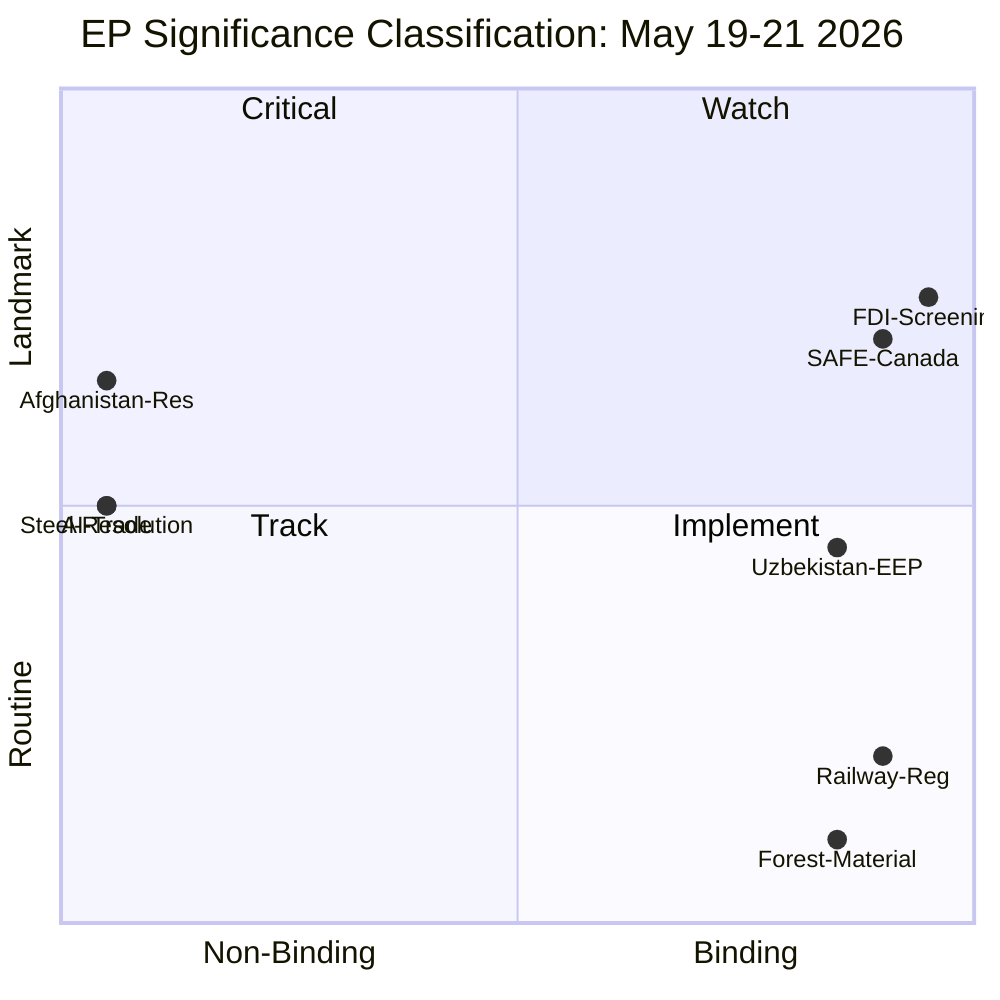

# Significance Classification — Breaking News, 2026-05-27

**SATs Applied**: Key Assumptions Check, ACH

---

## Classification Methodology

Each EP action is classified on a five-level scale:
- **TIER 1 — LANDMARK**: Rare, generation-defining legislation (EU treaties, foundational regulations)
- **TIER 2 — MAJOR**: Significant legislative development; binding; materially changes the EU legal landscape
- **TIER 3 — IMPORTANT**: Notable development; may be binding or non-binding; substantive political signal
- **TIER 4 — ROUTINE**: Standard legislative business; confirms existing policy direction
- **TIER 5 — ADMINISTRATIVE**: Technical/housekeeping; no material policy change

---

## Classifications: May 19–21, 2026

| Reference | Title (abbreviated) | Classification | Rationale |
|-----------|--------------------|----|-----------|
| TA-10-2026-0171 | FDI Screening Regulation | **TIER 2 — MAJOR** | First mandatory EU-wide FDI screening; binding regulation; significant expansion of EU economic security architecture |
| TA-10-2026-0186 | Afghanistan/Taliban women's rights | **TIER 3 — IMPORTANT** | Strongest EP Afghanistan resolution since 2021; provides Council mandate for sanctions escalation; operationally significant given ICJ advisory opinion |
| TA-10-2026-0180 | EU–Canada SAFE Instrument | **TIER 2 — MAJOR** | First third-country association with SAFE; sets binding precedent for allied defence procurement integration |
| TA-10-2026-0183 | AI Strategy for EU Trade | **TIER 3 — IMPORTANT** | Non-binding but provides legislative mandate for Commission trade negotiators on AI chapters |
| TA-10-2026-0170 | Steel overcapacity | **TIER 3 — IMPORTANT** | Non-binding resolution but provides mandate for Commission safeguard action; industry significance HIGH |
| TA-10-2026-0174/0173 | EU–Uzbekistan Partnership | **TIER 3 — IMPORTANT** | First Central Asian enhanced partnership ratification in EP10; strategic significance |
| TA-10-2026-0169 | Single European railway area | **TIER 4 — ROUTINE** | Technical regulation on infrastructure capacity management |
| TA-10-2026-0168 | Forest reproductive material | **TIER 4 — ROUTINE** | Sectoral regulation update |
| TA-10-2026-0164/0166 | Immunity waivers (Vilimsky/Pappas) | **TIER 5 — ADMINISTRATIVE** | Individual MEP immunity decisions; no broader policy significance |

---

## Session Overall Classification

**May 19–21, 2026 part-session**: **TIER 2 — MAJOR**
- Two TIER 2 items in one session is unusual; typical sessions produce 0–1 TIER 2 items
- The combination of FDI screening (TIER 2), SAFE Instrument (TIER 2), and three TIER 3 items represents an exceptionally high-significance session
- Comparable in significance to the March 2024 session that adopted the EU AI Act

---

## Breaking News Article Angle

Primary angle: **TIER 2 legislation adopted** — FDI Screening and SAFE Instrument are the substantive news story for policy audiences.
Secondary angle: **TIER 3 human interest** — Afghanistan women's rights resolution is the narrative hook for general audiences.

**Recommended editorial structure**: Lead with Afghanistan (human narrative + immediacy), contextualise with FDI screening (structural significance), integrate SAFE and AI strategy as strategic context, use steel as domestic/worker angle.

---

## Cross-References

- `intelligence/significance-scoring.md` for numeric scoring
- `documents/document-analysis-index.md` for document-level analysis

---

## Significance Diagram

## Reader Briefing

**What this means**: Of the legislation adopted this week, FDI Screening and the EU-Canada defence deal are the most significant because they create new binding rules that will affect real investment decisions. The Afghanistan and AI trade resolutions are important political signals but don't legally bind anyone. For citizens, the FDI screening is the most consequential long-term development.

