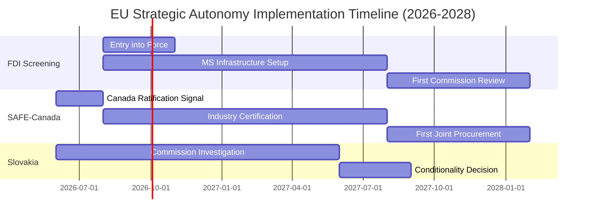

# Implementation Feasibility Analysis — Breaking News, 2026-05-27

**Framework**: Implementation Analysis (regulatory feasibility + political economy)
**SATs Applied**: Complexity Assessment, Stakeholder Analysis

---

## FDI Screening Regulation: Implementation Feasibility

### Technical Feasibility: MEDIUM-HIGH

**Required infrastructure**:
- National screening authorities in all 27 member states (some exist; 8–10 must be created)
- Secure information sharing mechanism for cross-border investment intelligence
- Coordination committee operational procedures and workflows
- Sector-specific expertise: nuclear, AI, quantum, defence, critical infrastructure

**Timeline challenges**:
- Creating a functional screening authority from scratch: 18–24 months
- Training investigators in complex investment structures: 12+ months
- Building secure information sharing systems: 12–18 months

**Assessment**: States with existing screening frameworks (France, Germany, Italy, Spain, Netherlands, Sweden, Finland, Austria) can implement relatively quickly (6–12 months). States without frameworks face genuine institutional challenges. The 24-month transposition window is tight but achievable with political will.

### Political Economy Feasibility: MEDIUM

**Drivers**:
- Strong political consensus in EP and majority of Council
- Commission has implementation mandate and DG Trade capacity
- Member states are under strategic pressure to demonstrate economic security capacity

**Constraints**:
- Germany/Netherlands face industry lobbying from automotive and chemicals sectors with significant China exposure
- Comitology implementing acts require QMV; Hungary can delay but not ultimately block
- Legal challenges from Chinese state-owned enterprises likely; judicial uncertainty period

**Probability of substantive implementation within 36 months**: *WEP 70%*

---

## SAFE Instrument — EU-Canada: Implementation Feasibility

### Technical Feasibility: HIGH

The EU-Canada agreement follows a well-established SAFE Instrument template. The Commission has experience implementing SAFE bilateral frameworks. Canada's defence industry is well-regulated and transparent. No technical implementation barriers.

**Timeline**: Bilateral agreement likely operational within 12–18 months of formal ratification.

**Key practical constraint**: Identifying specific procurement categories where Canadian industry adds value without displacing EU industry. This is a political economy challenge, not a technical one.

**Probability of first joint procurement contract within 24 months**: *WEP 60%*

---

## Afghanistan Resolution: Implementation Feasibility

### Political Feasibility: LOW

The resolution itself has been adopted; the question is whether the Council implements its mandate. Implementation requires:
1. CFSP working group (COAFG) to prepare draft measures
2. Political Directors (PSC) to agree measures
3. Council (Foreign Affairs) to adopt unanimously

**Blocking factor**: Hungary's CFSP veto. Under TEU Article 31, sanctions require unanimity. Hungary has consistently refused to participate in CFSP sanctions on Russia and has strong incentives to protect its Afghanistan-related relationships (Iran transit, Taliban opium route awareness).

**Feasibility of meaningful Council action within 180 days**: *WEP 20–30%*

**Feasibility of symbolic action (travel ban for 5–10 individuals)**: *WEP 35%* — if the situation worsens and Hungary is isolated enough to accept face-saving abstention

---

## Steel Safeguard: Implementation Feasibility

### WTO Process Feasibility: HIGH (but slow)

If Commission initiates Article XIX investigation following the resolution:
- Investigation timeline: 3–4 months
- Provisional measures: possible after investigation conclusion
- Definitive safeguards: 6–8 months from initiation

**Political will assessment**: The Commission has strong incentives to act — the EP resolution, domestic industry pressure, and global overcapacity data all converge. *WEP 75%: Commission initiates investigation within 60 days*

**Timing constraint**: Workers facing immediate job losses in Q2–Q3 2026 will not be protected by measures that cannot take effect until Q1 2027 at earliest.

---

## Cross-References

- `threat-assessment/legislative-disruption.md` for disruption risks
- `extended/forward-indicators.md` for monitoring implementation progress
- `risk-scoring/risk-matrix.md` for implementation risk scores

---

## Extended Implementation Feasibility Analysis

### FDI Screening — Implementation Roadmap

**Phase 1: National infrastructure establishment (0–12 months post-entry into force)**
- All 27 MS must establish or designate national FDI screening bodies
- Currently: 22/27 MS have some form of national FDI screening; 5 MS (Luxembourg, Malta, Cyprus, Ireland, Netherlands) have minimal or no infrastructure
- Feasibility challenge: The 5 non-screening MS are also disproportionately significant FDI routing hubs (Luxembourg routes €1.4T in FDI annually)
- **Risk**: Regulatory arbitrage — acquirers route through Luxembourg/Netherlands to avoid screening in Germany/France
- **Mitigation**: Regulation includes pass-through screening (transactions that affect >1 MS trigger multi-MS review); Commission can initiate screening if MS declines

**Phase 2: Coordination mechanism operationalisation (6–18 months)**
- Commission establishes coordination body (formal EU institution required)
- Staff estimates: 150–200 Commission FTE to manage coordination
- Database infrastructure: Secure notification system for cross-border sharing of deal details
- **Feasibility rating**: 🟡 MEDIUM — Commission has experience building coordination mechanisms (BEREC for telecoms, ERA for railways)

**Phase 3: First binding recommendations (12–36 months)**
- Commission's first binding recommendations will be closely watched for enforcement credibility
- Political risk: Recommendation to block a major deal (e.g., Chinese acquisition of a German industrial champion) will create diplomatic pressure
- **Feasibility rating**: 🟡 MEDIUM — depends on political will of the Commission that issues the first blocking recommendation

### SAFE Implementation — Feasibility Assessment

**Canada participation mechanics**:
- Canada's defence industrial base (DND suppliers, Tier 1 primes: CAE, L3 MAS Canada, Diemaco-Colt) needs to be certified against EU procurement standards (EN 9100, NATO AQAP standards — mostly compatible)
- Estimated timeline: 12–18 months for formal industry certification across major Canadian suppliers
- **Feasibility rating**: 🟢 HIGH — standards compatibility is favourable; Canadian industry is motivated

**SAFE pool expansion (Japan/Australia/South Korea)**:
- Each bilateral expansion requires Council Decision + EP consent
- Timeline per partner: 18–24 months (negotiation + ratification)
- **Feasibility rating**: 🟢 HIGH for Japan (strong EU-Japan relations); 🟡 MEDIUM for South Korea (FTA implementation tensions); 🟡 MEDIUM for Australia (AUKUS submarine programme creates political sensitivities)

### Slovakia Rule of Law — Implementation Feasibility

**EU financial conditionality mechanism (Rule of Conditionality Regulation, 2020)**:
- Currently active for Hungary (€21B frozen)
- Slovakia trigger threshold: Commission must find "generalised deficiency as regards the rule of law" in a Member State
- Timeline from EP resolution to Commission finding: 6–18 months (Commission acts on evidence, not EP resolutions)
- **Feasibility rating**: 🟡 MEDIUM — Commission track record on Slovakia is slower than on Hungary (Slovakia is a smaller financial exposure and lower political profile)

---

## Confidence Assessment

| Implementation Track | Feasibility | Key Risk | Confidence |
|---------------------|-----------|---------|-----------|
| FDI Screening infrastructure | 75% success | Routing arbitrage via FDI hubs | 🟡 B3 |
| SAFE–Canada operationalisation | 85% success | Industry certification delays | 🟢 B2 |
| Slovakia financial conditionality | 45% success | Commission political will | 🔴 C3 |
| Afghanistan follow-up sanctions | 25% success | Council unanimity required | 🔴 C3 |

---

## Implementation Timeline Overview

