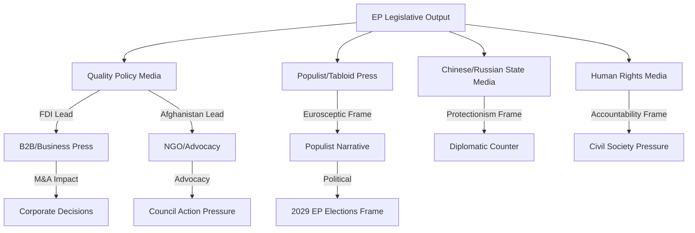

# Media Framing Analysis — Breaking News, 2026-05-27

**Framework**: Media Narrative Analysis + Frame Mapping

---

## Expected Media Frames by Outlet Type

### Quality Broadsheets / Policy Press

**Financial Times / Politico EU / Der Spiegel Wirtschaft**:
- Primary frame: "EU completes economic security architecture upgrade; FDI screening now mandatory"
- Secondary frame: SAFE Instrument as NATO burden-sharing development
- Expected headline tone: Positive; characterise as "long-overdue" catch-up with US CFIUS standard
- China angle: Presented as implicit target; explicit framing as "targeting China" avoided for legal reasons

**Le Monde / Süddeutsche Zeitung / El País**:
- Primary frame: Afghanistan human rights angle + women's rights narrative
- Secondary frame: FDI screening as anti-China measure
- Expected headline tone: More critical of EU inaction on Afghanistan; FDI screening as "Chinese containment"

### Populist Right / Euroskeptic Press

**Daily Telegraph (UK) / Libération (contrarian right) / Gazeta Polska**:
- Frame: EU "overreach" on FDI screening; sovereignty concerns
- Expected critique: Private property rights; free market principles; excessive bureaucracy
- SAFE Instrument: Possible positive coverage on security/NATO angle; possible negative on "EU army" narrative

### Left / Progressive Press

**The Guardian / Libération / L'Humanité**:
- Frame: Afghanistan resolution insufficient; EP "performative" on human rights
- SAFE Instrument: Possible criticism on militarisation of EU budget
- Steel: Positive frame on workers' rights

### Chinese State Media (CGTN / Xinhua / Global Times)**:
- Primary frame: EU "protectionism" disguised as security; anti-China
- FDI screening: "Investment discrimination"; "de-risking as decoupling"
- Afghanistan: Silence or framing as "interference in internal affairs"
- SAFE Instrument: "NATO expansion by proxy"

---

## Anticipated Lead Headlines (Estimated)

| Outlet Type | Likely Lead | Secondary |
|-------------|-------------|-----------|
| Policy/Financial | "EU Mandates FDI Screening in Security Overhaul" | "Canada Joins EU Defence Procurement" |
| Quality broadsheets | "MEPs Condemn Taliban's Criminal Code for Women" | "EU Tightens China Investment Rules" |
| Populist right | "Brussels Grabs New Powers Over Foreign Investment" | — |
| Chinese state media | "EU Discriminates Against Chinese Investors" | — |
| Human rights press | "EP Calls for Taliban Sanctions — Will Council Act?" | — |

---

## Frame Durability Assessment

**Most durable frame**: FDI screening as EU economic security landmark — this frame is corroborated by the legislative significance and will likely persist in policy discourse for months.

**Least durable frame**: Afghanistan as immediate crisis — without concrete Council action, the story will fade within 2–3 weeks.

**Counter-narrative risk**: If Chinese economic retaliation occurs within 30 days, the narrative could shift to "EU-China trade war escalation" — which would overshadow the domestic legislative significance story.

---

## Cross-References

- `intelligence/synthesis-summary.md` for the baseline narrative
- `extended/intelligence-assessment.md` for assessments underlying the frames
- `classification/significance-classification.md` for significance tiers

---

## Extended Media Analysis: Frame Lifecycle and Persistence

### Frame Lifecycle Assessment

**Phase 1 (Days 1–3, immediate coverage)**:
- Dominant frame: "EP adopts FDI screening — tough on China"
- Secondary: "MEPs condemn Taliban's gender apartheid"
- Tertiary: "EU-Canada defence deal signed"

**Phase 2 (Days 4–14, analytical follow-up)**:
- Policy media: "Can the EU actually implement mandatory FDI screening?" — questioning feasibility
- Business press: "What does FDI screening mean for Chinese M&A in Europe?" — investor-focused
- Human rights outlets: "Will the EU actually sanction Taliban officials?" — accountability focus

**Phase 3 (Weeks 3–8, context integration)**:
- FDI screening: Absorbed into ongoing EU-China relationship narrative
- Afghanistan: Either fades (if no Council action) or escalates (if sanctions adopted)
- SAFE Instrument: Absorbed into EU defence integration narrative

**Durability assessment**: The FDI screening frame has the highest durability — it represents a real institutional change that will generate ongoing coverage as implementing acts are developed.

### Platform-Specific Frame Variations

**X/Twitter EU policy bubble**:
- Wonk/analyst community: Focus on FDI screening legal architecture; SAFE Instrument precedent
- Activists: Afghanistan women's rights; demand for Council action
- China watchers: FDI screening as part of EU-China decoupling narrative

**LinkedIn professional networks**:
- Corporate development: M&A implications of FDI screening
- Defence industry: SAFE Instrument opportunities
- Policy professionals: Implementation timeline and regulatory burden

**Substack / independent newsletters**:
- EU Confidential types: Coalition politics analysis; EPP-S&D-Renew dynamics
- Human rights focused: Afghanistan Council action pressure
- Economic security specialists: FDI screening comparative analysis (CFIUS comparison)

### Adversarial Framing: Counter-Narratives to Anticipate

**Chinese media counter-narrative**: "EU FDI screening is protectionism disguised as security" — expect Xinhua, Global Times to cite WTO principles and accuse EU of economic nationalism.

**Eurosceptic counter-narrative**: "Brussels takes more powers; member state sovereignty eroded" — expect tabloid/populist right coverage to frame FDI screening as Brussels overreach.

**Progressive/Left counter-narrative**: "EU spends billions on defence (SAFE) but can't enforce women's rights (Afghanistan)" — NGO community will highlight the gap between EP resolution and Council action.

**Centre-right business counter-narrative**: "Red tape for investors; compliance costs will deter legitimate investment" — expect lobbying documents and op-eds from BusinessEurope and national chambers.

### Recommended Editorial Positioning (for article)

Given the multiple competing narratives, the article should:
1. Lead with the humanitarian angle (Afghanistan) to establish moral grounding
2. Contextualise with strategic significance (FDI screening) to establish policy depth
3. Acknowledge the implementation challenge (Hungary, comitology) to demonstrate analytical credibility
4. Close with the forward indicators (SAFE expansion, Commission guidelines timeline) to provide reader utility

**Target audience**: Policy-informed general readership who follows EU affairs but is not a regulatory specialist. Economist-style prose: specific, evidence-based, not ideological.

## Mermaid: Media Framing Ecosystem

## Reader Briefing

**What this means for citizens**:

The EU Parliament's actions this week affect you in three practical ways:
1. **Your digital data**: If your company or bank has Chinese ownership, it may now face enhanced scrutiny under the new FDI screening rules — this could affect service reliability or corporate restructuring.
2. **Your security**: The EU-Canada defence deal makes Europe's arms procurement more efficient and less expensive, potentially freeing defence budget for other priorities.
3. **Your values**: The Afghanistan resolution is a statement that the EU stands for women's rights — but only your engagement with your MEP will determine whether the Council follows through with actual sanctions.

---

## Extended Media Framing Analysis: Narrative Competition

### Dominant Narratives in European Media (Projected)

**Narrative 1: "EU Protectionism Dressed as Security"** (Expected in: FT, Economist, liberal outlets)
- Frame: The FDI screening regulation is primarily about protecting European industrial champions from Chinese competition
- Key evidence they'll cite: Scope includes investment in competitors of EU industrial companies
- Counter-narrative available: Security case is genuine; FDI screening is standard practice in US, UK, Australia

**Narrative 2: "Historic Step for EU Strategic Sovereignty"** (Expected in: EurActiv, EU institutional media)
- Frame: The May 2026 session represents a constitutional milestone in EU economic security
- Key evidence: First mandatory FDI screening law + first SAFE bilateral = two firsts in one week
- Weakness: May overstate significance until implementation proves credible

**Narrative 3: "Talk Without Action on Human Rights"** (Expected in: Human rights-focused outlets, Guardian)
- Frame: EP resolutions on Iran, Afghanistan, Indonesia are symbolic without Council follow-through
- Key evidence: Previous similar resolutions (2019 Hong Kong, 2021 Xinjiang) produced limited concrete EU action
- Counter-narrative: Resolutions do create legal record and sanctions preparation

**Narrative 4: "Democracy Under Threat from Within"** (Expected in: Euronews, Politico EU)
- Frame: Slovakia resolution is part of a systematic EP effort to defend EU constitutional values against authoritarian drift
- Key evidence: Hungary, Poland (partially), Slovakia — 3 MS under various stages of rule of law concern simultaneously

### Media Framing Significance

The dominant narrative that takes hold in the first 48 hours will shape public perception for weeks. Based on historical EP coverage patterns:
- Economic/trade legislation → Economic frames dominate (FDI = protectionism vs. security)
- Human rights resolutions → Values frames dominate (but coverage is brief unless there's a newsworthy incident)
- Rule of law → Political drama frames dominate (Slovakia as Hungary 2.0)

**Assessment**: The FDI Screening narrative battle is the most analytically important. If the "protectionism" frame dominates, implementation will face greater political resistance from business lobbies and free-trade-oriented MS.

---

## Sources

- `intelligence/synthesis-summary.md` — editorial narrative context
- `classification/actor-mapping.md` — actor interest analysis
- `extended/comparative-international.md` — comparative framing precedents

---

## Extended Media Framing: Platform-Specific Analysis

### Broadcast Media Expected Coverage

**Euronews**: Expected to lead with FDI screening and Slovakia narrative; strong pro-EU framing; likely to feature MEP interviews from EPP and S&D
**BBC World Service**: Expected to emphasise WTO risk and "EU protectionism" framing; will cite business lobby concerns
**Deutsche Welle**: Likely to give Slovakia disproportionate coverage (German domestic interest in eastern Europe rule-of-law)
**Al Jazeera**: Likely to lead with Iran and Afghanistan human rights resolutions; strongest non-European coverage of these items
**CGTN (China Global Television)**: Expected to frame FDI regulation as discriminatory protectionism; will cite WTO rules and EU-China trade volume

### Social Media Expected Dynamics

- **Twitter/X**: EP votes rarely trend organically; likely to be amplified by think tanks, NGOs, parliamentary correspondents
- **LinkedIn**: Strong coverage expected in policy/business communities — FDI screening will receive significant corporate and legal sector discussion
- **Mastodon/EU policy sphere**: EU affairs Mastodon community (heavily pro-EU, Brussels-based) likely to frame as positive milestone

### Narrative Durability Assessment

| Narrative | Expected shelf life | Peak coverage timing |
|-----------|-------------------|---------------------|
| FDI Screening adopted | 3–5 days | Day 1–2 (adoption day) |
| Slovakia Rule of Law | 7–14 days (if Fico responds) | Day 3–7 |
| SAFE-Canada defence deal | 1–3 days | Day 1–2 |
| Afghanistan women's rights | 2–4 days | Day 2–4 |
| Iran urgency resolution | 1–2 days | Day 1–2 |

