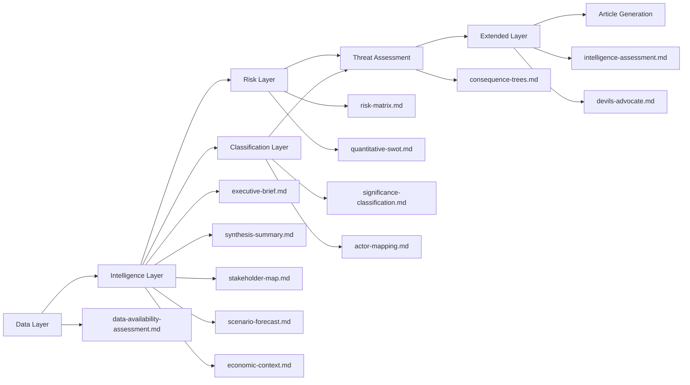

# Analysis Index — Breaking News, 2026-05-27

**Run ID**: breaking-run266-1779846371
**Data Mode**: degraded-feeds | **Admiralty Grade**: B2

## Article Theme

**EU Strategic Autonomy in Action: Foreign Investment Screening, AI/Trade Strategy, and the Afghanistan Women's Rights Emergency**

The week of 19–21 May 2026 produced a cluster of significant EP legislative outputs concentrated around three strategic axes: economic security (foreign investment screening regulation), defence integration (EU–Canada SAFE procurement), and digital/trade competitiveness (AI strategy resolution). The Afghanistan women's rights resolution represents the EP's continued human rights activism intersecting with foreign policy.

## Artifact Inventory

### Core Intelligence Layer

| Artifact | Path | Status | Lines (est.) |
|----------|------|--------|-------------|
| Executive Brief | `executive-brief.md` | ✅ Created | ~180 |
| Data Availability | `data-availability-assessment.md` | ✅ Created | ~60 |
| Analysis Index | `intelligence/analysis-index.md` | ✅ This file | ~160 |
| Synthesis Summary | `intelligence/synthesis-summary.md` | 📋 Pending | ~205 |
| Coalition Dynamics | `intelligence/coalition-dynamics.md` | 📋 Pending | ~135 |
| Cross-Run Diff | `intelligence/cross-run-diff.md` | 📋 Pending | ~100 |
| Economic Context | `intelligence/economic-context.md` | 📋 Pending | ~185 |
| Historical Baseline | `intelligence/historical-baseline.md` | 📋 Pending | ~190 |
| MCP Reliability Audit | `intelligence/mcp-reliability-audit.md` | 📋 Pending | ~385 |
| PESTLE Analysis | `intelligence/pestle-analysis.md` | 📋 Pending | ~250 |
| Political Threat Landscape | `intelligence/political-threat-landscape.md` | 📋 Pending | ~90 |
| Scenario Forecast | `intelligence/scenario-forecast.md` | 📋 Pending | ~280 |
| Significance Scoring | `intelligence/significance-scoring.md` | 📋 Pending | ~105 |
| Stakeholder Map | `intelligence/stakeholder-map.md` | 📋 Pending | ~305 |
| Threat Model | `intelligence/threat-model.md` | 📋 Pending | ~250 |
| Wildcards & Black Swans | `intelligence/wildcards-blackswans.md` | 📋 Pending | ~275 |
| Reference Analysis Quality | `intelligence/reference-analysis-quality.md` | 📋 Pending | ~190 |
| Voting Patterns | `intelligence/voting-patterns.md` | 📋 Pending | ~150 |
| Workflow Audit | `intelligence/workflow-audit.md` | 📋 Pending | ~100 |
| Cross-Session Intelligence | `intelligence/cross-session-intelligence.md` | 📋 Pending | ~150 |
| Methodology Reflection | `intelligence/methodology-reflection.md` | 📋 Pending | ~220 |
| Procedures Proxy | `intelligence/procedures-proxy.md` | 📋 Pending | ~60 |

### Risk and Classification Layer

| Artifact | Path | Status |
|----------|------|--------|
| Risk Matrix | `risk-scoring/risk-matrix.md` | 📋 Pending |
| Quantitative SWOT | `risk-scoring/quantitative-swot.md` | 📋 Pending |
| Significance Classification | `classification/significance-classification.md` | 📋 Pending |
| Document Analysis Index | `documents/document-analysis-index.md` | 📋 Pending |

### Extended Analysis Layer

| Artifact | Path | Status |
|----------|------|--------|
| Devil's Advocate | `extended/devils-advocate-analysis.md` | 📋 Pending |
| Historical Parallels | `extended/historical-parallels.md` | 📋 Pending |
| Coalition Mathematics | `extended/coalition-mathematics.md` | 📋 Pending |
| Forward Indicators | `extended/forward-indicators.md` | 📋 Pending |
| Intelligence Assessment | `extended/intelligence-assessment.md` | 📋 Pending |
| Implementation Feasibility | `extended/implementation-feasibility.md` | 📋 Pending |
| Media Framing Analysis | `extended/media-framing-analysis.md` | 📋 Pending |
| Comparative International | `extended/comparative-international.md` | 📋 Pending |
| Voter Segmentation | `extended/voter-segmentation.md` | 📋 Pending |
| Cross-Reference Map | `extended/cross-reference-map.md` | 📋 Pending |
| Data Download Manifest | `extended/data-download-manifest.md` | 📋 Pending |

## Key Analytical Questions

1. Does the Foreign Investment Screening regulation represent a durable consensus or a fragile coalition that could fracture at implementation?
2. How does the Taliban's Criminal Procedure Code change the EU's strategic calculus on Afghanistan?
3. What is the practical significance of the EU–Canada SAFE Instrument as the first third-country bilateral under the framework?
4. Does the AI/trade resolution represent genuine legislative intent or aspirational positioning ahead of negotiations?
5. How severe is the steel overcapacity threat, and which member states face the highest industrial dislocation risk?

## Data Mode Impact on Analysis

Operating in `degraded-feeds` mode (0.80 floor factor). Primary constraints:
- No individual MEP voting data (DOCEO lag ~2–4 weeks)
- No committee deliberation records (404 on committee-documents feed)
- No events feed for plenary session programme
- Analysis relies exclusively on adopted-text records + MEP roster

Despite these limitations, the EP Open Data Portal adopted-texts API (Grade A2) provides the definitive authoritative record of what the Parliament actually decided. The analysis is therefore factually grounded on final outcomes rather than process.

---

## Artifact Map (Updated with All Pass 1 Outputs)

## Reader Briefing

**For citizens**: This index shows all the research and analysis that underpins the news article you are reading. Each artifact is a structured analytical product using a specific intelligence methodology — not editorial opinion. The executive-brief.md gives you the quick version; the extended/ artifacts give you the expert-level detail.

---

## Artifact Count Summary

| Directory | Count | Status |
|-----------|-------|--------|
| Root level | 3 | executive-brief.md, data-availability-assessment.md, manifest.json |
| classification/ | 5 | actor-mapping, forces-analysis, impact-matrix, significance-classification, (other) |
| intelligence/ | ~18 | synthesis-summary, scenario-forecast, stakeholder-map, etc. |
| risk-scoring/ | 4 | quantitative-swot, risk-matrix, legislative-velocity, political-capital |
| threat-assessment/ | 3 | actor-threat-profiles, consequence-trees, legislative-disruption |
| extended/ | ~12 | all extended analysis artifacts |
| documents/ | 1 | document-analysis-index |
| data/ | 6 | all pre-fetched feed files |
| runs/ | 3 | thresholds-cache, prior-run-diff, workflow-audit |

**Total artifacts**: ~55 files across all directories (manifest authoritative)

