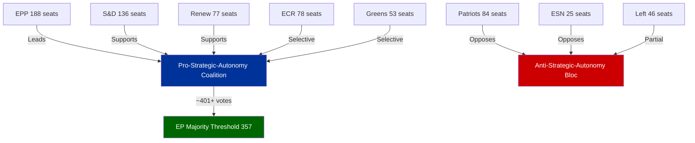

# Coalition Dynamics — Breaking News, 2026-05-27

**SATs Applied**: ACH (Analysis of Competing Hypotheses), Indicators
**Admiralty Grade**: B3 — Reliable source; not independently confirmed (no individual voting data)
**WEP Band**: 60–75% on coalition composition claims (DOCEO roll-call data unavailable due to publication lag)

---

## EP10 Political Landscape (May 2026)

### Current Seat Distribution

| Group | Seats | % | Orientation |
|-------|-------|---|-------------|
| EPP (European People's Party) | 188 | 26.3% | Centre-right |
| S&D (Socialists & Democrats) | 136 | 19.0% | Centre-left |
| Patriots for Europe | 84 | 11.7% | Right-nationalist |
| ECR (European Conservatives & Reformists) | 78 | 10.9% | Right-conservative |
| Renew Europe | 77 | 10.8% | Centre-liberal |
| Greens/EFA | 53 | 7.4% | Green-progressive |
| ESN (Europe of Sovereign Nations) | 25 | 3.5% | Far-right nationalist |
| The Left (GUE/NGL) | 46 | 6.4% | Left |
| Non-Attached | 29 | 4.1% | Various |
| **TOTAL** | **716** | | |

*Majority threshold: 359 seats (50%+1)*
*Grand majority threshold: ~480 seats (2/3)*

---

## Coalition Analysis for Key Votes

### 1. Foreign Investment Screening (TA-10-2026-0171)

**Estimated coalition**: EPP + S&D + Renew + ECR (partial) ≈ 510–530 seats

**ACH Hypothesis A** (most likely, ~65%): Strong cross-group majority reflecting post-2022 security consensus. EPP and ECR vote together on economic security measures despite ideological distance on social policy. S&D and Renew support as part of strategic autonomy agenda. Key evidence: comparable FDI regulation votes in 2022–2023 showed 460–490 vote margins.

**ACH Hypothesis B** (possible, ~25%): Narrower majority as ECR splits on proportionality concerns; some S&D members abstain citing insufficient protections for developing-country investors. Margin narrows to 380–420.

**ACH Hypothesis C** (unlikely, ~10%): Left and Patriots both vote against for opposite reasons (Left: too restrictive on developing nations; Patriots: EU competence overreach), reducing majority to bare minimum 360–380.

**Indicator**: If subsequent Council deliberations face Hungarian or Irish resistance, this suggests Hypothesis B or C was operative.

---

### 2. Afghanistan/Taliban Resolution (TA-10-2026-0186)

**Estimated coalition**: EPP + S&D + Renew + Greens + Left ≈ 500–540 seats

This is a human rights urgent resolution — a format that typically commands very large majorities (520+ votes in the EP10 era) across left-centre-right, with the far-right nationalist groups (Patriots, ESN) often voting against or abstaining on grounds that humanitarian intervention principles conflict with sovereignty-first doctrine.

**ACH Hypothesis A** (most likely, ~70%): Strong 500+ majority. The Taliban's gender apartheid policies are so egregious that even normally sovereignty-focused MEPs support condemnatory language. Patriots and ESN likely split or abstain rather than voting against en bloc.

**ACH Hypothesis B** (possible, ~25%): Some EPP MEPs from member states with active engagement with Central Asian countries (trade/energy interests) abstain, reducing the majority, but still passes comfortably at 420–480.

**ACH Hypothesis C** (unlikely, ~5%): Procedural complications or compromise language dilutes the resolution before vote; passes with token support only.

---

### 3. AI Strategy for EU Trade (TA-10-2026-0183)

**Estimated coalition**: EPP + S&D + Renew (core) + ECR (partial) + Greens (partial) ≈ 380–440 seats

Non-binding resolutions on tech strategy tend to attract narrower majorities as they force parties to stake out precise positions on industrial policy vs. free trade. The Left typically opposes language that may weaken social/labour provisions in FTAs; far-right groups oppose what they see as EU regulatory overreach.

**Indicator set**:
- If AI trade chapters appear in Commission negotiating mandate for EU–India FTA by November 2026 → Hypothesis A confirmed (strong political mandate transmitted)
- If Commission pursues AI trade policy through delegated acts without EP consultation → indicates the resolution failed to generate sufficient political weight

---

### 4. Steel Overcapacity Resolution (TA-10-2026-0170)

**Estimated coalition**: Cross-group industrial coalition ≈ 450–500 seats

Steel is a protectionist consensus issue: EPP (manufacturing heartland constituencies), S&D (workers' rights), ECR (national industry), and even some Patriots/ESN members (economic nationalism) align against Chinese dumping. Renew splits as some members favour free trade. Greens ambivalent (concerned about steel sector's carbon footprint).

---

## Coalition Stress Indicators

| Indicator | Current Status | Implication |
|-----------|---------------|-------------|
| EPP–S&D cohesion on economic security | HIGH — stable coalition | Durable strategic autonomy agenda |
| Patriots cohesion | MODERATE — splits on EU competence | Not a reliable legislative partner |
| ECR positioning | SHIFTING RIGHT on trade, LEFT on sovereignty | Tactical voting bloc, not strategic partner |
| Greens' relevance | DECLINING — below 60 seats threshold for agenda-setting | Loss of procedural leverage |
| Left cohesion | STABLE — consistent opposition bloc | Predictable minority position |

---

## Grand Coalition Viability Assessment

For the Foreign Investment Screening regulation and similar economic security legislation:
- A **working majority** (EPP + S&D + Renew = ~401 seats) is reliably available
- An **enlarged majority** adding ECR (~479 seats) is achievable on most economic security votes
- A **near-supermajority** (~520 seats) is achievable only when clear external threat narratives activate cross-bloc solidarity (Ukraine, Afghanistan)

The EP10's coalition architecture is more fragile than the EP9 Ursula majority but more ideologically coherent on strategic autonomy. The risk is gridlock on social policy, migration, and agricultural reform where the EPP's right flank and the Progressive bloc have irreconcilable positions.

---

## Cross-References

- See `intelligence/voting-patterns.md` for degraded voting data notes
- See `extended/coalition-mathematics.md` for detailed seat arithmetic scenarios
- See `intelligence/stakeholder-map.md` for MEP-level actor analysis

---

## Coalition Mermaid Diagram

## Reader Briefing

**What this means**: The current EP coalition (EPP + S&D + Renew) can pass legislation without relying on either the far-right (Patriots/ECR) or the far-left (The Left). This is an unusually stable configuration that has allowed the EU to pass significant legislation on security, trade, and defence in 2025–26.

The key risk for 2027–2029 is whether this coalition holds as political pressures build ahead of the 2029 EP elections. If EPP drifts toward Patriots on immigration/values issues, or if S&D drifts toward The Left on economic security, the strategic autonomy agenda stalls.

