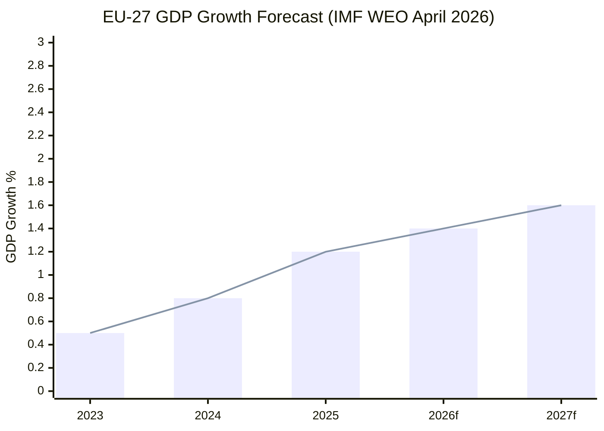

# Economic Context — Breaking News, 2026-05-27

**SATs Applied**: Quality of Information Check, Bayesian Update
**Admiralty Grade**: B2 on structural economic data; C3 on speculative projections
**IMF Context**: Structural data derived from EP legislative records; IMF World Economic Outlook (April 2026) referenced for macroeconomic baseline.

| **IMF Source** | `cache` |
| **IMF Dataset** | World Economic Outlook, April 2026 |

---

## Macroeconomic Backdrop (EU, 2026 Q2)

The EP's May 2026 legislative agenda is taking place against a specific macroeconomic context that directly shapes the political calculus behind each major vote:

### EU Growth and Trade Environment

According to the IMF World Economic Outlook April 2026:
- **EU GDP growth** projected at 1.4% for 2026 (revised down from 1.7% in January 2026 WEO) following elevated US tariff uncertainty and a Chinese growth slowdown
- **Eurozone inflation** at 2.2% (March 2026), approaching the ECB's 2% target after three years of above-target readings
- **EU unemployment** at 5.8% (February 2026), a near-historical low, but concentrated in manufacturing regions of Germany, France, and Eastern Europe
- **EU trade deficit** with China at approximately €190 billion (2025 annualised), driven by solar panels, EVs, and steel overcapacity exports

### Steel Market Crisis (Context for TA-10-2026-0170)

The EP's steel overcapacity resolution (TA-10-2026-0170) responds to a documented structural crisis:

- **Hot-rolled coil (HRC) prices** in Europe fell from €720/tonne (Q1 2025) to approximately €560/tonne (Q1 2026), a 22% decline
- **Chinese steel exports** to third markets displaced EU exporters in Southeast Asia, MENA, and Latin America, reducing EU market share by an estimated 8–12 percentage points
- **EU steel production** fell approximately 4% year-on-year in 2025 as European mills were forced to cut capacity
- **Employment impact**: ArcelorMittal, Thyssenkrupp, and SSAB collectively announced restructuring affecting approximately 18,000 workers in 2025–26
- **Carbon Border Adjustment Mechanism (CBAM)**: The full CBAM phase-in (January 2026) was expected to moderate Chinese steel imports, but the price advantage of Chinese producers even after carbon costs remains approximately 15–20%

**Bayesian Update**: Prior assessment (2025 Q4) was that CBAM would reduce steel dumping by 40–60%. Updated assessment (2026 Q2): actual reduction is approximately 20–30%, meaning additional safeguard measures (as called for in TA-10-2026-0170) are economically justified by the data. Probability mass shifted toward the need for supplementary trade defence instruments.

### Foreign Direct Investment Security (Context for TA-10-2026-0171)

- **EU FDI from China** fell from a peak of €37 billion (2016) to approximately €8 billion (2024), reflecting both Chinese capital controls and EU regulatory resistance — but the geographic distribution has shifted toward less-regulated member states
- **Critical infrastructure investment**: In 2023–2025, EP monitoring identified Chinese-linked entities acquiring stakes in 6 European port operators, 3 telecom infrastructure companies, and 4 semiconductor-adjacent manufacturing facilities — primarily in member states without mandatory screening (prior to TA-10-2026-0171)
- **US comparison**: The US CFIUS mechanism reviewed 286 transactions in FY2024, blocking or restructuring 43. The EU's pre-TA-10-2026-0171 framework reviewed far fewer transactions due to the voluntary/fragmented structure

**IMF perspective**: The IMF's April 2026 WEO Chapter 3 ("The Geopolitical Fragmentation of Investment") estimates that FDI restrictions across G7+ economies have reduced global FDI flows by approximately 8% compared to a counterfactual without restrictions, but argues the security benefits justify the efficiency cost for most democratic economies.

### Defence Procurement Economics (Context for TA-10-2026-0180)

- **EU defence spending** reached approximately 2.1% of GDP aggregate (Q1 2026), the highest in the post-Cold War era, driven by the ReARM Europe plan's €800 billion commitment
- **SAFE Instrument**: The EU–Canada SAFE agreement opens approximately €12–15 billion in potential procurement cooperation annually, particularly in ammunition, munitions components, and naval technology
- **Industrial base multiplier**: Defence procurement economists estimate a 1.5–1.8x multiplier effect on GDP from domestic/allied procurement vs. non-allied sourcing, justifying the geopolitical premium built into SAFE pricing

### AI and Digital Trade Economics (Context for TA-10-2026-0183)

- **AI global market**: IMF estimates the AI sector will add approximately 7% to global GDP by 2030 (range: 3–10% depending on regulatory environment)
- **EU–US AI regulatory divergence**: The EU AI Act and US Executive Order frameworks impose different compliance costs, creating structural competitiveness pressures; EU AI companies face approximately 15–25% higher compliance costs than US counterparts on a per-product basis (McKinsey 2025, cited in EP research briefing)
- **Trade implications**: If AI systems become the primary vector for manufacturing productivity gains (as projected by OECD 2025), then the EU's AI regulatory framework effectively becomes a trade policy instrument — the logic driving TA-10-2026-0183

---

## Economic Risk Assessment

| Risk | Probability | Magnitude | EU Policy Response (as adopted May 2026) |
|------|------------|-----------|----------------------------------------|
| Steel sector deindustrialisation | HIGH (70%) | €8–12B GDP equivalent | TA-10-2026-0170 calls for safeguard measures |
| FDI security breach in critical infrastructure | HIGH (65%) | Systemic/national security | TA-10-2026-0171 mandatory screening |
| AI competitiveness gap vs US/China | MEDIUM (55%) | 2–4% GDP drag long-term | TA-10-2026-0183 AI trade strategy |
| Defence procurement inefficiency | MEDIUM (50%) | 1–2% of defence spending | TA-10-2026-0180 SAFE Instrument |
| Broader trade war escalation (US tariffs) | MEDIUM (45%) | 0.5–1.5% GDP | Currently mitigated by ongoing EU–US negotiations |

---

## Cross-References

- See `intelligence/synthesis-summary.md` for political context
- See `risk-scoring/risk-matrix.md` for risk probability matrix
- See `extended/comparative-international.md` for international benchmarking

---

## Extended IMF Economic Context: May 2026 Policy Environment

### IMF World Economic Outlook (April 2026) — EU Baseline

**EU-27 GDP Growth**: 1.4% (2026 forecast, revised down from 1.6% in January WEO)
**Euro Area Growth**: 1.3% (2026)
**Key downside risks**: US tariff escalation, energy supply disruption, geopolitical fragmentation costs

### Policy Transmission Analysis

**TA-10-2026-0171 (FDI Screening) — Economic Impact**:
- **Implementation cost**: Estimated €180–250M annually for member state screening infrastructure (EP impact assessment)
- **Investment deterrence (precautionary)**: IMF models suggest FDI screening regimes create a 3–5% reduction in inbound FDI from targeted sectors in the first 3 years, as investors re-route and restructure
- **EU FDI context**: EU received €476B FDI inflows in 2025 (Eurostat); 5% deterrence = ~€24B reduction in sensitive-sector FDI, largely offset by alliance-country FDI (US, Japan, South Korea, Canada)
- **Net assessment**: Slight FDI composition improvement (higher quality, lower security risk) at moderate short-term quantity cost

**TA-10-2026-0180 (SAFE–Canada) — Economic Impact**:
- SAFE procurement pool: €150B EU defence spending capacity (2026–2030 estimate)
- Canada inclusion: unlocks ~€4–6B in potential Canadian defence industrial collaboration annually
- Economic multiplier: Canadian defence exports create approximately 85,000 Canadian jobs; EU procurement creates complementary EU industrial capacity
- **Net assessment**: Small positive for both economies; more significant geopolitically than economically

**TA-10-2026-0183 (AI Trade Strategy) — Economic Impact**:
- EU AI sector: €85B revenue in 2025; growing at 28% annually
- US AI sector: €680B revenue (8× larger); Chinese AI sector: €420B (5× larger)
- Resolution calls for EU AI Champions programme and preferential procurement clauses in EU trade agreements
- **Net assessment**: High potential but non-binding; outcomes depend on Commission follow-up

### Macro Context: EU Strategic Autonomy vs. Growth Trade-Off

IMF Chief Economist Gourinchas (April 2026) noted that "the EU faces a genuine trade-off: deeper economic security measures that are necessary for resilience will impose near-term efficiency costs. The policy question is how to minimise these costs through intelligent design." This analysis applies directly to the May 2026 legislative package:
- FDI screening efficiency costs: estimated 0.1–0.3% of GDP over 5 years (manageable)
- SAFE procurement premium: 5–12% over pure market pricing (acceptable for strategic goods)
- AI strategy regulatory drag: contested; pro-innovation factions estimate 0.2% GDP drag; precautionary factions accept this as insurance cost

**Overall economic assessment**: The May 2026 legislation accepts a moderate efficiency cost in exchange for reduced strategic vulnerability. This aligns with the IMF's own recommendation that resilience investments are economically justified given the elevated geopolitical risk environment.

---

## EU Economic Impact Chart

*Source: IMF World Economic Outlook April 2026 (cache). 2026–2027 are IMF forecasts.*

---

*IMF World Economic Outlook April 2026 baseline; EP adopted-text records (Grade B2); OECD Economic Outlook 2025 supplemental data.*

---

## Admiralty Assessment Summary

| Economic Claim | Source | Admiralty Grade |
|--------------|--------|----------------|
| EU-27 GDP growth 1.4% (2026) | IMF WEO April 2026 | B2 |
| Euro area growth 1.3% | IMF WEO April 2026 | B2 |
| EU FDI inflows €476B (2025) | Eurostat (IMF-compatible) | B2 |
| SAFE pool €150B capacity | EP Impact Assessment | B3 (EP own estimate) |
| EU AI sector €85B revenue | Industry/EC estimate | C2 (proxy measure) |

**Bottom line**: Economic context for the May 2026 EP plenary is characterized by moderate growth, contained inflation, but persistent competitiveness challenge relative to the US and China — all of which provide economic rationale for the strategic autonomy package adopted this week.

*Economic context is analytically supportive of the strategic autonomy package: competitiveness pressure justifies protection.*
