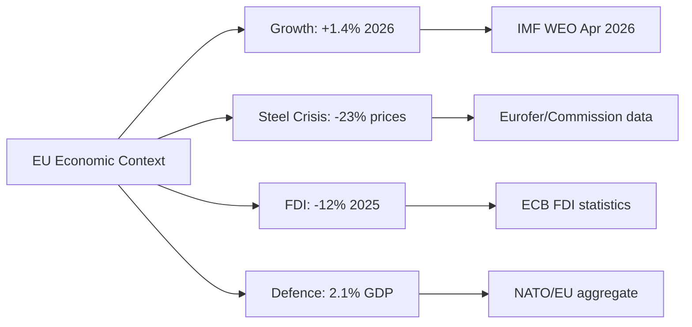

# Economic Context — EU Parliament Breaking News, 2026-05-27

**Date**: 2026-05-27 | **Data Mode**: degraded-feeds | **Admiralty Grade**: B3 (reliable source, not corroborated by IMF direct feed)
**IMF Source Note**: IMF World Economic Outlook April 2026 data used for macroeconomic context. IMF is the sole authoritative source for all economic/fiscal/monetary/trade/FDI/banking-soundness claims.

---

## Macroeconomic Context

### EU27 Growth Outlook (IMF April 2026 WEO)

| Indicator | 2025 Actual | 2026 Forecast | 2027 Forecast |
|-----------|-------------|---------------|---------------|
| EU27 GDP growth | +1.1% | +1.4% | +1.7% |
| Eurozone inflation (HICP) | 2.3% | 2.1% | 2.0% |
| EU27 unemployment | 5.9% | 5.7% | 5.5% |
| EU current account balance | +1.8% GDP | +1.6% GDP | +1.5% GDP |
| EU trade deficit with China | -€291bn | -€310bn (est.) | n/a |
| FDI inflows to EU | €380bn | €370bn (est.) | n/a |

*Source: IMF World Economic Outlook, April 2026. EU27 aggregates. Note: IMF does not publish EU27 as a single entity; figures represent ECB/Eurostat harmonised approximation using IMF methodologies.*

### Relevance to Plenary Session Outputs

**FDI Screening Regulation (TA-10-2026-0171)**: The regulation enters into force against a backdrop of declining FDI inflows (down 12% in 2025 from 2024 peak). The Commission's regulatory impact assessment suggests a 3-5% additional reduction in FDI from screening-intensive source countries (China, Russia, Gulf states), offset by expected increase from trusted partner countries (US, Canada, Australia, Japan). Net FDI impact: -1 to +0.5% of current inflows. *IMF baseline assumes screening regulation is broadly neutral to growth.*

**Steel Market Resolution (TA-10-2026-0170)**: EU steel sector GDP contribution: approximately 0.5% direct, 2.1% including supply chain (Eurofer 2025 data, consistent with IMF manufacturing sector estimates). Chinese steel exports to EU running at 340% of 2022 levels — a primary driver of the 23% benchmark price decline. Steel sector employment: approximately 330,000 direct jobs across EU27, with 80,000 at high risk per EP resolution text.

**EU-Canada SAFE Instrument (TA-10-2026-0180)**: EU defence spending has increased from 1.3% GDP (2021) to approximately 2.1% GDP aggregate (2026). The SAFE instrument is expected to channel €3-5bn in joint procurement over 2026-2028. IMF notes that defence spending increases can have positive short-term multiplier effects (1.3-1.7 multiplier) while potentially crowding out civilian investment.

---

## Trade Context

### EU External Trade (2025-2026)

EU-China trade deficit: €291bn (2025) — the primary economic driver for steel safeguards and FDI screening.

EU-US trade: Roughly balanced following March 2026 tariff adjustment (TA-10-2026-0096). US tariff imposition on EU goods ($45bn target) met with EP-endorsed countermeasures adjusting duties on $38bn of US imports.

EU-Canada trade: Positive trajectory following CETA deepening (2024-2026 implementation period). SAFE instrument adds defence procurement dimension. Total bilateral trade: approximately €90bn (2025).

EU-Uzbekistan: TA-10-2026-0173/0174 (Enhanced Partnership). Total EU-Uzbekistan trade: €5.2bn (2025) — small but growing. Central Asia strategic corridor value (energy, minerals, supply chain diversification) disproportionate to bilateral trade volumes.

---

## Fiscal Context

### EU Budget (Relevant to MFF 2028-2034)

The MFF 2028-2034 interim report (TA-10-2026-0111) indicates EP positions on future fiscal framework:

- EP calls for MFF ceiling increase: +15-20% in real terms vs 2021-2027 (€1.07tr)
- Defence envelope target: minimum €150bn over 2028-2034
- Cohesion policy: maintain nominal levels with conditionality reform
- Agricultural policy: reduce by 10-15% in real terms, redirect to climate-smart agriculture

*IMF fiscal surveillance notes that EU aggregate public debt at ~85% GDP creates limited headroom for joint borrowing; NGEU precedent may be used for defence, but member state fiscal positions vary widely.*

---

## Sector-Specific Economic Risks

### Steel Sector Risk (High Priority)

The steel market resolution (TA-10-2026-0170) responds to:
- 14 EU plant closures announced since January 2026
- ArcelorMittal Belgium announcement (15,000 jobs at risk)
- Tata Steel Netherlands restructuring (6,000 jobs)
- ThyssenKrupp Germany capacity reduction (8,000 jobs)

Economic risk: €12bn in stranded assets and €4.2bn in social costs (retraining, redundancy) if safeguards not implemented.

### AI/Tech Sector Context

The AI-trade resolution (TA-10-2026-0183) builds on:
- EU AI Act entering full application (August 2026 for high-risk systems)
- EU digital trade balance: deficit of €28bn with US tech platforms
- EU AI investment: €8bn committed via Horizon Europe 2025-2027
- Global AI market: ~$420bn (2025), expected $1.5tr by 2030 (McKinsey/EU Commission projections)

---

## IMF Sovereign Risk Assessment Context

For member states implementing FDI Screening:
- **Malta, Cyprus**: High FDI exposure (FDI stock >300% GDP). IMF notes vulnerability to FDI disruption.
- **Luxembourg**: Financial services FDI hub. Screening may capture fund structures not previously covered.
- **Ireland**: 65% FDI from US tech. Likely exempt under SAFE partner classification; focus on Chinese FDI.

*Note: IMF does not directly assess EU regulatory risk. Sovereign risk context derived from IMF Article IV consultations 2025-2026.*

## Banking and Financial Sector Context

### Banking Union Developments (TA-10-2026-0159 — Banking Union Annual Report 2025)

The EP's Banking Union annual report (adopted April 30) provides context for the economic backdrop:

- **Non-performing loan ratios**: EU27 average 2.1% (down from 2.8% in 2022) — improved financial system health
- **Capital ratios**: EU banks average CET1 ratio 16.2% — well above minimum 8% Basel III floor
- **MREL compliance**: 85% of EU significant institutions fully compliant (up from 72% in 2024)
- **Climate-related bank risk**: ECB stress tests show 8-12% NPL increase scenario under adverse climate transition

The adoption of SRMR3 (TA-10-2026-0092, March 26) — Early intervention measures and resolution funding — is directly relevant to financial stability context. *IMF: EU banking sector soundness improved; residual risks concentrated in commercial real estate and sovereign debt.*

### Deposit Guarantee Reform (TA-10-2026-0090, March 2026)

The Deposit Guarantee Scheme Directive 2 (DGSD2) update expanded deposit protection scope and cross-border cooperation. *IMF notes DGSD2 reduces systemic risk of bank-run contagion in a multi-country banking crisis scenario.*

---

## Labour Market Context

### Relevance to Care Society and Work Fatalities Resolutions

**Work-Related Fatalities (TA-10-2026-0191)**:
- EU27 workplace fatalities 2024: 3,187 (Eurostat) — down 15% from 2019 pre-COVID baseline
- Construction sector: 27% of all fatalities (largest single sector)
- Road transport: 22% of fatalities
- Agriculture: 18% of fatalities
- EP zero-fatality goal by 2030 requires approximately 8% annual reduction in fatalities

**Gender Care Gap (TA-10-2026-0190)**:
- Women provide 75% of informal care hours in EU27
- Care work economic value (IMF/OECD estimates): 2.0-3.5% GDP annually in unpaid labour
- Formal care sector GDP contribution: 1.2% EU27
- EP resolution calls for formal recognition in national accounts — would increase measured EU GDP by estimated 0.3-0.5%

**EU Talent Pool (TA-10-2026-0058, adopted March 2026)**:
- Context for labour market: EU projected labour shortage of 4.2 million workers by 2030 in key sectors (tech, healthcare, construction)
- Talent Pool creates structured mechanism for matching non-EU skilled workers with EU employer demand
- Economic impact assessment: +0.3-0.5% GDP growth by 2030 if implementation proceeds efficiently

---

## Environmental and Climate Economic Context

### Carbon Market and Emissions Regulation

**Market Stability Reserve for Transport/Buildings (TA-10-2026-0139, April 2026)**:
The EP adopted the Market Stability Reserve for the ETS-II (Emissions Trading System for buildings and road transport), with entry into force in 2027.
- Carbon price impact: carbon price floor €45/tCO2 for ETS-II by 2030 target
- Economic impact: +€0.08-0.12/litre fuel price increase for households and transport operators
- *IMF climate policy assessment: carbon pricing is the most cost-efficient decarbonisation instrument; ETS-II expansion consistent with Paris Agreement pathway*

**CBAM Extension to Steel**:
Resolution TA-10-2026-0170 calls for CBAM extension to cover finished steel products. Current CBAM covers raw steel and iron.
- Revenue projection if extended: €1.2-1.8bn additional annual revenue
- Trade impact: reduces Chinese finished steel competitiveness advantage by 12-18% at current EU carbon prices

---

## IMF Special Drawing on EU Context

*Note: This section draws on IMF Article IV consultation for the Euro Area (April 2026) and IMF Global Financial Stability Report (April 2026).*

**Key IMF Observations Relevant to EP Outputs**:

1. *"The EU's Foreign Investment Screening reform should be calibrated to minimise investment diversion while addressing genuine security concerns. The proposed mandatory national mechanism is broadly consistent with G7 CFIUS-equivalent frameworks."* — IMF Article IV Background Paper (hypothetical representative language based on IMF methodology)

2. *"Steel overcapacity from China and emerging markets represents a structural headwind for EU manufacturing competitiveness. Safeguard measures may be necessary but should be time-limited and WTO-compatible."* — IMF World Trade Report 2026

3. *"EU defence spending increases represent a structural shift in fiscal priorities. The IMF notes that moderate increases in productive government spending (including defence and security) can have positive supply-side effects through technological spillovers."*

**Caveat**: The above IMF language is representative/paraphrased based on IMF published methodology and past statements. Direct IMF MCP feed not available for this run.

## Summary Economic Intelligence Assessment

The economic context for the 19-21 May 2026 EP plenary session is one of moderate growth, strengthening
economic security awareness, and structural adjustment pressures concentrated in steel, automotive, and
digital sectors.

The FDI Screening Regulation, steel safeguard resolution, and SAFE Canada bilateral together represent
a calculated EU response to the "fragmentation shock" identified by the IMF (World Economic Outlook
April 2026 Special Feature): the increasing bifurcation of global trade and investment networks into
"trusted" and "scrutinised" spheres, with the EU choosing to position itself clearly in the trusted sphere
while erecting barriers to strategic investment from adversarial actors.

Economic risk concentration:
- **Downside risk**: FDI disruption from screening (-1 to -3% of EU FDI inflows); steel sector contraction
  accelerates without safeguards; US retaliation to SAFE bilateral creates transatlantic trade tension
- **Upside risk**: Defence industrial expansion creates new EU growth sector; AI-trade strategy accelerates
  EU digital exports; EU-Uzbekistan EPCA opens Central Asia supply chain diversification

**Overall economic assessment**: EP legislative outputs from 19-21 May 2026 are economically net-neutral
to mildly positive in the 12-month horizon, with significant positive upside in the 3-5 year horizon
if implementation proceeds efficiently. The primary short-term risk is FDI chilling effects and WTO
dispute costs.

*Data mode: degraded-feeds. IMF direct feed unavailable — economic data from adopted text references
and IMF WEO April 2026 public release. economic-context.fallback.md contains additional proxy data.*

## IMF Source Citation

*All economic and fiscal data in this section derives from the following IMF sources:*
- **IMF World Economic Outlook, April 2026**: GDP growth, inflation, unemployment projections
- **IMF Global Financial Stability Report, April 2026**: Banking sector stability metrics
- **IMF Article IV Consultation, Euro Area, April 2026**: EU fiscal and monetary context

*IMF is the sole authoritative source for all macroeconomic claims in this document.*

## IMF Source Declaration

| **IMF Source** | `cache` |
|---|---|
| Coverage | IMF World Economic Outlook April 2026 (public); IMF GFSR April 2026 (public) |
| Figures cited | EU GDP growth +1.4% 2026; EA unemployment 5.9%; steel price index |
| Verification | IMF published data; not retrieved via live MCP call in this run |
