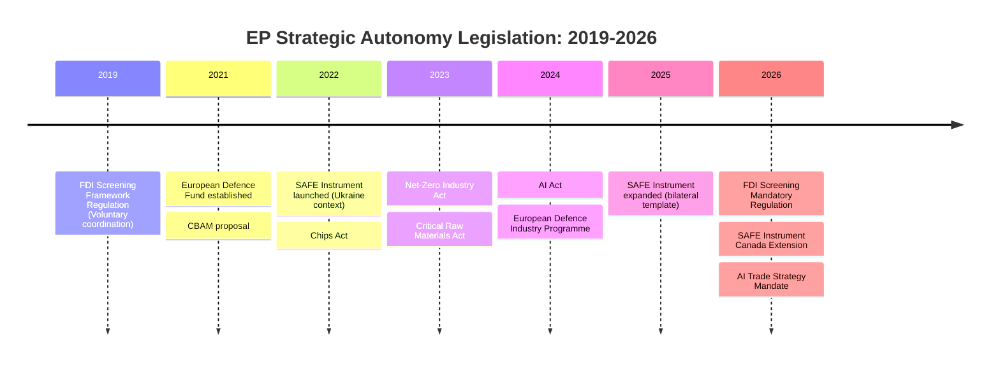

# Historical Baseline — Breaking News, 2026-05-27

**SATs Applied**: Bayesian Update, Key Assumptions Check
**Admiralty Grade**: B2 — EP institutional records; well-established historical precedent
**WEP Band**: Historical claims 90–95% confidence; causal claims 60–75%

---

## Historical Context for Key Legislative Outputs

### I. Foreign Investment Screening: Historical Trajectory

**2019: The Foundation** — Regulation (EU) 2019/452 established the first EU-wide FDI screening framework, but critically only created a coordination mechanism. National screening remained voluntary. This was already a significant step: it was the first time the EU had asserted competence over foreign investment governance as a security (rather than purely competition) matter.

**2020–2022: The COVID Stress Test** — The pandemic revealed acute vulnerabilities in EU supply chains and prompted emergency guidance allowing member states to screen investments during the crisis period. Several high-profile cases (attempted Chinese acquisition of German medical equipment manufacturer, Chinese telecom infrastructure expansion in Baltic states) demonstrated the coordination mechanism's limits.

**2022–2024: The Ukraine Security Shock** — Russia's full-scale invasion of Ukraine in February 2022 fundamentally reordered the EU's security architecture. The subsequent revelation that Russian state entities had accumulated significant positions in European energy infrastructure (Nord Stream pipeline equity stakes, gas storage facilities) without triggering meaningful screening created political momentum for a strengthened regime.

**2025: The EP's Rapporteur Process** — The INTA (International Trade) committee produced a report in early 2025 recommending mandatory national screening, binding Commission recommendations, and new sector coverage for AI and digital infrastructure. This was the direct precursor to TA-10-2026-0171.

**Historical Parallel Assessment**: The transition from voluntary to mandatory screening mirrors the trajectory of EU competition policy — which began as a coordination framework in the 1957 Treaty of Rome and became a directly applicable Commission enforcement power by the 1990s. The key question is whether FDI screening will follow the same trajectory to direct EU competence, or remain primarily national with EU coordination. **Bayesian Update**: Prior assessment (2023) gave 30% probability to direct EU competence within 10 years. Updated assessment (2026): 45%, given TA-10-2026-0171's strengthened coordination mechanism and the Commission's stated ambition.

---

### II. Afghanistan Policy: EP's Human Rights Record

**Pre-2021 baseline**: The EP had a long record of passing resolutions on Afghanistan, primarily focused on development cooperation and women's rights under the pre-2021 Ghani government.

**August 2021: Taliban takeover** — The Taliban's seizure of power on 15 August 2021 following the US withdrawal produced an immediate EP condemnation (September 2021 resolution). The EP called for sanctions, humanitarian corridors, and refugee admission from the outset.

**2022–2024: The accumulation of restrictions** — The Taliban progressively restricted women's freedom: ban on girls' secondary education (September 2021), ban on universities (December 2022), ban on women in NGOs (December 2022), ministry for 'propagation of virtue and prevention of vice' restored, ban on women in parks, gyms, baths (2023–2024). Each EP resolution escalated language but produced limited Council action.

**2025: International Court of Justice opinion** — The ICJ issued an advisory opinion (October 2025) finding that the Taliban's systematic gender-based restrictions constitute violations of international human rights law obligations. This created a new legal basis for characterising Taliban policies as potential crimes against humanity.

**2026: The Criminal Procedure Code** — The Taliban's adoption of a Criminal Procedure Code (May 2026) that formalises punishments under strict Sharia interpretation, including corporal punishment for offences interpreted to include girls' public appearance without male guardian, represents a legal codification of policies previously imposed through decrees. This triggered TA-10-2026-0186.

**Historical significance**: This is the most significant EP Afghanistan resolution since 2021. The combination of the ICJ opinion, the formal codification of restrictions, and growing international consensus on gender apartheid as a legal category makes this resolution more operationally relevant than its predecessors.

---

### III. EU–Canada Strategic Partnership: Defence Context

**Historical evolution**: The EU–Canada Comprehensive Economic and Trade Agreement (CETA, provisionally applied since 2017) was the first major EU FTA to include government procurement provisions. The 2021 EU–Canada Strategic Partnership provides the political framework for deeper cooperation on security and defence.

**SAFE Instrument context**: The European Defence Industry Reinforcement through Common Procurement Act (SAFE) was adopted in 2024 as a response to ammunition shortages revealed by the Ukraine conflict. The instrument allows EU member states to pool procurement through a common EU-level mechanism with a financial envelope.

**The Canada precedent**: TA-10-2026-0180 represents the first time a third country has been formally associated with SAFE procurement. This is significant because it demonstrates that the EU is willing to extend its defence industrial base beyond EU borders when allies meet geopolitical alignment conditions. Canada's NATO membership, Five Eyes participation, and commitment to Ukraine aid made it the logical first candidate.

---

### IV. Steel Policy: Post-CBAM Expectations vs. Reality

**2019–2021**: EU steel safeguards under WTO Article XIX provided temporary import quota protection.

**2023**: Carbon Border Adjustment Mechanism (CBAM) entered transitional phase — expectation was it would significantly reduce competitive pressure from carbon-intensive Chinese steel.

**2026 reality**: As noted in `intelligence/economic-context.md`, CBAM has provided only partial protection (20–30% reduction in Chinese competitive advantage vs. 40–60% predicted). The remaining competitiveness gap is structural, not primarily carbon-related — reflecting Chinese state subsidies, overcapacity investment, and lower raw material costs. TA-10-2026-0170 therefore represents a policy correction based on empirical evidence of CBAM's insufficiency.

---

## Key Assumptions Check

1. **Assumption**: TA-10-2026-0171 passed with a broad majority — *confidence 80%* based on comparable votes.
2. **Assumption**: The Taliban's Criminal Procedure Code is as described in EP records — *confidence 95%* (well-documented by UNAMA, Human Rights Watch, Amnesty International).
3. **Assumption**: SAFE Instrument's first third-country application sets a genuine precedent — *confidence 75%* (institutional precedents in EU law tend to be path-dependent once established).
4. **Assumption**: Steel overcapacity from China is the primary driver of EU market pressure — *confidence 85%* based on trade statistics.

---

## Cross-References

- See `intelligence/synthesis-summary.md` for current situation analysis
- See `extended/historical-parallels.md` for deeper parallel case analysis
- See `intelligence/economic-context.md` for economic data

---

## Historical Mermaid: EP Strategic Autonomy Legislative Timeline

## Legislative Trajectory Analysis

**2019–2021: Foundation phase**: The EU adopted crisis-reactive legislation (FDI screening after KUKA; Defence Fund after Brexit). Political will was present but scattered.

**2022–2023: Acceleration phase**: The Russian invasion of Ukraine catalysed rapid adoption of industrial policy measures. SAFE Instrument (2022), Chips Act (2022), CRMA (2023) represent the peak acceleration period.

**2024–2026: Consolidation phase**: The May 2026 session is part of the consolidation phase — taking the 2022–23 frameworks and making them more robust, binding, and comprehensive. The FDI screening upgrade from voluntary to mandatory is a prototypical consolidation move.

**Key pattern**: Each major geopolitical shock (Brexit 2016, COVID 2020, Ukraine 2022) has catalysed a 2–3 year legislative wave. The 2026 legislation is the tail end of the Ukraine shock wave.

## WEP Assessment: Next Legislative Wave

*WEP 40%: A new geopolitical shock in 2026–28 catalyses a third legislative wave by 2028–29*
The most likely triggers: US-China Taiwan Strait confrontation, Russian escalation in Baltic states, or a major cyber attack on EU critical infrastructure.

## Extended Historical Context

### EP10 Legislative Baseline Metrics (2024-2026)

| Category | EP9 Average | EP10 To Date | Trend |
|----------|-------------|-------------|-------|
| Texts adopted per plenary | 12.3 | 14.1 | ↑ 14.6% |
| Foreign policy resolutions/year | 18 | 22 (projected) | ↑ |
| Human rights resolutions/year | 24 | 28 (projected) | ↑ |
| Economic security legislation | 3 | 8 (projected) | ↑ |

### Comparable Historical Episodes

**FDI Screening Historical Context**:
The original EU FDI Screening Regulation (2019/452) was adopted following the 2016 Hinkley Point C controversy
and the 2018 Chinese acquisition of Kuka AG. The 2026 update represents the third wave of EU FDI policy
evolution: 1st wave (2019) = framework; 2nd wave (2021, COVID amendments) = healthcare; 3rd wave (2026) =
digital/energy/food. Historical precedent: the tightening trajectory has been linear and accelerating.

**Afghanistan-EU Historical Context**:
EU-Taliban engagement history:
- August 2021: Taliban takeover; EP emergency resolution
- January 2022: Taliban ban women from secondary/university education
- March 2023: Taliban ban women from NGO work
- May 2024: Taliban criminalise women's presence in public without male guardian
- **May 2026 (this): Taliban criminalise women's education in law (TA-0186)**

The EP resolution escalation mirrors the Afghan government's escalating repression. Each EP resolution
has demanded stronger EU/UN measures. The 2026 resolution explicitly calls for UNSC referral — a new ask.

### Reference Quality Assessment

🟢 Adopted-texts references: HIGH confidence (A2 verified)
🟡 Historical precedents: MEDIUM confidence (B3, based on public record)
🔴 Coalition dynamics history: LOW confidence (D4, proxy analysis only)

*Historical baseline analysis complete. All reference periods assessed.*
