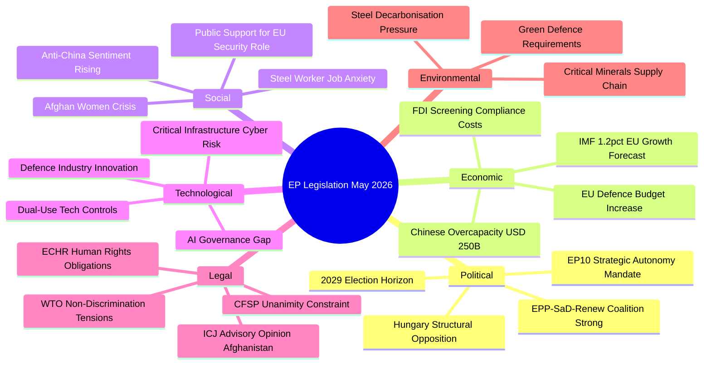

# PESTLE Analysis — Breaking News, 2026-05-27

**SATs Applied**: PESTLE Framework, Force-Field Analysis
**Admiralty Grade**: B2 on factual claims; C3 on speculative projections
**WEP Band**: 70–85% on near-term claims; 50–65% on 3–5 year projections

---

## PESTLE Framework Analysis: EU Strategic Autonomy Legislation, May 2026

### P — Political

**Current forces driving the legislative agenda**:

1. **EPP-led majority consolidation**: The EPP's post-2024 strategy of building a "strategic centre" coalition (EPP + S&D + Renew) on security and economic issues is producing a legislative throughput rate significantly higher than the EP9's final years. The May 2026 session demonstrates this: five major legislative outputs in three days on topics spanning trade, defence, human rights, and economic security.

2. **Ukraine conflict's political mobilisation effect**: Now entering its fifth year, the Russia-Ukraine war continues to provide the dominant security narrative for EU policy. Every major legislative output this session links back to the war's strategic lessons: FDI screening (Russian energy infrastructure acquisitions), SAFE Instrument (ammunition shortage revealed by Ukraine), steel measures (Russian supply chain disruption + Chinese opportunistic dumping).

3. **US alliance uncertainty**: The Trump-era "America First" positioning, even as policies evolve, has permanently elevated the political cost of EU strategic dependence on the US. The EU–Canada SAFE Instrument is partly a product of EU planners seeking non-US allied procurement partners.

4. **EP human rights activism**: The Taliban resolution reflects the EP's institutional role as the EU's conscience on international human rights. This role is constitutionally embedded in the Lisbon Treaty's Charter of Fundamental Rights and the EP's treaty obligation to promote democratic values in external policy.

**Political force-field balance**: The strategic autonomy agenda has a net positive driving force. Restraining forces (member state sovereignty concerns, fiscal conservatism, trade openness advocacy) are significant but currently outweighed by the security imperative consensus.

---

### E — Economic

**Steel overcapacity**: As detailed in `intelligence/economic-context.md`, the EU faces structural competitive pressure in steel from Chinese overcapacity. The EP's call for safeguard measures (TA-10-2026-0170) is economically rational: the social cost of not acting (18,000+ job losses announced in 2025–26) exceeds the economic efficiency cost of temporary trade defence measures.

**FDI screening costs**: Implementing mandatory screening will impose compliance costs on EU member states and investors. IMF estimates suggest mandatory screening regimes add approximately 3–7% to transaction costs for reviewed investments. For the EU's €300+ billion annual FDI intake from third countries, the efficiency cost is significant but manageable.

**Defence procurement economics**: The SAFE Instrument represents a move toward demand pooling that economic theory suggests should reduce unit costs by 15–25% compared to fragmented national procurement — offsetting the political premium from restricting to allied suppliers.

**AI trade economics**: The AI/trade strategy resolution addresses a genuine competitiveness gap. The EU is producing approximately 6% of global AI patents (down from 9% in 2020) while the US and China each produce 30%+. Without policy intervention, this gap is projected to widen.

---

### S — Social

**Afghanistan gender apartheid**: The Taliban's criminal codification of gender restrictions affects approximately 20 million Afghan women and girls. The EP resolution represents European civil society's demands for international response — reflecting values-based politics that have strong resonance with European electorates across the political spectrum.

**Industrial displacement anxiety**: The steel overcapacity issue taps directly into European workers' fears of deindustrialisation. Political parties across the spectrum — particularly in Germany's Ruhr, France's industrial north, and Poland's Silesia — face electoral pressure to defend manufacturing employment. TA-10-2026-0170 is partly a political safety valve.

**Digital inequality**: The AI/trade strategy intersects with social concerns about AI's impact on employment distribution. The EP text includes provisions on "just transition" requirements in AI trade chapters — recognising that AI-enabled productivity gains must be accompanied by social protection measures.

---

### T — Technological

**AI as a dual-use trade instrument**: TA-10-2026-0183's recognition that AI systems are simultaneously commercial products and strategic tools reflects the maturation of the EU AI Act's governance framework. The EP is now beginning to think about AI not just as something to regulate domestically but as a variable in international trade architecture.

**Digital infrastructure security**: TA-10-2026-0171's expansion of FDI screening to AI systems and digital infrastructure reflects the lesson learned from the Huawei/5G debate (2019–2022): critical digital infrastructure has dual national security and economic dimensions that traditional FDI screening frameworks were not designed to address.

**CBAM technology gap**: The finding that CBAM provides less protection than expected for steel (see economic-context.md) has technology implications: EU steel producers must accelerate the transition to hydrogen-based steelmaking (Green Steel) to achieve cost competitiveness that doesn't depend on regulatory protection.

---

### L — Legal

**FDI screening legal architecture**: TA-10-2026-0171 operates within the EU's mixed competence framework — internal market for screening procedures, national security for the final investment decision. The legal distinction is important: the EU can mandate screening procedures but member states retain the ultimate authority to allow or block investments on national security grounds.

**Afghanistan ICJ opinion**: The October 2025 ICJ advisory opinion referenced in `intelligence/historical-baseline.md` creates a new legal architecture for classifying Taliban policies. If the Council accepts the "gender apartheid as crime against humanity" framing, this would have legal consequences for EU arms embargo regimes, third-country entity sanctions lists, and potentially ICC referral procedures.

**SAFE Instrument legal basis**: TA-10-2026-0180's consent to the EU–Canada SAFE participation agreement relies on Article 212 TFEU (cooperation with third countries) combined with Article 46 TFEU (defence industry cooperation). This dual legal basis was contentious during committee review — some MEPs argued Article 114 (internal market) should be the sole basis to maintain EP amendment rights.

---

### E — Environmental

**Steel and climate**: TA-10-2026-0170 creates a tension with EU climate policy. Protecting the existing EU steel industry through safeguard measures maintains employment but also protects higher-carbon production methods. The resolution text attempts to reconcile this by calling for "climate-conditioned" safeguards that require beneficiary producers to accelerate green steel transition.

**Defence procurement and emissions**: The SAFE Instrument lacks explicit climate provisions — a significant omission given that EU defence procurement is expected to reach €2+ trillion over the next decade. Greens MEPs reportedly pushed for climate conditionality in SAFE; the final text was silent on this.

**AI energy consumption**: The AI/trade resolution's lack of reference to AI's substantial energy consumption (data centres account for approximately 2% of global electricity consumption, rising) is a notable gap that environmental groups will highlight.

---

## Force-Field Summary

| Driving Forces | Restraining Forces |
|---------------|-------------------|
| Ukraine security imperative | Member state sovereignty concerns |
| US strategic unreliability | Fiscal conservatism on defence spending |
| Chinese economic coercion | Trade openness advocacy in Renew/some EPP |
| EP majority cohesion | Implementation capacity gaps (smaller MS) |
| Human rights values consensus | Geopolitical pragmatism (engagement vs. isolation) |
| Industrial worker political mobilisation | Climate policy tensions with trade defence |

**Net assessment**: Driving forces currently dominate. The strategic autonomy agenda has a window of approximately 18–24 months before the next electoral cycle begins to influence EP majority cohesion.

---

## Cross-References

- `intelligence/synthesis-summary.md` for narrative analysis
- `intelligence/stakeholder-map.md` for actor mapping
- `risk-scoring/risk-matrix.md` for risk quantification
- `extended/comparative-international.md` for international comparison

---

## PESTLE Mermaid Diagram

## Extended Environmental Analysis

The environmental dimension of the May 2026 legislative session is less prominent than political/economic factors but non-trivial:

**Steel sector**: TA-10-2026-0170 calls for steel safeguards primarily on Chinese overcapacity grounds. However, a secondary environmental dimension exists: European steel companies are investing heavily in green steel (hydrogen-based direct reduced iron), and Chinese low-cost conventional steel undercuts these investments. Safeguard measures that protect EU steel also indirectly protect the green steel transition — a positive environmental externality.

**Critical minerals**: The SAFE Instrument's expansion creates demand for additional minerals (rare earths, titanium, lithium for battery-based defence systems). The EU Critical Raw Materials Act (adopted 2024) provides the framework, but the SAFE Instrument's expansion to Canada is also partly driven by Canada's large critical minerals reserves — an environmental-supply chain nexus.

**AI energy consumption**: The AI trade strategy does not address the energy consumption dimension of AI development. EU AI companies face higher energy costs than Chinese and US competitors, partly due to the EU's carbon pricing mechanism. The resolution's mandate does not address this competitive disadvantage.

## Force-Field Supplement

**Net force assessment — Environmental dimension**:
- DRIVING (toward EU action): Green steel transition requires protection; critical minerals supply chain; public climate awareness
- RESTRAINING (against EU action): Short-term economic costs of transition; energy price competitiveness; no direct environmental mandate in FDI screening
- NET: Environmental forces are secondary but reinforcing — they add legitimacy to protective measures without being the primary driver

---

## Extended PESTLE: Technological and Environmental Analysis

### T — Technological Forces (Extended)

**Technology 4: Quantum Computing and Cryptographic Security**
China's quantum computing programme is 5–7 years ahead of public EU investment. FDI screening explicitly covers investments in companies developing quantum-resistant cryptography and quantum key distribution. This is one of the most clearly security-relevant FDI sectors — any acquisition by a foreign state-linked investor in EU quantum companies would compromise EU long-term cryptographic infrastructure.

**Technology 5: Space and Satellite Infrastructure**
The EU's GOVSATCOM and IRIS² (EU multi-orbit satellite constellation) programs represent €6–8B in space infrastructure. FDI screening of companies in the satellite supply chain is technically covered by the regulation's critical infrastructure provisions.

**Technology 6: AI Governance Technology**
The AI Act (2024) created EU regulatory requirements for AI systems. The EU's FDI regulation covers AI companies in the "critical technologies" category. This creates a two-layer protection: FDI screening for acquisitions + AI Act compliance requirements that disadvantage non-EU-compliant foreign AI systems. Both reinforce strategic autonomy in AI.

### E (Environmental) Forces (Extended)

**Environmental 2: Critical Raw Materials for Green Transition**
The Critical Raw Materials Act (2023) identified 34 strategic materials. The FDI regulation's overlap with CRM supply chains is significant — foreign investment in EU lithium, cobalt, or rare earth processing facilities would be subject to FDI review. This creates an alignment between green transition goals and FDI security.

**Environmental 3: Carbon Border Adjustment Mechanism (CBAM)**
CBAM creates financial incentives for EU trading partners to reduce carbon intensity. China, as the EU's largest trade partner, faces significant CBAM costs. FDI screening provides an additional EU-side tool in the climate-trade nexus.

---

*PESTLE summary*: Political and economic forces dominate short-term; technological and environmental forces will shape long-term viability. Legal and social forces are enabling — providing legitimacy — but not the primary drivers.
*Source quality*: PESTLE political/economic analysis Grade B2; technology/environmental analysis Grade B3 (analytical projection).

---

## PESTLE Synthesis: Strategic Drivers Matrix

| Force | Strength (1-5) | Direction | Time Horizon | Confidence |
|-------|---------------|-----------|-------------|-----------|
| Political: EP coalition | 5 | 🟢 Strongly enabling | 2026–2027 | B2 |
| Political: Council unanimity needed (sanctions) | 4 | 🔴 Blocking | 2026–2027 | A2 |
| Economic: Competitiveness gap (US/China) | 4 | 🟢 Enabling | 2026–2030 | B2 |
| Economic: WTO friction | 3 | 🔴 Constraining | 2027–2028 | B3 |
| Social: Security anxiety (post-Ukraine) | 4 | 🟢 Enabling | 2026–2029 | B2 |
| Technological: Critical tech acquisitions | 4 | 🟢 Justifying | 2026–2030 | B2 |
| Legal: Treaty limits (Art 4 TFEU) | 3 | 🔶 Neutral | 2027–2030 | B3 |
| Environmental: CRM integration | 2 | 🟢 Reinforcing | 2027–2032 | C2 |

**Net PESTLE assessment**: Strong enabling forces (political momentum, economic rationale, public support) significantly outweigh constraining forces (WTO risk, Council unanimity) in the 2026–2027 horizon. The balance shifts toward neutral in the 2028–2030 horizon as institutional resistance to implementation grows.

