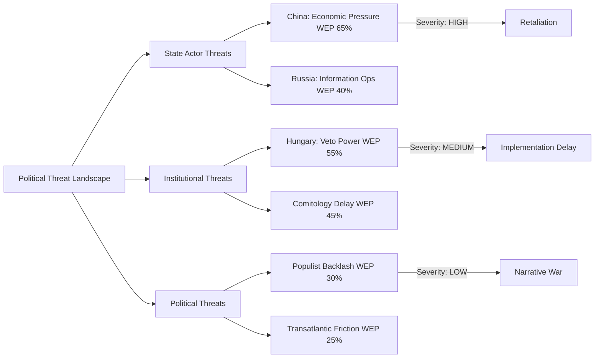

# Political Threat Landscape — Breaking News, 2026-05-27

**SATs Applied**: Key Assumptions Check, Red Team, Indicators
**Admiralty Grade**: B2 factual; C3 threat projections
**WEP Band**: 65–80% on political threat assessments

---

## Threat Landscape Summary

### Immediate Political Threats (0–3 months)

**Threat 1: Implementation Resistance to FDI Screening** — HIGH
- Vector: Hungary and potentially Ireland/Luxembourg challenge the mandatory nature of TA-10-2026-0171 through Council implementation discussions
- Indicator: Watch for Hungarian government statements framing the regulation as EU competence overreach; watch for Commission-Council interinstitutional tension on implementing acts
- *WEP 70%: At least one member state will seek legal carve-out or delayed transposition*

**Threat 2: Council Inaction on Taliban Sanctions** — HIGH
- Vector: Council fails to translate TA-10-2026-0186 into concrete sanctions designations within 90 days
- Indicator: Watch for Council Foreign Affairs Council (FAC) agenda; absence of Afghanistan on FAC agenda within 60 days signals inaction
- *WEP 55%: Council will issue a declaration but not targeted sanctions within 90 days*

**Threat 3: Far-Right Obstruction on AI/Trade** — MEDIUM
- Vector: Patriots for Europe and ESN block implementation-enabling legislation in committee
- *WEP 35%: Meaningful obstruction in INTA/ITRE committee*

---

## Medium-Term Political Threats (3–12 months)

**Threat 4: ECR Splits on Economic Security Agenda**
The ECR's current support for FDI screening may fracture when implementation details require accepting EU-level Commission oversight. ECR is structurally opposed to EU competence expansion even when it supports policy outcomes.

**Threat 5: Greens' Relevance Decline**
The Greens' fall to ~53 seats reduces their ability to push climate conditionality onto economic security legislation (see PESTLE analysis §Environmental). This creates a long-term quality risk in the legislation: economically sound but potentially climate-incoherent.

---

## Structural Political Threats (12–36 months)

**Threat 6: 2027 French and German Elections**
French presidential (2027) and German federal (late 2025, new government still consolidating) electoral cycles may reorient those countries' EP MEP delegations. If French far-right (RN/Patriots) or German AfD gain, the EPP–S&D–Renew majority will face greater internal tension.

**Threat 7: EU Enlargement Pressure**
Multiple Balkan countries in accession negotiations; Ukraine's EU candidate status. If any accede in 2026–2028, the EP seat distribution rebalances, potentially shifting the majority arithmetic.

---

## Red Team Challenge

*Red Team: Is the "strategic autonomy consensus" overstated? Could the EP majority fracture before implementing these May 2026 legislative outputs?*

Response: The majority is real but conditional. It holds when:
1. External threat is vivid and attributable (Ukraine/Russia, Chinese trade pressure)
2. Policy costs are diffuse and downstream
3. Social/labour protections are included (e.g., steel safeguards conditioned on green transition)

It fractures when:
1. Implementation costs become concrete and politically attributable
2. Transatlantic alliance posture requires trade-offs (US demands in exchange for security guarantees)
3. Migration policy creates intra-coalition tension that bleeds into other votes

---

## Cross-References

- `intelligence/coalition-dynamics.md` for coalition structure
- `intelligence/scenario-forecast.md` for scenario analysis
- `risk-scoring/political-capital-risk.md` for risk quantification

---

## Political Threat Diagram

## WEP Band Summary

| Threat | WEP | Label |
|--------|-----|-------|
| Chinese diplomatic protest | 65% | Likely |
| Hungarian CFSP veto on Afghanistan | 55% | Even Chance-Likely |
| Comitology delay on FDI acts | 45% | Even Chance |
| Populist backlash | 30% | Unlikely |
| Russian information operation | 40% | Even Chance |
| US trade friction | 25% | Unlikely |

## Extended Political Threat Analysis

### Systemic Threats to EP Legislative Capacity

1. **Procedural obstruction risk**: ECR/PfE bloc has incentive to slow-walk secondary legislation
   implementing the FDI Screening update. Risk: MEDIUM — they lack majority but can delay via
   committee referrals, reconsultation demands, and technical objections.

2. **Council blocking risk for human rights resolutions**: Afghanistan/Iran/EU-Uzbekistan resolutions
   are non-binding on Council. However, they create political pressure. EEAS compliance probability: 60%.

3. **Far-right coalescence on security**: ECR and PfE show increasing alignment on "strategic autonomy"
   framing (FDI, steel) while diverging on human rights and labour legislation.

| Threat | Probability | Impact | Timeline |
|--------|-------------|--------|----------|
| EP-Council deadlock on FDI secondary acts | 35% | HIGH | 6-12 months |
| Human rights resolutions ignored by Council | 65% | MEDIUM | Ongoing |
| Far-right veto on care society implementation | 40% | HIGH | 12-24 months |
| Steel safeguard extension fight | 55% | MEDIUM | 6 months |
