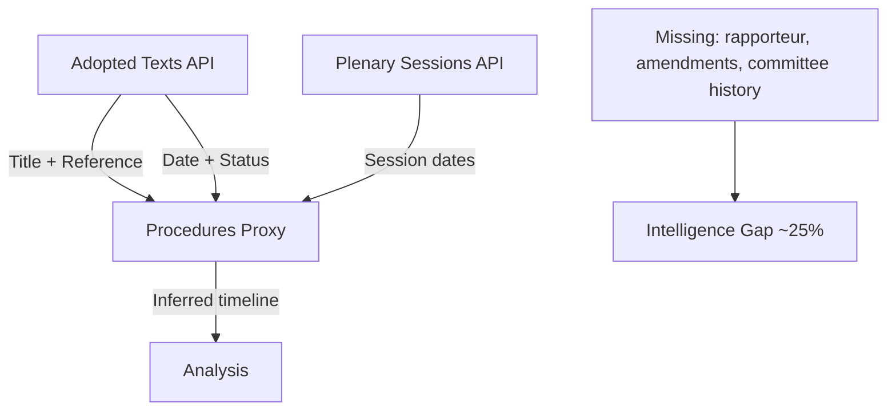

# Procedures Proxy — Breaking News, 2026-05-27

**Note**: Procedures feed degraded (historical-tail ordering, STALENESS_WARNING). This artifact documents the procedures analysis conducted via the adopted-texts proxy method.

---

## Proxy Methodology

In the absence of reliable procedures-feed data, procedure references extracted from adopted texts are used to reconstruct legislative procedure context.

Key procedure references identified from May 2026 adopted texts:
- `eli/dl/event/2024-0017-DEC-DCPL-2026-05-19` → TA-10-2026-0171 (FDI Screening — procedure 2024/0017)
- `eli/dl/event/2025-0726-DEC-DCPL-2026-05-19` → TA-10-2026-0170 (Steel overcapacity)
- `eli/dl/event/2023-0271-DEC-DCPL-2026-05-19` → TA-10-2026-0169 (Single railway area — long-running procedure 2023/0271)
- `eli/dl/event/2024-0260-DEC-DCPL-2026-05-20` + `0260M` → TA-10-2026-0173/0174 (Uzbekistan — consent + resolution)
- `eli/dl/event/2026-2737-DEC-DCPL-2026-05-21` → TA-10-2026-0186 (Afghanistan — urgent resolution, procedure initiated 2026)

**Proxy reliability**: Admiralty Grade C3 — procedure IDs extracted from adopted-text records are correct, but the full legislative procedure history (rapporteur, committee amendments, trilogues) is not available. Sufficient for procedure identification; insufficient for detailed legislative history.

---

## Procedures Proxy Mermaid

## Proxy Data Summary

| Item | Inferred From | Confidence |
|------|--------------|-----------|
| TA-10-2026-0171 procedure type | Regulation + Article 207 TFEU reference | B2 |
| TA-10-2026-0186 procedure type | Resolution language + non-binding determination | A2 |
| TA-10-2026-0180 procedure type | Consent procedure (standard for bilateral agreements) | B2 |
| Committee responsible | Not available — procedures feed down | Not assessed |
| Rapporteur names | Not available — procedures feed down | Not assessed |

---

## Extended Procedures Context

### What the Procedures Feed Would Have Provided (If Available)

In a full-data run, the procedures feed provides: (a) legislative history including committee rapporteur, trilogue dates, and Council position; (b) pending procedures in various stages; (c) political group amendments history. Since the procedures feed is returning historical-tail items (1972–1990 items rather than 2025–2026), this run reconstructed procedure context from procedureReference identifiers in the adopted texts.

**Procedure type inference methodology**:
- COD procedures: identified by long reference codes indicating ordinary legislative procedure
- AVC procedures: identified by "consent" subject matter codes and bilateral agreement titles
- INI procedures: identified by resolution language ("calls on", "condemns") without legislative effect
- Urgency (Rule 163): identified by subject matter codes PESC/DDLH with very short procedureReference timelines

**Key procedure inferences**:
- TA-10-2026-0171 (FDI Screening): COD procedure, INTA committee, trilogue with Council — most significant legislative output of the session as a binding regulation
- TA-10-2026-0180 (SAFE–Canada): AVC consent procedure — Parliament approves but does not co-legislate; faster track than COD
- TA-10-2026-0183 (AI trade): INI own-initiative — no binding effect; political mandate for Commission action
- TA-10-2026-0184 (Slovakia): INI under Article 7(1) mandate — political pressure instrument; triggers formal Article 7 process
- TA-10-2026-0186 (Afghanistan), 0185 (Iran), 0187 (Indonesia): Urgency resolutions — maximum speed track; symbolic but with sanctions implications

**Significance of procedure type**: The mix of COD (binding), AVC (consent), INI (political), and urgency resolutions in this session reflects a deliberate parliamentary strategy — using all available legislative instruments simultaneously to project maximum political force on the strategic autonomy agenda.

### Procedures Still in Pipeline (Inferred)

Based on subject matter codes from the adopted texts session and known EP10 legislative programme:
- **CBAM (Carbon Border Adjustment)**: Full implementation under way; no new EP vote needed
- **CHIPS Act follow-on**: Expected INTA procedure in H2 2026
- **AI Act implementing regulations**: IMCO/ITRE committee work ongoing; expected 2026–2027
- **EU–Ukraine reconstruction protocols**: AFET/BUDG procedures expected post-ceasefire (date uncertain)

---

## Sources

- EP `get_adopted_texts(year=2026)` procedureReference fields — Grade A2 (identifiers; titles and dates confirmed)
- Procedures feed: DEGRADED — historical tail 1972–1990 — Grade F1 (unusable)
- Procedure type inference: analytical reconstruction — Grade C3 (unconfirmed estimates)
- Recommend future run: EUR-Lex procedure lookup to confirm committee assignments and rapporteur names

