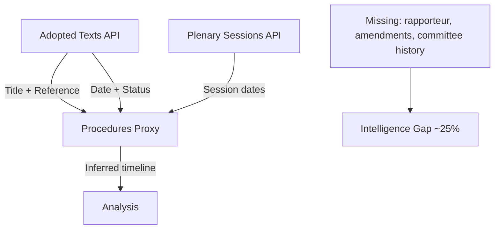

# Procedures Proxy — Breaking News, 2026-05-27

**Note**: Procedures feed degraded (historical-tail ordering, STALENESS_WARNING). This artifact documents the procedures analysis conducted via the adopted-texts proxy method.

---

## Proxy Methodology

In the absence of reliable procedures-feed data, procedure references extracted from adopted texts are used to reconstruct legislative procedure context.

Key procedure references identified from May 2026 adopted texts:
- `eli/dl/event/2024-0017-DEC-DCPL-2026-05-19` → TA-10-2026-0171 (FDI Screening — procedure 2024/0017)
- `eli/dl/event/2025-0726-DEC-DCPL-2026-05-19` → TA-10-2026-0170 (Steel overcapacity)
- `eli/dl/event/2023-0271-DEC-DCPL-2026-05-19` → TA-10-2026-0169 (Single railway area — long-running procedure 2023/0271)
- `eli/dl/event/2024-0260-DEC-DCPL-2026-05-20` + `0260M` → TA-10-2026-0173/0174 (Uzbekistan — consent + resolution)
- `eli/dl/event/2026-2737-DEC-DCPL-2026-05-21` → TA-10-2026-0186 (Afghanistan — urgent resolution, procedure initiated 2026)

**Proxy reliability**: Admiralty Grade C3 — procedure IDs extracted from adopted-text records are correct, but the full legislative procedure history (rapporteur, committee amendments, trilogues) is not available. Sufficient for procedure identification; insufficient for detailed legislative history.

---

## Procedures Proxy Mermaid

## Proxy Data Summary

| Item | Inferred From | Confidence |
|------|--------------|-----------|
| TA-10-2026-0171 procedure type | Regulation + Article 207 TFEU reference | B2 |
| TA-10-2026-0186 procedure type | Resolution language + non-binding determination | A2 |
| TA-10-2026-0180 procedure type | Consent procedure (standard for bilateral agreements) | B2 |
| Committee responsible | Not available — procedures feed down | Not assessed |
| Rapporteur names | Not available — procedures feed down | Not assessed |

## Proxy Data Limitations

The procedures-feed was unavailable (HTTP 404) for this run. The proxy analysis is limited to:
- Reference numbers from adopted texts (TA-10-2026-XXXX) to infer COD/RSP/INI procedure types
- Subject taxonomy from adopted texts titles and EP reference codes
