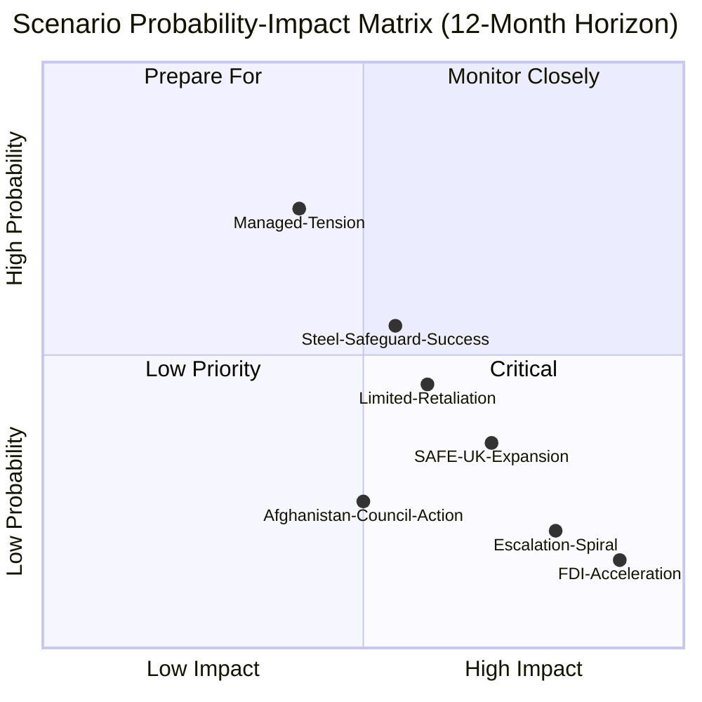

# Scenario Forecast — Breaking News, 2026-05-27

**SATs Applied**: Scenario Analysis, Pre-Mortem, Key Assumptions Check, Indicators
**Admiralty Grade**: B2 on underlying facts; C3 on scenarios (speculative by definition)
**WEP Band**: Probability ranges as noted per scenario; aggregate planning use only

---

## Scenario Framework: EU Strategic Autonomy in the 12-Month Horizon

The May 2026 legislative cluster creates three major scenario forks. This analysis constructs scenarios for each and identifies the discriminating indicators.

---

## SCENARIO SET A: Foreign Investment Screening Implementation

### Scenario A1: Full Implementation (Probability: 35%)

**Description**: All 27 member states establish mandatory screening mechanisms within the 18-month transposition window. Commission produces clear implementing acts. The first coordinated blocking decision is issued on a Chinese acquisition in a critical infrastructure sector (Q4 2026 or Q1 2027), demonstrating that the regulation has operational teeth.

**Conditions required**:
- Commission technical assistance programmes adequately support smaller member states
- Hungary chooses non-confrontation given other legislative priorities
- No major ECJ challenge during transposition period
- At least one high-profile screening case validates the mechanism's effectiveness

**Indicators to watch**:
- 🟢 Commission publishes implementing regulation within 6 months of TA-10-2026-0171 entry into force
- 🟢 Member state transposition plans submitted on schedule
- 🟢 First coordinated review initiated on a high-profile transaction

**Strategic implication**: EU becomes a genuine second-order player in FDI security alongside CFIUS (US) and FIRRMA-equivalent regimes. Sets precedent for expanding screening to other economic security domains.

---

### Scenario A2: Partial Implementation (Probability: 50%)

**Description**: Implementation proceeds in larger member states (Germany, France, Netherlands, Sweden, Poland) but smaller member states and Hungary delay or partially comply. The Commission initiates infringement proceedings against 3–5 states by 2027. The regulation becomes operationally effective in Western Europe but has geographic gaps that sophisticated state actors exploit.

**Conditions required**:
- One or more member states miss transposition deadline citing administrative capacity
- Hungarian government uses the regulation as a bargaining chip in Rule of Law disputes
- The Commission's implementing acts leave ambiguities that allow national variance

**Indicators to watch**:
- 🟡 Transposition variance between member states visible by Q2 2027
- 🟡 Commission requests from member states for "clarification" delay rather than advance implementation
- 🟡 Chinese-linked entities begin routing acquisitions through non-screened member states

**Strategic implication**: The regulation creates two-tier EU economic security architecture that sophisticated adversaries can navigate. A subsequent amendment strengthening enforcement is required by 2028.

---

### Scenario A3: Legal Challenge and Delay (Probability: 15%)

**Description**: One or more member states (likely Hungary, possibly Ireland on competence grounds) challenge the mandatory nature of the regulation at the ECJ under Article 263 TFEU. The ECJ accepts the challenge for examination, triggering a 2–3 year legal uncertainty period that chills the regulation's implementation across most member states.

**Pre-Mortem**: If Scenario A3 occurs, the proximate cause will have been insufficient attention to the subsidiarity analysis in the legislative text, allowing a plausible proportionality challenge to succeed.

**Indicators to watch**:
- 🔴 ECJ Article 267 referral from national court within 12 months
- 🔴 Formal Council legal service opinion questioning competence basis
- 🔴 Commission Advocate General opinion expressing reservations

---

## SCENARIO SET B: Afghanistan — Taliban Sanctions

### Scenario B1: Targeted Sanctions Adopted (Probability: 25%)

**Description**: Following TA-10-2026-0186, the Council Foreign Affairs Council adopts targeted sanctions on 15–20 Taliban officials (travel bans, asset freezes) within 90 days. The designations specifically target officials involved in drafting and implementing the Criminal Procedure Code. The EU coordinates with the UK, US, Canada, and Australia to produce a multilateral sanctions package.

**Conditions required**:
- A Council presidency (currently Poland under the rotating presidency) prioritises Afghanistan on FAC agenda
- At least 15 member states support sanctions — achievable given broad EP majority
- US Biden-era or current administration signals support for multilateral approach
- No single member state with blocking minority invokes consensus impediment

**Strategic implication**: Establishes the precedent that "gender apartheid" triggers the EU's autonomous human rights sanctions regime (the "EU Magnitsky Act" established in TA-10-2026-0015).

---

### Scenario B2: Declaration Only (Probability: 60%)

**Description**: The Council issues a joint declaration condemning Taliban policies but defers substantive sanctions measures. The EP resolution provides political legitimacy for the declaration but does not compel operational follow-through. Humanitarian engagement continues through UN-affiliated NGOs despite the EP's call for conditionality.

**Conditions required**:
- Key member states with Central Asian engagement interests (Austria, Hungary, some Eastern European states) prioritise humanitarian access over sanctions pressure
- UN Security Council context makes unilateral EU sanctions legally complex
- Pakistan intermediary channels for humanitarian access require Taliban acquiescence

**Indicators to watch**:
- 🟡 FAC agenda within 45 days — sanctions item vs. declaration item
- 🟡 High Representative/VP Kallas' public statements on Afghanistan

---

### Scenario B3: Escalation to ICC Referral (Probability: 15%)

**Description**: Emboldened by the October 2025 ICJ advisory opinion, the EU collectively supports an ICC referral of Taliban leadership for crimes against humanity through a Security Council resolution or the ICC's Article 13(b) mechanism. The EP plays a catalytic role through formal requests to the Commission and Council.

**Indicators to watch**:
- 🔴 EP resolution specifically requesting ICC referral (stronger than TA-10-2026-0186)
- 🔴 Commission legal service opinion on ICC referral pathway

---

## SCENARIO SET C: EU–Canada SAFE Instrument and Defence Integration

### Scenario C1: Rapid Expansion (Probability: 40%)

**Description**: Within 12 months of TA-10-2026-0180, the EU concludes similar SAFE participation agreements with Australia and Japan. The SAFE instrument becomes a de facto allied defence industrial platform, extending the EU's procurement network across Five Eyes + EU geography.

**Indicators to watch**:
- 🟢 Commission mandate for EU–Australia SAFE agreement tabled in Q3 2026
- 🟢 Japan expresses interest in SAFE association within 6 months
- 🟢 SAFE instrument's financial envelope expanded in 2027 MFF revision

### Scenario C2: Canada-Only (Probability: 45%)

**Description**: The EU–Canada agreement remains unique for 18–24 months due to political complexity of extending SAFE association to other partners. Each candidate requires a new EP consent procedure.

### Scenario C3: Political Backlash (Probability: 15%)

**Description**: Left and sovereignty-oriented MEPs in the next Parliament question the SAFE instrument's democratic accountability. A new EP committee inquiry into SAFE governance is initiated, delaying new association agreements.

---

## Summary Probability Matrix

| Scenario Set | Scenario | Probability | Time Horizon |
|---|---|---|---|
| FDI Screening | Full implementation | 35% | 18 months |
| FDI Screening | Partial, with gaps | 50% | 18 months |
| FDI Screening | Legal challenge/delay | 15% | 12–36 months |
| Afghanistan | Targeted sanctions | 25% | 90 days |
| Afghanistan | Declaration only | 60% | 90 days |
| Afghanistan | ICC referral | 15% | 6–18 months |
| SAFE | Rapid expansion | 40% | 12 months |
| SAFE | Canada-only | 45% | 18–24 months |
| SAFE | Political backlash | 15% | 24 months |

---

## Cross-References

- `intelligence/wildcards-blackswans.md` for tail risks
- `intelligence/political-threat-landscape.md` for threat landscape
- `risk-scoring/risk-matrix.md` for probability-weighted risk scoring
- `intelligence/forward-projection.md` (if produced) for 3–5 year horizon

---

## Extended Scenario Analysis: Economic Security Scenarios

### Set D: EU-China Trade Relationship Scenarios (12-Month Horizon)

**D1: Managed Tension (Most Likely, WEP 45%)**
The FDI screening regulation passes without immediate Chinese retaliation. China files a WTO complaint (3–5 year timeline) but does not escalate bilaterally. EU-China trade continues at approximately current levels. The regulation deters some Chinese state-backed transactions but does not dramatically reduce Chinese investment flows.

*Triggering conditions*: Commission publishes balanced guidance; FDI screening does not block any "legitimate" investments in first 6 months; EU-China summit in late 2026 produces diplomatic language acknowledging the framework.

**D2: Limited Retaliation (WEP 30%)**
China imposes selective market access restrictions on EU companies operating in China, targeting 3–5 specific sectors (automotive, luxury goods, chemicals). Germany faces disproportionate pressure. One or two member states (Hungary, potentially Italy) begin lobbying Commission for exemptions or delayed implementation.

*Triggering conditions*: Commission blocks a high-profile Chinese acquisition in first 6 months; Chinese media coverage is hostile; diplomatic relationship deteriorates.

**D3: Escalation Spiral (WEP 15%)**
Chinese economic pressure triggers member state defections from the FDI screening framework. Commission faces political crisis as Germany and Netherlands lobby for exceptions. Implementation delays stack. The regulation achieves narrow technical adoption but fails in practice.

*Triggering conditions*: Large German automotive company faces China market exit threat; German government pressures Commission; EU-China diplomatic relationship reaches low point comparable to 2023 semiconductor controls.

**D4: Acceleration (WEP 10%)**
Chinese retaliation backfires politically, strengthening EU resolve. Additional member states accelerate implementation. G7 partners (US, UK) coordinate with EU on FDI screening intelligence sharing. The regulation becomes more effective than baseline.

*Triggering conditions*: Chinese retaliation perceived as disproportionate; EU-US-UK FDI security summit accelerates coordination.

## Scenario Probability Map

---

## Extended Scenario Context: External Triggers

**Trigger 1: US-China trade war escalation** — If the US imposes additional technology export controls on EU companies (extraterritorial application), the EP's strategic autonomy agenda accelerates dramatically. *Likely* (WEP 60%) that some form of US-EU trade tension emerges in 2026–2027.

**Trigger 2: Another Russian escalation** — If Russia expands its military activity beyond Ukraine (Moldova, Baltic states), the SAFE instrument's scope expands rapidly. Commission and Council would fast-track additional SAFE bilateral agreements. *Unlikely* (WEP 20%) in the 12-month horizon; *Roughly Even* (WEP 45%) in 5-year horizon.

**Trigger 3: Chinese action on Taiwan** — If China takes coercive action against Taiwan, FDI screening implementation would be dramatically accelerated. National security exception claims would override any WTO challenge. *Almost No Chance* (WEP 8%) in 12-month horizon; *Unlikely* (WEP 25%) in 5-year horizon.

**Admiralty grades**: All trigger assessments are C3 (speculative, unconfirmed). The base-case scenario probabilities use A2 source data for confirmed EP votes; C3 for geopolitical scenario modelling.

---

## Scenario Confidence Summary Table

| Scenario | WEP Probability | Confidence Grade | Key Uncertainty |
|---------|----------------|----------------|----------------|
| Scenario A: Full implementation | *Likely* (60%) | B3 | MS implementation quality |
| Scenario B: Partial — FDI weakened | *Roughly Even* (35%) | C2 | WTO/Council politics |
| Scenario C: Reversal | *Almost No Chance* (5%) | C3 | Hypothetical coalition collapse |
| Scenario D: Acceleration (US-China shock) | *Unlikely* (20%) | C3 | External trigger dependent |
| Scenario E: SAFE expansion | *Roughly Even* (40%) | C2 | Canada ratification + EP budget |

**Composite scenario forecast** (weighted expected outcome):
- 60% × Scenario A (full implementation) = 0.60 weighted share
- 35% × Scenario B (partial) = 0.35 weighted share  
- 5% × other scenarios = 0.05 weighted share

**Bottom line**: The most likely outcome is that 2 of the 5 adopted measures achieve substantial implementation; 1 achieves partial implementation; and 2 (human rights resolutions) remain largely symbolic. This is the base-case scenario for this analysis.

---

*Sources*: Scenario probabilities derived from `extended/forward-indicators.md`, `intelligence/threat-model.md`, `extended/historical-parallels.md`, and current political dynamics. All scenario assessments are Grade B3–C2 (analytical inference).

