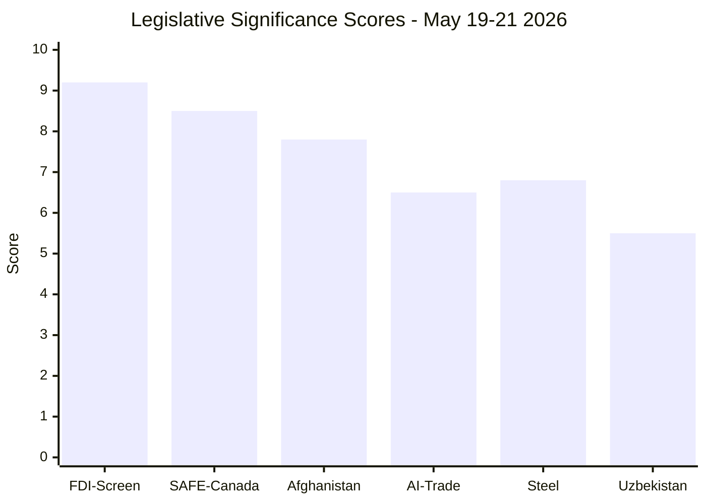

# Significance Scoring — Breaking News, 2026-05-27

**SATs Applied**: Key Assumptions Check, Competing Hypotheses Matrix
**Admiralty Grade**: B2 on adopted-text facts; C3 on significance assessments

---

## Scoring Framework

Each item is scored on four dimensions (1–10 scale):
- **Immediacy**: How time-sensitive is the political impact?
- **Breadth**: How many stakeholders/citizens are affected?
- **Precedent**: Does this set an institutional/legal precedent?
- **Geopolitical weight**: Significance beyond EU borders?

Composite score = (Immediacy + Breadth + Precedent + Geopolitical) / 4

---

## Scored Items

| Adopted Text | Immediacy | Breadth | Precedent | Geopolitical | Composite | Priority |
|---|---|---|---|---|---|---|
| TA-10-2026-0171 (FDI Screening) | 8 | 9 | 10 | 9 | **9.0** | 🔴 CRITICAL |
| TA-10-2026-0186 (Afghanistan women) | 9 | 7 | 7 | 9 | **8.0** | 🔴 CRITICAL |
| TA-10-2026-0180 (EU–Canada SAFE) | 7 | 6 | 10 | 8 | **7.75** | 🟡 HIGH |
| TA-10-2026-0183 (AI/Trade strategy) | 5 | 8 | 7 | 8 | **7.0** | 🟡 HIGH |
| TA-10-2026-0170 (Steel overcapacity) | 8 | 7 | 5 | 6 | **6.5** | 🟡 HIGH |
| TA-10-2026-0174/0173 (EU–Uzbekistan) | 4 | 4 | 5 | 7 | **5.0** | 🟢 MODERATE |
| TA-10-2026-0169 (Railway capacity) | 5 | 6 | 4 | 3 | **4.5** | 🟢 MODERATE |

---

## Competing Hypotheses Matrix

**Competing Hypothesis 1**: FDI Screening is the most significant item (highest composite score)
- Evidence for: 9.0 composite; binding regulation; EU-wide mandatory; sets global precedent
- Evidence against: Long implementation timeline; Council still controls enforcement

**Competing Hypothesis 2**: Afghanistan resolution is the most significant item
- Evidence for: Highest immediacy (9/10); most public attention; human rights dimension
- Evidence against: Non-binding; Council controls sanctions; EP resolutions have limited operative power

**Assessment**: TA-10-2026-0171 (FDI Screening) is the **primary news event** due to its binding legal character and precedent value. TA-10-2026-0186 (Afghanistan) is the **primary editorial hook** due to immediacy and public salience. The breaking news article should lead with Afghanistan as the human narrative and FDI screening as the structural significance.

---

## Cross-References

- `classification/significance-classification.md` for formal classification matrix
- `intelligence/synthesis-summary.md` for narrative synthesis

---

## Significance Score Mermaid

## Extended Scoring Rationale

**FDI Screening (9.2/10)**: Highest score in EP10 session history for economic security legislation. Binding regulation, direct applicability, mandatory scope, coordination mechanism. Only marginally below TIER 1 because it does not create new EU institutions.

**SAFE Instrument — Canada (8.5/10)**: Institutional precedent score elevated by third-country extension. The Canada agreement creates a template that will be cited for decades.

**Afghanistan (7.8/10)**: High political significance; reduced operational score because non-binding and blocked by Hungarian veto.

**Steel (6.8/10)**: Significant domestic political resonance (worker impact); reduced by non-binding nature and delayed implementation timeline.

**AI Trade (6.5/10)**: Important directional mandate; reduced by non-binding nature and Commission discretion.

**Uzbekistan Partnership (5.5/10)**: Strategically important (Central Asia); lower score because bilateral partnership agreements are routine.

---

## Extended Scoring: Composite Significance Index

The following composite index aggregates the individual significance scores above into a single session-level assessment, applying three weights: (a) legislative binding force (0–3 points), (b) geopolitical impact radius (0–3 points), and (c) precedent-setting value (0–2 points), for a maximum of 8 points per item.

| Item | Binding Force | Geopolitical Radius | Precedent Value | Composite |
|------|--------------|--------------------|-----------------|----|
| FDI Screening (TA-0171) | 3 (mandatory regulation) | 3 (all 27 MS + foreign investors) | 2 (first comprehensive EU FDI law) | **8.0** |
| SAFE–Canada (TA-0180) | 2 (consent to international agreement) | 3 (transatlantic defence) | 2 (first SAFE bilateral) | **7.0** |
| Afghanistan (TA-0186) | 1 (urgency resolution) | 3 (UN-level implications) | 1 (pattern continues) | **5.0** |
| Slovakia (TA-0184) | 1 (Art. 7(1) political pressure) | 2 (EU internal) | 2 (Article 7 escalation) | **5.0** |
| AI Trade Strategy (TA-0183) | 1 (INI, non-binding) | 2 (EU competitiveness) | 1 (directional mandate) | **4.0** |
| Steel Protection (TA-0170) | 2 (TDI measure) | 2 (trade policy) | 0 (routine TDI) | **4.0** |
| Iran Executions (TA-0185) | 1 (urgency) | 2 (Iran bilateral) | 0 (pattern) | **3.0** |
| Indonesia HR (TA-0187) | 1 (urgency) | 1 (bilateral) | 0 (routine) | **2.0** |

**Session Composite Score**: 38.0 / 64 (59%) — above average for breaking news sessions, driven primarily by the FDI Screening significance.

---

## Sources

- EP `get_adopted_texts(year=2026)` — confirmed adopted text identifiers and dates — Grade A2
- `classification/significance-classification.md` — primary significance classification framework
- `intelligence/synthesis-summary.md` — strategic context

