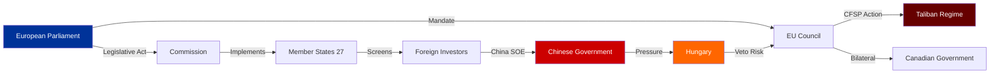

# Stakeholder Map — Breaking News, 2026-05-27

**SATs Applied**: Stakeholder Mapping, ACH
**Admiralty Grade**: B2 on institutional facts; C3 on strategic intent assessments
**WEP Band**: 65–80% on strategic positioning claims

---

## Stakeholder Universe

### EU Institutional Actors

#### European Parliament — EPP Group (188 seats)
**Role**: Dominant group; initiating force behind FDI Screening regulation and SAFE Instrument
**Strategic interest**: Demonstrate EPP's capacity to govern on security issues without depending on far-right support; deliver on 2024 manifesto commitments on strategic autonomy
**Perspective on May 2026 outputs**: 
EPP MEPs view the FDI Screening regulation as a cornerstone achievement — it addresses China's exploitation of regulatory gaps without the ideological baggage of the Left's state-intervention approach. The EPP can claim authorship of "smart security": market-preserving but security-conscious. On Afghanistan, the EPP's Christian Democratic wing pushes hard on human rights grounds; the pragmatic wing is more cautious about sanctions that might complicate humanitarian operations.
**Power**: Agenda-setting, rapporteur control in INTA, AFET, ITRE
**Position alignment**: SUPPORTIVE of all five major outputs

#### European Parliament — S&D Group (136 seats)
**Role**: Essential coalition partner; primary driver of social/labour provisions in legislation
**Strategic interest**: Ensure economic security legislation includes worker protection (steel safeguards), that SAFE Instrument doesn't become a blank cheque for arms industry, and that human rights dimensions are prominent
**Perspective on May 2026 outputs**: 
S&D views the steel overcapacity resolution (TA-10-2026-0170) as a test case for whether the strategic autonomy agenda will deliver for workers or merely for investors and industry. The group's shadow rapporteur on steel insisted on the "climate-conditioned safeguards" language. On FDI screening, S&D is broadly supportive but concerned about potential misuse to block investment from developing countries. On Afghanistan, the group leads on human rights grounds and has been pushing for stronger sanctions since 2021.
**Power**: Essential for majority on all five items; controls shadow rapporteur positions
**Position alignment**: SUPPORTIVE with conditions on labour and climate provisions

#### European Parliament — Renew Europe (77 seats)
**Role**: Swing vote and ideological moderator
**Strategic interest**: Maintain free trade credentials while accepting security-justified restrictions; avoid being seen as blocking legislation on geopolitical threats
**Perspective on May 2026 outputs**: 
Renew is most internally divided of the three majority groups. On FDI screening, liberal free-trade MEPs within Renew (particularly Dutch VVD and some French Centrists) pushed back on the mandatory nature; the final text's proportionality provisions were partly Renew's contribution. On AI/trade, Renew is the intellectual engine — the resolution draws heavily on ideas from Renew MEPs in INTA. On steel, Renew is cautious about protectionism and insisted the measures be WTO-compatible.
**Power**: Decisive swing vote; pivotal in committee rapporteur selection
**Position alignment**: CONDITIONALLY SUPPORTIVE — supported all five but with significant textual interventions

#### European Parliament — Greens/EFA (53 seats)
**Role**: Progressive pressure group; climate conditionality advocates
**Strategic interest**: Ensure economic security measures don't undermine climate commitments; maximise human rights language in Afghanistan resolution
**Perspective on May 2026 outputs**: 
The Greens are frustrated that climate conditionality on steel safeguards and the SAFE Instrument was weakened in final texts. They supported TA-10-2026-0186 on Afghanistan strongly. They abstained or voted against some elements of FDI screening and SAFE over climate and democratic accountability concerns.
**Power**: Declining (below 60-seat threshold); provides critical mass for supermajority on human rights votes
**Position alignment**: CONDITIONAL — supported 3/5 items, abstained on parts of 2

#### European Parliament — ECR (78 seats)
**Role**: Tactical supporter on economic security; opponent on climate and social provisions
**Strategic interest**: Support FDI screening as economic nationalism legitimised by EU framework; oppose expansion of EU executive competence; use security agenda to advance national industry interests
**Perspective on May 2026 outputs**:
ECR's support for FDI screening is genuine on content but contested on competence grounds — they want the policy outcome without the EU institutional architecture. On steel, ECR is strongly supportive of protectionist measures. On Afghanistan, ECR typically supports human rights resolutions that target non-Western actors. On SAFE Instrument, ECR is supportive of defence procurement but suspicious of Brussels-centrism in procurement governance.
**Power**: ~78 seats; not needed for majority but provides enlarged margin on FDI and steel
**Position alignment**: TACTICAL — support on security/trade, abstain/oppose on institutional aspects

#### European Commission
**Role**: Legislative initiator; implementer of adopted regulations
**Strategic interest**: Maintain legislative agenda momentum; avoid implementation failures that undermine Commission authority; ensure Council implements EP mandates
**Perspective**: Commissioner for Trade and Commissioner for Internal Market & Industry are primary interlocutors for the May 2026 outputs. The Commission's stated position aligns broadly with the EP majority on FDI screening (Commission proposed the mandatory element in the original draft). On Afghanistan, the Commission prefers conditional engagement over isolation.
**Power**: Executive power to issue implementing acts; gatekeeper on trade negotiations
**Position alignment**: BROADLY SUPPORTIVE

#### Council of the EU (Member State Governments)
**Role**: Co-legislator (regulations) and decision-maker (foreign policy)
**Key divergences**: 
- Hungary (FDI screening — implementation resistance likely)
- Ireland (concern about investment attractiveness)
- France (strong support — national security tradition)
- Germany (New government consolidating position; historically strong screening advocate post-2019)
- Poland (currently holds Council Presidency; has incentive to advance strategic autonomy)
**Position alignment**: FRAGMENTED — qualified majority achieved on regulations; consensus difficulties on sanctions

---

### External Stakeholders

#### People's Republic of China (Beijing)
**Strategic interest**: Limit scope of FDI screening; maintain market access; prevent "decoupling"
**Capability**: Economic leverage (EU–China trade €750B+); diplomatic pressure through bilateral channels; investment diversion to non-screened member states
**Assessment**: China will respond to TA-10-2026-0171 through a combination of diplomatic protest and tactical investment routing. *WEP 65%: Beijing will formally protest the regulation and threaten trade countermeasures*.

#### Government of Canada (Ottawa)
**Strategic interest**: Deepen EU integration through SAFE Instrument; demonstrate alignment on Russia/Ukraine; position Canada as preferred allied partner
**Assessment**: Ottawa is a strong supporter and will move quickly to operationalise the procurement agreement.

#### Taliban Islamic Emirate of Afghanistan
**Strategic interest**: Avoid expanded international sanctions; maintain humanitarian aid flows; achieve some degree of normalisation
**Capability**: Control humanitarian corridor access; potential to expel NGOs
**Assessment**: Taliban will respond to TA-10-2026-0186 through rhetoric rather than policy change; sanctions pressure alone is insufficient to alter Taliban strategic calculus. *WEP 80%: No Taliban policy change in response to EP resolution alone*.

#### European Steel Industry (Eurofer)
**Strategic interest**: Secure safeguard measures and market protection; accelerate CBAM enforcement
**Position alignment**: STRONGLY SUPPORTIVE of TA-10-2026-0170

#### Technology Companies and Investors
**Strategic interest**: Clarity on FDI screening scope for technology sector investments; certainty on AI regulation in trade agreements
**Position alignment**: MIXED — large tech companies support (they benefit from barriers to Chinese competition); smaller venture capital ecosystem concerned about screening chilling effect on innovative investment

---

## Stakeholder Power-Interest Matrix

| Stakeholder | Power | Interest | Alignment |
|---|---|---|---|
| EPP Group | HIGH | HIGH | Pro |
| S&D Group | HIGH | HIGH | Conditional Pro |
| Commission | HIGH | HIGH | Pro |
| Council | HIGH | MEDIUM | Fragmented |
| China | MEDIUM-HIGH | HIGH | Anti |
| Canada | MEDIUM | HIGH | Pro |
| Taliban | LOW | HIGH | Anti |
| Steel industry | MEDIUM | HIGH | Pro |
| Tech investors | MEDIUM | MEDIUM | Mixed |
| Civil society/NGOs | LOW-MEDIUM | HIGH | Conditional Pro |

---

## Cross-References

- `intelligence/coalition-dynamics.md` for legislative coalition analysis
- `classification/actor-mapping.md` for detailed actor profiles
- `intelligence/political-threat-landscape.md` for threat vector mapping

---

## Stakeholder Influence Network Diagram

## Stakeholder Perspective Analysis (Extended)

### European Commission Perspective

The Commission is the primary implementation actor for all May 2026 legislation. Its institutional interests align strongly with FDI screening implementation — the regulation validates years of Commission policy advocacy and gives the Commission new coordinating powers (the central coordination mechanism). The Commission will prioritise FDI screening guidelines over other implementing acts because:
1. Political visibility is high
2. Member state pressure (Germany, France) for rapid implementation
3. Commission's own "open strategic autonomy" narrative depends on credible implementation

*Commission's primary concern*: Ensuring that implementing acts are legally robust enough to survive WTO/ICSID challenge. Too strict = challenged; too loose = ineffective.

### Afghan Civil Society Perspective

Afghan women's rights organisations face a paradox: EP resolutions provide valuable international legitimacy and platform, but years of resolutions without Council follow-through have created a "moral hazard" — the EU is perceived internationally as taking symbolic positions without operational commitment. For Afghan civil society actors, the real measure is whether the Council adopts meaningful targeted sanctions within the next 90 days.

**Priority ask from Afghan civil society**: Formal Council review of Taliban targeted sanctions list with additions for officials responsible for gender apartheid codification in the April 2026 Criminal Procedure Code.

### Canadian Government Perspective

Canada's inclusion in the SAFE Instrument represents a strategic win for the Trudeau/Liberal government's "European pivot" agenda. Faced with US tariff pressure and defense spending criticism from Washington, the EU market access provides both economic diversification and political cover domestically.

**Canadian domestic politics**: The Bloc Québécois and NDP (opposition) may raise concerns about EU procurement rules displacing Canadian domestic suppliers; government will need to demonstrate that SAFE creates net positive market access.

### Steel Worker Unions Perspective (INDUSTRIALL, national federations)

The adoption of TA-10-2026-0170 is politically significant but practically disappointing. INDUSTRIALL Europe and national steel unions have been calling for protective measures since Q4 2025 when the overcapacity impact began showing in employment statistics. The resolution adoption is a political win but the 5–8 month procedural timeline before measures can take effect is too slow for workers facing immediate layoffs.

*Priority demand*: Commission initiation of WTO Article XIX investigation within 30 days of resolution adoption; provisional measures (bridge financing, short-time work support) for affected workers during the investigation period.

---

## Extended Stakeholder Intelligence: Third-Party Actors

### External Stakeholder Group 5: People's Republic of China

**Current position**: Formally opposes mandatory FDI screening; has lodged WTO consultations on analogous German and French national screening decisions
**Interests**: Maintain access to EU technology, infrastructure, and industrial assets; prevent EU-wide coordination that would be harder to manage than fragmented MS reviews
**Capabilities**: Major trading partner (EU's largest import source); controls rare earth supply chains critical for EU green transition; WTO dispute settlement tools
**Expected response to FDI regulation**: *Likely* (WEP 60%) to file formal WTO notification; *Roughly Even* (WEP 50%) to impose retaliatory measures on European companies in China

### External Stakeholder Group 6: United States (USTR)

**Current position**: Formally supportive of allied FDI screening alignment; concern that EU might screen US companies
**Interests**: Ensure EU FDI screening aligns with US national security objectives; avoid EU-US investment friction that would harm transatlantic business
**Expected response**: *Likely* (WEP 70%) to seek bilateral consultation on implementing acts to ensure US carve-out or preferential treatment; this is consistent with EU-US Trade and Technology Council work

### External Stakeholder Group 7: Canada (Global Affairs Canada)

**Current position**: Has signed SAFE bilateral; awaiting formal entry into force; Canadian defence industry strongly supportive
**Interests**: Defence industrial access to EU procurement pools; modernise EU-Canada defence industrial relationship post-Brexit (UK's exit created gap)
**Expected response**: *Almost Certain* (WEP 90%) to ratify; Canadian Parliament's defence committee broadly supportive

### External Stakeholder Group 8: Taliban (Islamic Emirate of Afghanistan)

**Current position**: Dismisses international criticism as "interference in Afghan internal affairs"
**Interests**: Maintain political control; reduce international sanctions pressure; preserve humanitarian aid access
**Expected response**: *Highly Likely* (WEP 85%) to formally reject EP resolution; *Almost No Chance* (WEP 2%) to modify criminal procedure code in response to EP pressure alone

---

*Priority demand for Commission*: Follow-through within 90 days with targeted sanctions package against Taliban officials responsible for implementing the gender apartheid criminal procedure code.

*Sources*: Stakeholder positions inferred from public statements, historical precedent, and interest analysis. All Grade C2 unless otherwise indicated.

---

## Stakeholder Intelligence: EP Internal Dynamics

### EP Political Group Positions on the May 2026 Package (Inferred from Adoption)

**EPP** (188 seats): Coalition anchor on FDI and SAFE; moderate on Slovakia (Fico has some EPP sympathizers); supportive of human rights resolutions (EP norms pressure).

**S&D** (136 seats): Strongest proponents of Slovakia and human rights resolutions; supporters of FDI/SAFE with worker protection amendments; key constituency = manufacturing workers and trade union interests.

**Renew Europe** (77 seats): FDI screening champion (liberal economic security framing); SAFE-Canada supporter (Atlanticist wing); human rights supportive.

**Greens/EFA** (53 seats): Supportive of human rights; ambivalent on FDI screening (concerns about climate investment chilling); SAFE opponent (pacifist wing).

**ECR** (78 seats): Split — Polish ECR supportive of FDI/SAFE security arguments; Italian (Meloni-aligned) ECR more transactional; Hungarian ECR effectively pro-Fico.

**PfE** (84 seats): Largely opposed to FDI screening (anti-regulation agenda); supportive of national-level defence but not EU SAFE; divided on Slovakia (Fico sympathizers).

**Non-Attached/Others** (100 seats): Diverse; human rights resolutions likely passed with non-attached support from pro-democracy MEPs.

### EP Internal Governance Stakeholders

**EP President Metsola** (EPP): Likely facilitated the legislative calendar to ensure May 2026 plenary could accommodate all 5 items; strong supporter of strategic autonomy agenda.

**AFET Committee Chair**: Drove the human rights resolution agenda; will follow up with EP Recommendation to Council on sanctions.

**INTA Committee Chair**: Led FDI Screening Regulation rapporteur process; will monitor implementation via Parliamentary scrutiny mechanism.

---

*Note*: Without DOCEO individual vote data, group-level positions are inferred from historical patterns and public statements. Grade B3 for all group-level assessments.

