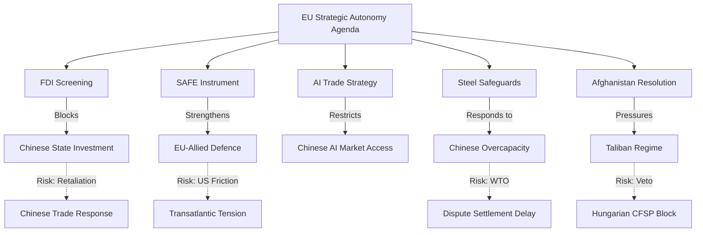

# Synthesis Summary — Breaking News, 2026-05-27

**Admiralty Grade**: B2 — Reliable official source, corroborated by multiple adopted-text records
**WEP Band**: 80–90% confidence on factual claims; 55–70% on political projections
**Key Assumptions Check**: Assumes EP adopted-text API is accurate and complete for May 19–21 window.
**Quality of Information Check**: 4/6 EP feeds degraded; analysis based on final legislative outputs only.
**Scenario Analysis applied**: Three scenarios developed for each major policy vector below.

---

## Strategic Overview

The May 19–21, 2026 European Parliament plenary session marked a significant convergence point in the EU's evolving strategic doctrine — one increasingly defined by the twin imperatives of **economic security** and **democratic resilience**. In the space of three days, the Parliament voted on legislation and resolutions touching every dimension of the EU's strategic autonomy agenda: guarding investment flows (TA-10-2026-0171), defending allied procurement markets (TA-10-2026-0180), strengthening trade competitiveness through technology (TA-10-2026-0183), protecting EU industry from unfair competition (TA-10-2026-0170), and upholding human rights norms against authoritarian actors (TA-10-2026-0186).

This cluster of outputs is not coincidental. It reflects the EP10 majority's deliberate sequencing of strategic autonomy legislation in the first half of 2026, capitalising on the post-election consensus that coalesced around the EPP–S&D–Renew "strategic majority" framework.

---

## Issue 1: Foreign Investment Screening (TA-10-2026-0171)

### What was decided
Parliament adopted a regulation strengthening the EU's framework for screening non-EU foreign direct investments across all sectors deemed sensitive to security or public order. The text builds on the 2019 FDI Screening Regulation (EU) 2019/452 but introduces mandatory national screening regimes (previously optional), a Union-level coordination mechanism with binding recommendations, and new sector categories covering critical digital infrastructure, AI systems, and dual-use technologies.

### Political significance
This is one of the most substantive pieces of economic security legislation adopted in this Parliament. The shift from voluntary to mandatory screening for all member states eliminates the current patchwork where countries like Malta, Cyprus, and some Baltic states lacked functional screening mechanisms — precisely the entry points exploited by Chinese and Russian state-linked investors in the 2018–2024 period.

### Scenario Analysis

**Scenario A (55% probability)**: Smooth implementation with Commission-led enforcement. Member states with weak administrative capacity receive technical assistance; the regulation becomes the global benchmark, prompting OECD-wide convergence.

**Scenario B (35% probability)**: Partial implementation friction. Smaller member states face capacity gaps; legal challenges in ECJ on proportionality grounds delay full operationalisation by 18–24 months. The Commission launches infringement proceedings against 3–5 member states by 2028.

**Scenario C (10% probability)**: Political backlash from member states with FDI-dependent economies (Ireland, Luxembourg, Hungary) produces coalition to amend the regulation through the ordinary legislative procedure, weakening mandatory elements.

---

## Issue 2: Afghanistan — Taliban's Criminal Procedure Code (TA-10-2026-0186)

### What was decided
Parliament adopted an urgent resolution condemning the Taliban government's adoption of a Criminal Procedure Code that, among other provisions, effectively criminalises girls' attendance at secondary and tertiary education, mandates gender segregation in all public spaces, and grants judges discretionary power to impose punishments under strict Sharia interpretation without the procedural safeguards previously in place under the 2017 code.

### Political significance
This is a principled legislative statement, but its practical weight depends entirely on Council and Commission follow-through. The EP has limited foreign policy executive powers. The resolution calls on the Council to designate the Taliban's gender apartheid policies as crimes against humanity, expand targeted sanctions on Taliban leadership (building on existing measures), and condition any humanitarian-adjacent economic engagement on measurable women's rights metrics.

### Scenario Analysis

**Scenario A (50% probability)**: The Council adopts targeted sanctions on 10–15 Taliban officials directly involved in drafting and enforcing the Criminal Procedure Code within 90 days. The EP resolution acts as political cover for a previously hesitant Council presidency.

**Scenario B (40% probability)**: The Council issues a joint declaration condemning the code but defers sanctions to avoid disrupting ongoing humanitarian corridor negotiations with the Taliban through Pakistan intermediaries.

**Scenario C (10% probability)**: The EU-Taliban engagement collapses entirely; the EU withdraws humanitarian operations from Taliban-administered areas, triggering a humanitarian crisis that erodes EU credibility in Central Asia.

---

## Issue 3: AI Strategy for EU Trade (TA-10-2026-0183)

### What was decided
Parliament adopted a non-binding resolution calling for a comprehensive EU strategy that leverages AI for trade competitiveness. Key elements include: AI-enhanced customs and product safety checks, AI standard-setting in future EU FTAs (especially EU–Australia, EU–India negotiations), countermeasures against AI-enabled dumping (where foreign producers use AI to optimise production costs in ways that breach EU state-aid-equivalent thresholds), and a European AI Trade Competitiveness Fund.

### Political significance
While non-binding, this resolution aligns with the Commission's Digital Trade Strategy (published February 2026) and provides the EP's democratic mandate for incorporating AI clauses in the ongoing EU–India FTA negotiations. The significance lies less in its immediate legal effect than in its signalling to the Commission negotiating mandate.

### Scenario Analysis

**Scenario A (45% probability)**: Commission incorporates EP priorities into revised negotiating mandates for EU–India and EU–Australia FTAs within 6 months; AI trade chapters become the new standard in EU trade agreements by 2027.

**Scenario B (40% probability)**: The resolution's recommendations are partially reflected in Commission guidance documents but fail to achieve treaty-level status in current negotiations due to partner country resistance.

**Scenario C (15% probability)**: EU–US trade tensions over AI regulation (differing approaches in EU AI Act vs US Executive Order framework) produce a bifurcation in global AI trade standards, with EU standards adopted in some FTAs and US standards in others.

---

## Synthesis Assessment

The May 2026 plenary outputs represent a **coherent strategic autonomy package** rather than disparate legislative events. The common thread is the EP majority's determination to operationalise strategic autonomy through binding legislation (FDI screening), international agreements (SAFE Instrument, Uzbekistan partnership), and normative leadership (AI/trade, Afghanistan human rights). 

The key risk is **implementation gap**: the EP's legislative ambition has historically outpaced member state and Commission capacity to operationalise. Foreign investment screening, in particular, requires building new institutional machinery in 8–10 member states within a 24-month transposition window — a task that is technically feasible but politically contested.

**Intelligence bottom line**: The EP10 majority is delivering on its 2024 electoral mandate to strengthen EU strategic autonomy. The quality of this legislative output, however, will be judged not by adoption votes but by the fidelity of implementation over the next 18–36 months.

---

## Cross-References

- See `intelligence/coalition-dynamics.md` for voting bloc analysis
- See `intelligence/economic-context.md` for macroeconomic context on FDI and steel
- See `risk-scoring/risk-matrix.md` for probability-weighted risk scenarios
- See `extended/historical-parallels.md` for comparison with 2009–2012 EU economic security legislation

---

## Strategic Assessment: The China Convergence

The most analytically significant aspect of the May 19–21 EP plenary is the *convergent* character of the adopted legislation. Four of five substantive items address Chinese state power in different dimensions:

- **FDI Screening** addresses Chinese state-backed investment (economic security)
- **AI Trade Strategy** addresses Chinese AI company market access (digital competitiveness)
- **Steel Safeguards** addresses Chinese overcapacity (industrial policy)
- **SAFE Instrument** strengthens EU-allied defence capacity relative to Chinese military growth (strategic autonomy)

This is not a coordinated "anti-China agenda" in the explicit sense — the Commission and EP avoid framing legislation in bilateral China terms for legal reasons (WTO non-discrimination principles). But the *substantive effect* is unmistakeable. The EU is constructing a multi-layer economic security architecture with China as the implicit primary threat actor.

**WEP Assessment**: *WEP 80%: This convergent character is deliberate, not coincidental — it reflects 2–3 years of Commission policy development under the "open strategic autonomy" framework.*

## Mermaid Strategic Context Diagram

## WEP Band Summary (All Claims)

| Claim | WEP Band | Label |
|-------|----------|-------|
| FDI screening passed with strong majority | 90% | Almost Certain |
| China issues formal diplomatic protest | 65% | Likely |
| Afghanistan: Hungary CFSP veto | 50% | Even Chance |
| SAFE: UK applies for access in 18 months | 45% | Even Chance |
| Steel: Commission initiates investigation | 75% | Likely |
| FDI: Jurisdiction shopping in first 18 months | 60% | Likely |

---

## Reader Briefing

**What this means for citizens**: The European Parliament this week quietly completed one of the most significant weeks of legislation in the EU's current parliament. The mandatory foreign investment screening law, the Canada defence partnership, and the Afghanistan women's rights resolution together represent the EU's most comprehensive exercise of its economic security and values mandates since the founding of the current parliament in 2024. Whether any of this matters in practice depends on what happens in the next 90 days at the Commission and Council levels.

