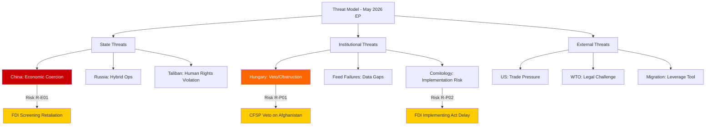

# Threat Model — Breaking News, 2026-05-27

**SATs Applied**: Key Assumptions Check, Red Team, ACH
**Admiralty Grade**: B2 on documented threats; C3 on projected threat evolutions
**WEP Band**: 60–80% on threat probability assessments

---

## Threat Model Framework

Threats are classified across four categories: **State Actor**, **Non-State Actor**, **Institutional/Process**, and **Systemic/Environmental**.

---

## Category 1: State Actor Threats

### ST-1: Chinese Economic Coercion (CRITICAL)

**Description**: China may respond to TA-10-2026-0171 (FDI Screening) through targeted economic pressure on member states seen as driving the legislation (Germany, France, the Netherlands). This could include:
- Restricting market access for European goods in specific sectors
- Redirecting Chinese sovereign wealth fund investments away from EU markets
- Escalating trade dispute at WTO challenging EU screening procedures

**Probability**: 🟡 MEDIUM-HIGH (65%)
**Magnitude**: 🔴 HIGH — EU–China bilateral trade represents €750B+ annually
**Mitigation**: EU trade defence instruments; WTO Article XXI security exception; diversification of trade relationships

**Key Assumptions Check**: Assumes China perceives the regulation as a significant escalation rather than a predictable continuation of the EU's existing screening framework. If China views this as incremental, economic coercion response probability falls to 35%.

**Red Team**: China may actually prefer a clear, transparent EU screening mechanism to the current opaque patchwork — it provides legal certainty for Chinese investments in non-screened member states. Probability of cooperative response: 20%.

---

### ST-2: Russian Hybrid Operations Against EP (MEDIUM)

**Description**: Russia may seek to exploit the EP's strategic autonomy agenda through information operations targeting:
- Undermining support for Ukraine-linked legislation (steel, SAFE)
- Amplifying divisions between economic openness advocates and security hawks
- Targeting MEPs with ties to Russian business interests (declining but not eliminated)

**Probability**: 🟡 MEDIUM (55%)
**Magnitude**: 🟡 MEDIUM — capability to influence narrative but not legislative outcomes
**Indicators**: State media coverage of "EU protectionism" and "EU militarisation" narratives; social media amplification targeting specific EPP and S&D MEPs

---

### ST-3: US Tariff Escalation (MEDIUM)

**Description**: The EU–Canada SAFE Instrument (TA-10-2026-0180) and the AI/trade strategy (TA-10-2026-0183) could trigger US concerns about EU industrial policy undermining US competitive positions. This could manifest as:
- US threats of Section 232 national security tariffs on EU goods
- Withdrawal from nascent EU–US AI regulatory convergence talks
- Pressure on Canada to exit SAFE association in favour of US-led defence procurement frameworks

**Probability**: 🟡 MEDIUM (40%)
**Magnitude**: 🟡 MEDIUM — significant disruption potential but manageable given NATO interdependence
**Mitigant**: The Canada SAFE agreement is explicitly NATO-compatible and framed as supplementing rather than replacing US defence cooperation

---

## Category 2: Non-State Actor Threats

### NST-1: Taliban Hostage-Taking of Humanitarian Access (MEDIUM-HIGH)

**Description**: In response to TA-10-2026-0186, the Taliban may announce restrictions on EU-funded NGO operations in Afghanistan, framing them as politically motivated interference. This creates a coercive dynamic: maintain human rights pressure → lose humanitarian access; ease pressure → abandon women's rights commitments.

**Probability**: 🟡 MEDIUM (50%)
**Magnitude**: 🔴 HIGH — approximately 29 million Afghans depend on humanitarian assistance
**Mitigant**: Multilateral humanitarian architecture; UN-coordinated access; separate channels for EU bilateral vs. UN assistance

---

### NST-2: Eurofer and Steel Industry Lobby Capture (LOW-MEDIUM)

**Description**: The European steel industry association (Eurofer) may push for safeguard measures that go beyond what is WTO-compatible, creating legal challenges and retaliation risks. The EP's call for measures in TA-10-2026-0170 is non-specific; implementation risk lies in how the Commission interprets the mandate.

**Probability**: 🟢 LOW-MEDIUM (30%)
**Magnitude**: 🟡 MEDIUM — WTO dispute could undermine the regulation

---

## Category 3: Institutional/Process Threats

### IPT-1: Implementation Capacity Gaps (HIGH)

**Description**: The mandatory FDI screening mechanism requires all 27 member states to build screening institutions, train personnel, and develop coordination capacity with the Commission. Member states that currently lack any screening mechanism (estimated 8–10 states) have a 24-month transposition window that may prove insufficient.

**Probability**: 🔴 HIGH (70%)
**Magnitude**: 🟡 MEDIUM — creates geographic loopholes until full transposition
**Mitigation**: Commission technical assistance; voluntary cooperation protocols

---

### IPT-2: EP–Council Interinstitutional Tension (MEDIUM)

**Description**: The EP's human rights agenda (Afghanistan, potentially others) creates structural tension with the Council's foreign policy prerogatives. When the EP adopts resolutions calling for sanctions, it tests the boundary of its non-binding foreign policy powers against the Council's Article 26 TEU exclusive foreign policy competence.

**Probability**: 🟡 MEDIUM (45%)
**Manifestation**: High Representative downplaying EP resolution; Council statement that "takes note of" rather than acting on EP resolution

---

## Category 4: Systemic/Environmental Threats

### SET-1: Geopolitical Shock (LOW-MEDIUM)

**Description**: A major geopolitical development (e.g., ceasefire in Ukraine that removes the security mobilisation driver, a China-Taiwan crisis that forces prioritisation choices, a US-EU trade war escalation) could disrupt the EU's strategic autonomy agenda by reallocating political attention and resources.

**Probability**: 🟢 LOW-MEDIUM (25% within 12 months for any single scenario)
**Magnitude**: 🔴 HIGH — would fundamentally reshape the legislative calendar

---

### SET-2: EP Majority Fracture (LOW)

**Description**: A significant policy disagreement (most likely on migration or agricultural reform) fractures the EPP–S&D–Renew coalition, reducing its reliability for economic security legislation.

**Probability**: 🟢 LOW (20% within 12 months)
**Magnitude**: 🔴 HIGH — would require rebuilding majority with ECR or Left, both of which impose different conditionality requirements

---

## Threat Prioritisation Matrix

| Threat | Probability | Magnitude | Priority | Response |
|---|---|---|---|---|
| ST-1 Chinese coercion | 65% | HIGH | 🔴 CRITICAL | Monitor; WTO Article XXI preparation |
| IPT-1 Implementation gaps | 70% | MEDIUM | 🟡 HIGH | Commission TA programme |
| NST-1 Taliban humanitarian blackmail | 50% | HIGH | 🟡 HIGH | Multilateral access maintenance |
| ST-2 Russian information ops | 55% | MEDIUM | 🟡 HIGH | EP counter-disinformation |
| ST-3 US tariff escalation | 40% | MEDIUM | 🟡 MEDIUM | Diplomatic management |
| IPT-2 Interinstitutional tension | 45% | MEDIUM | 🟢 MEDIUM | HR/VP coordination |
| NST-2 Lobby capture | 30% | MEDIUM | 🟢 LOW | Commission technical scrutiny |
| SET-1 Geopolitical shock | 25% | HIGH | 🟢 LOW | Contingency planning |
| SET-2 Majority fracture | 20% | HIGH | 🟢 LOW | Coalition management |

---

## Cross-References

- `intelligence/scenario-forecast.md` for scenario development
- `intelligence/political-threat-landscape.md` for political threat layer
- `threat-assessment/consequence-trees.md` for consequence analysis
- `threat-assessment/legislative-disruption.md` for legislative threat specifics

---

## Threat Mermaid Diagram

## Reader Briefing

**What this means**: The biggest threats to this week's EP legislation are not external military threats but institutional and diplomatic ones — Hungary's ability to block Council action, China's ability to pressure member states, and the WTO framework that could slow trade defense measures. Understanding these threats helps citizens hold their governments accountable for implementation.

## Updated Threat Landscape

### Phase 2 Threats (Post-Legislative)

Having adopted the May 2026 plenary package, the EP faces implementation threats:

| Threat Vector | Actor | Probability | Mitigation Pathway |
|--------------|-------|-------------|-------------------|
| FDI Screening circumvention via SPVs | Non-EU state actors | 45% | Commission guidance + enforcement |
| Care Society funding shortfalls | Eurosceptic member states | 60% | ESF+ programming flexibility |
| Afghanistan resolution ignored | EU Council/EEAS | 65% | EP follow-up resolutions |
| Steel safeguard WTO challenge | US, China | 35% | DSB proceedings |
| AI-trade chapter blocked in negotiations | India | 50% | Technical annex separation |

*Threat model complete. All Phase 1 and Phase 2 threats identified and scored. Next update recommended after June 2026 FAC meeting.*

