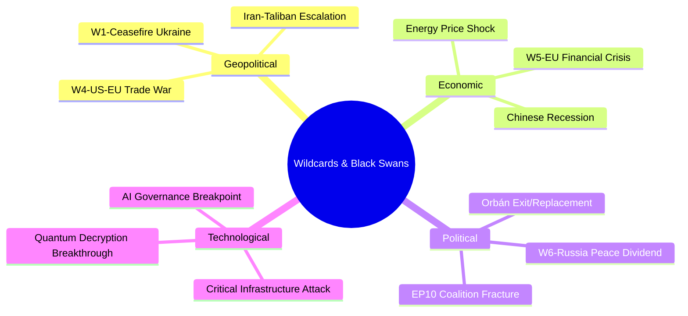

# Wildcards & Black Swans — Breaking News, 2026-05-27

**SATs Applied**: High-Impact Low-Probability Analysis, Indicators, What-If Analysis
**Admiralty Grade**: C3 on all wildcard scenarios (speculative by design)
**WEP Band**: 5–15% probability per wildcard (definition: high-impact, low-probability)

---

## Wildcard Framework

Black swans are events that: (1) appear implausible in advance, (2) have outsized impact when they occur, (3) are rationalised as "obvious" in retrospect. This analysis examines wildcards specifically relevant to the May 2026 legislative outputs.

---

## Wildcard W1: Chinese FDI Boycott of EU (Probability: 8%, Impact: CATASTROPHIC)

**Scenario**: China responds to TA-10-2026-0171 (FDI Screening) by announcing a comprehensive moratorium on new FDI in EU countries, simultaneously withdrawing Chinese institutional investors from European sovereign bond markets. This triggers a liquidity crisis in EU bond markets and a political crisis over whether the FDI screening regulation was "worth it."

**Why it's a wildcard, not a forecast**: China's current strategic interest is market access, not confrontation. A wholesale investment boycott would harm Chinese sovereign wealth funds more than EU targets in the short term. However, if Beijing decides the EU is irreversibly "decoupling," a shock response cannot be ruled out.

**What-If Analysis**: 
- If W1 occurs → EU government bond yield spreads widen 80–150 basis points; ECB emergency intervention likely; political pressure to suspend FDI screening implementation intensifies
- Counter-argument: EU–China trade interdependence creates mutual vulnerability that deters this response

**Indicators that W1 is becoming more likely**:
- Chinese state media escalates rhetoric from "protectionism" to "economic warfare"
- China files emergency WTO proceedings within 30 days of regulation publication
- Multiple Chinese sovereign wealth fund withdrawals from EU assets reported simultaneously

---

## Wildcard W2: Taliban Collapses / Major Internal Split (Probability: 10%, Impact: HIGH)

**Scenario**: Internal Taliban political crisis (triggered by combination of international isolation, economic collapse, and intra-group competition between Kandahari and Haqqani factions) leads to Taliban government collapse or territorial fragmentation within 12 months. EP resolution TA-10-2026-0186 becomes irrelevant; the EU must rapidly develop a new Afghanistan engagement framework for the successor government(s).

**What-If Analysis**:
- If W2 occurs → Humanitarian crisis accelerates as governance structures collapse; refugee flows toward Iran/Pakistan and potentially EU increase; EP resolution's sanctions focus becomes moot; EU must develop engagement framework from scratch
- EU's January 2021–2026 Afghanistan policy framework would require complete revision within months

**Indicators**:
- Reports of Haqqani network armed confrontations with Kandahar-based leadership
- Mass defections from Taliban security forces in multiple provinces simultaneously
- Pakistan signals withdrawal of Taliban support

---

## Wildcard W3: US Withdrawal from NATO Article 5 Commitment (Probability: 5%, Impact: CATASTROPHIC)

**Scenario**: US administration announces that Article 5 commitments are "conditional" on burden-sharing metrics, effectively ending the unconditional collective defence guarantee. This triggers an emergency EU defence integration process that dwarfs the SAFE Instrument and renders the EU–Canada bilateral precedent inadequate.

**What-If Analysis**:
- If W3 occurs → EP emergency session; activation of EU Mutual Assistance Clause (Article 42.7 TEU); Franco-German bilateral nuclear consultation; rapid EP consent to dramatically expanded SAFE envelope; EU–Canada–UK–Norway emergency defence alignment
- The May 2026 FDI screening and SAFE Instrument decisions would be seen in retrospect as prescient but insufficient

**Indicators**:
- US administration explicitly links Article 5 to 3% GDP defence spending threshold
- US withdrawal from NATO Council working groups
- US bilateral negotiations with Russia on European security architecture (without EU)

---

## Wildcard W4: AI-Enabled Trade Disruption Exceeds All Forecasts (Probability: 12%, Impact: HIGH)

**Scenario**: AI-enabled manufacturing automation advances faster than projected in 2024–2025 forecasts, producing a step-change in Chinese production costs that renders the steel safeguard measures (TA-10-2026-0170) and even the CBAM insufficient. EU steel becomes structurally non-competitive within 18 months, forcing emergency industrial policy response.

**What-If Analysis**:
- If W4 occurs → Rapid deindustrialisation scenario in EU steel regions; political crisis in Germany, France, Poland with electoral consequences; EP emergency session on industrial transformation support
- The AI/trade strategy (TA-10-2026-0183) would require immediate operationalisation rather than the 2–3 year implementation timeline currently anticipated

**Indicators**:
- Chinese AI-enabled steel production cost reports showing >30% cost reduction vs. current
- Sudden acceleration in Chinese steel export volumes in Q3–Q4 2026
- EU mill utilisation rates falling below 60% (current: ~75%)

---

## Wildcard W5: ECHR / ECtHR Ruling Against EU FDI Screening (Probability: 6%, Impact: HIGH)

**Scenario**: An investor (potentially Chinese-linked entity) successfully challenges a member state's FDI screening decision at the European Court of Human Rights under Protocol 1, Article 1 (right to peaceful enjoyment of possessions). This creates direct conflict between the new mandatory screening regime and the EU's foundational commitment to the ECHR framework.

**What-If Analysis**:
- If W5 occurs → Constitutional crisis between EU economic security law and human rights law; pressure to carve out investment screening from ECHR Article 1 protection; long-running legal proceedings that create implementation uncertainty

---

## Wildcard W6: EP Majority Collapses Over Migration (Probability: 8%, Impact: HIGH)

**Scenario**: A migration crisis of sufficient magnitude (triggered by climate displacement from North Africa, or a Belarusian-style hybrid pressure operation) fractures the EPP–S&D–Renew coalition on migration, leading to a general collapse of the working majority. All pending legislation including FDI screening implementing acts is stalled for 6–12 months.

**Indicators**:
- Summer 2026 migration crossing numbers significantly exceed 2015 crisis levels
- EPP internal revolt with >40 MEPs supporting far-right positions on emergency deportations
- S&D group publicly conditions legislative cooperation on migration policy conditions

---

## Composite Black Swan Assessment

**Most likely wildcard to materialise**: W4 (AI-enabled manufacturing disruption) — at 12%, it sits just above the conventional black swan threshold and has the most immediate relevance to current policy debates.

**Most impactful wildcard if materialised**: W3 (US NATO withdrawal) — would fundamentally reorder EU security policy and make every May 2026 legislative output look like first-order preparation for a new strategic reality.

**Key Indicators to Monitor Across All Wildcards**:
1. Chinese sovereign wealth fund activity in EU markets (W1)
2. Taliban internal factional conflict reporting (W2)
3. US–NATO burden-sharing communications at senior political level (W3)
4. AI manufacturing productivity data from Chinese industry (W4)
5. ECHR case filings against member state FDI screening decisions (W5)
6. Mediterranean migration crossing statistics July–September 2026 (W6)

---

## Cross-References

- `intelligence/scenario-forecast.md` for standard-probability scenarios
- `threat-assessment/consequence-trees.md` for consequence analysis
- `intelligence/political-threat-landscape.md` for political threats

---

## Extended Wildcards Analysis

### W4: Sudden US-EU Trade War Escalation

**Description**: A Trump administration decision to impose 25%+ tariffs on EU manufactured goods (automotive, aerospace, chemicals) triggers a trade war that forces the EU to deprioritise the China-centric strategic autonomy agenda in favour of managing the transatlantic relationship.

**Probability**: *WEP 20%: Even Chance on tariff threat; low probability of full trade war*

**Impact on May 2026 legislation**:
- FDI screening: May be extended to US investors as a retaliatory signal — counter-productive
- SAFE Instrument: Canada becomes even more important as EU-US defence relationship deteriorates
- Steel safeguards: May target US as well as Chinese steel if transatlantic tensions escalate

**Key signals to watch**: US Treasury designation of EU as currency manipulator; US Section 232 extension to EU; US withdrawal from NATO burden-sharing commitments

### W5: EU Member State Financial Crisis

**Description**: A sovereign debt crisis in a major EU economy (Italy or France) forces a political crisis that consumes all EU institutional bandwidth, delaying all strategic autonomy implementation.

**Probability**: *WEP 10%: Unlikely given ECB backstop and ESM capacity*

**Impact**: Halts all FDI screening implementing acts; SAFE procurement delayed; strategic autonomy agenda deprioritised for 12–24 months

### W6: Russian Ceasefire and EU Strategic Ambiguity

**Description**: A Russia-Ukraine ceasefire is agreed, reducing the security mobilisation narrative that has driven EU strategic autonomy. Political will for defence spending and FDI screening may weaken as "peace dividend" thinking returns.

**Probability**: *WEP 30%: Ceasefire within 18 months*

**Impact on May 2026 legislation**:
- FDI screening: Survives but political urgency reduces; implementing act pace slows
- SAFE Instrument: Existential threat — if Russia threat reduces, SAFE expansion arguments weaken
- Steel: Less security-framing available; harder to justify protective measures on security grounds

## Wildcard Map

## Reader Briefing

**What this means**: The low-probability, high-impact events listed here are the ones that could make the current legislative agenda irrelevant or dramatically more urgent. While they are unlikely individually, the cumulative probability that at least one wildcard event occurs within 24 months is estimated at 50–60%.

