# Workflow Audit — Breaking News, 2026-05-27

**Run ID**: breaking-run266-1779846371
**Workflow**: news-breaking (unified Stage A→E)
**Generated**: 2026-05-27T01:55:00Z

---

## Stage Execution Summary

| Stage | Status | Start (approx) | Duration | Notes |
|-------|--------|---------------|----------|-------|
| A — Data Collection | ✅ COMPLETE | Minute 0 | ~3 min | 4 EP MCP calls; degraded-feeds mode declared |
| B — Analysis Pass 1 | 🔄 IN PROGRESS | Minute 3 | Ongoing | Writing all artifacts |
| B — Analysis Pass 2 | ⏳ PENDING | — | — | Will review and deepen after Pass 1 |
| C — Completeness Gate | ⏳ PENDING | — | — | `npm run validate-analysis` |
| D — Article Render | ⏳ PENDING | — | — | `npm run generate-article` |
| E — PR Creation | ⏳ PENDING | — | — | Single `safeoutputs create_pull_request` |

---

## Stage A Data Collection Record

**Feeds assessed**:
- `adopted-texts-feed.json`: AVAILABLE — 500 items (primary analytical base)
- `meps-feed.json`: AVAILABLE — 484 MEPs
- `procedures-feed.json`: DEGRADED — historical tail (1972-1990 items)
- `events-feed.json`: 404 NOT FOUND
- `committee-documents-feed.json`: 404 NOT FOUND
- `documents-feed.json`: 404 NOT FOUND

**Data mode declared**: `degraded-feeds`
**EP MCP calls used**: 4 of 5 Stage A cap

**Key findings**:
- Most recent adopted text: TA-10-2026-0186 (2026-05-21)
- Primary breaking news cluster: May 19–21, 2026 (strategic autonomy legislation package)
- No adopted texts found for May 22–27 (consistent with expected plenary schedule)

---

## Stage B Artifact Progress

Pass 1 artifacts written in order of analytical priority:
1. `executive-brief.md` ✅
2. `data-availability-assessment.md` ✅
3. `intelligence/analysis-index.md` ✅
4. `intelligence/synthesis-summary.md` ✅
5. `intelligence/coalition-dynamics.md` ✅
6. `intelligence/economic-context.md` ✅
7. `intelligence/historical-baseline.md` ✅
8. `intelligence/mcp-reliability-audit.md` ✅
9. `intelligence/pestle-analysis.md` ✅
10. `intelligence/political-threat-landscape.md` ✅
11. `intelligence/scenario-forecast.md` ✅
12. `intelligence/significance-scoring.md` ✅
13. `intelligence/stakeholder-map.md` ✅
14. `intelligence/threat-model.md` ✅
15. `intelligence/wildcards-blackswans.md` ✅
16. `intelligence/reference-analysis-quality.md` ✅
17. `intelligence/voting-patterns.md` ✅
18. `intelligence/cross-run-diff.md` ✅
19. `intelligence/workflow-audit.md` ✅ (this file)

---

## Risk Flags

- [🟡 MEDIUM] DOCEO voting data unavailable — all voting analysis is estimated, not confirmed
- [🟡 MEDIUM] Procedures feed degraded — no legislative procedure context for adopted texts
- [🟢 LOW] 6-day gap to most recent data (May 21) — no known plenary sessions in May 22-27 window
- [🟢 LOW] First run for this date — no prior-run diff baseline available

---

## Cross-References

- `intelligence/mcp-reliability-audit.md` for MCP tool usage details
- `data-availability-assessment.md` for data mode declaration

---

## Workflow Execution Diagram

```mermaid
gantt
    title News-Breaking Workflow Stages - 2026-05-27
    dateFormat HH:mm
    axisFormat %H:%M

    section Stage A
    Data Collection :a1, 00:00, 15m

    section Stage B
    Pass 1 - Core Artifacts :b1, after a1, 20m
    Pass 2 - Extension :b2, after b1, 10m

    section Stage C
    Validation Round 1 :c1, after b2, 3m
    Pass 3 Fixes :c2, after c1, 5m
    Validation Round 2 :c3, after c2, 3m

    section Stage D
    Article Generation :d1, after c3, 5m

    section Stage E
    Git Commit + PR :e1, after d1, 5m
```

