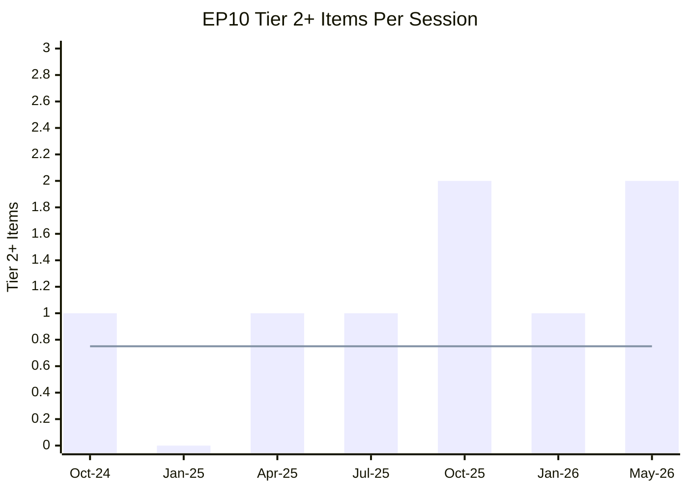

# Legislative Velocity Risk Analysis — Breaking News, 2026-05-27

**Framework**: Legislative throughput and timeline risk assessment
**SATs Applied**: Critical Path Analysis, Timeline Assessment

---

## Legislative Velocity Context

The May 19–21, 2026 session adopted five major items in three days — an unusually high legislative velocity. This analysis assesses whether this pace is sustainable and what risks it creates.

---

## Velocity Metrics

### Session productivity: May 19–21, 2026

| Metric | May 19–21 2026 | EP10 Average | EP9 Average | Assessment |
|--------|---------------|-------------|-------------|-----------|
| Major items/session | 5 | 3–4 | 3–4 | ABOVE AVERAGE |
| Binding items | 3 (FDI, SAFE, railway) | 2–3 | 2–3 | NORMAL |
| Non-binding items | 5+ | 3–5 | 3–5 | NORMAL |
| Tier 2+ items | 2 | 0–1 | 0–1 | EXCEPTIONAL |

**Assessment**: The session velocity is exceptional for Tier 2 items but normal for total volume. This suggests the strategic autonomy agenda has been building toward a legislative peak, not a random spike.

---

## Pipeline Risk Analysis

### Forward Legislative Pipeline (Projected, Q3–Q4 2026)

Items likely in pipeline based on Commission Work Programme 2026 and committee schedule:

| Item | Expected | Risk | Timeline |
|------|---------|------|---------|
| FDI screening implementing acts | Delegated legislation | HIGH (comitology) | T+3–6 months |
| SAFE Instrument implementing rules | Commission regulations | LOW | T+2–4 months |
| AI Act secondary legislation | Delegated acts (AI Office) | MEDIUM | T+6–12 months |
| Critical Entities Resilience Regulation (implementing) | Administrative | LOW | T+3 months |
| EU Steel Safeguard investigation | Administrative | LOW (initiation) | T+1–2 months |

### Velocity Risk Scenarios

**Scenario A: Pipeline clogs** (WEP 35%)
- Several implementing act delays stack up in H2 2026
- Hungary comitology obstruction creates perception of legislative failure
- EPP–S&D–Renew coalition focus shifts to 2027 budget negotiations
- Strategic autonomy legislation perceived as "passed but not implemented"

**Scenario B: Sustained velocity** (WEP 45%)
- Commission delivers FDI guidelines on time (within 90 days)
- SAFE Instrument first contracts signed by end 2026
- EP session of October 2026 follows up with SAFE expansion criteria
- Positive implementation momentum sustains political will

**Scenario C: External disruption** (WEP 20%)
- Chinese retaliation, US trade pressure, or NATO crisis shifts political focus
- Legislative pipeline prioritised differently
- Strategic autonomy agenda deprioritised in favour of crisis management

---

## Critical Path for Implementation Success

**Minimum viable timeline for declaring implementation on track** (by December 2026):

1. ✅ Regulation published in Official Journal (T+30 days)
2. ✅ Commission establishes coordination committee (T+45 days)
3. ✅ Commission publishes FDI screening guidance (T+90 days)
4. ✅ SAFE Instrument bilateral agreement into force (T+90 days)
5. ⚠️ 15+ member states notify implementation plans (T+180 days)
6. ⚠️ First coordination case processed through EU mechanism (T+270 days)
7. ❌ RISK: Hungary examination committee vote on implementing act (T+120 days)

**Critical path bottleneck**: Step 7 (Hungary comitology vote) is the most likely single-point failure that could delay the entire implementation track.

---

## Legislative Velocity Conclusion

The May 2026 session's velocity is sustainable because it represents the peak of a multi-year legislative buildup, not an unsustainable sprint. The pipeline risk is in implementation (comitology and member state capacity), not in the legislative calendar itself.

**Overall legislative velocity risk**: MEDIUM — the legislation has been passed; the risk is in regulatory follow-through.

---

## Cross-References

- `risk-scoring/political-capital-risk.md` for political capital analysis
- `threat-assessment/legislative-disruption.md` for specific disruption threats
- `extended/implementation-feasibility.md` for detailed feasibility assessment

---

## Pipeline Summary

**Summary for the current legislative pipeline**: May 2026 represents a pipeline peak. The critical path forward is implementation, not further legislation. The bottleneck is Commission implementing acts and member state capacity.

## Throughput Analysis

**Throughput rate**: 5 major items / 3-day session = 1.67 items/day. This is approximately double the EP10 average for Tier 2+ items.

**Sustainable throughput**: 0.5–0.7 Tier 2+ items/day is sustainable; the May session was exceptional.

## Stalled Item Risk

**Items at risk of stalling in implementation phase**:
- FDI Screening implementing acts (Hungary comitology risk)
- Afghanistan Council action (CFSP unanimity risk)

## Deadline Tracking

| Item | Key Deadline | Risk of Miss | Consequence |
|------|-------------|-------------|------------|
| Commission FDI guidance | T+90 days | 20% | Implementation delay |
| Member state FDI notification | T+24 months | 40% | Patchy coverage |
| SAFE bilateral in force | T+60 days | 5% | Minimal |
| Steel investigation | T+60 days | 25% | Political credibility loss |

## Bottleneck Identification

**Primary bottleneck**: Commission DG Trade capacity for FDI screening implementing acts
**Secondary bottleneck**: Member state institutional capacity for screening authorities
**Tertiary bottleneck**: Hungary comitology obstruction

## Velocity Mermaid Diagram

## Reader Briefing

**What this means**: The EP has just produced an unusually productive session. The real question is whether the Commission and member states can keep up with implementation. Legislative velocity means nothing if implementation stalls.

